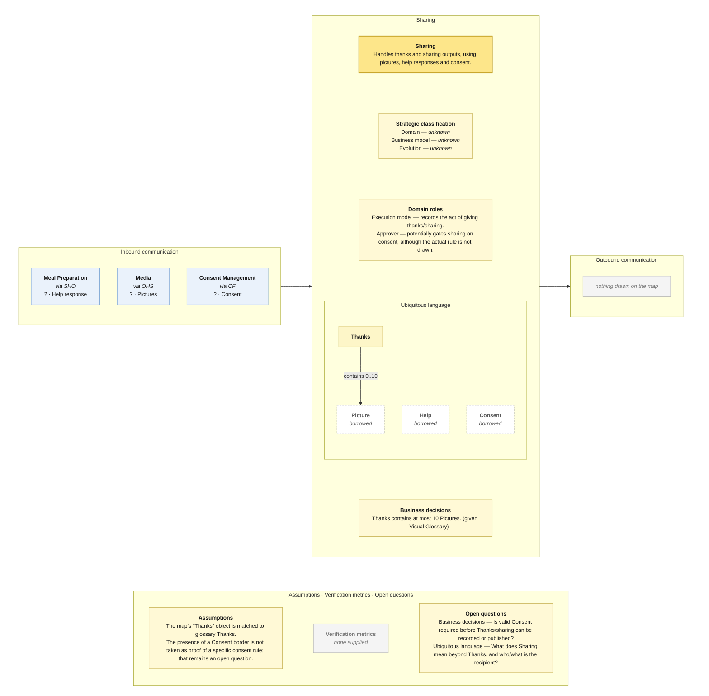

# Bounded Context Canvas — Sharing

> **Source:** supplied Context Map + supplied Visual Glossary · **Mode:** derived from the team's cut  
> **Provenance:** `(given)` stated by a source · `(derived)` read off one · `(proposed)` mine, confirm it · `(unknown)` nothing to derive from.

## Canvas

## Purpose  (derived)

Handles thanks and sharing outputs, using pictures, help responses and consent.

## Strategic classification  (unknown)

| | |
|---|---|
| Domain | (unknown) — no Core Domain Chart supplied |
| Business model | (unknown) — no source supplied |
| Evolution | (unknown) — no Wardley/evolution source supplied |

## Domain roles  (derived)

- Execution model — records the act of giving thanks/sharing.
- Approver — potentially gates sharing on consent, although the actual rule is not drawn.

## Inbound communication  (derived)

| Collaborator | Message | Type | What it carries | Evidence |
|---|---|---|---|---|
| Meal Preparation | Help response | ? | border payload only; fields not supplied | synchronous · via SHO; Help response sticky on the Meal Preparation → Sharing border |
| Media | Pictures | ? | border payload only; fields not supplied | synchronous · via OHS; Pictures sticky on the Media → Sharing border |
| Consent Management | Consent | ? | border payload only; fields not supplied | synchronous · via CF; Consent sticky on the Consent Management → Sharing border |

## Outbound communication  (derived)

| Message | Type | Collaborator | What it carries | Evidence |
|---|---|---|---|---|
| — | — | — | — | nothing drawn on the map |

## Ubiquitous language  (given / derived)

The glossary slice is partitioned by the context map's ownership/read-model notation. Exact spelling differences between map and glossary are preserved in assumptions/open questions rather than silently normalized.

| Term | What it means *here* | Owned or borrowed | Cardinality / relation |
|---|---|---|---|
| Thanks | A thank-you associated with help/community interaction. | owned / contested where noted | contains 0..10 Picture |
| Picture | Pictures supplied by Media. | borrowed | borrowed |
| Help | Help response associated with the sharing flow. | borrowed | borrowed |
| Consent | Consent supplied by Consent Management; absent from glossary. | borrowed | borrowed |

## Business decisions  (derived)

- Thanks contains at most 10 Pictures. (given — Visual Glossary)

## Assumptions  (derived)

- The map’s “Thanks” object is matched to glossary Thanks.
- The presence of a Consent border is not taken as proof of a specific consent rule; that remains an open question.

## Verification metrics  (unknown)

`none supplied`

## Open questions

- Business decisions — Is valid Consent required before Thanks/sharing can be recorded or published?
- Ubiquitous language — What does Sharing mean beyond Thanks, and who/what is the recipient?

## Border reconciliation

- No outbound messages are drawn on the map.
