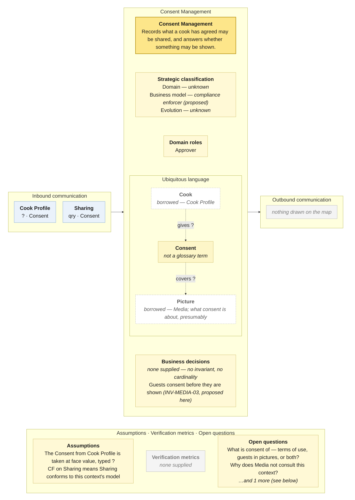

# Bounded Context Canvas — Consent Management

> **Source:** Community Cooking context map (ContextMap.jpg) + Visual Glossary (VisualGlossaryEnhanced.jpg); business decisions from invariants-community-cooking-board.md; purpose lines from the pivotal-event cuts and the context cut · **Mode:** derived from the team's cut
> **Provenance:** `(given)` stated by a source · `(derived)` read off one ·
> `(proposed)` mine, confirm it · `(unknown)` nothing to derive from.

## Canvas

## Purpose  (derived)

Records what a cook has agreed may be shared, and answers — for Sharing, which
conforms to its answer — whether something may be shown.

Derived from the bubble (one business object, no events) and its two edges.
No prior analysis in the project had this context; the invariants sheet's
`INV-MEDIA-03` (guests consent before they are shown) is the rule that called
for it.

## Strategic classification  (proposed)

| | |
|---|---|
| Domain | `(unknown)` |
| Business model | `(proposed)` compliance enforcer — the only reading of a context called Consent with a conformist downstream. |
| Evolution | `(unknown)` — consent records are a commodity in general; nothing says so here. |

## Domain roles  (derived)

- **Approver** — its whole job is to say whether something may be shown, and
  Sharing has bound itself (CF) to that answer.

Rejected: *Enforcer* — it does not apply constraints continuously; it is asked
at one decision point.

## Inbound communication  (derived)

| Collaborator | Message | Type | What it carries | Evidence |
|---|---|---|---|---|
| Cook Profile | Consent | ? | what the user agreed to at registration — presumably; the map does not say | yellow Consent sticky beside the arrow -- the only thing Cook Profile emits, and it is not Cook |
| Sharing | Consent | qry | whether these pictures, and the people in them, may be shown | yellow Consent sticky on the long arrow from Consent Management; CF = Sharing conforms |

Two inbound rows, two different natures: one `?` from Cook Profile (a push of
a consent given), one `qry` from Sharing (a check before showing). If the first
is really a *Cook* rather than a *Consent*, this context's inbound column is a
single query.

## Outbound communication  (derived)

**Nothing is drawn.** Nobody is told when consent is granted or withdrawn — a withdrawn consent reaches Sharing only on its next query, and reaches Media and Cooking Assistance never.

## Ubiquitous language  (derived — the glossary has no term for this context)

The panel above draws this table; it is repeated here because the picture caps what fits and a borrowed sense needs a sentence.

| Term | What it means *here* | Owned or borrowed | Cardinality |
|---|---|---|---|
| Consent | a cook's agreement that something may be shared | **owned** — the bubble's business object; **the glossary does not define it**, and neither does any prior artifact | `(unknown)` — every edge on the panel is a question mark |
| Cook | who gives consent | **borrowed — Cook Profile** | — |
| Picture | what consent is presumably about | **borrowed — Media** | — |

What consent is *of* is unstated: the cook's own terms of use (given at
registration, which is what the Cook Profile edge suggests), the guests'
appearance in pictures (which is what `INV-MEDIA-03` needs), or both. The
glossary's silence here is complete.

## Business decisions  (proposed — nothing in either input states a rule for this context)

**Nothing given.** The invariants sheet predates this context and the glossary
does not define *Consent*.

`(proposed)`, relocated from Media's canvas, where it cannot be enforced:

1. **Pictures showing identifiable guests are not shared beyond the cook without
   consent recorded** — "this photo has guests in it — share the food instead?"
   `INV-MEDIA-03`, which as a *refusal* would live here and as a *check* lives
   in Sharing.

Whether consent can be withdrawn, and what happens to already-shared pictures
when it is, is on no artifact.

## Assumptions  (derived)

- The sticky on the Cook Profile edge is carried as *Consent* and typed `?`
  (see the Cook Profile canvas).
- The CF box is on Sharing's edge, so this context is upstream and unmodified
  by its consumer.
- A bubble with a business object and **no events** is read as a record, not a
  lifecycle; *Consent given* / *Consent withdrawn* are not drawn.

## Verification metrics  (unknown)

`none supplied` — neither the map nor the glossary states one.

`(proposed)`: share of share attempts refused; time between a withdrawal and the last public appearance of the affected picture.

## Open questions

1. **What is a Consent about?** The cook's terms, the guests' faces, or both? *(Settles the ubiquitous language and every cardinality on the panel.)*
2. **Why does Media, and the kitchen-photo path through Cooking Assistance, never consult this context?** Only Sharing does. *(Settles at least one undrawn edge.)*
3. **Can consent be withdrawn, and who is told?** No event leaves this bubble. *(Settles the outbound column.)*

## Border reconciliation

| Message | Direction | Counterpart | Status |
|---|---|---|---|
| Consent | in, from Cook Profile | `cook-profile.canvas.md` | matched — `?` both sides |
| Consent | in, from Sharing | `sharing.canvas.md` | matched — `qry` both sides |
| *(none)* | out | — | **no outbound message anywhere on this canvas** |

Both inbound messages pair. Nothing outbound.
