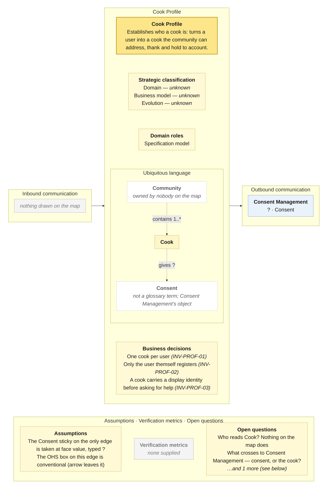

# Bounded Context Canvas — Cook Profile

> **Source:** Community Cooking context map (ContextMap.jpg) + Visual Glossary (VisualGlossaryEnhanced.jpg); business decisions from invariants-community-cooking-board.md; purpose lines from the pivotal-event cuts and the context cut · **Mode:** derived from the team's cut
> **Provenance:** `(given)` stated by a source · `(derived)` read off one ·
> `(proposed)` mine, confirm it · `(unknown)` nothing to derive from.

## Canvas

## Purpose  (derived)

Establishes who a cook is — turns a *User* into a *Cook* the rest of the
product can address, thank and hold to account.

Derived from the one event on the bubble and the pivotal-event cut's *Cook
Membership* description. The map's name, *Cook Profile*, is kept; the board's
bubble carried the same name.

## Strategic classification  (unknown)

| | |
|---|---|
| Domain | `(unknown)` — the pivotal-event re-run called registration "identity… available off the shelf", which is a hunch; no chart. |
| Business model | `(unknown)` |
| Evolution | `(unknown)` |

## Domain roles  (derived)

- **Specification model** — it defines who a cook is, and every other context
  is supposed to resolve *Cook* against it. Whether any does is the open
  question below.

Rejected: *Gateway* — it faces the user once, at registration, then holds a
record.

## Inbound communication  (derived)

**Nothing is drawn.** Nothing tells this context anything after registration: no deactivation, no suspension, no change of standing.

## Outbound communication  (derived)

| Message | Type | Collaborator | What it carries | Evidence |
|---|---|---|---|---|
| Consent | ? | Consent Management | the sticky says Consent — presumably what the user agreed to at registration; the map does not say | yellow Consent sticky beside the arrow -- the only thing Cook Profile emits, and it is not Cook |

**The only thing this context emits is *Consent*, to Consent Management** —
and the map draws its business object, *Cook*, crossing no border at all.
Cooking Assistance needs a requester, Sharing needs a help provider, the
glossary says `Community contains 1..* Cook`, and none of them reads *Cook*
from here. Either the map assumes a shared identity nobody drew, or Cook
Profile is an OHS with no guests.

## Ubiquitous language  (given for Cook — from the Visual Glossary; the rest derived)

The panel above draws this table; it is repeated here because the picture caps what fits and a borrowed sense needs a sentence.

| Term | What it means *here* | Owned or borrowed | Cardinality (glossary) |
|---|---|---|---|
| Cook | a registered person who plans, prepares, asks and thanks | **owned** — the bubble's business object, produced by *Cook registered* | Community contains **1..\*** · prepares **0..\*** Meal · posts **0..\*** Help Request · posts **0..\*** Thanks |
| User | what a person is before registration (the board's read model on *Register cook*) | **owned** — the board's only unambiguous re-modelling: *User* goes in, *Cook* comes out; **the glossary has no User** | — |
| Community | the cooks, collectively; a help provider and a thanks recipient | **undefined owner** — glossary term, no context on the map | contains **1..\*** Cook |
| Consent | what this context sends to Consent Management | **not a glossary term**; Consent Management's business object | — |

The glossary's four edges from *Cook* all point at other contexts' terms. This
context's own language is one noun.

## Business decisions  (derived — from the invariants sheet)

From the invariants sheet (`INV-PROF-*`):

1. **One cook per user** — "you already cook with us — sign in instead". `INV-PROF-01`
2. **Registration is self-service** — "you cannot create a profile for someone else". `INV-PROF-02`
3. **A cook is identifiable to the community** — a display identity before any Help request or Help response may be attributed. `INV-PROF-03` (inferred; the only rule that gives this context a purpose beyond a row in a table)

The glossary adds no cardinality this context enforces. `Community contains
1..* Cook` is a rule about *Community*, which nobody owns.

Missing, per the sheet's §3.4: a cook can be registered and nothing else — no
suspension, no deactivation, no leaving. Every authorization rule in every
other context resolves against a Cook that can never stop being valid.

## Assumptions  (derived)

- The sticky on this context's only edge reads *Consent*, not *Cook*. It is
  carried verbatim and typed `?`: it may be a command ("record this consent"),
  an event (*Cook registered* carrying the consent given), or a mislabelled
  *Cook*. Nothing else on the canvas depends on the reading.
- The OHS box is on this context's edge with the arrow leaving it —
  conventional.
- *User* is taken from the board (not on the map, not in the glossary).

## Verification metrics  (unknown)

`none supplied` — neither the map nor the glossary states one.

`(proposed)`: registrations that go on to a first plan; cooks with no display identity.

## Open questions

1. **Who reads *Cook*?** Every other context needs a cook and none queries this one. *(Settles the outbound column — probably several undrawn edges.)*
2. **What crosses to Consent Management — the consent a user gave at registration, or the cook the consent is about?** *(Settles the `?` message type.)*
3. **Can a cook be deactivated or removed from the community?** *(Settles whether a second event and a status belong on this bubble.)*

## Border reconciliation

| Message | Direction | Counterpart | Status |
|---|---|---|---|
| Consent | out, to Consent Management | `consent-management.canvas.md` | matched — `?` both sides |
| *(none)* | in | — | **no inbound message anywhere on this canvas** |

The one message pairs as `?` on both sides. Nothing is inbound.
