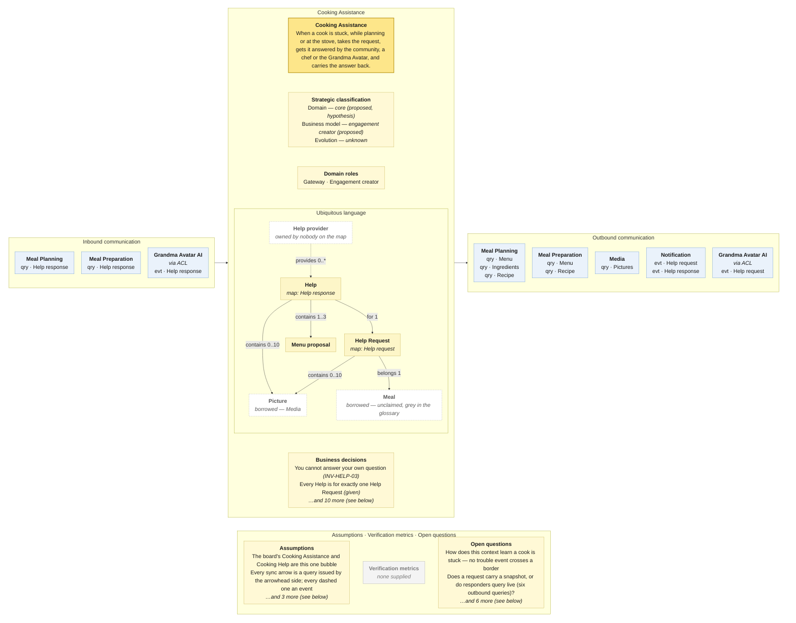

# Bounded Context Canvas — Cooking Assistance

> **Source:** Community Cooking context map (ContextMap.jpg) + Visual Glossary (VisualGlossaryEnhanced.jpg); business decisions from invariants-community-cooking-board.md; purpose lines from the pivotal-event cuts and the context cut · **Mode:** derived from the team's cut
> **Provenance:** `(given)` stated by a source · `(derived)` read off one ·
> `(proposed)` mine, confirm it · `(unknown)` nothing to derive from.

## Canvas

## Purpose  (derived)

When a cook is stuck — while planning a dinner or standing at the stove — takes
the request, gets it answered by the community, a chef or the Grandma Avatar,
and carries the answer back to whichever context asked. **It serves both Meal
Planning and Meal Preparation**: the board drew the request → answer cluster
twice (once per phase) and the map has, correctly, collapsed it into one node.

Derived from the pivotal-event re-run's §5b ("get them unstuck") and the story
cut's *Community Help* lane. The map's own name is kept.

## Strategic classification  (proposed)

| | |
|---|---|
| Domain | `(proposed)` **core — hypothesis.** No Core Domain Chart exists in the project. Two independent analyses (the pivotal-event re-run, the story cut's §8) argued this is the one thing nobody can buy: "a stranger answering a panicking cook fast enough to save dinner". Recorded as their hypothesis, not as a decision. |
| Business model | `(proposed)` engagement creator — the reciprocity loop (Thanks) exists to make responders come back; nothing on the map mentions money. |
| Evolution | `(unknown)` — no Wardley Map. |

Run `core-domain-chart-author` before building on the domain line.

## Domain roles  (derived)

- **Gateway** — every inbound message is a request for an answer and every
  answer comes from outside it (Community, Chef, Grandma Avatar AI). It routes;
  it does not itself know how to fix a burnt sauce.
- **Engagement creator** — its value is participation: a request nobody answers
  is a failed request, and the map gives it a Notification outlet precisely to
  pull responders in.

Rejected: *Execution model* — it carries out nothing in the kitchen; the rescue
happens in Meal Preparation.

## Inbound communication  (derived)

| Collaborator | Message | Type | What it carries | Evidence |
|---|---|---|---|---|
| Meal Planning | Help response | qry | the answer to a planning-time request: substitutes, a menu proposal, who answered | yellow Help response sticky on the upward arrow |
| Meal Preparation | Help response | qry | the answer to a cooking-time request: a step explanation or steps to mitigate a catastrophe, who answered | yellow Help response sticky on the downward arrow |
| Grandma Avatar AI `(via ACL)` | Help response | evt | a machine-generated answer, translated at the ACL | yellow Help response sticky beside the descending dashed arrow |

**Stays outside:** the search history, the rejected recipes, the guest list,
the full step sequence — the invariants sheet's X-02 notes that this context
takes advice from strangers while holding none of the guest constraints.

**Two of three inbound rows are queries the requesters issue for *Help
response*.** Nothing inbound *tells* this context that a cook is stuck: no
*Ingredients missing*, *Meal planning stalled*, *Step unclear* or *Catastrophe
happened* crosses a border on this map. The four missing policies every prior
analysis flagged are still missing — see open questions.

## Outbound communication  (derived)

| Message | Type | Collaborator | What it carries | Evidence |
|---|---|---|---|---|
| Menu | qry | Meal Planning | the menu the request is about | yellow Menu sticky on the downward arrow; green Menu read model inside Cooking Assistance |
| Ingredients | qry | Meal Planning | the ingredient list, including what is missing | yellow Ingredients sticky on the downward arrow; green read model spelled Ingredietens inside Cooking Assistance |
| Recipe | qry | Meal Planning | the chosen recipe (Recipe Catalog's, passed through) | green Recipe sticky on the downward arrow (a read model, not a business object -- Meal Planning passes Recipe Catalog's Recipe through) |
| Menu | qry | Meal Preparation | what is being cooked right now | green Menu sticky on the upward arrow |
| Recipe | qry | Meal Preparation | the recipe and the current step | green Recipe sticky on the upward arrow |
| Pictures | qry | Media | the catastrophe pictures attached to a request | yellow Pictures sticky on the arrow from Media; green Pictures read model inside Cooking Assistance |
| Help request | evt | Notification | that a request is open, for whoever should be told | yellow Help request sticky beside the dashed arrow; corresponds to the Help requested event |
| Help response | evt | Notification | that an answer arrived | yellow Help response sticky beside the dashed arrow; corresponds to the Help provided event |
| Help request | evt | Grandma Avatar AI `(via ACL)` | the request, for the avatar to answer | yellow Help request sticky beside the rising dashed arrow |

**Six outbound queries to three contexts.** This is the widest interface on
the map, and the pivotal-event re-run's §6 warning applies: either a help
request carries a **snapshot** taken at request time, or responders reach back
live into planning and cooking — and six live queries is the second design. The
green *Recipe* sticky on the Meal Planning arrow (a read model where the others
are business objects) says the map already knows *Recipe* is not Meal Planning's
to give.

## Ubiquitous language  (given — from the Visual Glossary; map spellings noted)

The panel above draws this table; it is repeated here because the picture caps what fits and a borrowed sense needs a sentence.

| Term | What it means *here* | Owned or borrowed | Cardinality (glossary) |
|---|---|---|---|
| Help Request | a cook's call for help, tied to one Meal, sent to a responder | **owned** — the map spells it *Help request* | Cook posts **0..\*** · belongs **1** Meal · at **1** Community · at **1** Grandma Avatar · contains **0..10** Picture |
| Meal Preparation Catastrophe · Help for Meal Preparation Step · Help with Ingredients · Help Meal plan | the four kinds of Help Request (`is` edges) | **owned** — none appears on the map | each **is** a Help Request |
| Help | the answer; the map calls it *Help response* | **owned** | **for 1** Help Request · contains **1..3** Ingredient Substitute · **1** Preparation Step Explanation · **1..10** Steps to Mitigate Catastrophe · **1..3** Menu proposal · contains **0..10** Picture |
| Ingredient Substitute · Preparation Step Explanation · Steps to Mitigate Catastrophe · Menu proposal | the four kinds of content an answer carries; each *belongs to* the matching request kind | **owned** — none appears on the map | Ingredient Substitute refers to **1** Substitute · Preparation Step Explanation refers to **1** Step |
| Help provider | whoever answers: Community, Grandma Avatar or Chef are each `is` a Help provider | **undefined owner** — the glossary defines it, no context on the map writes it | provides **0..\*** Help (drawn per provider) |
| Community · Chef | human responders | **not on the map at all** — see open questions | Community contains **1..\*** Cook |
| Grandma Avatar | the machine responder | **borrowed — Grandma Avatar AI**, which on the map is a separate context behind an ACL | Help Request at **1** |
| Picture | evidence attached to a request or an answer | **borrowed — Media**, where it is *Pictures* and also the trophy shot | 0..10 on both Help Request and Help |
| Meal | the thing the request is about — a *described* situation, never a pan (story cut §3) | **borrowed — nobody claims it**; grey in the glossary | belongs **1** |
| Menu · Ingredients · Recipe | context for a request, read from Meal Planning / Meal Preparation | **borrowed** — read models on the bubble; *Ingredietens* is the bubble's spelling | — |

**The borrowed senses, because they are what the borders are for:** *Meal* here
is a snapshot a stranger can answer from; in Meal Preparation it is a pan on a
hob with a current step. *Picture* here is diagnostic evidence with one
audience; in Sharing it is a trophy with the whole community as audience.

**Glossary and map disagree on two names for this context's own aggregates:**
*Help Request* / *Help request*, and *Help* / *Help response*. The map's
*Help response* is the more informative word, since the glossary's *Help* is
also the name of the whole activity. Patch list for the wall.

## Business decisions  (derived — from the invariants sheet and the glossary's cardinalities)

From the invariants sheet (`INV-HELP-*`, one rule set for what the board drew
as *Cooking Assistance* and *Cooking Help*; the map already draws one bubble):

1. **A request must be answerable** — refused with "add the recipe or a photo so someone can actually help". `INV-HELP-01` `(board)`
2. **One requester per request.** `INV-HELP-02`
3. **No self-help** — "you cannot answer your own question". `INV-HELP-03`
4. **Only an Open request can be answered** — "this request has been withdrawn". `INV-HELP-04`
5. **A response belongs to one request and cannot exist without it.** `INV-HELP-05` — and the glossary agrees: `Help for 1 Help Request` `(given)`.
6. **Many answers, at most one resolution** — contested and unenforceable today (no command marks the resolving answer). `INV-HELP-06`
7. **An avatar answer says so** — a Help produced by the Grandma Avatar is labelled machine-generated wherever it is shown. `INV-HELP-07`
8. **Urgency is carried, not guessed** — the request records whether the cook is at the stove or at the table. `INV-HELP-08` — the rule that keeps this one context instead of two.
9. **Answered is not reopened** — a follow-up is a new request. `INV-HELP-09` (contested)

From the glossary's cardinalities, which state rules nobody wrote as rules:

10. **A request carries at most ten pictures**, and so does an answer. `contains 0..10 Picture` `(given)`
11. **An answer about ingredients offers one to three substitutes; about a menu, one to three proposals; about a catastrophe, one to ten steps; about a step, exactly one explanation.** `Help contains 1..3 / 1..3 / 1..10 / 1` `(given)` — worth challenging: an answer with *no* substitute ("just leave it out") is refused by this model.
12. **A request is addressed to exactly one Community and exactly one Grandma Avatar.** `Help Request at 1 / at 1` `(given)` — which reads as "every request goes to both", and says nothing about a Chef.

**Not business decisions here** (need another context's data — policies, not rules):
"If nobody answers in *n* minutes, the avatar answers" (X-04); "when a cook gets
stuck, help is offered" (X-05); "a rescue must not break a guest's diet" (X-02).

## Assumptions  (derived)

- The board's two bubbles *Cooking Assistance* and *Cooking Help* are this one
  map node; the invariants sheet's `INV-HELP-*` set is applied once.
- **Every synchronous arrow on the map is read as a query issued by the context
  at the arrowhead**, because each such arrow ends at a context holding a green
  read model of exactly that object. Every dashed arrow is read as an event.
  Applied uniformly across all ten canvases — overturn it once and every canvas
  changes together.
- The dashed stickies say *Help request* and *Help response* (objects); they are
  read as the board's *Help requested* / *Help provided* events, carrying those
  objects, and named as the map names them.
- The OHS box on this context's right edge receives the arrow from Media, which
  is the wrong side for an open host; read as the map placing pattern labels at
  the arrowhead. See the README for the pattern on the whole map.
- The glossary's dangling `◀ belongs to` arrowhead beside *Ingredient Substitute*
  is read, by symmetry with the other three content → request-kind edges, as
  `Ingredient Substitute belongs to 1 Help with Ingredients`.
- Grandma Avatar AI is a **separate context** here because the map draws one.
  Three prior analyses argued the avatar is a responder *inside* this context;
  the canvas follows the map and carries the disagreement in open questions.

## Verification metrics  (unknown)

`none supplied` — neither the map nor the glossary states one.

`(proposed)`, if the room wants a starting point: time from *Help requested* to
first *Help provided*, split by at-the-stove vs at-the-table; share of requests
answered by a human before the avatar; share of answered requests that receive
Thanks.

## Open questions

1. **How does this context learn that a cook is stuck?** No *Ingredients missing*, *Meal planning stalled*, *Step unclear* or *Catastrophe happened* crosses a border; the only inbound messages are pulls for *Help response*. *(Settles the inbound column — and whether the four missing policies exist.)*
2. **Does a Help Request carry a snapshot, or do responders read live?** Six outbound queries say live; the *Help request* business object says snapshot. *(Settles the outbound column and whether these borders survive implementation.)*
3. **Is help at the stove the same context as help at the table?** Same objects and commands say yes; a response-time requirement an order of magnitude apart would say no. *(Settles whether this canvas is one or two, via `INV-HELP-08` vs X-04's `<n>`.)*
4. **Who owns *Help request* and *Help response*?** Grandma Avatar AI's bubble carries both as business objects and both events. *(Settles the ubiquitous language on two canvases; contested ownership.)*
5. **Where are Community and Chef?** The glossary names both as help providers; the map has neither a context nor an actor for them, and Notification has nobody to notify. *(Settles the `Help provider` gap.)*
6. **Why does Sharing get *Help response* from Meal Preparation rather than from here?** `INV-SHARE-01` needs the help provider, which only this context knows. *(Settles a probable misdrawn edge.)*
7. **When several people answer, who marks which answer resolved it?** *(Settles `INV-HELP-06` and unblocks Thanks.)*
8. **Is "at 1 Community and at 1 Grandma Avatar" really "every request goes to both"?** And can a request go to a Chef at all? *(Settles business decision 12.)*

## Border reconciliation

| Message | Direction | Counterpart | Status |
|---|---|---|---|
| Help response | in, from Meal Planning | `meal-planning.canvas.md` | matched — `qry` both sides |
| Help response | in, from Meal Preparation | `meal-preparation.canvas.md` | matched — `qry` both sides |
| Help response | in, from Grandma Avatar AI | `grandma-avatar-ai.canvas.md` | matched — `evt` both sides |
| Menu | out, to Meal Planning | `meal-planning.canvas.md` | matched — `qry` both sides |
| Ingredients | out, to Meal Planning | `meal-planning.canvas.md` | matched — `qry` both sides |
| Recipe | out, to Meal Planning | `meal-planning.canvas.md` | matched — `qry` both sides |
| Menu | out, to Meal Preparation | `meal-preparation.canvas.md` | matched — `qry` both sides |
| Recipe | out, to Meal Preparation | `meal-preparation.canvas.md` | matched — `qry` both sides |
| Pictures | out, to Media | `media.canvas.md` | matched — `qry` both sides |
| Help request | out, to Notification | `notification.canvas.md` | matched — `evt` both sides |
| Help response | out, to Notification | `notification.canvas.md` | matched — `evt` both sides |
| Help request | out, to Grandma Avatar AI | `grandma-avatar-ai.canvas.md` | matched — `evt` both sides |

All fifteen messages pair by construction of the ledger. The findings are the
shape, not the mismatches: **three inbound, all pulls; twelve outbound, six of
them queries.** This context asks far more than it is told.
