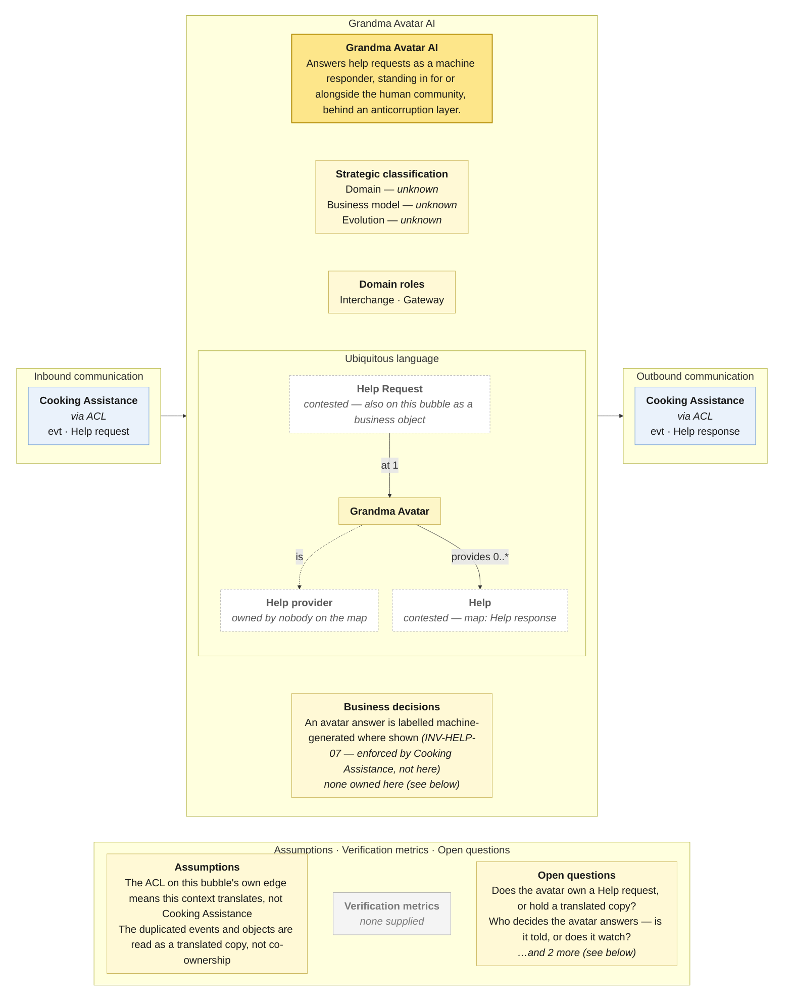

# Bounded Context Canvas — Grandma Avatar AI

> **Source:** Community Cooking context map (ContextMap.jpg) + Visual Glossary (VisualGlossaryEnhanced.jpg); business decisions from invariants-community-cooking-board.md; purpose lines from the pivotal-event cuts and the context cut · **Mode:** derived from the team's cut
> **Provenance:** `(given)` stated by a source · `(derived)` read off one ·
> `(proposed)` mine, confirm it · `(unknown)` nothing to derive from.

## Canvas

## Purpose  (derived)

Answers help requests as a machine responder — standing in for, or alongside,
the human community — and hands the answer back to Cooking Assistance through
an anticorruption layer.

Derived from the bubble (the same two events and two objects as Cooking
Assistance, behind an ACL) and the story cut's treatment of the avatar. **The
prior analyses in this project all placed the avatar *inside* the help
context**; the map draws it out, and this canvas follows the map.

## Strategic classification  (unknown)

| | |
|---|---|
| Domain | `(unknown)` — the story cut's §8 says explicitly this is "a bought or built capability inside Community Help, not a subdomain"; the map disagrees by drawing it. Nobody has classified it. |
| Business model | `(unknown)` |
| Evolution | `(unknown)` — "a differentiator or a commodity LLM behind a persona is a strategy question" (story cut). |

## Domain roles  (derived)

- **Interchange** — the ACL on its edge says it translates between Cooking
  Assistance's *Help request* and whatever a language model consumes, owning
  neither model.
- **Gateway** — it routes between the inside (a request) and something outside
  the map (an AI), and its whole traffic is request-in, answer-out.

Rejected: *Segregated core* — only if the avatar is the differentiator, which
nobody has decided.

## Inbound communication  (derived)

| Collaborator | Message | Type | What it carries | Evidence |
|---|---|---|---|---|
| Cooking Assistance `(via ACL)` | Help request | evt | the request, in Cooking Assistance's model, for the avatar to answer | yellow Help request sticky beside the rising dashed arrow |

## Outbound communication  (derived)

| Message | Type | Collaborator | What it carries | Evidence |
|---|---|---|---|---|
| Help response | evt | Cooking Assistance `(via ACL)` | a machine-generated answer, translated back | yellow Help response sticky beside the descending dashed arrow |

Asynchronous both ways — the only pair of dashed arrows on the map that
returns. The avatar can answer late, and Cooking Assistance must cope with a
human answer and an avatar answer arriving in either order.

## Ubiquitous language  (given for Grandma Avatar — from the Visual Glossary; ownership of the rest contested)

The panel above draws this table; it is repeated here because the picture caps what fits and a borrowed sense needs a sentence.

| Term | What it means *here* | Owned or borrowed | Cardinality (glossary) |
|---|---|---|---|
| Grandma Avatar | the persona that answers; the glossary term names this context's responder | **owned** | Help Request at **1** · provides **0..\*** Help · Thanks to **0..1** · is a Help provider |
| Help Request | a request to answer | **contested** — the bubble carries *Help request* as a business object and *Help requested* as an event, exactly as Cooking Assistance does; the ACL says this context has its *own* model of it, which is the opposite of sharing the object | at **1** Grandma Avatar |
| Help | the answer; map: *Help response* | **contested** — same duplication | Grandma Avatar provides **0..\*** |
| Help provider | what the avatar *is*, per the glossary | **undefined owner** | — |

**The bubble is a copy of Cooking Assistance's.** Two events, two objects,
identical names. With an ACL between them that is either (a) the avatar keeps
a translated copy — fine, and the duplication is the ACL working — or (b) two
contexts write one aggregate — the "implement it twice" trap the pivotal-event
re-run warned about. The map cannot tell which.

## Business decisions  (unknown — the invariants sheet has no context for the avatar)

**None owned here.** The invariants sheet placed the avatar inside the help
context and wrote its one rule there:

- `INV-HELP-07` — an avatar answer is labelled machine-generated wherever it is
  shown. Enforced by whoever *shows* the answer, i.e. Cooking Assistance, not
  by the avatar.

The rule that would make this context decide anything is X-04 — "if nobody
answers in *n* minutes, the avatar answers" — and that needs Cooking
Assistance's request state, so it is a **policy across the ACL**, not a
business decision here. Whose policy it is (does the avatar watch, or is it
told?) is open question 2.

## Assumptions  (derived)

- The ACL box sits on **this** context's edge, so the map is saying the avatar
  translates Cooking Assistance's model into its own. The prior analyses had
  the ACL the other way round (help context wraps the avatar). Followed the
  map.
- The duplicated *Help requested* / *Help provided* events and *Help request* /
  *Help response* objects are read as a translated copy behind the ACL, not as
  co-ownership — the more charitable reading, and the one open question 1
  should confirm.
- Both dashed stickies are read as events, named as the map names them.

## Verification metrics  (unknown)

`none supplied` — neither the map nor the glossary states one.

`(proposed)`: share of requests the avatar answers first; share of avatar answers later superseded by a human; share of avatar answers thanked.

## Open questions

1. **Does this context own a *Help request*, or hold a translated copy of Cooking Assistance's?** The bubble duplicates the object; the ACL implies a copy. *(Settles the ubiquitous language on both canvases.)*
2. **Who decides that the avatar answers?** Always, in parallel with humans (`Help Request at 1 Grandma Avatar` says every request reaches it), or only after *n* minutes unanswered (X-04)? *(Settles whether the inbound event is a request or a fallback trigger, and whose policy X-04 is.)*
3. **Is this a context or a capability inside Cooking Assistance?** Three prior analyses said inside; the map says beside. *(Settles whether this canvas should exist.)*
4. **Can the avatar be thanked?** The glossary says yes (`Thanks to 0..1 Grandma Avatar`); the invariants sheet asked. *(Settles a business decision on Sharing's canvas.)*

## Border reconciliation

| Message | Direction | Counterpart | Status |
|---|---|---|---|
| Help request | in, from Cooking Assistance | `cooking-assistance.canvas.md` | matched — `evt` both sides |
| Help response | out, to Cooking Assistance | `cooking-assistance.canvas.md` | matched — `evt` both sides |

Both messages pair with Cooking Assistance, `evt` both sides, both via the ACL.
