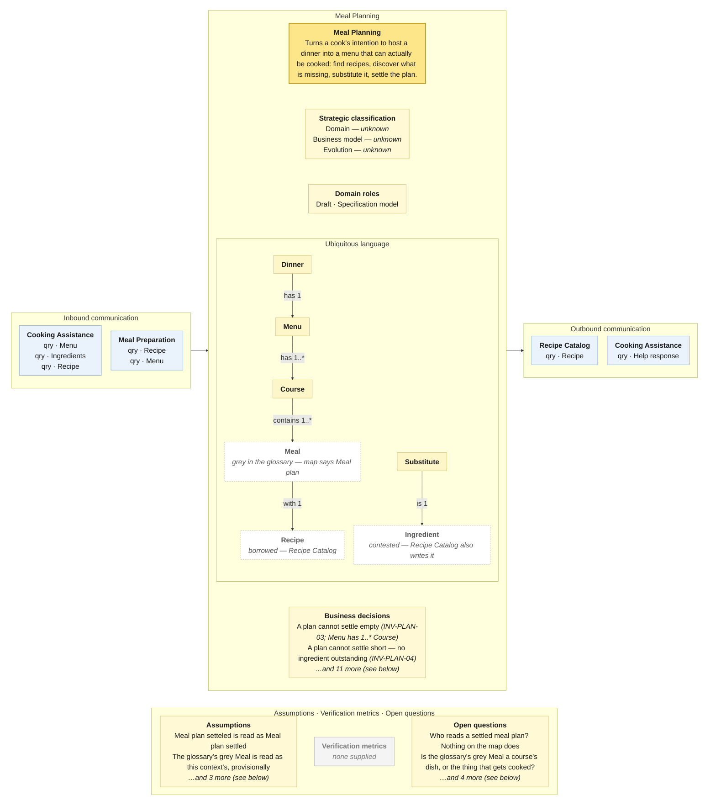

# Bounded Context Canvas — Meal Planning

> **Source:** Community Cooking context map (ContextMap.jpg) + Visual Glossary (VisualGlossaryEnhanced.jpg); business decisions from invariants-community-cooking-board.md; purpose lines from the pivotal-event cuts and the context cut · **Mode:** derived from the team's cut
> **Provenance:** `(given)` stated by a source · `(derived)` read off one ·
> `(proposed)` mine, confirm it · `(unknown)` nothing to derive from.

## Canvas

## Purpose  (derived)

Turns a cook's intention to host a dinner into a menu that can actually be
cooked: find recipes, discover which ingredients are missing, substitute them
(with help if planning stalls), and settle the plan.

Derived from the seven events on the bubble and the pivotal-event cut's segment
description ("turns an intention to host into a plan somebody could actually
cook").

## Strategic classification  (unknown)

| | |
|---|---|
| Domain | `(unknown)` — no Core Domain Chart; the story cut did not cover planning, and the pivotal-event re-run only said "a meal plan is a list", which is an opinion about evolution, not a classification. |
| Business model | `(unknown)` |
| Evolution | `(unknown)` |

## Domain roles  (derived)

- **Draft** — everything before *Meal plan setteled* is work in progress that
  has committed nobody; the invariants sheet's status model (Drafting → Blocked
  → Stalled → Settled) is a draft lifecycle.
- **Specification model** — once settled, the plan is what Meal Preparation
  executes against. Two contexts query it for *Recipe* and *Menu*.

Rejected: *Execution model* — nothing is cooked here.

## Inbound communication  (derived)

| Collaborator | Message | Type | What it carries | Evidence |
|---|---|---|---|---|
| Cooking Assistance | Menu | qry | the menu a planning-time request is about | yellow Menu sticky on the downward arrow; green Menu read model inside Cooking Assistance |
| Cooking Assistance | Ingredients | qry | the ingredient list, including what is missing | yellow Ingredients sticky on the downward arrow; green read model spelled Ingredietens inside Cooking Assistance |
| Cooking Assistance | Recipe | qry | the chosen recipe, passed through from Recipe Catalog | green Recipe sticky on the downward arrow (a read model, not a business object -- Meal Planning passes Recipe Catalog's Recipe through) |
| Meal Preparation | Recipe | qry | the recipe(s) to cook | yellow Recipe sticky on the long arrow from Meal Planning; green Recipe read model inside Meal Preparation |
| Meal Preparation | Menu | qry | the menu being cooked — portions, courses | yellow Menu sticky on the same arrow; green Menu read model inside Meal Preparation |

**Stays inside:** the search history, the rejected recipes, guest preferences
and the reasoning behind the menu, the fact that planning stalled at all
(pivotal-event cut §6).

**The settled plan itself never crosses.** Meal Preparation queries *Recipe*
and *Menu*, not a *Meal plan* — the "orphaned artefact" finding of both
pivotal-event cuts survives onto the context map: *Meal plan setteled* is
produced here and read by nobody.

## Outbound communication  (derived)

| Message | Type | Collaborator | What it carries | Evidence |
|---|---|---|---|---|
| Recipe | qry | Recipe Catalog | a recipe: its ingredients and steps | yellow Recipe sticky on the arrow; green Recipe read model inside Meal Planning |
| Help response | qry | Cooking Assistance | the answer to a planning-time request — substitutes, a menu proposal | yellow Help response sticky on the upward arrow |

*Recipe* is queried from Recipe Catalog and then served onward to two other
contexts — this context is a pass-through for a term it does not own. The map
marks that itself: the *Recipe* sticky on the arrow to Cooking Assistance is
green (a read model), unlike *Menu* and *Ingredients* beside it.

## Ubiquitous language  (given — from the Visual Glossary's blue terms; map spellings noted)

The panel above draws this table; it is repeated here because the picture caps what fits and a borrowed sense needs a sentence.

| Term | What it means *here* | Owned or borrowed | Cardinality (glossary) |
|---|---|---|---|
| Dinner | the occasion being planned | **owned** — blue in the glossary; **not on the map** (the map's *Dinner planned* event is the only trace) | has **1** Menu |
| Menu | what will be served | **owned** — business object on the bubble | has **1..\*** Course |
| Course | a course of the menu | **owned** by elimination — blue, next to Menu; **not on the map** | contains **1..\*** Meal |
| Meal | one dish of a course; the glossary draws it **grey**, claimed by no colour | **unclaimed** — the map has *Meal plan* here and *Meal preparation* opposite, and the glossary has neither | Cook prepares **0..\*** · with **1** Recipe · Help Request belongs **1** |
| Substitute | an ingredient standing in for one that is missing (*Ingredients substituted*) | **owned** by the event | is **1** Ingredient |
| Ingredient | the map's *Ingredients* business object on this bubble | **contested** — Recipe Catalog's bubble also carries *Ingredients*, and the glossary hangs Ingredient under Recipe | Recipe contains **1..\*** · Step needs **?** |
| Recipe | the thing a meal is made from | **borrowed — Recipe Catalog**; a read model here | Meal with **1** |
| Help | the answer to a stalled plan — here, substitutes and menu proposals to act on | **borrowed — Cooking Assistance** (map: *Help response*) | — |

**Map terms the glossary never defines:** *Meal plan* (the bubble's own
pivotal event, *Meal plan setteled*), *Guests* (the board's read model on which
`INV-PLAN-05` rests — absent from both artifacts), *Ingredients* as a list
distinct from *Ingredient*.

**The blue colour is a bounded-context colour** in the glossary's notation, and
it stops at Course. Whether the grey *Meal* is planning's (a slot in a course)
or preparation's (the thing cooked) is the single most useful question this
glossary raises — see open questions.

## Business decisions  (derived — from the invariants sheet and the glossary's cardinalities)

From the invariants sheet (`INV-PLAN-*`):

1. **A dinner has guests and an occasion** — "who is coming, and when?" `INV-PLAN-01`
2. **Portions follow the guests** — "this recipe serves 4 and you are 9". `INV-PLAN-02` (inferred)
3. **A plan cannot settle empty** — "you have not chosen anything to cook yet". `INV-PLAN-03` — and the glossary agrees twice over: `Menu has 1..* Course`, `Course contains 1..* Meal` `(given)`.
4. **A plan cannot settle short** — every gap raised by *Ingredients missing* must have been substituted or sourced. `INV-PLAN-04` — the rule events 5–9 of the board exist for, stated nowhere on the wall.
5. **Substitutions respect the guests** — "that swaps in walnuts, and Anna's allergy is on this plan". `INV-PLAN-05` (inferred; the rule most likely to hurt someone)
6. **Substitutions belong to a chosen recipe.** `INV-PLAN-06`
7. **One unsettled plan per occasion.** `INV-PLAN-07` (inferred)
8. **Only the planning cook plans** — "this is someone else's dinner". `INV-PLAN-08`
9. **The assistant does not nag** — *Meal planning stalled* is never raised for a settled plan, nor twice without a planning command between. `INV-PLAN-09`
10. **Settling is once** — "this plan is settled — reopen it to change the menu". `INV-PLAN-10` (no reopen command exists)

From the glossary's cardinalities:

11. **A dinner has exactly one menu.** `Dinner has 1 Menu` `(given)`
12. **A meal is one recipe.** `Meal with 1 Recipe` `(given)` — worth challenging: a course of "roast with two sides" is three recipes or three meals.
13. **A substitute stands in for exactly one ingredient.** `Substitute is 1 Ingredient` `(given)`

**Not business decisions here:** "you can only cook a meal you have planned"
(X-01 — nothing on the map reads the plan, so probably not a rule at all).

## Assumptions  (derived)

- *Meal plan setteled* on the bubble is read as *Meal plan settled*; the
  spelling goes on the patch list, not into the canvas.
- The glossary's blue terms (Dinner, Menu, Course) are read as this context's
  model; the grey *Meal* is drawn on this canvas as unclaimed rather than owned.
- Every sync arrow is a query issued by the arrowhead side (set-wide assumption,
  see the Cooking Assistance canvas).
- *Help response* has no green read model on this bubble, but the board's
  *Ingredients substituted* and *Meal plan settled* events both read it; the
  upward arrow is therefore read as this context pulling it.
- The OHS box below this bubble serves both the arrow leaving (to Cooking
  Assistance) and the arrow arriving; read as one box for two crossings.

## Verification metrics  (unknown)

`none supplied` — neither the map nor the glossary states one.

`(proposed)`: share of plans that settle; share that settle with no help request;
time from *Meal planning stalled* to the next planning command.

## Open questions

1. **Who reads a settled meal plan, and what happens between settling and the stove?** Meal Preparation queries *Recipe* and *Menu*, never a plan; a Shopping context may be missing between the two. *(Settles the outbound column and the Meal Planning → Meal Preparation border.)*
2. **Is the glossary's grey *Meal* one course's dish (planning) or the thing being cooked (preparation)?** The glossary refuses to colour it; the map has *Meal plan* here and *Meal preparation* opposite. *(Settles the ubiquitous language on two canvases.)*
3. **Who owns *Ingredients*?** This bubble writes it, Recipe Catalog's bubble writes it, and the glossary hangs *Ingredient* under Recipe. *(Settles a contested term and whether the substituted list is a different concept from the catalogue's.)*
4. **Where are the guests?** `INV-PLAN-01`, `-02` and `-05` all read a guest list that neither the map nor the glossary has. *(Settles three business decisions.)*
5. **Can a cook prepare a meal without planning one?** If yes, X-01 is a happy path, not a rule, and *Meal preparation started* is the real border. *(Settles the purpose line of this canvas and the next.)*
6. **Is "a meal is one recipe" right?** *(Settles business decision 12.)*

## Border reconciliation

| Message | Direction | Counterpart | Status |
|---|---|---|---|
| Menu | in, from Cooking Assistance | `cooking-assistance.canvas.md` | matched — `qry` both sides |
| Ingredients | in, from Cooking Assistance | `cooking-assistance.canvas.md` | matched — `qry` both sides |
| Recipe | in, from Cooking Assistance | `cooking-assistance.canvas.md` | matched — `qry` both sides |
| Recipe | in, from Meal Preparation | `meal-preparation.canvas.md` | matched — `qry` both sides |
| Menu | in, from Meal Preparation | `meal-preparation.canvas.md` | matched — `qry` both sides |
| Recipe | out, to Recipe Catalog | `recipe-catalog.canvas.md` | matched — `qry` both sides |
| Help response | out, to Cooking Assistance | `cooking-assistance.canvas.md` | matched — `qry` both sides |

All seven messages pair. Note that *Recipe* appears in three rows of this
canvas — one pull from Recipe Catalog, two serves onward — for a term this
context does not own.
