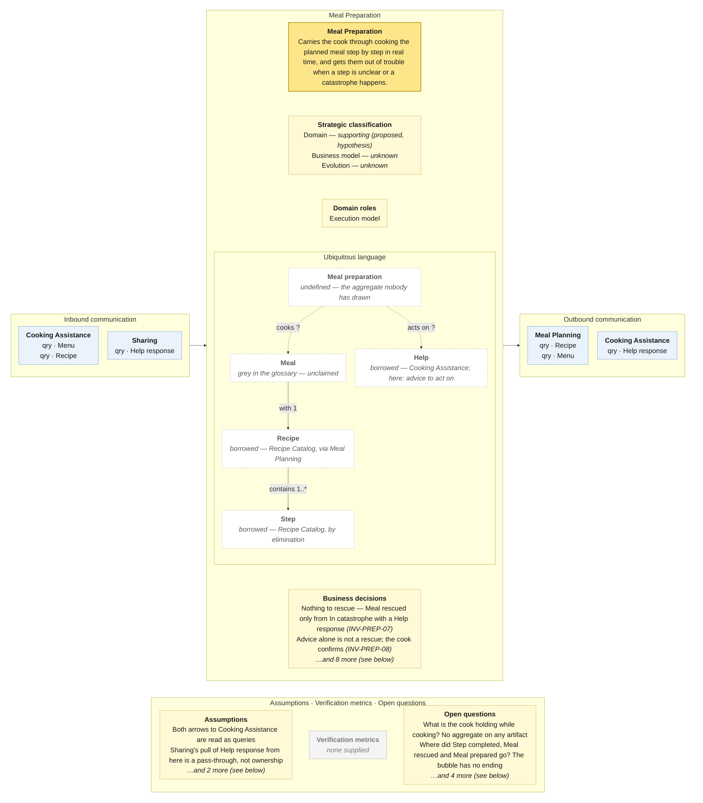

# Bounded Context Canvas — Meal Preparation

> **Source:** Community Cooking context map (ContextMap.jpg) + Visual Glossary (VisualGlossaryEnhanced.jpg); business decisions from invariants-community-cooking-board.md; purpose lines from the pivotal-event cuts and the context cut · **Mode:** derived from the team's cut
> **Provenance:** `(given)` stated by a source · `(derived)` read off one ·
> `(proposed)` mine, confirm it · `(unknown)` nothing to derive from.

## Canvas

## Purpose  (derived)

Carries the cook through cooking the planned meal, step by step and in real
time, and gets them out of trouble when a step is unclear or a catastrophe
happens — by asking Cooking Assistance and deciding for itself whether the
advice worked.

Derived from the three events on the bubble and the story cut's *Meal
Preparation* lane, whose phrasing — "including when it goes wrong and comes
back" — is kept.

## Strategic classification  (proposed)

| | |
|---|---|
| Domain | `(proposed)` **supporting — hypothesis** from the story cut's §8: "necessary, specific to the product, and mostly bookkeeping — where am I, what went wrong". It becomes core only if step-by-step guidance turns into the differentiator. No chart exists. |
| Business model | `(unknown)` |
| Evolution | `(unknown)` |

## Domain roles  (derived)

- **Execution model** — it carries out, in real time, what Meal Planning
  specified: the recipe's steps, in the kitchen, with a clock running. Every one
  of its events is a moment in one cooking session.

Rejected: *Audit model* — it records catastrophes, but to get out of them, not
for later scrutiny.

## Inbound communication  (derived)

| Collaborator | Message | Type | What it carries | Evidence |
|---|---|---|---|---|
| Cooking Assistance | Menu | qry | what is being cooked right now | green Menu sticky on the upward arrow |
| Cooking Assistance | Recipe | qry | the recipe and, implicitly, the current step | green Recipe sticky on the upward arrow |
| Sharing | Help response | qry | who helped and what they said — served second-hand; this context never writes it | yellow Help response sticky on the arrow from Meal Preparation -- an object Meal Preparation never writes |

**Stays inside:** step-by-step progress, every *Step unclear*, the
catastrophe and the rescue (pivotal-event cut §6).

**One of the two inbound collaborators is asking for something this context
does not own.** Sharing pulls *Help response* from here; *Help response* is
Cooking Assistance's business object, and this bubble does not even carry it as
a read model. Read as a pass-through, and probably a misdrawn edge.

## Outbound communication  (derived)

| Message | Type | Collaborator | What it carries | Evidence |
|---|---|---|---|---|
| Recipe | qry | Meal Planning | the recipe(s) to cook | yellow Recipe sticky on the long arrow from Meal Planning; green Recipe read model inside Meal Preparation |
| Menu | qry | Meal Planning | the menu being cooked | yellow Menu sticky on the same arrow; green Menu read model inside Meal Preparation |
| Help response | qry | Cooking Assistance | a step explanation or steps to mitigate a catastrophe — advice to act on | yellow Help response sticky on the downward arrow |

**Nothing this context produces ever leaves it.** Three events on the bubble —
*Meal preparation started*, *Catastrophe happened*, *Step unclear* — and none
crosses a border. The board's *Step completed*, *Meal rescued* and *Meal
prepared* are **not on this bubble at all**: as mapped, a preparation starts
and never finishes. Sharing therefore has no trigger for *Thanks given*.

## Ubiquitous language  (derived — this context writes no glossary term; every node on the panel is dashed)

The panel above draws this table; it is repeated here because the picture caps what fits and a borrowed sense needs a sentence.

| Term | What it means *here* | Owned or borrowed | Cardinality (glossary) |
|---|---|---|---|
| Meal | the pan on the hob: a preparation in progress with a current step and a status (cooking → stuck → in catastrophe → rescued → prepared) | **unclaimed** — grey in the glossary; `Cook prepares 0..* Meal` is the only edge that points this way | with **1** Recipe |
| Meal preparation | the map's own noun (*Meal preparation started*) for the thing above | **undefined** — on no glossary, and **no business object on the bubble** | — |
| Step | one instruction of the recipe; *Step unclear* is about one of these | **borrowed** — `Recipe contains 1..* Step` puts it in Recipe Catalog by elimination; no context on the map writes it | Recipe contains **1..\*** · needs **?** Ingredient |
| Recipe · Menu | what is being cooked | **borrowed — Meal Planning** serves them; Recipe Catalog owns Recipe | — |
| Help | in Cooking Assistance an answer; **here, advice to act on** — receiving it is not the rescue, the cook confirming the pan is recoverable is (story cut §4, `INV-PREP-08`) | **borrowed — Cooking Assistance** (map: *Help response*) | — |
| Catastrophe · Steps to Mitigate Catastrophe · Preparation Step Explanation | what goes wrong and what comes back | *Catastrophe* is on the board, in no glossary; the other two are Cooking Assistance's Help contents | Help contains **1..10** · **1** |

**This is the only canvas in the set with no solid term.** The pivotal-event
cuts, the invariants sheet and the story cut all found the same thing from
different directions, and the context map — which had the chance to fix it —
draws seven read models and events into this bubble and not one business
object. Naming the aggregate remains the highest-value change to every artifact
in the project.

## Business decisions  (derived — from the invariants sheet; every rule names an aggregate the map does not have)

From the invariants sheet (`INV-PREP-*`). **Every one of these names an
aggregate that exists on no artifact.** They are kept because they are the
specification for the one that is needed.

1. **Cooking is cooking something** — "what are you making?" `INV-PREP-01` `(board)`
2. **A step is completed once.** `INV-PREP-02`
3. **Unclear applies to an open step** — "that step is behind you". `INV-PREP-03`
4. **Done means done** — every mandatory step completed, "3 steps are still open — finish or skip them". `INV-PREP-04` (no skip command exists)
5. **Steps follow the recipe's order.** `INV-PREP-05` — contested and probably wrong; real cooks parallelise.
6. **A catastrophe belongs to one step of one preparation.** `INV-PREP-06`
7. **Nothing to rescue** — *Meal rescued* only from *In catastrophe*, and only with a Help response for it. `INV-PREP-07` `(board)`
8. **A rescue is not a rescue until the cook says so** — advice arriving does not end a catastrophe. `INV-PREP-08` — as the board reads today, the system declares a meal rescued while it is still burning.
9. **Only the cook cooks** — "this is someone else's kitchen". `INV-PREP-09`
10. **Prepared is final.** `INV-PREP-10`

The glossary contributes no cardinality this context could enforce: it defines
nothing this context writes.

**Not business decisions here:** "a rescue must not break a guest's diet" (X-02
— the guest constraints live in Meal Planning and nothing on the map carries
them across); "you can only cook a meal you have planned" (X-01).

## Assumptions  (derived)

- The two arrows between this bubble's top OHS and Cooking Assistance are read
  as two queries: this context pulls *Help response*; Cooking Assistance pulls
  *Menu* and *Recipe* (both green on the arrow, i.e. read models served onward).
- Sharing's arrow from this context carrying *Help response* is read as a
  pass-through of Cooking Assistance's object, since nothing here writes it.
- The OHS box on the left edge receives the arrow from Meal Planning; read as
  the map placing pattern labels at the arrowhead (set-wide, see README).
- The glossary's grey *Meal* is drawn here as unclaimed, not as this context's,
  even though `Cook prepares 0..* Meal` is the one relationship that reads as
  preparation.

## Verification metrics  (unknown)

`none supplied` — neither the map nor the glossary states one.

`(proposed)`: share of preparations that reach *Meal prepared* (once that event
exists); time from *Catastrophe happened* to a cook-confirmed rescue; share of
catastrophes with no rescue.

## Open questions

1. **What is the cook holding while cooking?** A session, a checklist, a preparation? Ten business decisions have nowhere to live until it is named. *(Settles the ubiquitous language and the whole business-decisions field.)*
2. **Where did *Step completed*, *Meal rescued* and *Meal prepared* go?** The board has them; the bubble does not, and nothing tells Sharing a meal is done. *(Settles the outbound column, and Sharing's inbound one.)*
3. **Why does Sharing read *Help response* from here and not from Cooking Assistance?** *(Settles whether the Meal Preparation → Sharing edge is drawn right.)*
4. **Is `Prepare meal` one command or six?** Until it is split, no `INV-PREP` guard has a command to attach to. *(Settles whether the business decisions are enforceable.)*
5. **Do the guest constraints reach the kitchen?** X-02: the context that takes advice from strangers holds no allergy list. *(Settles whether a copy crosses the Meal Planning border — an undrawn edge.)*
6. **What happens to a catastrophe nobody can rescue?** *(Names a missing state and a missing command.)*

## Border reconciliation

| Message | Direction | Counterpart | Status |
|---|---|---|---|
| Menu | in, from Cooking Assistance | `cooking-assistance.canvas.md` | matched — `qry` both sides |
| Recipe | in, from Cooking Assistance | `cooking-assistance.canvas.md` | matched — `qry` both sides |
| Help response | in, from Sharing | `sharing.canvas.md` | matched — `qry` both sides |
| Recipe | out, to Meal Planning | `meal-planning.canvas.md` | matched — `qry` both sides |
| Menu | out, to Meal Planning | `meal-planning.canvas.md` | matched — `qry` both sides |
| Help response | out, to Cooking Assistance | `cooking-assistance.canvas.md` | matched — `qry` both sides |

All five messages pair. The finding is the empty outbound column: this context
tells nobody anything, not even that the meal is done.
