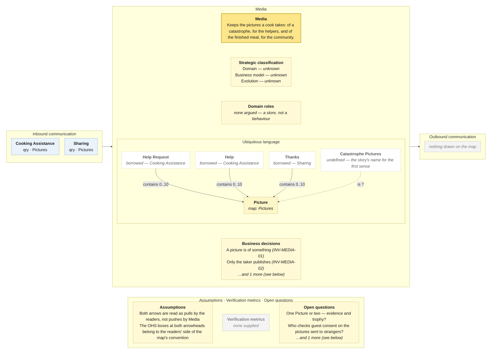

# Bounded Context Canvas — Media

> **Source:** Community Cooking context map (ContextMap.jpg) + Visual Glossary (VisualGlossaryEnhanced.jpg); business decisions from invariants-community-cooking-board.md; purpose lines from the pivotal-event cuts and the context cut · **Mode:** derived from the team's cut
> **Provenance:** `(given)` stated by a source · `(derived)` read off one ·
> `(proposed)` mine, confirm it · `(unknown)` nothing to derive from.

## Canvas

## Purpose  (derived)

Keeps the pictures a cook takes — of a catastrophe, so a helper can see what
went wrong, and of the finished meal, so the community can see the result.

Derived from the one event on the bubble and its two readers. Every prior
analysis found the two purposes to be **two concepts under one word**; the map
keeps one bubble and one word.

## Strategic classification  (unknown)

| | |
|---|---|
| Domain | `(unknown)` — the pivotal-event re-run called pictures "media… available off the shelf" and the story cut said "supporting, tending generic" for sharing them. Hunches, not a chart. |
| Business model | `(unknown)` |
| Evolution | `(unknown)` — photo storage is a commodity in general; whether *this* is, nobody said. |

## Domain roles  (derived)

**None argued.** One event (*Pictures taken*), one object, two readers, no
decision. Nothing on the bubble predicts behaviour, and tagging it *Gateway*
or *Audit model* would be decoration. That is itself a finding: a context that
only stores and serves may be a component of the contexts that use it (see
open questions).

## Inbound communication  (derived)

| Collaborator | Message | Type | What it carries | Evidence |
|---|---|---|---|---|
| Cooking Assistance | Pictures | qry | the catastrophe pictures attached to a help request | yellow Pictures sticky on the arrow from Media; green Pictures read model inside Cooking Assistance |
| Sharing | Pictures | qry | the pictures of the finished meal, to show | yellow Pictures sticky on the arrow from Media |

**Two readers, two senses.** The same query name from two collaborators is a
fact about coupling — and here, about language: Cooking Assistance wants
diagnostic evidence with one audience; Sharing wants a trophy shot for the
whole community. See ubiquitous language.

## Outbound communication  (derived)

**Nothing is drawn.** *Pictures taken* crosses no border; nobody is told a picture exists — both readers must already know to ask.

## Ubiquitous language  (given — from the Visual Glossary; map spelling noted)

The panel above draws this table; it is repeated here because the picture caps what fits and a borrowed sense needs a sentence.

| Term | What it means *here* | Owned or borrowed | Cardinality (glossary) |
|---|---|---|---|
| Picture | an image a cook took; the map spells it *Pictures* | **owned** — the bubble's business object | Help Request contains **0..10** · Help contains **0..10** · Thanks contains **0..10** |
| Help Request · Help · Thanks | the three things a picture can be attached to | **borrowed** — Cooking Assistance (two) and Sharing (one) | — |
| Catastrophe Pictures | the first sense, named by the domain story (as *Catastrophy Pictures*) and the prototype | **undefined** — on no map bubble and in no glossary | — |

**The glossary defines one *Picture* with three owners of attachments and no
distinction between them.** The story cut's table is the borrowed-sense
statement this canvas needs: evidence (short-lived, one responder, "is the
damage legible?") versus result (indefinite, whole community, "is it
flattering, who is in it?"). One name for both "will pull the two contexts
back together" (pivotal-event cut §7).

## Business decisions  (derived — from the invariants sheet)

From the invariants sheet (`INV-MEDIA-*`):

1. **A picture is of something** — a catastrophe, a step, or a finished meal; "which meal is this?" `INV-MEDIA-01` — the board's trophy shot reads *nothing*, i.e. floats free.
2. **Only the taker publishes** — "these are not your pictures". `INV-MEDIA-02`

From the glossary: **at most ten pictures per request, answer or thanks**
(`0..10` on all three) — but those are rules the *owners of the attachments*
enforce, not this context.

**Not a business decision here:** `INV-MEDIA-03` — pictures showing
identifiable guests are not shared without consent. That is Consent
Management's data, and **this context has no edge to Consent Management**;
only Sharing does. The kitchen photos that go to strangers via Cooking
Assistance are checked by nobody.

## Assumptions  (derived)

- Both arrows leaving this bubble end at an OHS box on the *reader's* edge
  (Cooking Assistance, Sharing). Read as the map's arrowhead-side placement;
  the messages are queries the readers issue.
- *Pictures* (map) and *Picture* (glossary) are one term; patch list.
- *Catastrophe Pictures* is carried from the story and prototype, not from
  either input, to name the sense the glossary lacks.

## Verification metrics  (unknown)

`none supplied` — neither the map nor the glossary states one.

`(proposed)`: pictures attached to a request that are never viewed by a responder; pictures never shared.

## Open questions

1. **Is a catastrophe picture the same kind of thing as a finished-meal picture?** Different lifetime, audience and questions; one glossary term. *(Settles the ubiquitous language, and whether this bubble is one context or a piece of two.)*
2. **Who checks consent on the pictures that go to strangers via Cooking Assistance?** Media has no edge to Consent Management. *(Settles where `INV-MEDIA-03` lives — an undrawn edge.)*
3. **Is Media a context or a component?** No decision, no role, no outbound message. *(Settles whether this canvas should exist.)*

## Border reconciliation

| Message | Direction | Counterpart | Status |
|---|---|---|---|
| Pictures | in, from Cooking Assistance | `cooking-assistance.canvas.md` | matched — `qry` both sides |
| Pictures | in, from Sharing | `sharing.canvas.md` | matched — `qry` both sides |
| *(none)* | out | — | **no outbound message anywhere on this canvas** |

Both queries pair. Nothing outbound.
