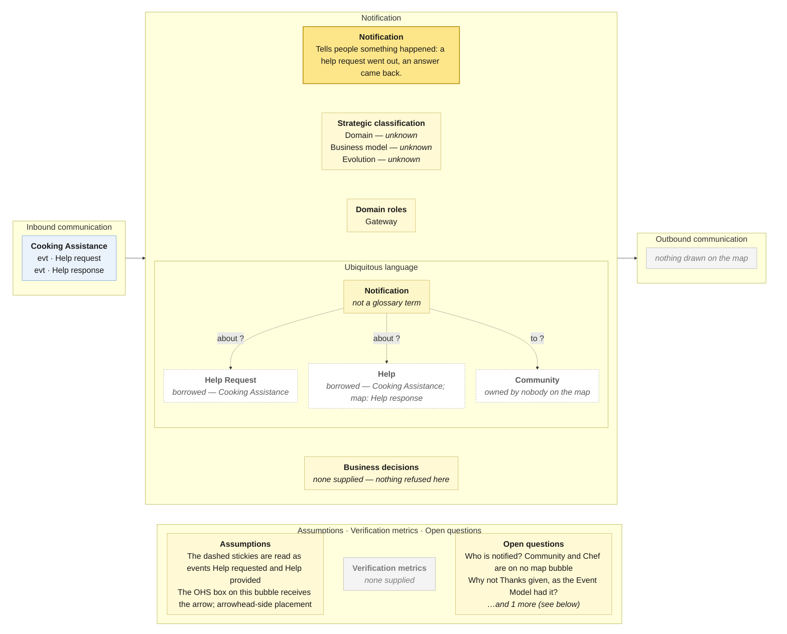

# Bounded Context Canvas — Notification

> **Source:** Community Cooking context map (ContextMap.jpg) + Visual Glossary (VisualGlossaryEnhanced.jpg); business decisions from invariants-community-cooking-board.md; purpose lines from the pivotal-event cuts and the context cut · **Mode:** derived from the team's cut
> **Provenance:** `(given)` stated by a source · `(derived)` read off one ·
> `(proposed)` mine, confirm it · `(unknown)` nothing to derive from.

## Canvas

## Purpose  (derived)

Tells people that something happened — a help request went out, an answer
came back — so that responders respond and requesters return.

Derived from the bubble (one business object, no events) and its single
inbound edge. The pivotal-event cuts listed this as "implied, unmodelled — the
mechanism the whole community proposition rests on"; the map now draws it.

## Strategic classification  (unknown)

| | |
|---|---|
| Domain | `(unknown)` |
| Business model | `(unknown)` |
| Evolution | `(unknown)` — notification delivery is a commodity in general; nothing here says so. |

## Domain roles  (derived)

- **Gateway** — it routes between the inside (Cooking Assistance's events) and
  people outside the map. Everything it handles arrives as an event and leaves
  as a message to a person the map does not draw.

## Inbound communication  (derived)

| Collaborator | Message | Type | What it carries | Evidence |
|---|---|---|---|---|
| Cooking Assistance | Help request | evt | that a request is open — for whoever should be told; who that is, the map does not say | yellow Help request sticky beside the dashed arrow; corresponds to the Help requested event |
| Cooking Assistance | Help response | evt | that an answer arrived — for the requesting cook, presumably | yellow Help response sticky beside the dashed arrow; corresponds to the Help provided event |

Two events, both from one publisher, both asynchronous. Nothing else on the
map is announced here: not *Thanks given* (the Event Model had it), not *Meal
prepared*, not a stalled plan.

## Outbound communication  (derived)

**Nothing is drawn.** Delivery to a person is off-board by nature; but the map also draws no *Community* or *Chef* to deliver to, so this context has events in and nobody to tell.

## Ubiquitous language  (derived — the glossary has no term for this context)

The panel above draws this table; it is repeated here because the picture caps what fits and a borrowed sense needs a sentence.

| Term | What it means *here* | Owned or borrowed | Cardinality |
|---|---|---|---|
| Notification | a message to a person that something happened | **owned** — the bubble's business object; **not in the glossary** (the bubble spells it *Notifi cation* across two lines) | `(unknown)` |
| Help Request · Help | what a notification is about | **borrowed — Cooking Assistance** | — |
| Community · Chef | who a request notification should reach, per the glossary's *provides* edges | **undefined owner** — glossary terms, on no map bubble | — |

A context whose only owned noun is its own name, and whose recipients exist in
the glossary but not on the map.

## Business decisions  (unknown — no invariant, no cardinality, no policy drawn)

**None.** Nothing on either input is refused by this context. The invariants
sheet's dropped-candidate list is the right home for what it does ("sends a
notification" is behaviour, not a decision).

The decision that *would* live here — who is told about which request, and
when the avatar is told instead (X-04) — is drawn nowhere.

## Assumptions  (derived)

- The dashed stickies *Help request* / *Help response* are read as the
  events *Help requested* / *Help provided*, named as the map names them.
- The OHS box on this bubble's edge receives the arrow — arrowhead-side
  placement (set-wide assumption).
- A bubble with one object and no events is read as a component-like context;
  see open question 3.

## Verification metrics  (unknown)

`none supplied` — neither the map nor the glossary states one.

`(proposed)`: time from *Help requested* to first notification delivered; share of notifications that produce a response.

## Open questions

1. **Who is notified of a help request?** The glossary's Community and Chef are on no bubble; the map draws no recipient. *(Settles the outbound column, off-board or not.)*
2. **Why is *Thanks given* not announced?** The project's Event Model routed it here; the map does not. *(Settles whether an edge from Sharing is missing.)*
3. **Is Notification a context or a component?** One noun, no decision, no event of its own. *(Settles whether this canvas should exist.)*

## Border reconciliation

| Message | Direction | Counterpart | Status |
|---|---|---|---|
| Help request | in, from Cooking Assistance | `cooking-assistance.canvas.md` | matched — `evt` both sides |
| Help response | in, from Cooking Assistance | `cooking-assistance.canvas.md` | matched — `evt` both sides |
| *(none)* | out | — | **no outbound message anywhere on this canvas** |

Both events pair with Cooking Assistance. Nothing outbound.
