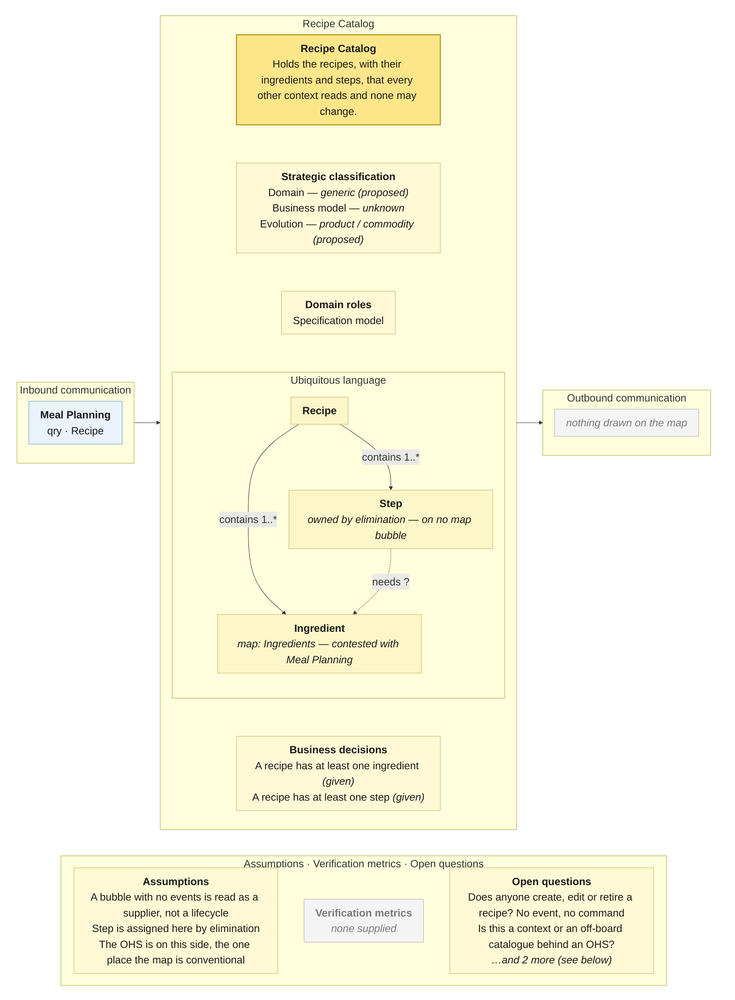

# Bounded Context Canvas — Recipe Catalog

> **Source:** Community Cooking context map (ContextMap.jpg) + Visual Glossary (VisualGlossaryEnhanced.jpg); business decisions from invariants-community-cooking-board.md; purpose lines from the pivotal-event cuts and the context cut · **Mode:** derived from the team's cut
> **Provenance:** `(given)` stated by a source · `(derived)` read off one ·
> `(proposed)` mine, confirm it · `(unknown)` nothing to derive from.

## Canvas

## Purpose  (derived)

Holds the recipes — what a dish is made of and how it is made — that Meal
Planning reads and passes on to Cooking Assistance and Meal Preparation. Nobody
on the map changes a recipe.

Derived from the bubble (two business objects, no events) and the prior cuts'
*Recipe Catalogue* finding: "*Recipe* appears in seven clusters spanning every
segment, and no event on the board ever creates, edits or retires a recipe."
The map now draws the context those cuts said was missing — still without an
event.

## Strategic classification  (proposed)

| | |
|---|---|
| Domain | `(proposed)` generic — the pivotal-event re-run: "recipe search is a catalogue… available off the shelf". No chart. |
| Business model | `(unknown)` |
| Evolution | `(proposed)` product or commodity — the same cut proposed a *conformist* relationship to an off-board supplier, which is what product/commodity looks like on a map. |

## Domain roles  (derived)

- **Specification model** — it holds the definitions (ingredients, steps) that
  Meal Preparation executes against and Meal Planning composes from. It never
  executes anything itself.

## Inbound communication  (derived)

| Collaborator | Message | Type | What it carries | Evidence |
|---|---|---|---|---|
| Meal Planning | Recipe | qry | a recipe: its ingredients and its steps | yellow Recipe sticky on the arrow; green Recipe read model inside Meal Planning |

One collaborator, one query. Cooking Assistance and Meal Preparation also read
*Recipe*, but the map routes them through Meal Planning rather than here.

## Outbound communication  (derived)

**Nothing is drawn.** A catalogue that never announces a new, changed or withdrawn recipe. Any context holding a copy of a recipe (all three that read it) can never learn it went stale.

## Ubiquitous language  (given — from the Visual Glossary; map spellings noted)

The panel above draws this table; it is repeated here because the picture caps what fits and a borrowed sense needs a sentence.

| Term | What it means *here* | Owned or borrowed | Cardinality (glossary) |
|---|---|---|---|
| Recipe | a dish's ingredients and the steps to make it | **owned** — business object on the bubble | contains **1..\*** Ingredient · contains **1..\*** Step · Meal with **1** |
| Ingredient | something a recipe is made of; the bubble spells it *Ingredients* | **owned — contested**: Meal Planning's bubble also carries *Ingredients* as a business object | Recipe contains **1..\*** · Substitute is **1** · Step needs **?** |
| Step | one instruction of a recipe | **owned by elimination** — the glossary hangs it under Recipe; no bubble on the map carries it, and Meal Preparation's *Step unclear* uses it | Recipe contains **1..\*** · Preparation Step Explanation refers to **1** |

**Borrowed:** nothing — this context reads no other context's terms, which is
consistent with an upstream catalogue and inconsistent with a context (a
context with no borrowed terms usually has no behaviour).

**Sense elsewhere:** Meal Planning's *Ingredients* is the substituted list for
one dinner; Cooking Assistance's *Ingredient Substitute* is advice. Three
contexts, one word, and only the glossary's `Substitute is 1 Ingredient` edge
keeps them apart.

## Business decisions  (given — from the glossary's cardinalities only; the invariants sheet has no Recipe context)

The invariants sheet found "everything about Recipes… unowned" (X-03). The
glossary supplies two rules by cardinality:

1. **A recipe has at least one ingredient.** `Recipe contains 1..* Ingredient` `(given)`
2. **A recipe has at least one step.** `Recipe contains 1..* Step` `(given)`

Nothing else: the bubble has no command, no event and therefore nothing it
could refuse. **Whether a step needs an ingredient at all is unstated** — the
`Step needs Ingredient` edge carries no multiplicity, so it is drawn dashed.

## Assumptions  (derived)

- A bubble with business objects and **no events** is read as a supplier
  context with no lifecycle on this map — not as a context whose events were
  left off.
- *Step* is assigned here by elimination from the glossary; the map has no
  opinion.
- The plural *Ingredients* on the bubble and the singular *Ingredient* in the
  glossary are read as one term; the spelling goes on the patch list.
- The OHS box sits on this context's own edge with the arrow leaving it — the
  conventional placement, and one of only three on the map.

## Verification metrics  (unknown)

`none supplied` — neither the map nor the glossary states one.

`(proposed)`: share of recipe reads that find the recipe; number of recipes never read.

## Open questions

1. **Does anyone create, edit or retire a recipe?** No event, no command, in a context named *Catalog*. *(Settles whether this is a context or a component — and whether it should have a canvas at all.)*
2. **Is this an off-board supplier behind an OHS, or the team's own recipe model?** The prior cuts recommended conformist; the map draws a full bubble. *(Settles the evolution line.)*
3. **Who owns *Ingredients*?** *(Settles the contested term with Meal Planning.)*
4. **Should Cooking Assistance and Meal Preparation read *Recipe* from here directly?** The map routes both through Meal Planning. *(Settles whether two more edges belong on this canvas.)*

## Border reconciliation

| Message | Direction | Counterpart | Status |
|---|---|---|---|
| Recipe | in, from Meal Planning | `meal-planning.canvas.md` | matched — `qry` both sides |
| *(none)* | out | — | **no outbound message anywhere on this canvas** |

The one message pairs. The outbound column is empty by the map's own silence.
