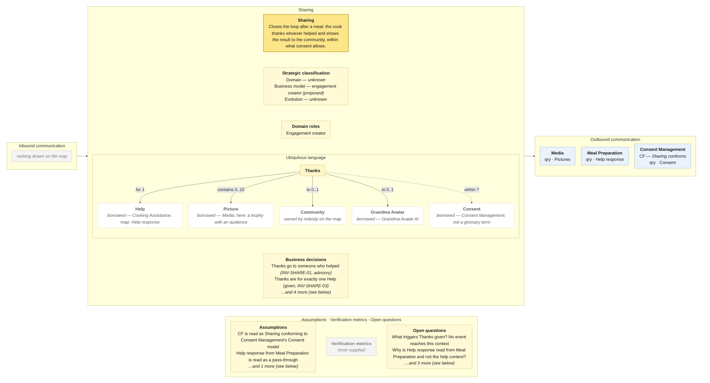

# Bounded Context Canvas — Sharing

> **Source:** Community Cooking context map (ContextMap.jpg) + Visual Glossary (VisualGlossaryEnhanced.jpg); business decisions from invariants-community-cooking-board.md; purpose lines from the pivotal-event cuts and the context cut · **Mode:** derived from the team's cut
> **Provenance:** `(given)` stated by a source · `(derived)` read off one ·
> `(proposed)` mine, confirm it · `(unknown)` nothing to derive from.

## Canvas

## Purpose  (derived)

Closes the loop after a meal: the cook thanks whoever helped and shows the
result — within what Consent Management says may be shown.

Derived from the one event on the bubble (*Thanks given*), its three outbound
queries and the story cut's *Meal Sharing* lane. The pivotal-event re-run
recommended dissolving this context into Cooking Assistance (thanks) and Media
(pictures); the map keeps it, so this canvas does.

## Strategic classification  (proposed)

| | |
|---|---|
| Domain | `(unknown)` — the story cut said "supporting, tending generic" for *Meal Sharing*, and core-adjacent for the thanks; the map's *Sharing* is both. No chart. |
| Business model | `(proposed)` engagement creator — thanks are "the only reciprocity mechanism on the board" (pivotal-event cut). |
| Evolution | `(unknown)` |

## Domain roles  (derived)

- **Engagement creator** — it exists so that helpers come back. Its one event
  is a gesture toward another person; nothing here is operationally necessary
  to get dinner made.

## Inbound communication  (derived)

**Nothing is drawn.** No event reaches this context. *Meal prepared* is not on the Meal Preparation bubble, and nothing else says a meal is done. *Thanks given* happens with no trigger the map can name.

## Outbound communication  (derived)

| Message | Type | Collaborator | What it carries | Evidence |
|---|---|---|---|---|
| Pictures | qry | Media | the finished-meal pictures to show | yellow Pictures sticky on the arrow from Media |
| Help response | qry | Meal Preparation | who helped and what they said — served second-hand by Meal Preparation | yellow Help response sticky on the arrow from Meal Preparation -- an object Meal Preparation never writes |
| Consent | qry | Consent Management `(CF — Sharing conforms)` | whether the pictures, and the guests in them, may be shown; taken in Consent Management's model, unchanged | yellow Consent sticky on the long arrow from Consent Management; CF = Sharing conforms |

Three pulls, three suppliers — and the one that matters most is drawn oddly:
*Help response* is fetched from **Meal Preparation**, which never writes it,
rather than from Cooking Assistance, which owns it and the *Help provider*
that `INV-SHARE-01` needs.

## Ubiquitous language  (given — from the Visual Glossary; Consent derived from the map)

The panel above draws this table; it is repeated here because the picture caps what fits and a borrowed sense needs a sentence.

| Term | What it means *here* | Owned or borrowed | Cardinality (glossary) |
|---|---|---|---|
| Thanks | the cook's gesture back to whoever helped, with pictures | **owned** — the bubble's business object | Cook posts **0..\*** · for **1** Help · contains **0..10** Picture · to **0..1** Community · to **0..1** Grandma Avatar |
| Help | in Cooking Assistance an answer; **here, the thing being thanked for** | **borrowed — Cooking Assistance** (map: *Help response*) | for **1** |
| Picture | in Media, an image; in Cooking Assistance, evidence; **here, a result with an audience** | **borrowed — Media** | contains **0..10** |
| Community | the audience, and one of two possible recipients | **undefined owner** — glossary term, no context | to **0..1** |
| Grandma Avatar | the other possible recipient | **borrowed — Grandma Avatar AI** | to **0..1** |
| Consent | what may be shown | **borrowed — Consent Management**, whose model this context conforms to (CF); **not in the glossary** | — |

**A Chef cannot be thanked.** The glossary draws `Thanks to 0..1 Community` and
`to 0..1 Grandma Avatar`, and no edge to *Chef* — although Chef `provides 0..*
Help` and `is` a Help provider. Either an omission or a rule; either way it is
on no wall.

**The borrowed sense that is the border:** *Picture* here is the one with a
public audience — which is exactly why Consent sits on this canvas and on no
other.

## Business decisions  (derived — from the invariants sheet and the glossary's cardinalities)

From the invariants sheet (`INV-SHARE-*`):

1. **Thanks go to someone who helped** — "you have not had help from them". `INV-SHARE-01` **[advisory]** — checks a projection owned by the help context; thanks sent on stale data are withdrawn, not prevented.
2. **No self-thanks** — "pick the person who helped you". `INV-SHARE-02`
3. **Thanks once per help response** — "you have already thanked Maria for this". `INV-SHARE-03` — and the glossary agrees: `Thanks for 1 Help` `(given)`.
4. **Thanks carry the cook's own pictures.** `INV-SHARE-04`

From the glossary's cardinalities:

5. **Thanks may carry at most ten pictures.** `contains 0..10 Picture` `(given)`
6. **Thanks go to at most one Community and at most one Grandma Avatar — and never to a Chef.** `to 0..1 / to 0..1`, no edge to Chef `(given)` — challenge this: it may be a drawing omission.

**Not business decisions here:** "nothing is shown without consent" — Consent
Management's data, reached by conforming (CF), so a policy with a staleness
window, not a refusal this context can guarantee. `INV-MEDIA-03` is the same
rule seen from Media's side.

## Assumptions  (derived)

- The CF box on this bubble's lower edge is read as **Sharing conforms** to
  Consent Management — the conventional placement (downstream side), and the
  only conformist border on the map.
- *Help response* from Meal Preparation is read as a pass-through of Cooking
  Assistance's object, and flagged as a probably misdrawn edge.
- The two OHS boxes on this bubble (top: from Media; left: from Meal
  Preparation) receive arrows; read as arrowhead-side placement (set-wide
  assumption).

## Verification metrics  (unknown)

`none supplied` — neither the map nor the glossary states one.

`(proposed)`: share of answered help requests that receive Thanks; share of Thanks that carry pictures; share of shares refused by consent.

## Open questions

1. **What triggers *Thanks given*?** Nothing is inbound and *Meal prepared* is on no bubble. *(Settles the inbound column.)*
2. **Why is *Help response* read from Meal Preparation rather than from Cooking Assistance, which owns it and the help provider?** *(Settles a probable misdrawn edge.)*
3. **Is the thank-you private to the helper, or the caption on the public post?** The stories bind *thanks* and *shares* into one sentence. *(Settles whether this is one context or two moves.)*
4. **Can a Chef be thanked?** The glossary says no by omission. *(Settles business decision 6.)*
5. **Who reads *Thanks*?** Nothing does; the Event Model had Thanks → Notification and the map does not. *(Settles the outbound column.)*

## Border reconciliation

| Message | Direction | Counterpart | Status |
|---|---|---|---|
| Pictures | out, to Media | `media.canvas.md` | matched — `qry` both sides |
| Help response | out, to Meal Preparation | `meal-preparation.canvas.md` | matched — `qry` both sides |
| Consent | out, to Consent Management | `consent-management.canvas.md` | matched — `qry` both sides |
| *(none)* | in | — | **no inbound message anywhere on this canvas** |

All three pulls pair. Nothing is inbound.
