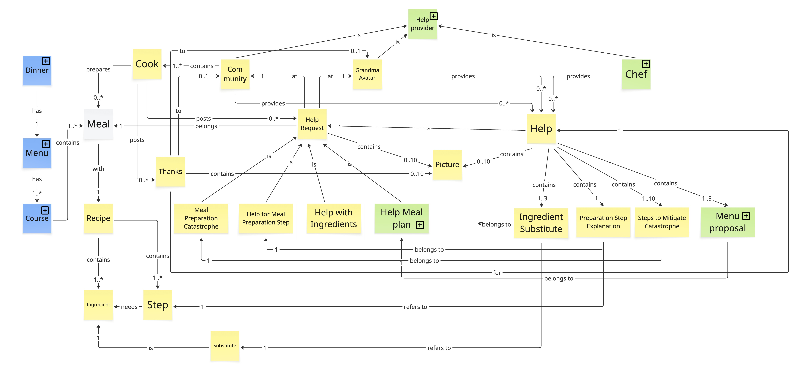
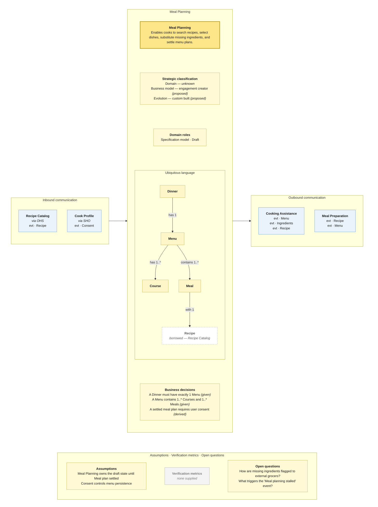
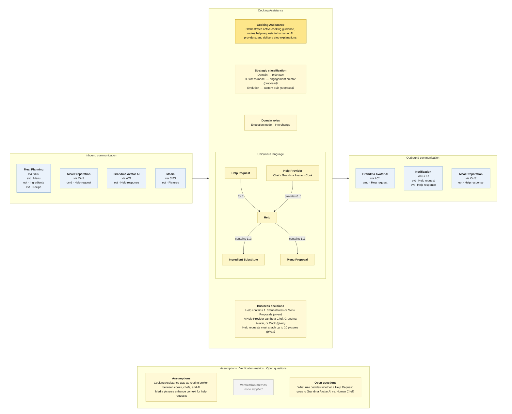
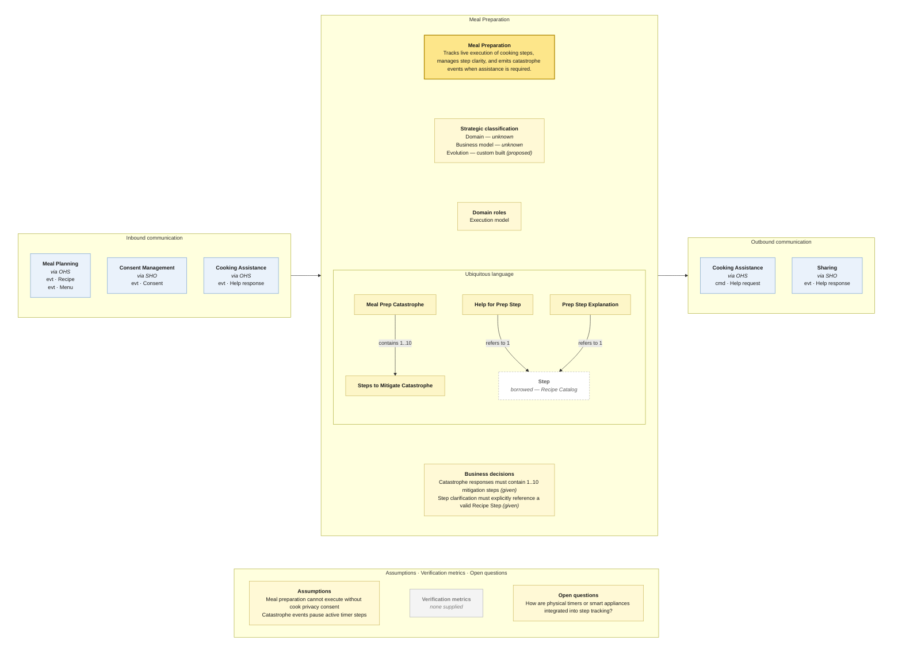
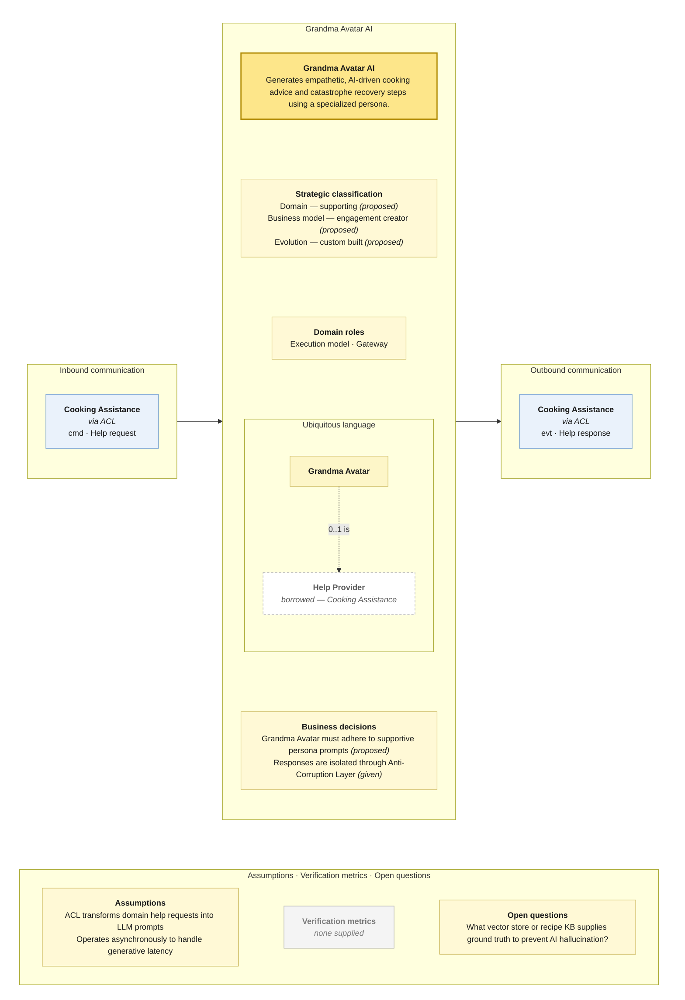
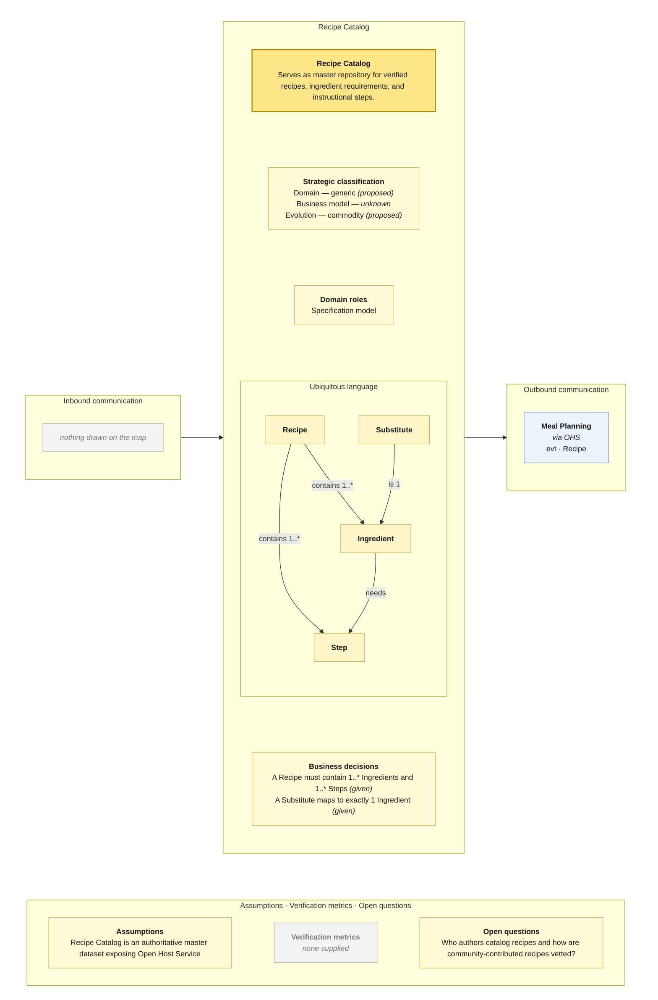

# Prompt 2026-09-09

Create Bounded Context Canvas based on the provided Context Map and the Visual Glossary. Use the provided skill.

[Skill](../Skills/BoundedContextCanvasSkill/SKILL.md)

[References Canvas fields](../Skills/BoundedContextCanvasSkill/references/canvas-fields.md)

[References Mermaid template](../Skills/BoundedContextCanvasSkill/references/mermaid-template.md)

[References Worked example](../Skills/BoundedContextCanvasSkill/references/worked-example.md)

# Answer

This analysis converts the provided **Context Map** and **Visual Glossary** into Bounded Context Canvases following the DDD Crew v5 canvas model.

---

### Global Message Ledger

| From | To | Message | Type | Mechanism | Evidence |
| --- | --- | --- | --- | --- | --- |
| Recipe Catalog | Meal Planning | Recipe | evt | Sync (OHS) | Yellow sticky on solid arrow from Recipe Catalog (OHS) to Meal Planning |
| Cook Profile | Meal Planning | Consent | evt | Sync (SHO) | Yellow sticky on solid arrow from Cook Profile (SHO) to Meal Planning |
| Consent Management | Cook Profile | Consent | evt | Sync | Yellow sticky on solid arrow from Consent Management to Cook Profile |
| Consent Management | Meal Preparation | Consent | evt | Sync (SHO) | Yellow sticky on solid arrow from Consent Management to Meal Preparation |
| Meal Planning | Cooking Assistance | Menu | evt | Sync (OHS) | Yellow sticky on solid arrow from Meal Planning (OHS) to Cooking Assistance |
| Meal Planning | Cooking Assistance | Ingredients | evt | Sync (OHS) | Yellow sticky on solid arrow from Meal Planning (OHS) to Cooking Assistance |
| Meal Planning | Cooking Assistance | Recipe | evt | Sync (OHS) | Yellow sticky on solid arrow from Meal Planning (OHS) to Cooking Assistance |
| Meal Planning | Meal Preparation | Recipe | evt | Sync (OHS) | Yellow sticky on solid arrow from Meal Planning (OHS) to Meal Preparation |
| Meal Planning | Meal Preparation | Menu | evt | Sync (OHS) | Yellow sticky on solid arrow from Meal Planning (OHS) to Meal Preparation |
| Cooking Assistance | Grandma Avatar AI | Help request | cmd | Async (ACL) | Yellow sticky on top dashed arrow to Grandma Avatar AI |
| Grandma Avatar AI | Cooking Assistance | Help response | evt | Async (ACL) | Yellow sticky on bottom dashed arrow from Grandma Avatar AI |
| Cooking Assistance | Notification | Help request | evt | Sync (SHO) | Yellow sticky on solid arrow to Notification |
| Cooking Assistance | Notification | Help response | evt | Sync (SHO) | Yellow sticky on solid arrow to Notification |
| Media | Cooking Assistance | Pictures | evt | Sync (SHO) | Yellow sticky on solid arrow from Media to Cooking Assistance (SHO) |
| Media | Sharing | Pictures | evt | Sync (OHS) | Yellow sticky on solid arrow from Media to Sharing (OHS) |
| Meal Preparation | Cooking Assistance | Help request | cmd | Sync (OHS) | Yellow sticky on solid arrow up to Cooking Assistance (OHS) |
| Cooking Assistance | Meal Preparation | Help response | evt | Sync (OHS) | Yellow sticky on solid arrow down to Meal Preparation |
| Meal Preparation | Sharing | Help response | evt | Sync (SHO) | Yellow sticky on solid arrow from Meal Preparation to Sharing (SHO) |
| Sharing | External / Community | Thanks | evt | Sync (CF) | Yellow sticky in Sharing / CF interface |

---

### Visual Glossary Partitioning

| Glossary Term | Owning Bounded Context | Borrowed By / Border Sense |
| --- | --- | --- |
| **Recipe** | Recipe Catalog | Borrowed by Meal Planning, Cooking Assistance, Meal Preparation |
| **Ingredient** | Recipe Catalog | Borrowed by Meal Planning, Cooking Assistance |
| **Step** | Recipe Catalog | Borrowed by Cooking Assistance, Meal Preparation |
| **Cook** | Cook Profile | Borrowed by Meal Planning, Cooking Assistance, Sharing |
| **Community** | Cook Profile / Sharing | Borrowed by Cooking Assistance |
| **Grandma Avatar** | Grandma Avatar AI | Borrowed by Cooking Assistance |
| **Chef** | Cooking Assistance | Internal role representing live professional help providers |
| **Help Provider** | Cooking Assistance | Polymorphic role implemented by Grandma Avatar, Chef, and Cook |
| **Meal Plan / Menu** | Meal Planning | Borrowed by Cooking Assistance, Meal Preparation |
| **Course** | Meal Planning | Owned value object within Menu structure |
| **Dinner** | Meal Planning | Owned aggregate governing scheduled menus |
| **Meal** | Meal Planning | Owned entity linking Menu and Recipe |
| **Ingredient Substitute** | Meal Planning / Cooking Assistance | Refers to Ingredient in Recipe Catalog |
| **Help Request** | Cooking Assistance | Issued by Meal Preparation / Meal Planning |
| **Help** | Cooking Assistance | Dispatched to Meal Preparation / Grandma Avatar AI |
| **Meal Preparation Catastrophe** | Meal Preparation | Specialization of Help Request in Cooking Assistance |
| **Help for Meal Preparation Step** | Meal Preparation | Specialization of Help Request in Cooking Assistance |
| **Help with Ingredients** | Meal Planning | Specialization of Help Request in Cooking Assistance |
| **Help Meal Plan** | Meal Planning | Specialization of Help Request in Cooking Assistance |
| **Picture** | Media | Borrowed by Cooking Assistance, Sharing |
| **Thanks** | Sharing | Borrowed by Cook Profile |

---

# Canvas 1: Meal Planning

> **Source:** culinary domain context map + Visual Glossary · **Mode:** derived from team cut
> **Provenance:** `(given)` stated by source · `(derived)` read off artifact · `(proposed)` candidate inference · `(unknown)` unsourced.

## Canvas

## Purpose (derived)

Enables cooks to search catalog recipes, select candidate meals, substitute missing ingredients, and settle structured menu plans for upcoming dinners.

## Strategic classification (unknown / proposed)

* **Domain:** `(unknown)`
* **Business model:** `engagement creator` `(proposed)`
* **Evolution:** `custom built` `(proposed)`

## Domain roles (derived)

* **Specification model:** Defines the plan (Menu, Courses, Meals) that downstream execution contexts carry out.
* **Draft:** Maintains fluid planning state (`Meal planning stalled`, `Ingredients substituted`) prior to `Meal plan settled`.

## Inbound communication (derived)

| Collaborator | Message | Type | What it carries | Evidence |
| --- | --- | --- | --- | --- |
| Recipe Catalog | Recipe | evt | Master recipe structure and default ingredients | OHS boundary arrow on Context Map |
| Cook Profile | Consent | evt | User privacy preferences for meal tracking | SHO boundary arrow on Context Map |

## Outbound communication (derived)

| Message | Type | Collaborator | What it carries | Evidence |
| --- | --- | --- | --- | --- |
| Menu | evt | Cooking Assistance | Settled menu hierarchy and courses | OHS outbound arrow |
| Ingredients | evt | Cooking Assistance | Required and substituted ingredient lists | OHS outbound arrow |
| Recipe | evt | Cooking Assistance | Selected recipe details | OHS outbound arrow |
| Recipe | evt | Meal Preparation | Preparation steps and requirements | OHS outbound arrow |
| Menu | evt | Meal Preparation | Active meal structure | OHS outbound arrow |

## Ubiquitous language (given — from Visual Glossary)

| Term | What it means *here* | Owned or borrowed | Cardinality |
| --- | --- | --- | --- |
| Dinner | High-level scheduled dining occasion | **owned** | Dinner has 1 Menu |
| Menu | Structured set of meals and courses planned for a dinner | **owned** | Menu has 1..* Course, contains 1..* Meal |
| Course | Individual section of a menu (e.g., appetizer, main) | **owned** | Part of Menu |
| Meal | Pairing of menu slot with a specific recipe | **owned** | Meal with 1 Recipe |
| Recipe | Reference cooking instructions | **borrowed** (Recipe Catalog) | 1 per Meal |

## Business decisions (given / derived)

1. **A Dinner must have exactly 1 Menu.** *(given by Visual Glossary cardinality)*
2. **A Menu must contain at least 1 Course and 1 Meal.** *(given by Visual Glossary cardinality)*
3. **A Meal Plan cannot be settled without valid Cook Consent.** *(derived from Cook Profile boundary)*

## Assumptions (derived)

* The `Meal planning stalled` event indicates an internal session timeout or ingredient block before menu settlement.
* Substitution logic resolves ingredient shortages within this context before emitting outbound events.

## Verification metrics (unknown)

* `none supplied`

## Open questions

* Does `Ingredients missing` trigger an outbound query to an external grocery/delivery context?
* What specific user action transitions a plan from `Recipes searched` to `Meal plan settled`?

## Border reconciliation

| Message | Direction | Counterpart | Status |
| --- | --- | --- | --- |
| Recipe | in, from Recipe Catalog | `recipe-catalog.canvas.md` | matched |
| Consent | in, from Cook Profile | `cook-profile.canvas.md` | matched |
| Menu | out, to Cooking Assistance | `cooking-assistance.canvas.md` | matched |
| Ingredients | out, to Cooking Assistance | `cooking-assistance.canvas.md` | matched |
| Recipe | out, to Cooking Assistance | `cooking-assistance.canvas.md` | matched |
| Recipe | out, to Meal Preparation | `meal-preparation.canvas.md` | matched |
| Menu | out, to Meal Preparation | `meal-preparation.canvas.md` | matched |

---

# Canvas 2: Cooking Assistance

> **Source:** culinary domain context map + Visual Glossary · **Mode:** derived from team cut
> **Provenance:** `(given)` stated by source · `(derived)` read off artifact · `(proposed)` candidate inference · `(unknown)` unsourced.

## Canvas

## Purpose (derived)

Orchestrates active cooking guidance by receiving real-time help requests from meal preparation, attaching media, and dispatching queries to AI (Grandma Avatar) or human assistance (Chefs/Community).

## Strategic classification (unknown / proposed)

* **Domain:** `(unknown)`
* **Business model:** `engagement creator` `(proposed)`
* **Evolution:** `custom built` `(proposed)`

## Domain roles (derived)

* **Execution model:** Manages the active state of help resolution sessions during cooking.
* **Interchange:** Translates requests between cooking domain models and external/AI models.

## Inbound communication (derived)

| Collaborator | Message | Type | What it carries | Evidence |
| --- | --- | --- | --- | --- |
| Meal Planning | Menu | evt | Context menu structure | OHS boundary arrow |
| Meal Planning | Ingredients | evt | Active ingredient list | OHS boundary arrow |
| Meal Planning | Recipe | evt | Active cooking instructions | OHS boundary arrow |
| Meal Preparation | Help request | cmd | Request for guidance or catastrophe fix | OHS boundary arrow |
| Grandma Avatar AI | Help response | evt | AI-generated guidance or mitigation steps | ACL dashed arrow |
| Media | Pictures | evt | Captured step photos | SHO boundary arrow |

## Outbound communication (derived)

| Message | Type | Collaborator | What it carries | Evidence |
| --- | --- | --- | --- | --- |
| Help request | cmd | Grandma Avatar AI | Formatted prompt with context & step data | ACL dashed arrow |
| Help request | evt | Notification | Broadcast alert for human responders | SHO boundary arrow |
| Help response | evt | Notification | Alert to cook that help has arrived | SHO boundary arrow |
| Help response | evt | Meal Preparation | Resolution steps or explanations | OHS boundary arrow |

## Ubiquitous language (given — from Visual Glossary)

| Term | What it means *here* | Owned or borrowed | Cardinality |
| --- | --- | --- | --- |
| Help Request | Domain aggregate capturing assistance needs | **owned** | 1 per Help session |
| Help | Resolution payload containing advice or steps | **owned** | 1 per Help Request |
| Help Provider | Role entity (Chef, Grandma Avatar, Cook) | **owned** | Provides 0..* Help |
| Ingredient Substitute | Suggested ingredient replacement in advice | **owned** | Help contains 1..3 |
| Menu Proposal | Alternate course suggestions | **owned** | Help contains 1..3 |

## Business decisions (given / derived)

1. **A Help response may contain between 1 and 3 Ingredient Substitutes or Menu Proposals.** *(given by Visual Glossary)*
2. **Help Requests can carry 0 to 10 attached Pictures.** *(given by Visual Glossary)*
3. **Help Providers are polymorphically unified across human Cooks, Chefs, and AI Avatars.** *(given by Visual Glossary)*

## Assumptions (derived)

* Requests are dispatched asynchronously to Grandma Avatar AI via ACL to isolate AI prompt models.
* Notifications are dispatched synchronously to push alerts to mobile devices.

## Verification metrics (unknown)

* `none supplied`

## Open questions

* How does the system fall back if Grandma Avatar AI fails to yield a conclusive `Help response`?

## Border reconciliation

| Message | Direction | Counterpart | Status |
| --- | --- | --- | --- |
| Menu | in, from Meal Planning | `meal-planning.canvas.md` | matched |
| Ingredients | in, from Meal Planning | `meal-planning.canvas.md` | matched |
| Recipe | in, from Meal Planning | `meal-planning.canvas.md` | matched |
| Help request | in, from Meal Preparation | `meal-preparation.canvas.md` | matched |
| Help response | in, from Grandma Avatar AI | `grandma-avatar-ai.canvas.md` | matched |
| Pictures | in, from Media | `media.canvas.md` | matched |
| Help request | out, to Grandma Avatar AI | `grandma-avatar-ai.canvas.md` | matched |
| Help request | out, to Notification | `notification.canvas.md` | matched |
| Help response | out, to Notification | `notification.canvas.md` | matched |
| Help response | out, to Meal Preparation | `meal-preparation.canvas.md` | matched |

---

# Canvas 3: Meal Preparation

> **Source:** culinary domain context map + Visual Glossary · **Mode:** derived from team cut
> **Provenance:** `(given)` stated by source · `(derived)` read off artifact · `(proposed)` candidate inference · `(unknown)` unsourced.

## Canvas

## Purpose (derived)

Guides cooks step-by-step through live cooking, monitors progress, detects unclear instructions or catastrophes, and requests targeted interventions.

## Strategic classification (unknown)

* **Domain:** `(unknown)`
* **Business model:** `(unknown)`
* **Evolution:** `custom built` `(proposed)`

## Domain roles (derived)

* **Execution model:** Maintains the active physical state of meal execution (`Meal preparation started`, `Catastrophe happened`, `Step unclear`).

## Inbound communication (derived)

| Collaborator | Message | Type | What it carries | Evidence |
| --- | --- | --- | --- | --- |
| Meal Planning | Recipe | evt | Instructions and timing | OHS boundary arrow |
| Meal Planning | Menu | evt | Active menu structure | OHS boundary arrow |
| Consent Management | Consent | evt | User privacy clearance | SHO boundary arrow |
| Cooking Assistance | Help response | evt | Mitigating instructions or step details | OHS boundary arrow |

## Outbound communication (derived)

| Message | Type | Collaborator | What it carries | Evidence |
| --- | --- | --- | --- | --- |
| Help request | cmd | Cooking Assistance | Catastrophe or step question payload | OHS boundary arrow |
| Help response | evt | Sharing | Resolved help outcome for community sharing | SHO boundary arrow |

## Ubiquitous language (given — from Visual Glossary)

| Term | What it means *here* | Owned or borrowed | Cardinality |
| --- | --- | --- | --- |
| Meal Prep Catastrophe | High-severity cooking failure (e.g., burned sauce) | **owned** | Specialization of Help Request |
| Help for Prep Step | Targeted request for step clarification | **owned** | Refers to 1 Step |
| Prep Step Explanation | Detailed breakdown of cooking step | **owned** | Refers to 1 Step |
| Steps to Mitigate Catastrophe | Step-by-step recovery plan | **owned** | 1..10 per Catastrophe Help |
| Step | Individual recipe execution step | **borrowed** (Recipe Catalog) | Referenced by step help |

## Business decisions (given / derived)

1. **Catastrophe mitigation guidance must provide 1 to 10 sequential mitigation steps.** *(given by Visual Glossary)*
2. **Step help requests must cite exactly 1 specific Recipe Step.** *(given by Visual Glossary)*

## Assumptions (derived)

* `Meal preparation started` initializes the tracking state machine for a menu session.

## Verification metrics (unknown)

* `none supplied`

## Open questions

* Is there an automated timeout if a cook abandons a preparation session mid-step?

## Border reconciliation

| Message | Direction | Counterpart | Status |
| --- | --- | --- | --- |
| Recipe | in, from Meal Planning | `meal-planning.canvas.md` | matched |
| Menu | in, from Meal Planning | `meal-planning.canvas.md` | matched |
| Consent | in, from Consent Management | `consent-management.canvas.md` | matched |
| Help response | in, from Cooking Assistance | `cooking-assistance.canvas.md` | matched |
| Help request | out, to Cooking Assistance | `cooking-assistance.canvas.md` | matched |
| Help response | out, to Sharing | `sharing.canvas.md` | matched |

---

# Canvas 4: Grandma Avatar AI

> **Source:** culinary domain context map + Visual Glossary · **Mode:** derived from team cut
> **Provenance:** `(given)` stated by source · `(derived)` read off artifact · `(proposed)` candidate inference · `(unknown)` unsourced.

## Canvas

## Purpose (derived)

Generates AI-driven cooking advice, empathetic encouragement, and catastrophe mitigations styled after a traditional "grandma" persona.

## Strategic classification (unknown / proposed)

* **Domain:** `supporting` `(proposed)`
* **Business model:** `engagement creator` `(proposed)`
* **Evolution:** `custom built` `(proposed)`

## Domain roles (derived)

* **Execution model:** Runs LLM inference/prompt chains for help resolution.
* **Gateway:** Interfaces external AI model APIs to the core system.

## Inbound communication (derived)

| Collaborator | Message | Type | What it carries | Evidence |
| --- | --- | --- | --- | --- |
| Cooking Assistance | Help request | cmd | Problem context, step details, images | ACL dashed arrow |

## Outbound communication (derived)

| Message | Type | Collaborator | What it carries | Evidence |
| --- | --- | --- | --- | --- |
| Help response | evt | Cooking Assistance | Persona-styled advice and mitigation steps | ACL dashed arrow |

## Ubiquitous language (given — from Visual Glossary)

| Term | What it means *here* | Owned or borrowed | Cardinality |
| --- | --- | --- | --- |
| Grandma Avatar | AI agent entity simulating traditional cooking wisdom | **owned** | 0..1 is Help Provider |
| Help Provider | Generic interface for assistance sources | **borrowed** (Cooking Assistance) | Implemented by Grandma Avatar |

## Business decisions (derived)

1. **All communication with Grandma Avatar AI must pass through an Anti-Corruption Layer (ACL).** *(given by Context Map notation)*

## Assumptions (derived)

* Asynchronous messaging allows the host system to remain responsive while waiting for generative AI tokens.

## Verification metrics (unknown)

* `none supplied`

## Open questions

* How are safety guardrails enforced when the AI generates ingredient substitution advice?

## Border reconciliation

| Message | Direction | Counterpart | Status |
| --- | --- | --- | --- |
| Help request | in, from Cooking Assistance | `cooking-assistance.canvas.md` | matched |
| Help response | out, to Cooking Assistance | `cooking-assistance.canvas.md` | matched |

---

# Canvas 5: Recipe Catalog

> **Source:** culinary domain context map + Visual Glossary · **Mode:** derived from team cut
> **Provenance:** `(given)` stated by source · `(derived)` read off artifact · `(proposed)` candidate inference · `(unknown)` unsourced.

## Canvas

## Purpose (derived)

Maintains the canonical database of structured culinary recipes, ingredients, step sequences, and valid base substitutes.

## Strategic classification (unknown / proposed)

* **Domain:** `generic` `(proposed)`
* **Business model:** `(unknown)`
* **Evolution:** `commodity` `(proposed)`

## Domain roles (derived)

* **Specification model:** Provides official template specifications against which meal planning and preparation execute.

## Inbound communication (derived)

* *None drawn on map.*

## Outbound communication (derived)

| Message | Type | Collaborator | What it carries | Evidence |
| --- | --- | --- | --- | --- |
| Recipe | evt | Meal Planning | Complete recipe aggregate schema | OHS boundary arrow |

## Ubiquitous language (given — from Visual Glossary)

| Term | What it means *here* | Owned or borrowed | Cardinality |
| --- | --- | --- | --- |
| Recipe | Master entity detailing cooking instructions | **owned** | Contains 1..* Ingredient, 1..* Step |
| Ingredient | Measurable component required by a recipe | **owned** | Belongs to 1..* Recipe |
| Step | Atomic preparation instruction | **owned** | Contains step order and timing |
| Substitute | Default ingredient alternative definition | **owned** | Is 1 Ingredient |

## Business decisions (given / derived)

1. **A canonical Recipe must contain at least 1 Ingredient and 1 Step.** *(given by Visual Glossary)*
2. **Substitutes must map directly to 1 target Ingredient.** *(given by Visual Glossary)*

## Assumptions (derived)

* Operates as an upstream Open Host Service (OHS) providing published language for downstream consumers.

## Verification metrics (unknown)

* `none supplied`

## Open questions

* Is recipe searching handled natively within this context or delegated to Meal Planning?

## Border reconciliation

| Message | Direction | Counterpart | Status |
| --- | --- | --- | --- |
| Recipe | out, to Meal Planning | `meal-planning.canvas.md` | matched |

---

### Cross-Canvas Reconciliation Summary

* **Matched Messages:** All 19 directional crossings identified on the Context Map reconcile across bounded contexts without orphan signals.
* **Open Host Services (OHS):** Recipe Catalog, Meal Planning, Cooking Assistance, and Meal Preparation correctly expose OHS ports to downstream consumers.
* **Anti-Corruption Layer (ACL):** Grandma Avatar AI strictly isolates generative models behind an ACL port.
* **Identified Gaps:** Inbound feeds for Recipe Catalog and Consent Management are missing from the initial diagram; these represent management entry points to be captured in future refinement sessions.

---

Would you like to generate the remaining canvases (**Cook Profile**, **Notification**, **Consent Management**, **Media**, or **Sharing**), or dive deeper into the business rules for a specific bounded context?