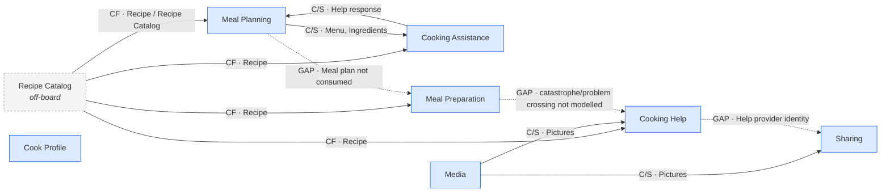

# Context Map — Cooking / Meal Planning board

I treated this as **review mode**: the bounded-context bubbles on the EventStorming board are preserved, repeated appearances are collapsed into one node, and relationships are reconstructed from ownership/read crossings rather than from timeline adjacency. That is the method prescribed by the supplied skill.  Direction below follows the writer-as-upstream rule; relationship patterns are assigned only after direction is established.

## 1. Collapsed contexts

The board contains these **seven distinct bounded contexts**, despite several being drawn multiple times:

| Context                | Appearances | Main objects written               | Main things read                                              |
| ---------------------- | ----------: | ---------------------------------- | ------------------------------------------------------------- |
| **Cook Profile**       |           1 | `Cook`                             | `User`                                                        |
| **Meal Planning**      |           2 | `Menu`, `Ingredients`, `Meal plan` | `Guests`, `Recipe Catalog`, `Recipe`, `Menu`, `Help response` |
| **Cooking Assistance** |           2 | `Help request`, `Help response`    | `Ingredients`, `Menu`, `Recipe`, `Help request`               |
| **Meal Preparation**   |           2 | — clearly shown                    | `Recipe`, `Catastrophe`, `Help response`                      |
| **Media**              |           2 | `Pictures`                         | — clearly shown                                               |
| **Cooking Help**       |           2 | `Help request`, `Help response`    | `Catastrophe`, `Recipe`, `Pictures`, `Help request`           |
| **Sharing**            |           1 | `Thanks`                           | `Help provider`, `Pictures`                                   |

Collapsing repeated bubbles is important: the supplied example likewise treats repeated timeline appearances as evidence about a context's role, not as extra contexts.

## 2. Term ledger

This is the evidence base for the map.

| Term             | Written by                              | Read by                                                           | Verdict                                                                        |
| ---------------- | --------------------------------------- | ----------------------------------------------------------------- | ------------------------------------------------------------------------------ |
| `Cook`           | Cook Profile                            | nobody as a read model                                            | **orphan**; Cook actors occur elsewhere, but identity propagation is not drawn |
| `User`           | nobody                                  | Cook Profile                                                      | unwritten noun / source unknown                                                |
| `Guests`         | nobody                                  | Meal Planning                                                     | unwritten noun / source unknown                                                |
| `Recipe Catalog` | nobody                                  | Meal Planning                                                     | **off-board upstream candidate**                                               |
| `Recipe`         | nobody                                  | Meal Planning, Cooking Assistance, Meal Preparation, Cooking Help | **strong off-board upstream**                                                  |
| `Menu`           | Meal Planning                           | Meal Planning, Cooking Assistance                                 | owned; crosses                                                                 |
| `Ingredients`    | Meal Planning                           | Cooking Assistance                                                | owned; crosses                                                                 |
| `Meal plan`      | Meal Planning                           | nobody                                                            | **orphan; likely missing handoff**                                             |
| `Help request`   | Cooking Assistance **and** Cooking Help | internally within both                                            | **contested ownership/name**                                                   |
| `Help response`  | Cooking Assistance **and** Cooking Help | Meal Planning, Meal Preparation                                   | **contested ownership/name**                                                   |
| `Pictures`       | Media                                   | Cooking Help, Sharing                                             | owned; crosses                                                                 |
| `Catastrophe`    | no explicit business-object writer      | Meal Preparation, Cooking Help                                    | crossing/source ambiguous                                                      |
| `Help provider`  | nobody                                  | Sharing                                                           | unwritten noun / missing handoff                                               |
| `Thanks`         | Sharing                                 | nobody                                                            | **orphan**                                                                     |

The skill specifically treats one writer plus external readers as a real border, two writers as a boundary defect, no writer with multiple readers as evidence for a missing/external upstream, and no readers as an orphan.

## 3. Context Map

**Legend:** solid arrow = crossing evidenced by producer/consumer stickies; dashed node = off-board source; dotted arrow = a business handoff implied by the process but not represented by an object on the board. Those conventions follow the supplied skill.

`CF` = Conformist; `C/S` = Customer/Supplier. The catalog describes Customer/Supplier as the reasonable default for an internal one-consumer relationship when the organizational politics are unknown, while an off-board upstream whose vocabulary is simply adopted is consistent with Conformist.

## 4. Relationships

| ID | Upstream → downstream               | Pattern                                       | Board evidence                                                                     | Confidence   |
| -- | ----------------------------------- | --------------------------------------------- | ---------------------------------------------------------------------------------- | ------------ |
| E1 | Recipe Catalog → Meal Planning      | Conformist, provisional                       | `Recipe Catalog` / `Recipe` read, written nowhere                                  | implied      |
| E2 | Recipe Catalog → Cooking Assistance | Conformist, provisional                       | `Recipe` read, written nowhere                                                     | implied      |
| E3 | Recipe Catalog → Meal Preparation   | Conformist, provisional                       | `Recipe` read, written nowhere                                                     | implied      |
| E4 | Recipe Catalog → Cooking Help       | Conformist, provisional                       | `Recipe` read, written nowhere                                                     | implied      |
| E5 | Meal Planning → Cooking Assistance  | Customer/Supplier                             | `Menu`, `Ingredients` written by MP and read by CA                                 | **on board** |
| E6 | Cooking Assistance → Meal Planning  | Customer/Supplier / mutual-dependency finding | `Help response` written by CA and read by MP                                       | **on board** |
| E7 | Media → Cooking Help                | Customer/Supplier                             | `Pictures` written by Media and read by Cooking Help                               | **on board** |
| E8 | Media → Sharing                     | Customer/Supplier                             | `Pictures` written by Media and read by Sharing                                    | **on board** |
| G1 | Meal Planning → Meal Preparation    | **GAP**                                       | `Meal plan` is produced, but preparation never reads it                            | inferred     |
| G2 | Meal Preparation → Cooking Help     | **GAP**                                       | Cooking Help reads `Catastrophe`; no explicit object is produced across the border | uncertain    |
| G3 | Cooking Help → Sharing              | **GAP**                                       | Sharing requires `Help provider`, but nobody writes it                             | inferred     |

The patterns involving team negotiation remain provisional because an EventStorming board shows models, not team ownership, influence, or release coordination. Those organizational facts must not be guessed.

## 5. Most important findings

**Meal Planning ↔ Cooking Assistance is mutually dependent as currently modelled.** Meal Planning supplies `Menu`/`Ingredients`, while Cooking Assistance supplies `Help response` back. Before calling this a Partnership, I would test whether the boundary is misplaced or whether these are genuinely independently releasable capabilities. The pattern catalog explicitly warns that mutual dependencies often indicate a boundary problem rather than a true Partnership.

**`Help request` and `Help response` have contested ownership.** Both **Cooking Assistance** and **Cooking Help** write identically named objects. That should be resolved before treating their integrations as stable. The likely clean solution is two models with explicit names—for example, *Planning Help Request/Response* versus *Cooking Help Request/Response*—unless the team genuinely intends one shared invariant. Contested ownership is treated by the skill as a boundary defect, not automatically as a Shared Kernel.

**The strongest missing context is the source of `Recipe`.** Four contexts consume `Recipe` and nobody produces it. The existing board term `Recipe Catalog` is the best candidate name for that off-board upstream. Multiple consumers of an unwritten noun are specifically called out as strong evidence of a missing/external context.

**`Meal plan` is an important orphan.** Meal Planning explicitly produces it, but Meal Preparation never consumes it. This looks like the key missing handoff between planning and execution. I would not turn the dotted edge solid until the team confirms what preparation actually needs: perhaps `Meal plan`, perhaps only selected `Recipe + Ingredients`, or something else.

**`Help provider` is missing from the help contract.** Sharing needs to know whom the cook is thanking, but neither help context writes a `Help provider` object. That is either a missing field on `Help response` or a missing object crossing into Sharing.

**`Cook` is produced but never read.** The same human actor appears throughout the board, but there is no modeled identity/authorization crossing from Cook Profile. That may be intentional—human/session identity carried outside the domain—or a missing integration. The board does not settle it.

**`Thanks` is also an orphan.** Nothing consumes the object after Sharing produces it. It could legitimately be a terminal record, notification, reputation input, etc., but the board gives no consumer, so one should not be invented.

## 6. Border contracts to clarify first

The most useful contracts to agree next are:

**Meal Planning → Cooking Assistance**

* Crosses: `Menu`, `Ingredients`
* Stays behind: recipe-search history, guest-selection logic, plan-editing state
* Translation: currently no vocabulary difference is shown
* Mechanism: likely replicated/read projection or synchronous query; board does not decide
* Staleness: **unknown**
* Failure: **unknown**

**Cooking Assistance → Meal Planning**

* Crosses: `Help response`
* Should probably also identify which help request it answers
* Stays behind: helper-selection/conversation mechanics
* Translation: likely assistance-specific advice → planning decision
* Mechanism/staleness/failure: not shown

**Media → Cooking Help / Sharing**

* Crosses: `Pictures` plus an identifier associating pictures with a meal/help request
* Stays behind: capture/device/storage details
* Mechanism: likely asynchronous upload/event or media reference
* Staleness: should be short enough that help can use the picture while the problem still exists
* Failure: request can continue without pictures, or user retries

A buildable border contract should name what crosses, what stays behind, translation, mechanism, acceptable staleness, and failure compensation.

## 7. Questions that would settle the map

1. **Meal Planning → Meal Preparation:** Is `Meal plan` actually the input to `Prepare meal`, and what fields does it contain?
2. **Cooking Assistance vs Cooking Help:** Are these intentionally different capabilities—planning-time help versus preparation-time help—or two appearances of one Help context?
3. If they are separate, should the two pairs be renamed to **Planning Help Request/Response** and **Cooking Help Request/Response**?
4. **Recipe Catalog:** Is it an internal bounded context, an external service, or merely a projection owned elsewhere?
5. **Sharing:** Where does `Help provider` come from? Is it part of `Help response`?
6. **Cook Profile:** Do the other contexts need a `Cook id`, or is identity deliberately handled outside the domain model?
7. **Catastrophe:** Does `Catastrophe happened` create an object/event that crosses from Meal Preparation to Cooking Help?
8. **Guests/User:** Which context or external system owns these nouns?
9. **Thanks:** Is anything supposed to consume it—for reputation, notification, history, or rewards?

This map intentionally does **not** connect contexts merely because they occur next to each other in the EventStorming timeline; an edge requires something concrete to cross the boundary. 
