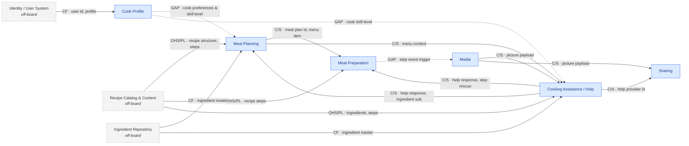

# Prompt 2026-09-07

Create a Context Map based on the provided EventStorming board. Use the provided skill.

[Skill](../Skills/ContextMapSkill/SKILL.md)

[References Pattern catalog](../Skills/ContextMapSkill/references/pattern-catalog.md)

[References Worked example](../Skills/ContextMapSkill/references/worked-example.md)

# Context Map — Collaborative Cooking Platform

## 1. Board as read

**Mode: Review.** The board contains bounded context bubbles drawn around events, commands, read models, business objects, actors, and exception stickies.

| # | Event | Command | Actor / System | Produces 💼 | Reads 👁 | Context Bubble | Notes / Hotspots |
| --- | --- | --- | --- | --- | --- | --- | --- |
| 1 | Cook registered | Register cook | User | Cook | User | Cook Profile |  |
| 2 | Dinner planned | Plan dinner | Cook | Menu | Guests | Meal Planning |  |
| 3 | Recipes searched | Search recipes | Cook | — | Recipe Catalog | Meal Planning |  |
| 4 | Recipe selected | Search recipes | Cook | — | Recipe | Meal Planning |  |
| 5 | Meal planning stalled | Prepare meal | Cook | Meal plan | Guests, Menu | Meal Planning | Exception sticky |
| 6 | Ingredients missing | Search ingredients | Cook | — | Recipe | Cooking Assistance | Exception sticky |
| 7 | Help requested | Request help | Cook | Help request | Ingredients, Menu | Cooking Assistance |  |
| 8 | Help provided | Provide help | Chef, Grandma Avatar | Help response, Community Cook | Help request | Cooking Assistance |  |
| 9 | Ingredients substituted | Substitute ingredients | Cook | — | Recipe, Ingredients | Meal Planning |  |
| 10 | Meal plan settled | Plan meal | Cook | Meal plan | Menu, Help Response, Ingredients | Meal Planning |  |
| 11 | Meal preparation started | Prepare meal | Cook | — | Recipe | Meal Preparation |  |
| 12 | Step unclear | Prepare meal | Cook | — | Recipe | Meal Preparation | Exception sticky |
| 13 | Catastrophe happened | Prepare meal | Cook | — | Catastrophe, Recipe | Meal Preparation | Exception sticky |
| 14 | Help requested | Request help | Cook | Help request | Catastrophe, Recipe, Pictures | Cooking Help |  |
| 15 | Pictures taken | Take pictures | Cook | Pictures | — | Media |  |
| 16 | Help provided | Request help / Provide help | Community Cook, Grandma Avatar | Help response | Help request | Cooking Help |  |
| 17 | Step completed | Prepare meal | Cook | — | Help response | Meal Preparation |  |
| 18 | Meal rescued | Prepare meal | Cook | Meal plan | Help response | Meal Preparation |  |
| 19 | Meal prepared | Prepare meal | Cook | — | Recipe | Meal Preparation |  |
| 20 | Pictures taken | Take pictures | Cook | Pictures | — | Media |  |
| 21 | Thanks given | Provide thanks | Cook | Thanks | Help provider, Pictures | Sharing |  |

---

## 2. Contexts

Collapsing timeline recurrence reveals 6 distinct contexts (with *Cooking Assistance* and *Cooking Help* identified as a duplicated boundary):

* **Cook Profile** (1 appearance): Handles cook onboarding and identity. Writes `Cook` 💼. Reads `User` 👁.
* **Meal Planning** (2 appearances): Manages menu creation, recipe selection, ingredient substitution, and plan settling. Writes `Menu` 💼, `Meal plan` 💼. Reads `Guests` 👁, `Recipe Catalog` 👁, `Recipe` 👁, `Menu` 👁, `Help Response` 👁, `Ingredients` 👁.
* **Cooking Assistance / Cooking Help** (4 appearances total across two names): Community assistance for missing ingredients and live cooking catastrophes. Writes `Help request` 💼, `Help response` 💼, `Community Cook` 💼. Reads `Recipe` 👁, `Ingredients` 👁, `Menu` 👁, `Catastrophe` 👁, `Pictures` 👁.
* **Meal Preparation** (2 appearances): Execution of recipe steps, handling catastrophes, step completions, and meal rescues. Writes `Meal plan` 💼 (event 18). Reads `Recipe` 👁, `Catastrophe` 👁, `Help response` 👁.
* **Media** (2 appearances): Capturing photo evidence during cooking or catastrophe. Writes `Pictures` 💼. Reads none directly.
* **Sharing** (1 appearance): Community gratitude and feedback loop. Writes `Thanks` 💼. Reads `Help provider` 👁, `Pictures` 👁.

---

## 3. Term ledger

| Term | Written by 💼 | Read by 👁 | Verdict |
| --- | --- | --- | --- |
| **Cook** | Cook Profile (1) | — | Owned, internal / orphan |
| **User** | — | Cook Profile (1) | **Off-board upstream** |
| **Guests** | — | Meal Planning (2, 5) | **Off-board upstream** |
| **Menu** | Meal Planning (2) | Meal Planning (5, 10), Cooking Assistance (7) | Owned, crosses → **E1** |
| **Recipe Catalog / Recipe** | — | Meal Planning (3, 4, 9), Cooking Assistance (6), Meal Preparation (11, 12, 13, 19), Cooking Help (14) | **Off-board upstream / Missing bounded context**  |
| **Meal plan** | Meal Planning (5, 10), Meal Preparation (18) | Meal Preparation (18) | **Contested ownership**  |
| **Ingredients** | — | Cooking Assistance (7), Meal Planning (9, 10) | **Off-board upstream** |
| **Help request** | Cooking Assistance (7), Cooking Help (14) | Cooking Assistance (8), Cooking Help (16) | Duplicate context artifact |
| **Help response** | Cooking Assistance (8), Cooking Help (16) | Meal Planning (10), Meal Preparation (17, 18) | Owned, crosses → **E2, E3** |
| **Catastrophe** | — | Meal Preparation (13), Cooking Help (14) | Domain state / event signal crossing borders |
| **Pictures** | Media (15, 20) | Cooking Help (14), Sharing (21) | Owned, crosses → **E4, E5** |
| **Help provider** | — | Sharing (21) | Read model, crosses from Assistance → **E6** |
| **Thanks** | Sharing (21) | — | Owned, orphan

|

---

## 4. The map

**Legend:** Solid = evidenced crossing · Dashed node = off-board context · Dotted = GAP (needed edge undrawn).

---

## 5. Relationships

| Id | Upstream → Downstream | Pattern | Evidence | Confidence |
| --- | --- | --- | --- | --- |
| **E1** | Meal Planning → Cooking Assistance | Customer/Supplier | `Menu` read at event 7 | On the board

|
| **E2** | Cooking Assistance → Meal Planning | Customer/Supplier | `Help response` read at event 10 | On the board

|
| **E3** | Cooking Assistance → Meal Preparation | Customer/Supplier | `Help response` read at events 17 & 18 | On the board

|
| **E4** | Media → Cooking Assistance | Customer/Supplier | `Pictures` read at event 14 | On the board

|
| **E5** | Media → Sharing | Customer/Supplier | `Pictures` read at event 21 | On the board

|
| **E6** | Cooking Assistance → Sharing | Customer/Supplier | `Help provider` read at event 21 | Implied

|
| **E7** | Recipe System (Off-board) → MP / MPrep / CA | Open Host Service / Published Language | `Recipe` read across 4 contexts, written by none | Implied

|
| **E8** | Meal Planning → Meal Preparation | Customer/Supplier | `Meal plan` passed from planning to prep | Implied

|
| **E9** | Cook Profile → Meal Planning / Assistance | **GAP** | `Cook` written at 1; no preference/skill context crosses | Implied — **GAP**  |

---

## 6. Border contracts

### E2 / E3 · Cooking Assistance → Meal Planning & Meal Preparation

* **Crosses:** `help_request_id`, `resolution_type` (substitution / step explanation / rescue procedure), `substituted_ingredient_id`, `instructions_text`, `responder_id`.
* **Stays behind:** Internal community chat history, mentor rating, helper badges/avatars (`Grandma Avatar`, `Chef`).
* **Translation:** Assistance `Help response` → Meal Planning `Ingredient substitution` / Meal Preparation `Step instruction`.
* **Mechanism:** Domain event (`HelpProvided`) + replicated read model.

* **Staleness:** Real-time / seconds (critical during active cooking).
* **Failure:** Cook proceeds with manual fallback or pauses meal preparation.

### E4 / E5 · Media → Cooking Assistance & Sharing

* **Crosses:** `picture_id`, `media_url`, `timestamp`, `step_number`.
* **Stays behind:** Camera EXIF data, device hardware telemetry, local storage paths.
* **Translation:** Media `Picture` → Assistance/Sharing `Visual evidence`.
* **Mechanism:** Synchronous reference link / Async event payload.

* **Staleness:** Immediate (< 5 seconds).

### E7 · Recipe System (Off-board) → Cooking Contexts

* **Crosses:** `recipe_id`, `title`, `ingredient_list`, `step_sequence`, `timing_guidelines`.
* **Stays behind:** Authoring workflow, rights management, publisher metadata.
* **Translation:** External Published Language (`Recipe Spec`) adopted via Conformist / ACL by downstream contexts.

* **Mechanism:** Synchronous lookup API / Replicated cache.

* **Staleness:** Minutes to hours.

---

## 7. Missing contexts and undrawn edges

* **Missing Bounded Context — Recipe Management:** `Recipe` and `Recipe Catalog` are read across almost every bubble on the board (events 3, 4, 6, 9, 11, 12, 13, 14, 19) but never written by any context.

* **Missing Bounded Context — Ingredient Catalog:** `Ingredients` is read in multiple contexts without a writing aggregate.

* **Undrawn Edge — Cook Profile → Meal Planning / Cooking Assistance (E9):** `Cook Profile` creates a registered cook, but preferences, dietary restrictions, or skill levels never cross into planning or assistance.

* **Undrawn Edge — Meal Preparation → Media:** Photos are taken in Media without explicit contextual triggers from active recipe steps in `Meal Preparation`.

---

## 8. Smells and stress tests

* **Contested Ownership — `Meal plan`:** Written by `Meal Planning` (events 5, 10) AND `Meal Preparation` (event 18: `Meal rescued` writes `Meal plan`).

* *Resolution:* `Meal Planning` must own `Meal plan` mutations. `Meal Preparation` should produce a `RescuedStepApplied` or `ExecutionLog` event rather than directly writing the `Meal plan` aggregate.

* **Context Duplication — `Cooking Assistance` vs `Cooking Help`:** The board draws two separate context bubbles with identical actors (`Community Cook`, `Chef`, `Grandma Avatar`), identical commands (`Request help`, `Provide help`), and identical outputs (`Help request`, `Help response`).

* *Resolution:* Consolidate into a single **Community Assistance** Bounded Context.

* **Orphan Objects:** `Thanks` (written at 21) and `Cook` (written at 1) are never read downstream.

---

## 9. Contested calls and alternative maps

* **Consolidated Map (Recommended):** Merge `Cooking Assistance` and `Cooking Help` into a unified `Community Assistance` context, and establish an explicit off-board `Recipe Management` context.

* **Coarser Alternative:** Merge `Meal Planning` and `Meal Preparation` into a single `Meal Lifecycle` context. *Rejected:* Planning (menu selection/guests) operates on a completely different clock and cadence than live execution/preparation.

---

## 10. Open questions

1. Who owns the creation and master schema for `Recipe` and `Ingredients`? (Settles the off-board Recipe/Ingredient context boundaries).

2. Why does `Meal Preparation` write to `Meal plan` during a meal rescue? (Settles the contested ownership of `Meal plan`).

3. Are `Cooking Assistance` and `Cooking Help` intentionally separated by phase, or are they duplicate representations of the same team/domain capability? (Settles context consolidation).

4. What information from `Cook Profile` (e.g., skill level, dietary restrictions) is needed by `Meal Planning` or `Community Assistance`? (Settles undrawn GAP edges).