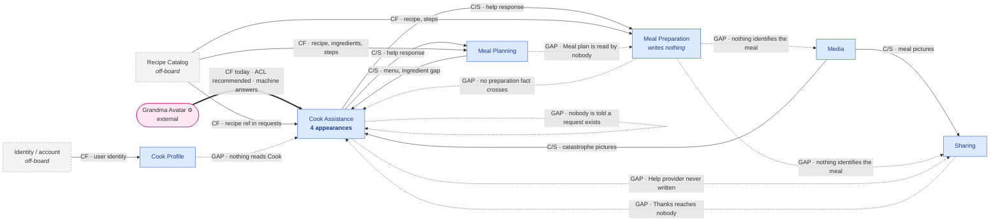

# Context Map — Community Cooking board

**Mode: review of the contexts, propose for the relationships.** The team drew
**eleven bubbles carrying seven names**, so the nodes below are theirs, not
mine. What nobody drew is the *relationships between* them — and there is **not
one lilac policy sticky anywhere on this board**, so every edge in §5 is derived
from who writes and who reads a business object, not read off the wall.

This is a **strategic map** (contexts, ownership, patterns). It is not a team map
and not a deployment map; the team dimension is unknown throughout and is
flagged as such in §5.

---

## 1. Board as read

Colour and icon convention as read: orange = domain event · blue ⌘ = command ·
bright yellow 👤 = actor · green 👁 = read model consumed · pale yellow 💼 =
business object produced · pink ⚙ = external system.

Event numbering follows the other analyses in this project, so the five can be
laid side by side.

| # | Event | Command | Actor / system | Produces 💼 | Reads 👁 | Bubble |
|---|-------|---------|----------------|-------------|----------|--------|
| 1 | Cook registered | Register cook | User 👤 | **Cook** | User | Cook Profile |
| 2 | Dinner planned | Plan dinner | Cook | **Menu** | Guests | Meal Planning |
| 3 | Recipes searched | Search recipes | Cook | — | Recipe Catalog | Meal Planning |
| 4 | Recipe selected | Search recipes *(sic)* | Cook | — | Recipe | Meal Planning |
| 5 | Ingredients missing | Search Ingredients | Cook | — | Recipe | Meal Planning |
| 6 | Meal planning stalled 🤖 | Prepare meal *(sic)* | Cook | — | Guests, Menu | Meal Planning |
| 7 | Help requested | Request help | Cook | **Help request** | Ingredients, Menu | Cooking Assistance |
| 8 | Help provided | Provide help | Community Cook, Chef, *Grandma Avatar* ⚙ | **Help response** | Help request | Cooking Assistance |
| 9 | Ingredients substituted | Substitute ingredients | Cook | **Ingredients** | Recipe, Help Response | Meal Planning |
| 10 | Meal plan settled | Plan meal | Cook | **Meal plan** | Menu, Help Response | Meal Planning |
| 11 | Meal preparation started | Prepare meal | Cook | — | Recipe | Meal Preparation |
| 12 | Step unclear | Prepare meal | Cook | — | Recipe | Meal Preparation |
| 13 | Catastrophe happened | Prepare meal | Cook | — | Catastrophe, Recipe | Meal Preparation |
| 14 | Pictures taken | Take pictures | Cook | **Pictures** | Catastrophe *(overlap)* | Media |
| 15 | Help requested | Request help | Cook | **Help request** | Recipe, Pictures | Cooking Help |
| 16 | Help provided | Request help *(sic)* | Community Cook, *Grandma Avatar* ⚙ | **Help response** | Help request | Cooking Help |
| 17 | Step competeted *(sic)* | Prepare meal | Cook | — | Help response | Meal Preparation |
| 18 | Meal rescued 🤖 | Prepare meal | Cook | — | Help response | Meal Preparation |
| 19 | Meal prepared | Prepare meal | Cook | **nothing** | Recipe | Meal Preparation |
| 20 | Pictures taken | Take pictures | Cook | **Pictures** | **nothing** | Media |
| 21 | Thanks given | Provide thanks | Cook | **Thanks** | Help provider, Pictures | Sharing |

**Assumptions flagged — these decide the map, so confirm them first.**

- **Board spellings kept verbatim.** *Step competeted* (17), *Recipe Catalog* (3)
  beside plain *Recipe* everywhere else, *Help Response* capitalised at 9 and 10
  and *Help response* elsewhere. None of these is normalised above, because
  inconsistent spelling is evidence about the ubiquitous language.
- **Three commands are probable slips**: event 4 reads *Search recipes* where
  *Select recipe* is expected, event 6 reads *Prepare meal* in the middle of
  planning, event 16 reads *Request help* where its twin at 8 says *Provide
  help*. Read as slips; none of them changes an edge.
- **The green *Ingredients* sticky sits inside the top-right Cooking Assistance
  bubble**, so event 7 is read as consulting *Ingredients* and *Menu*. It could
  equally belong to event 5 next door. **This matters**: it is the difference
  between Cook Assistance reading a Meal Planning object or not — see the
  temporal inversion in §3. Marked `uncertain`.
- **The green *Catastrophe* sticky near the top of the Media / Cooking Help
  bubbles is in the overlap.** Assigned to event 14 above; it may belong to 15.
  Either way *Catastrophe* is read and never written, so the ledger verdict does
  not change.
- **Produced vs consumed is legible on this board.** Pale yellow 💼 and green 👁
  are used consistently, which is why the ownership column below can be trusted.
  The one place it is not is event 6, whose command sticky contradicts its
  bubble.
- **No policies, no state stickies, no red hotspots anywhere.** The absence of
  policies is why §5 is inference from ownership rather than harvest. The absence
  of hotspots on a board with contested ownership of its central object is
  "disagreement was never captured".
- **🤖 on events 6 and 18 is unconfirmed** — system-raised, or a note that the
  sticky was AI-proposed. **No edge below rests on it.**

---

## 2. Contexts — eleven bubbles, six contexts

The most important move on this board. A timeline forces a context to reappear
every time it acts, so the team drew *Meal Planning* twice, *Meal Preparation*
twice, *Media* twice, and the help capability **four times under two names**.
Those are appearances, not contexts.

| Context | Appearances | Events | Writes 💼 | Reads 👁 | Actors | Commands |
|---|---|---|---|---|---|---|
| **Cook Profile** | 1 | 1 | Cook | User | User | Register cook |
| **Meal Planning** | 2 | 2–6, 9, 10 | Menu, Ingredients, Meal plan | Guests, Recipe Catalog, Recipe, Menu, Help Response | Cook | Plan dinner, Search recipes, Search Ingredients, Substitute ingredients, Plan meal |
| **Cook Assistance** *(Cooking Assistance ≡ Cooking Help)* | **4** | 7, 8, 15, 16 | Help request, Help response | Ingredients, Menu, Recipe, Pictures, Help request | Cook, Community Cook, Chef, *Grandma Avatar* ⚙ | Request help, Provide help |
| **Meal Preparation** | 2 | 11, 12, 13, 17, 18, 19 | **nothing** | Recipe, Catastrophe, Help response | Cook | Prepare meal (×6) |
| **Media** | 2 | 14, 20 | Pictures | Catastrophe | Cook | Take pictures |
| **Sharing** | 1 | 21 | Thanks | Help provider, Pictures | Cook | Provide thanks |

**Cooking Assistance and Cooking Help are one context drawn four times.** Same
two commands, same *Help request* → *Help response* pair, same responders
including the same pink *Grandma Avatar*, same shape down to the sticky layout.
Two names for one model is not two contexts; it is the board saying, twice, that
this capability serves more than one phase. Collapsed to **Cook Assistance**
throughout — a neutral name, since the team's own two are both in use. §9 gives
the single condition under which the split would be real.

What the appearance count already says, before an edge is drawn: **the help
capability recurs across every phase of the timeline, which makes it a supplier
to the process rather than a step in it** — and it is the only context on the
board that does.

**Meal Preparation writes nothing at all.** Six events, six repetitions of one
command, not one pale-yellow sticky. Hold that: it decides four edges in §5.

---

## 3. Term ledger

The engine of the map. Every noun on the board, verbatim.

| Term | Written by | Read by | Verdict |
|---|---|---|---|
| **User** | *nobody* | Cook Profile (1) | **off-board upstream** — identity/account → E12 |
| **Cook** 💼 | Cook Profile (1) | *nobody* (appears everywhere only as a 👤 actor, never as a 👁 read model) | **orphan** — see §8 |
| **Guests** | *nobody* | Meal Planning (2, 6) | **unwritten noun**, both readers inside one context → missing *object*, not a missing context |
| **Menu** | Meal Planning (2) | Meal Planning (6, 10), **Cook Assistance (7)** | owned, crosses → **E1** |
| **Recipe Catalog / Recipe** | *nobody* | Meal Planning (3, 4, 5, 9), Meal Preparation (11, 12, 13, 19), Cook Assistance (15) | **off-board upstream, three consumers** → E11 |
| **Ingredients** 💼 | Meal Planning (9) | **Cook Assistance (7)** *(uncertain — see §1)* | owned, crosses → **E1**; but **written after it is read** — see below |
| **Help request** | Cook Assistance (7, 15) | Cook Assistance (8, 16) | internal to one context — **no edge**, *provided the two bubbles are one context*; two contexts would make this contested ownership |
| **Help response** | Cook Assistance (8, 16) | **Meal Planning (9, 10)**, **Meal Preparation (17, 18)** | owned, crosses twice → **E2, E3** |
| **Help provider** | *nobody* | Sharing (21) | **unwritten noun**, candidate owner Cook Assistance → **E5, and the object does not exist** |
| **Meal plan** | Meal Planning (10) | *nobody* | **orphan** — the board's loudest silence, §8 |
| **Catastrophe** | *nobody* | Meal Preparation (13), Media (14) *(and possibly Cook Assistance at 15)* | **unwritten noun**, candidate owner = the aggregate Meal Preparation does not have |
| **Pictures** | Media (14, 20) | Cook Assistance (15), Sharing (21) | owned, crosses twice → **E4, E6**; **one word, two models**, §8 |
| **Thanks** | Sharing (21) | *nobody* | **orphan** — the reciprocity loop terminates in an unread object, §8 |
| *Cook · User · Community Cook · Chef* | — | — | role vocabulary, §8 |

Five findings fall out of this table before anything is drawn.

1. **The two objects the business cares most about are orphans.** *Meal plan* is
   written at 10 and read by nothing; *Thanks* is written at 21 and read by
   nothing. The plan that took eight events to produce is consulted by nobody,
   and the gratitude that is supposed to make strangers answer next time never
   reaches them.
2. **Three nouns are read and never written**: *Recipe*, *Catastrophe*, *Help
   provider*. *Recipe* has three consuming contexts — the strongest possible
   argument for a context that exists in the business and not on the wall.
   *Catastrophe* and *Help provider* are different: their owners are already on
   the board and simply never mint them.
3. ***Cook* is written once and read never.** No context anywhere consults a
   *Cook* read model. Cook Profile's entire output is invisible to the board;
   the Cook exists downstream only as a bright-yellow actor sticky. Nothing on
   this board checks who anybody is.
4. ***Ingredients* is read at 7 and written at 9** — two events *later*. Either
   the sticky is misplaced (see §1), or the word carries two models: the
   **gap** the cook is stuck on at 7, and the **substituted list** produced at 9.
   The second reading is more interesting and costs one sticky to confirm.
5. **Meal Preparation writes nothing, so nothing it does can cross a border.**
   Every edge out of it in §5 is a gap. This is not a modelling nicety: it means
   the picture at 20, the thanks at 21 and the help request at 15 all describe a
   meal that no object identifies.

---

## 4. The map

**Legend.** Solid = a crossing evidenced on the board · thick = external system ·
dashed node = off-board context · **dotted = an edge the business needs and the
board does not draw**. Arrows point upstream → downstream. The self-loop on Cook
Assistance is the notification gap: nothing on the board tells a responder that a
request exists.

**Read the shape, not just the edges.** Ten of the eighteen edges are gaps, and
**every single edge into or out of Meal Preparation is one of them** except the
help it receives and the recipe it reads. The board draws a working assistance
service surrounded by a cooking process that produces nothing anyone can consume.

The second thing the shape says: **Cook Assistance touches five of the six
contexts**. It is the hub. §8 says which kind.

---

## 5. Relationships

| Id | Upstream → Downstream | Pattern | Evidence | Confidence |
|---|---|---|---|---|
| **E1** | Meal Planning → Cook Assistance | Customer/Supplier | *Menu* written at 2, read at 7; *Ingredients* read at 7 | on the board *(Ingredients uncertain)* |
| **E2** | Cook Assistance → Meal Planning | Customer/Supplier | *Help response* written at 8, read at 9 and 10 | on the board |
| **E3** | Cook Assistance → Meal Preparation | Customer/Supplier | *Help response* written at 16, read at 17 and 18 | on the board |
| **E4** | Media → Cook Assistance | Customer/Supplier | *Pictures* written at 14, read at 15 | on the board |
| **E5** | Cook Assistance → Sharing | Customer/Supplier | *Help provider* read at 21 — **and written nowhere** | implied — **object missing** |
| **E6** | Media → Sharing | Customer/Supplier | *Pictures* written at 20, read at 21 | on the board |
| **E7** | Meal Planning → Meal Preparation | **undrawn** | *Meal plan* written at 10, read by nothing; 11 goes straight to *Recipe* | implied — **GAP** |
| **E8** | Meal Preparation → Cook Assistance | **undrawn** | event 15 asks for help about a preparation and carries a picture and a recipe — **nothing owned by Meal Preparation** | implied — **GAP** |
| **E9** | Meal Preparation → Media / Sharing | **undrawn** | event 20 reads **nothing at all**; event 21 reads pictures and a provider, never a meal | implied — **GAP** |
| **E10** | Sharing → Cook Assistance | **undrawn** | *Thanks* written at 21, read by nobody — the loop never closes | implied — **GAP, the reciprocity edge** |
| **E11** | Recipe Catalog → Meal Planning, Meal Preparation, Cook Assistance | **Conformist** | *Recipe* / *Recipe Catalog* read by 9 events in 3 contexts, written by none | implied |
| **E12** | Identity / account → Cook Profile | Conformist | *User* read at 1, written nowhere | implied |
| **E13** | *Grandma Avatar* ⚙ → Cook Assistance | **Conformist today; ACL recommended** | pink external sticky is a responder in **both** help clusters, producing the same *Help response* as the humans | on the board |
| **E14** | Cook Profile → everything | **undrawn** | *Cook* written at 1, read by no context; only the actor sticky recurs | implied — **GAP** |
| **E15** | Cook Assistance → its responders | **undrawn** | *Help requested* only works if somebody is told; no sticky, no policy | implied — **GAP** |

**Team dimension: unknown.** Every pattern above is a model claim. Customer/
Supplier versus Conformist is an *organisational* fact — whether the downstream
can actually get what it asks for — and nothing on a board can settle it. Ask
before treating any C/S above as more than the honest default for two internal
contexts.

**E1 + E2 look like mutual dependency and are not.** Run the change test: if
Cook Assistance changed *Help response*, Meal Planning would react (E2); if Meal
Planning changed *Menu*, the request payload would react (E1). Both directions
fire — but that is the ordinary shape of ask-and-answer, not a Partnership. The
request payload is a **snapshot supplied by the requester**; the answer is the
supplier's own vocabulary. One border, two legs, one contract (§6). **Do not
label this Partnership** — it would buy permanent release coordination to
describe a form submission.

**E13 deserves the hardest look on the board.** An external system stands among
the human responders and produces the *same* pale-yellow *Help response* they
do. As drawn, that is Conformist: the avatar's output has already entered our
model with no distinction. Whether that is acceptable is a trust question before
it is a modelling one — question 6 in §10.

**Deliberate non-edges.** Cook Profile ↔ Media, Meal Planning ↔ Sharing, Meal
Planning ↔ Media: no shared noun, no crossing, and none needed. Drawn nowhere and
named here so nobody builds them. That is **Separate Ways**, and it is a result.

---

## 6. Border contracts

### E1 / E2 · Meal Planning ↔ Cook Assistance

- **Crosses inward:** who is stuck · the *Menu* reference · which ingredient is
  missing and from which recipe · the guest constraints that limit a substitution
  · how urgent.
- **Crosses back out:** *Help response* text · who answered · whether a human or
  the avatar answered.
- **Stays behind:** the search history, the rejected recipes, the guest list
  itself, the reasoning behind the menu, the fact that planning stalled at all.
- **Translation:** planning's *Menu* → assistance's *situation*; assistance's
  *Help response* → planning's *substitution proposal*. **Receiving advice is not
  substituting** — event 9 is planning's own command, and that is the border
  doing its job.
- **Mechanism:** domain event both ways (`Help requested`, `Help provided`), with
  the request carrying a snapshot.
- **Staleness:** `<n>` hours. A stalled plan can wait overnight.
- **Failure:** the cook plans without help, or the plan stays blocked. Nothing is
  lost; nobody is owed anything.

### E3 / E8 · Meal Preparation ↔ Cook Assistance

Same contract shape, **different clock, and one leg missing.**

- **Crosses inward — and this is E8, the gap:** which preparation · which step ·
  what went wrong · the recipe reference · the catastrophe pictures. **Today only
  the pictures and the recipe cross, and neither is owned by Meal Preparation.**
- **Crosses back out:** *Help response*, as at E2.
- **Stays behind:** the full step sequence, everything about the meal plan.
- **Translation:** the kitchen's *step* → assistance's *question*; the response →
  an input to the rescue. **Advice arriving is not a rescue**; the cook confirming
  the pan is recoverable is, and event 18 as drawn does not say so.
- **Mechanism:** domain event.
- **Staleness:** **minutes, and this is the one place on the board where lag is
  the product.** A step-unclear request answered perfectly in twenty minutes has
  failed.
- **Failure:** the meal is not rescued. The board has no path for this — no
  abandon, no takeaway, no serve-it-anyway.

### E4 / E6 · Media → Cook Assistance, Media → Sharing

- **Crosses (E4):** picture references · what they show · when taken.
  **(E6):** picture references · the meal they show.
- **Stays behind:** originals, EXIF, storage detail, anything else the cook
  photographed.
- **Translation — and the reason this is one context serving two:** the same
  *Pictures* object means **diagnostic evidence** downstream at E4 (short-lived,
  one viewer, "can you tell what happened") and **a result** at E6 (indefinite,
  public, "is it flattering, who is in it"). §8.
- **Mechanism:** reference passed with the help request / with the thanks.
- **Staleness:** none — pictures cross by reference at the moment of use.
- **Failure:** a request without evidence is answerable but worse; a post without
  a picture is not a post.

### E11 · Recipe Catalog → Meal Planning, Meal Preparation, Cook Assistance

- **Crosses:** recipe id · title · ingredient list · quantities · steps · yield.
- **Stays behind:** everything about how recipes are authored, rated, ranked or
  retired. No event on this board creates, edits or retires one.
- **Translation:** none today — the catalogue's word *Recipe* is used unchanged
  inside all three contexts. **That is what Conformist looks like**, and it is the
  right call for a generic upstream.
- **Mechanism:** synchronous query at search time; a **copied snapshot** at plan
  settling, or a cooking session breaks when a recipe changes mid-meal.
- **Staleness:** days for search; **zero during a preparation** — the steps a
  cook is following must not change under them.
- **Failure:** no search, no new plans; in-flight preparations continue from
  their snapshot. That requirement alone argues for the snapshot.

### E13 · Grandma Avatar ⚙ → Cook Assistance

- **Crosses inward:** a generated answer · a confidence or refusal · which
  request it answers.
- **Crosses outward:** the request snapshot, including a cook's kitchen photos.
- **Stays behind:** the cook's identity, the guest list, the plan, everything the
  avatar does not need to answer.
- **Translation — the model difference an ACL would absorb:** a model output is
  *not* a neighbour's advice. It has no standing, no reputation, no reciprocity,
  and it can be wrong in ways a chef cannot. Wrap it, and **label its answers as
  machine-generated wherever the cook sees them.** If you will not do that, the
  honest label is Conformist and the finding is that the board has already let a
  vendor's model into the core.
- **Mechanism:** synchronous call, triggered by a policy nobody drew.
- **Staleness:** `<n>` minutes — the fallback window before the avatar answers
  instead of a human. **Nobody supplied it, and it is the number the whole
  community proposition turns on.**
- **Failure:** no answer at all; today, nothing else happens.

### The gaps, as contracts that need writing

- **E7** must carry a plan into the kitchen: recipe reference(s) · portions and
  guest count · the post-substitution ingredient list · the occasion · the
  intended time. *Meal plan* exists and nothing reads it.
- **E8** must carry a preparation into a help request: preparation id · current
  step · what went wrong. **No such object exists anywhere on this board.**
- **E9** must carry a finished meal to Media and Sharing: meal identity · what
  it was · when · who helped. *Meal prepared* mints nothing.
- **E10** must carry thanks back to a responder: provider reference · which
  response · the message. *Thanks* exists; nothing reads it.
- **E14** must carry an identity: cook id · display name · standing.
- **E15** must carry a notification: request id · to whom · how urgent.

---

## 7. Missing contexts and undrawn edges

**Missing contexts**, each argued from an unwritten noun.

- **Recipe Catalog.** Read by nine events across three contexts, written by none.
  The only unwritten noun on this board with more than one consuming context,
  and therefore the only one that clears the bar for a missing context rather
  than a missing object. Off-board or bought; Conformist.
- **Identity / account.** *User* is read once and written nowhere. Thin evidence,
  and Cook Profile may simply *be* this context with its upstream implied. Drawn
  dashed and left as a question.
- **Notification** is argued for by an *edge*, not a noun — nobody is told a help
  request exists — so it is filed as E15, not as a context. Do not draw a bubble
  for it until something names what it owns.

**Missing objects** — this board's characteristic failure, and more consequential
here than the missing contexts.

1. **The preparation aggregate.** Six events, zero objects, and three nouns
   pointing at it: *Catastrophe* (read, never written), the *step* that 12 and 17
   presuppose, and the *meal* that 19 completes. Four analyses in this project
   have independently landed on this. **Naming it is the single highest-value
   change to the board**, and it is what unblocks E7, E8 and E9 at once.
2. **The help provider.** Read at 21, written nowhere. Cook Assistance obviously
   knows who answered; it never mints the fact.
3. **The guest list.** Read at 2 and 6, written nowhere. Almost certainly part of
   *Meal plan* — cheap to fix, and it is what a substitution must be checked
   against.

**Undrawn edges, in order of consequence.**

1. **Meal Preparation → Cook Assistance (E8).** The board's core interaction — a
   panicking cook asking a stranger for help — carries a photo and a recipe id
   and nothing about the meal being cooked. The responder cannot be told what is
   on the hob because no object holds it.
2. **Meal Planning → Meal Preparation (E7).** The board's central phase handover.
   Eight events produce a *Meal plan*; the kitchen reads a *Recipe* instead.
   Either the read model is undrawn, or **a Shopping / mise-en-place context is
   missing** between them — which is where a settled plan is actually consumed —
   or the plan is a report.
3. **Sharing → Cook Assistance (E10).** Thanks are written and never delivered.
   The reciprocity loop that makes strangers answer next time is drawn as a
   dead end.
4. **Meal Preparation → Media / Sharing (E9).** Event 20 reads **nothing at
   all**. A trophy shot with no meal attached.
5. **Cook Profile → everything (E14).** Nothing checks who anybody is: not who
   may answer, not who may thank, not whose kitchen this is.
6. **Cook Assistance → its responders (E15).** Nobody is told.

**The four missing policies.** *Ingredients missing* (5), *Meal planning stalled*
(6), *Step unclear* (12) and *Catastrophe happened* (13) each sit one sticky away
from a *Request help*, with **nothing between them**. Whether the cook presses a
button or the system notices and offers is the difference between a request board
and an assistance product, and the board does not say.

---

## 8. Smells and stress tests

**Contested ownership — *Help request* and *Help response*.** Written in the
*Cooking Assistance* bubbles (7, 8) and again in the *Cooking Help* bubbles
(15, 16). Two writers of one noun is a boundary defect, and every edge drawn
around it would be wrong. Three resolutions:

1. **One context, four appearances (preferred, and taken above).** Same commands,
   same objects, same responders, same avatar. The cheapest fix on the board:
   rename both bubbles to one name and draw it as a band under the timeline
   rather than as two boxes in it.
2. **Two names, two models.** *Planning help* and *Kitchen help*, with different
   response-time guarantees and different routing. Honest **only** if the
   urgency answer in §10 comes back an order of magnitude apart.
3. **Merge them into their neighbours.** Rejected outright: it would put the same
   aggregate in two contexts and duplicate the avatar integration.

**The hub — Cook Assistance.** Five of six contexts touch it; thirteen of the
twenty-one events involve it. Per the catalogue, a hub is either identity/billing
or the system itself wearing a bubble. It is **neither**: its neighbours do *not*
share its vocabulary — *Help request*, *Help response*, *Help provider* and
*responder* appear nowhere else except as things read at a border. That makes it
a genuine supplier serving every phase, and **the candidate core domain**.
Everything else here is buyable: recipe search is a catalogue, registration is
identity, pictures are media, a meal plan is a list. Worth taking to
`core-domain-chart-author` before any build decision.

**The context that produces nothing — Meal Preparation.** Six events, no object.
Not a sink (a sink at least writes something nobody reads); this is a context
that consumes and emits. Everything downstream of the kitchen — the picture, the
thanks, the help request — describes a meal that nothing identifies. **Do not
fold it.** Its thinness is the symptom of the missing aggregate, not evidence
that the context is unreal. Give it the object and it becomes upstream of Media,
Sharing and half of Cook Assistance at a stroke.

**The orphans — *Meal plan* and *Thanks*.** Both are objects the business plainly
cares about, written and never read. *Meal plan* is the more likely undrawn read
model; *Thanks* is the more expensive silence, because it is the only reciprocity
mechanism on a board about strangers helping strangers.

**One word, two models — *Pictures*.** Media writes it twice for unrelated
purposes: evidence attached to a catastrophe (14, reads *Catastrophe*) and a
trophy shot (20, reads nothing). Different lifetime, different audience,
different questions asked of them. **Split the name.** Keeping one word will pull
Cook Assistance and Sharing back together through a shared model neither of them
wants.

**The thin context — Sharing.** One event. It writes *Thanks*, which nobody
reads, and reads *Help provider*, which nobody writes. **Both of its nouns belong
to Cook Assistance**, which already owns the reciprocity loop. By the too-small
test it folds — and folding it converts two gaps (E5, E10) into internal detail.
That is the coarser map in §9, and it is the recommendation.

**The thin context — Cook Profile.** One event, one object nobody reads. Kept,
because identity is a legitimately thin context and its thinness here is E14 (the
undrawn authorization edge), not unreality. But say plainly: **as drawn it
contributes nothing to any other context.**

**Role vocabulary.** *User* mints at 1 and never appears again; every context
afterwards says *Cook*. That is the one real translation on the board and it
belongs in E14's contract. *Community Cook* and *Chef* are two responder roles
inside Cook Assistance, and the board never says whether a *Cook* becomes one —
which is the question that decides whether the community is closed or open.

**Wide-interface check — the one border at risk.** A stranger cannot answer
without enough of the cook's situation to understand it. Either the *Help
request* carries a **snapshot** taken at request time (narrow, stale, and what
the board's own pale-yellow *Help request* object already implies), or responders
**reach back** into planning and preparation for live detail — which is a wide
interface that will pull three contexts into one under implementation pressure.
**Decide this deliberately.** It is the single design decision most likely to
determine whether this map survives contact with code.

**Checked and clean:** no Big Ball of Mud region, no context sharing its whole
vocabulary with a neighbour, no source without a trigger, and three deliberate
non-edges (§5).

---

## 9. Contested calls and alternative maps

**Coarser — dissolve Sharing and split Media (recommended).** Move *Thanks
given* into **Cook Assistance**, which already owns *Help provider* and the whole
reciprocity loop; move the trophy half of *Pictures* into whatever Media becomes,
and the evidence half into Cook Assistance as an attachment on the request. This
removes two gap edges (E5, E10) by making them internal, resolves the one-word-
two-models finding, and leaves **four contexts** — Cook Profile · Meal Planning ·
Meal Preparation · Cook Assistance — with Recipe Catalog off-board. **What is
lost:** any independent social product. If showing finished meals to a community
is a thing this product does rather than a garnish on a help thread, Sharing is
real and it is simply drawn once because the board only touches it once. That is
a strategy question, not a modelling one.

**Finer — split Cook Assistance into Planning Assistance and Kitchen Assistance.**
The team already drew it this way, under two names. **Rejected on the evidence
here**: same commands, same objects, same responders, same avatar. The *one*
argument that would make it real is the clock — a stalled plan can wait
overnight, an unclear step cannot wait five minutes. If routing, escalation and
avatar-fallback windows differ by an order of magnitude, split it; otherwise
carry the urgency **on the request** (cheaper, one field) and keep one context.
Put this in front of the room first, because the team's own bubbles assume the
answer.

**Finer — a Shopping / mise-en-place context between planning and cooking.**
Argued entirely by the *Meal plan* orphan: a settled plan is consumed by
shopping and prep, and neither is on this board. Not drawn, because inventing a
context to give an orphan a reader is exactly the trap. Ask question 1.

**The team's own cut, reviewed.** Six of the seven names survive. The one
disagreement is *Cooking Assistance* vs *Cooking Help*, which the board's own
stickies say are one model — and it is the same call three earlier analyses in
this project reached independently. Nothing here supports an eighth context; one
noun supports one off-board one.

---

## 10. Open questions

Each answerable in one sentence, each naming the edge or ownership call it
settles.

1. **Who reads a settled meal plan, and what happens between settling it and
   standing at the stove?** *(Settles E7 — whether the read model is merely
   undrawn or a Shopping context is missing.)*
2. **What is the cook holding while cooking — a session, a checklist, nothing?**
   *(Names the missing aggregate, and with it E8, E9 and half of §7.)*
3. **Is help during cooking the same thing as help during planning?** Same
   objects and responders, but is the response-time requirement an order of
   magnitude apart? *(Settles whether Cook Assistance is one context or the
   team's two.)*
4. **Does a help request carry a snapshot, or do responders look things up?**
   *(Settles the wide-interface risk in §8 — the decision most likely to collapse
   these boundaries.)*
5. **What happens between the trouble and the request — does the cook press a
   button, or does something notice?** *(Settles the four missing policies, and
   whether this is an assistance product or a request board.)*
6. **Must an answer from the Grandma Avatar be labelled machine-generated?**
   *(Settles E13: Conformist as drawn, or the ACL.)*
7. **Does the person who helped ever learn they were thanked?** *(Settles E10,
   the reciprocity edge, and whether *Thanks* is an object or a gesture.)*
8. **Does anything ever check who a cook is — who may answer, who may thank,
   whose kitchen this is?** *(Settles E14 and the *Cook* orphan.)*
9. **Who is told when a help request is raised, and how?** *(Settles E15.)*
10. **Are the pictures taken during a catastrophe the same kind of thing as the
    pictures of the finished meal?** *(Settles the *Pictures* split and the shape
    of Media.)*
11. **Who owns recipes, and can one change while a cook is following it?**
    *(Settles E11's mechanism: live query or snapshot at plan settling.)*
12. **Which team owns each of these contexts, and can any of them ask another for
    what it needs?** *(Settles every C/S-versus-Conformist label in §5. A board
    cannot answer this; a person can, in one sentence.)*

**Numbers nobody supplied:** avatar fallback window (E13) · planning-help
response time (E1/E2) · cooking-help response time (E3) · recipe snapshot
staleness (E11) · how long "stalled" is (event 6) · how many responders may
answer one request.

**Hotspots verbatim: none.** The board carries no red stickies at all, on a
domain whose own events include *stalled*, *unclear* and *catastrophe*, which
routes a panicking cook's kitchen photos to strangers and to an AI persona, and
whose central object has two writers. An empty hotspot column here reads as
"disagreement was never captured", not as "nobody disagreed" — and the
disagreements are exactly where the remaining edges are.

---

## Reconciliation with the other analyses in this project

Same board, a fourth method. Two cuts read the timeline for borders, one read the
wall for refusals, one read a domain story for lanes; this one reads the wall for
**who owns which word**.

**Agreed independently, and now with four methods behind it:**

- **Cooking Assistance and Cooking Help are one context**, with the Grandma
  Avatar a responder inside it rather than a context of its own, and the
  response-time difference as the single argument that could split them.
- **Meal Preparation owns no aggregate**, and naming it is the highest-value
  change to the board. The ledger reaches it from a third direction: a context
  that writes nothing cannot supply anything to anyone.
- ***Meal plan* is an orphan**, with the same three explanations.
- ***Thanks* belongs with the help context**, which owns the reciprocity loop.
- ***Pictures* is one word for two concepts.**
- **Recipe Catalog is missing** and read by everything.
- **The four missing policies** are where the product's behaviour lives.
- **No hotspots is a finding**, not a clean bill of health.

**Added here, not visible to the other methods:**

- ***Cook* is written once and read never.** Every prior analysis treated
  registration as an open host service consumed by everyone. The ledger says
  nothing on this board consults a *Cook* at all — the authorization edge is
  entirely undrawn, and Cook Profile as drawn supplies nobody.
- ***Thanks* is an orphan too.** Prior analyses noted that thanks belong in the
  help context; none noted that as drawn **the thanks never reach the person
  thanked.** The reciprocity loop is not merely in the wrong bubble; it does not
  close.
- ***Ingredients* is read two events before it is written**, which is either a
  misplaced sticky or two models sharing a word.
- **Three deliberate non-edges**, named so nobody builds them.

**Where the pivotal-event cut and this map differ, and why it does not matter:**
that cut drew *Cook Membership* on the line in one run and beside it in the
other. A context map has no line, so the question disappears: Cook Profile is a
node with one undrawn outbound edge either way.