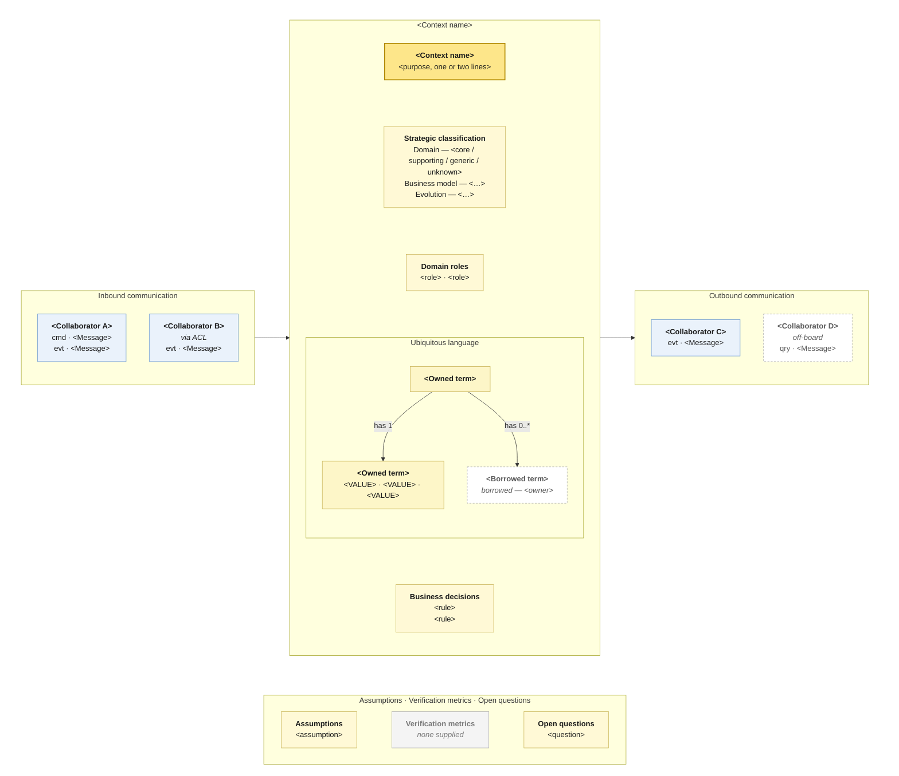

# The canonical Mermaid canvas

One layout for every canvas in the set. Consistency is the point: a reader who
has learned to read one canvas should not have to learn the next.

## Contents

1. Layout at a glance
2. The template
3. Why it is built this way
4. Node id conventions
5. Label conventions
6. Class definitions
7. Variants — empty columns, dense canvas, diagram-only, block-beta
8. Mermaid syntax traps

---

## 1. Layout at a glance

Three columns left to right, the meta panels beneath — the DDD Crew canvas's own
arrangement.

```
┌────────────────┐   ┌───────────────────────────┐   ┌────────────────┐
│ Inbound        │──▶│  <Context name> + purpose │──▶│ Outbound       │
│                │   │  strategic classification │   │                │
│ Collaborator   │   │  domain roles             │   │ Collaborator   │
│  cmd · …       │   │  ubiquitous language ▸    │   │  evt · …       │
│  evt · …       │   │  business decisions       │   │                │
└────────────────┘   └───────────────────────────┘   └────────────────┘

              ┌──────────────────────────────────────┐
              │ assumptions · metrics · questions    │
              └──────────────────────────────────────┘
```

**The ubiquitous language panel is drawn, not written.** It holds a small term
graph — the slice of the Visual Glossary this context owns, with the glossary's
own cardinalities on the edges — because a glossary is a picture, and flattening
it into a comma-separated list throws away the relationships that make it worth
having. §7 has the text fallback for when no glossary exists.

**Messages live inside the collaborator boxes, one per line**, not on the
arrows. That is how the paper canvas reads — a collaborator with its messages
listed under it — and it is what lets the column arrows stay at the subgraph
level, which is what makes the three-column layout hold (see §3).

---

## 2. The template

Fill the placeholders; keep the structure, the ids and the class names.

````markdown

````

---

## 3. Why it is built this way

Four structural choices carry the layout. They look arbitrary and each one is
load-bearing — this is what a straightforward `flowchart LR` gets wrong:

- **The three columns are wrapped in an invisible `TOP` subgraph with
  `direction LR`, inside a `flowchart TB` diagram.** The diagram runs top-down
  so the meta block lands beneath; `TOP` runs left-right so the columns are
  columns. `class TOP frame` makes the wrapper itself invisible.
- **The column arrows are `IN --> BCX` and `BCX --> OUT`, subgraph to
  subgraph.** This is the crucial one. Mermaid ignores a subgraph's own
  `direction` as soon as one of its *inner nodes* links outside it — but linking
  the subgraph itself leaves the inner direction intact. That is what lets `BCX`
  keep `direction TB` and stack its panels vertically inside a left-to-right
  row.
- **Messages therefore live in the collaborator labels, not on the arrows.** A
  subgraph-level arrow cannot say which collaborator sends which message. Losing
  that would be worse than losing the layout, so the messages move into the
  boxes, which is where the paper canvas puts them anyway.
- **`bc ~~~ strat ~~~ roles ~~~ LANG ~~~ rules`** fixes the panel order. The
  language panel is a subgraph rather than a node and links into the chain the
  same way; its inner direction is inherited rather than declared, which is fine
  — a term graph reads in either orientation. Without
  the chain the panels have no edges, so their order is whatever the layout
  engine settles on — business decisions above the purpose, on a fresh render,
  for no reason anyone can act on. And **`TOP ~~~ META`** keeps the meta block at
  the bottom rather than wherever there happens to be room.

Two known cosmetic limits, both acceptable and neither worth fighting:

- **Collaborators sit side by side inside their column**, not stacked, because
  `IN` and `OUT` inherit `TOP`'s direction. Wrapping them in a further nested
  subgraph does not fix it — three levels of nesting is past where Mermaid
  honours `direction`. With one to four collaborators a side it reads fine; past
  that the column gets wide, and that width is itself telling you something
  about the context.
- **The meta panels stack vertically** rather than sitting in a row. Same cause,
  and it costs nothing.

---

## 4. Node id conventions

The checker relies on these, and so does anyone reading two canvases side by
side.

| Id | Holds |
|---|---|
| `bc` | the context head — name and purpose |
| `strat` `roles` `rules` | the middle text panels |
| `LANG` | the ubiquitous language panel — a subgraph, not a node |
| `t_<slug>` | one term inside `LANG` |
| `assume` `metrics` `quest` | the meta panels |
| `in_<slug>` | an inbound collaborator, with its messages |
| `out_<slug>` | an outbound collaborator, with its messages |
| `TOP` `IN` `BCX` `LANG` `OUT` `META` | the subgraphs |

Panel order in the chain is `bc`, `strat`, `roles`, `LANG`, `rules`.

The same collaborator sending and receiving gets **two nodes** — `in_rack` and
`out_rack`. That is the canvas's own convention, not a mistake, and collapsing
them turns the picture into a context map.

Slugs are the collaborator name in lower snake_case: *Rack management* →
`in_rack_management`. Keep them stable across files so the set greps cleanly.

---

## 5. Label conventions

- **Every label is quoted.** `bc["Bicycle distribution"]`, never `bc[Bicycle
  distribution]`. Quoting is what makes punctuation, `·`, `/` and `-` safe.
- **Line breaks are `<br/>`.** It works with HTML labels on or off.
- **A collaborator label opens with the collaborator's name and nothing else.**
  The checker reads that first line as the name it must match against another
  canvas, so qualifiers go on their own line: `<b>Rack management</b><br/><i>via
  ACL</i><br/>evt · Bicycle unlocked`. Putting *via ACL* on the name line makes
  the collaborator "Rack management via ACL", and the symmetry check silently
  stops matching.
- **Each message is its own line, `type · Message name`**, type being exactly
  `cmd`, `qry`, `evt` or `?`. Lines that match nothing — a qualifier, a note —
  are ignored, so they are safe.
- **A term node carries the glossary's exact spelling**, in bold, with nothing
  else on the first line. Enumerated values fold onto a second line
  (`<b>Status</b><br/>IN_GARAGE · IN_HOTEL`) rather than becoming four more
  nodes — the glossary draws them as separate stickies, but at canvas size that
  buries the terms that matter. A borrowed term names its owner on its own line.
- **Cardinalities go on the term edges, in the glossary's own notation**:
  `-->|"has 1"|`, `-->|"has 0..1"|`, `-->|"selects 1..*"|`. A relationship the
  glossary draws without a multiplicity gets `has ?`, which is a question, not a
  default.
- **Panel headings are `<b>…</b>`** followed by `<br/>`. Bold needs HTML labels,
  the default in mermaid.live, VS Code, GitHub and Obsidian. If the target
  renderer has `htmlLabels: false`, drop the tags and keep `<br/>`.
- **Separate list items with ` · `**, not commas — commas inside quoted labels
  are legal but hard to scan at diagram size.
- **Cap a panel at roughly six lines.** Beyond that the picture stops being
  readable and the field table is the right home; put the top few on the canvas
  and end the panel with `<i>…and n more (see below)</i>`.
- **Mark unknown fields on the picture**, not just in the text: `<i>none
  supplied</i>`, and give the node the `unknown` class so it goes grey. A grey
  box in a folder of canvases is a to-do list.

---

## 6. Class definitions

Six classes, applied consistently:

| Class | Used for | Reads as |
|---|---|---|
| `head` | the `bc` node | the context itself |
| `panel` | filled middle and meta panels | content derived from a source |
| `unknown` | any panel with nothing behind it | grey — a gap, deliberately visible |
| `collab` | on-map collaborators | a context with its own canvas |
| `offboard` | external or off-board collaborators | dashed — no canvas, no negotiation |
| `frame` | the `TOP` wrapper | invisible; structural only |
| `term` | a term this context owns | solid — its model, its rules |
| `termgap` | a borrowed or undefined term | dashed — someone else's model, or nobody's |

An `offboard` collaborator's messages are exempt from the symmetry check, since
there is no canvas on the other side to match them.

---

## 7. Variants

**A column with no messages.** An empty inbound or outbound column is a
finding, so draw it rather than dropping the subgraph: one node classed
`unknown`, labelled `<i>nothing drawn on the map</i>`. Keep the column arrow —
`IN --> BCX --> OUT` is what holds the three columns in a row.

**No glossary.** Without one the term graph has no cardinalities and no agreed
spellings, so drawing it would assert more than is known. Fall back to the text
node the panel replaced, and say why on the face of it:

```
lang["<b>Ubiquitous language</b><br/><i>no glossary supplied — derived from the map</i><br/>&lt;term&gt; · &lt;term&gt;<br/><i>borrows</i> &lt;term&gt;"]
```

Keep it in the chain as `roles ~~~ lang` then `lang ~~~ rules`, and give it the
`unknown` class, so the canvas shows a grey box where the agreed language should
be.

**Dense canvas.** When a context has many messages, the middle stack squeezes.
Merge `strat` and `roles` into one panel, and move the ubiquitous language to
the field table with only its owned aggregates on the picture. Do not shrink the
`rules` panel first — business decisions are the most-read panel on a canvas.

**Diagram only.** If the user wants `.mmd` files rather than Markdown, write the
diagram body alone (no fence) to `<slug>.canvas.mmd` and keep a single
`README.md` holding all the field tables. Say plainly that the provenance
markers then live only in the README, which is where canvases start drifting
from their evidence.

**`block-beta`.** Mermaid's block diagram lays out a real grid and gives the
same three columns without the wrapper trickery. It is not the default for two
reasons: it is still beta, so older renderers fail on it outright, and its
blocks carry less structure, so the panels flatten. Offer it when the user says
where the files will be read and the answer is a current Mermaid.

**Unmatched messages.** A message with no counterpart on any other canvas goes
to a collaborator node classed `offboard` and named for what it reveals —
`out_notification["<b>Notification</b><br/><i>off-board, undrawn</i><br/>evt ·
Help requested"]`. Never delete it and never invent the receiving context.

---

## 8. Mermaid syntax traps

The ones that actually break canvases, in rough order of how often:

- **Unquoted labels.** Anything with a space, `·`, `/`, `(`, `-` or `:` must be
  quoted. Just quote everything.
- **Quotes inside a label.** `"say "no""` breaks the parse. Use `&quot;` or
  rewrite.
- **`#` inside a label.** Starts an entity code. Use `&num;` or drop it.
- **A node id called `end`, `graph`, `subgraph`, `class`, `style`, `click`,
  `call`, `href`, `default`, `o` or `x`.** Reserved. `end` in particular closes
  a subgraph and produces a baffling error twenty lines later.
- **Ids starting with a digit** — prefix them (`in_2fa`, not `2fa`).
- **`direction` inside a subgraph whose inner nodes link outside it** is
  ignored. This is the rule the whole template is built around — see §3.
- **Three levels of subgraph.** Two is the practical limit for `direction` being
  honoured; the template uses exactly two inside `TOP`.
- **Chained invisible links.** Write `a ~~~ b` then `b ~~~ c` on separate lines
  rather than `a ~~~ b ~~~ c`; chaining is less reliably supported than for
  `-->`.
- **Subgraph titles with spaces** need the id form: `subgraph IN["Inbound
  communication"]`, not `subgraph Inbound communication`.
- **A `%%` comment must be on its own line.** Trailing comments after a
  statement are not parsed as comments.

Run `scripts/check_canvases.py` before presenting anything. It catches the whole
list above except layout quality — and layout is worth actually looking at, at
least once per new shape of canvas, because a diagram can parse cleanly and
still come out unreadable.