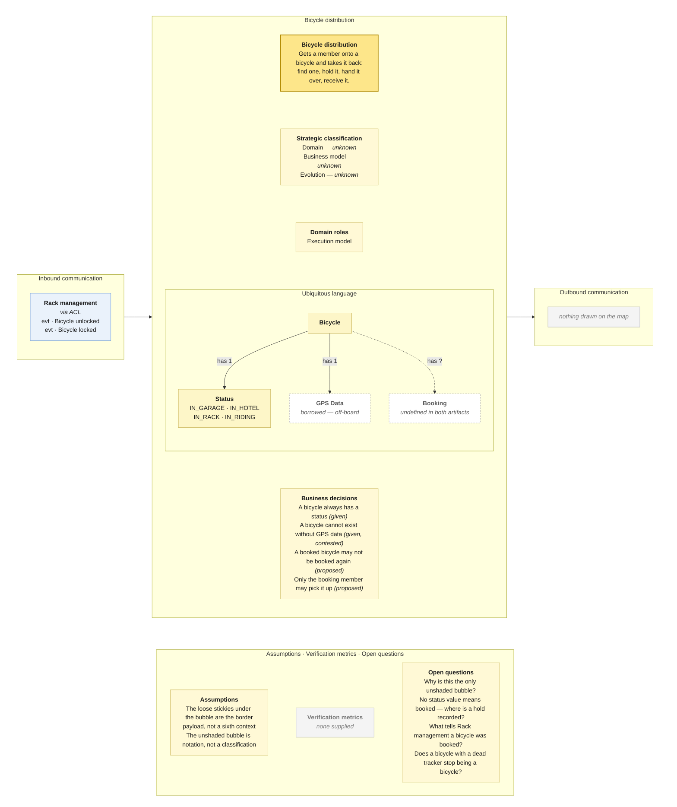

# Worked example — a five-context bike-sharing map

A context map with five bubbles — **Bicycle distribution**, **Rack
management**, **Member Management**, **Accounting**, **Riding** — three ACL
boxes, two dashed arrows, and a handful of stickies floating between bubbles;
plus a **Visual Glossary** covering part of the same domain. Read this end to
end when unsure how deep to go, how to type a message, how to partition a
glossary, or how firmly to leave a box empty.

Abridged: the ledger and the reconciliation are complete, one canvas is written
out in full, and the other four are sketched. A real run writes every file.

---

## 1. Map as read

| Context | Events on it | Business objects (yellow) | Read models (green) |
|---|---|---|---|
| Bicycle distribution | Bicycle distributed · Bicycle searched · Bicycle booked · Bicycle returned · Bicycle picked up | Bicylce | — |
| Rack management | Unlock code generated · Bicycle locked · Bicycle unlocked | Bicylce · Code | — |
| Member Management | Member registered | Member | — |
| Accounting | Monthly fee paid · Fee paid | Fee | — |
| Riding | Bicycle ridden | — | Geo data |

**Between the bubbles**, and this is where the whole ledger comes from:

- Below Bicycle distribution: loose stickies *Bicycle unlocked*, *Bicycle
  locked* and a yellow *Bicylce*, sitting on a dashed arrow that runs from an
  **ACL** on Rack management's edge up into Bicycle distribution.
- Between Accounting and Member Management: a loose *Monthly fee payed* and a
  yellow *Fee*, on a dashed arrow running from an **ACL** on Accounting's edge
  up to a second **ACL** on Member Management's edge.
- Riding carries an **ACL box with no arrow attached to it.**

Four reading notes, recorded before deriving anything:

- **Spelling drift, kept verbatim.** The yellow objects say *Bicylce*; every
  event says *Bicycle*. The loose sticky says *Monthly fee payed*; the one
  inside Accounting says *Monthly fee paid*. Both go on the canvases as the
  board spells them, because normalizing them silently deletes the finding.
- **Bicycle distribution is the only unshaded bubble.** Every other context is
  grey. Nothing on the map explains the difference. Read as notation, recorded
  as an assumption, asked about in open questions — *not* read as a
  classification, however tempting.
- **The loose stickies are the border payload, not a sixth context.** *Bicycle
  locked* and *Bicycle unlocked* appear both inside Rack management and again on
  the arrow: once as events it owns, once as what crosses. One pair of events,
  drawn twice.
- **Both ends of the Accounting → Member Management edge carry an ACL.** Two
  translation layers on one border is either a drawing habit or a real statement
  that neither side will accept the other's model. It goes in open questions.

**A Visual Glossary came with this map**, and it changes the run: the
ubiquitous language on two of the five canvases becomes `(given)` rather than
`(derived)`, with the team's own spellings and multiplicities. It is read and
partitioned in §4, and it turns out to carry the sharpest finding here.

## 2. Roster

| Context | Canvas? |
|---|---|
| Bicycle distribution | yes |
| Rack management | yes |
| Member Management | yes |
| Accounting | yes |
| Riding | yes |
| *Geo data source* | no — off-board collaborator, read by Riding and written by nobody |

## 3. Message ledger

Built once, before any canvas. Every row becomes exactly two canvas entries.

| From | To | Message | Type | Mechanism | Evidence |
|---|---|---|---|---|---|
| Rack management | Bicycle distribution | Bicycle unlocked | evt | event, via ACL | loose sticky on the dashed arrow |
| Rack management | Bicycle distribution | Bicycle locked | evt | event, via ACL | loose sticky on the dashed arrow |
| Accounting | Member Management | Monthly fee payed | evt | event, via ACL | loose sticky on the dashed arrow |
| *Geo data source* | Riding | Geo data | qry | *(unknown)* | green read model with no writer |

**Three drawn messages on a five-context map.** That is the ledger's first
finding and it shapes every canvas below: most of these contexts have an empty
outbound column, and an empty column is a question, not a fact.

Two typing calls worth showing the working for:

- ***Bicycle unlocked* is an event, not a command.** Past tense, and Bicycle
  distribution cannot refuse it — the rack has already opened. A crossing that
  cannot be refused is an event.
- ***Geo data* is a query Riding issues**, so it is **outbound for Riding** even
  though the data flows back into it. Nothing on the map writes *Geo data*, so
  the collaborator is off-board and gets no canvas.

---

## 4. Glossary as read, and partitioned

The glossary draws **Bicycle twice**, with a different set of relationships each
time. That is not a duplicate sticky — it is two contexts' models of one word,
drawn side by side, and it is the single most useful thing in this run.

| | Left-hand *Bicycle* | Right-hand *Bicycle* |
|---|---|---|
| has | 1 GPS Data · 1 Status | 0..1 Slot · 0..1 Rack · 0..1 Hotel · 1 GPS Data · 1 Status |
| *Status* is one of | IN_GARAGE · IN_HOTEL · IN_RACK · IN_RIDING | LOCKED · UNLOCKED |
| Reads as | where a bicycle **is** in the fleet | whether a bicycle is **held** by a rack |
| Owner, per the map's term ledger | **Bicycle distribution** | **Rack management** |

**Two models of *Status* with disjoint value sets.** No value appears on both
sides. A single `Status` field would have to hold both, and any code that tried
would be translating between two contexts inside one type — which is exactly
what the ACL the team already drew on that border exists to prevent. The map
said *Bicycle* was contested; the glossary says precisely what the contest is
about, and it also says the answer: **neither context should give it up.** Two
models, one word, one translation at the border.

### The partition

| Glossary term | Owner | Bicycle distribution's canvas | Rack management's canvas |
|---|---|---|---|
| Bicycle | both, differently | **owned** (fleet model) | **owned** (rack model) |
| Status | both, differently | **owned** — 4 values | **owned** — 2 values |
| GPS Data | *nobody writes it* | borrowed | borrowed |
| Slot · Rack · Hotel | Rack management | — not referenced | **owned** |

### What the partition finds

- ***GPS Data* is written by no context on the map** and read by three: both
  Bicycles, and Riding. That is an off-board upstream — a telemetry supplier
  nobody drew. Both canvases carry it as **borrowed** rather than owned, and it
  goes in the set's findings once, not on every canvas.
- **The board and the glossary disagree on its name.** The glossary says *GPS
  Data*; the Riding bubble says *Geo data*. Same thing, two words. Fix the wall.
- ***Slot* and *Hotel* are glossary terms no event on the map ever touches.**
  Rack management owns them by elimination, and the map draws neither. Either
  events are missing from that bubble or the glossary is ahead of the board.
- **The glossary defines no *Booking*, and neither does the map.** Two
  independent artifacts, the same silence, on the concept the whole distribution
  lifecycle turns on. This stops being a transcription gap and becomes a finding.
- **Nothing here covers Member Management or Accounting.** *Member*, *Fee* and
  *Code* have no glossary terms at all, so those three canvases keep a
  `(derived)` ubiquitous language and say so.
- **One cardinality is unreadable.** A loose `0..*` floats beneath the left-hand
  Bicycle, touching no edge. It probably belongs to the *has Status* relation —
  many bicycles, one status value — but it is placed ambiguously and is recorded
  as an assumption rather than read.

### Cardinalities that are business decisions

Two of them, and neither is written as a rule anywhere:

- **`Bicycle has 1 Status`** — a bicycle always has a status; there is no
  unknown, no null, no "just added and not yet placed".
- **`Bicycle has 1 GPS Data`** — a bicycle *cannot exist here without* GPS data.
  Worth challenging out loud: a tracker with a flat battery does not stop being
  a bicycle, and this cardinality says the model thinks otherwise.

And one absence that is a business question: **no status value means *booked***.
The map draws *Bicycle booked*, and the glossary offers no state to record it
in. Either a booking is held somewhere neither artifact shows, or a booked
bicycle is indistinguishable from an available one.

---

## 5. Canvas in full — Bicycle distribution

````markdown
# Bounded Context Canvas — Bicycle distribution

> **Source:** bike-sharing context map + Visual Glossary (images) · **Mode:** derived from the team's cut
> **Provenance:** `(given)` stated by a source · `(derived)` read off one ·
> `(proposed)` mine, confirm it · `(unknown)` nothing to derive from.

## Canvas



## Purpose  (derived)

Gets a member onto a bicycle and takes it back again: find one, hold it against
a booking, hand it over, receive it on return.

Derived from the five events on the bubble, which read as one lifecycle.
*Bicycle distributed* does not fit that lifecycle and may belong to a different
actor entirely — see open questions.

## Strategic classification  (unknown)

| | |
|---|---|
| Domain | `(unknown)` — no Core Domain Chart, and the map states nothing |
| Business model | `(unknown)` |
| Evolution | `(unknown)` |

The unshaded bubble is **not** evidence of coreness. It is undocumented
notation, and reading a classification off a fill colour is how a canvas
manufactures a decision nobody made.

## Domain roles  (derived)

- **Execution model** — it carries out the booking lifecycle in real time; every
  one of its events is a step in one journey.

Rejected: *Specification model* — it holds no definitions anyone else executes
against. *Gateway* — it faces the member, but it owns the lifecycle rather than
routing it.

## Inbound communication  (derived)

| Collaborator | Message | Type | What it carries | Evidence |
|---|---|---|---|---|
| Rack management `(via ACL)` | Bicycle unlocked | evt | which bicycle, which rack, when | loose sticky on the dashed arrow |
| Rack management `(via ACL)` | Bicycle locked | evt | which bicycle, which rack, when | loose sticky on the dashed arrow |

**Stays outside:** the unlock *Code*, and everything about the physical slot.
The ACL is the map's own statement that the rack's model of a bicycle is not
this context's model.

## Outbound communication  (unknown)

**Nothing is drawn.** Five events on the bubble and not one leaves it, although
*Bicycle booked* must reach Rack management before an unlock code can be
generated, and *Bicycle picked up* / *Bicycle returned* are the obvious triggers
for Riding and Accounting.

This is the map's largest silence, and the canvas records it as a silence rather
than filling it in. See the reconciliation report.

## Ubiquitous language  (given — from the Visual Glossary)

The panel above draws this table; it is repeated here because the picture caps
what fits and the borrowed sense needs a sentence.

| Term | What it means here | Owned or borrowed | Cardinality |
|---|---|---|---|
| Bicycle | a unit of the fleet, wherever it currently is | **owned** — and Rack management owns a *different* Bicycle | — |
| Status | where the bicycle is: `IN_GARAGE`, `IN_HOTEL`, `IN_RACK`, `IN_RIDING` | **owned** | Bicycle has **1** |
| GPS Data | where the bicycle reports itself to be | **borrowed** — written by no context on the map | Bicycle has **1** |
| Booking | *not a glossary term, and not a board object* | **undefined** | — |

**The borrowed sense, stated, because it is what the border is for:** Rack
management's *Status* is `LOCKED` / `UNLOCKED` — whether the rack is holding the
bicycle. This context's *Status* is where the bicycle is in the fleet. The value
sets are disjoint; neither model should absorb the other, and the ACL the team
drew on that border is the right instinct.

Board spellings kept rather than corrected: the yellow sticky reads *Bicylce*
where the glossary reads *Bicycle*, and Riding's read model reads *Geo data*
where the glossary reads *GPS Data*. Both go on the patch list for the wall, not
into this table.

## Business decisions  (given + proposed)

From the glossary's cardinalities, which state rules nobody wrote as rules:

1. **A bicycle always has a status.** `Bicycle has 1 Status` — no unknown, no
   null, no "added to the fleet but not yet placed". `(given)`
2. **A bicycle cannot exist here without GPS data.** `Bicycle has 1 GPS Data`.
   `(given)` — and worth challenging out loud: a flat tracker battery does not
   stop something being a bicycle, and this cardinality says the model disagrees.

No invariants sheet exists, so the lifecycle rules remain `(proposed)` and
should not be built on:

3. A booked bicycle may not be booked again.
4. Only the member who booked a bicycle may pick it up.
5. A returned bicycle returns to `IN_RACK`.

**Not a business decision here:** *"a bicycle may only be picked up by a member
in good standing."* Standing lives in Member Management, so this context cannot
enforce it — a policy across a border the map does not draw.

## Assumptions  (derived)

- The loose stickies beneath the bubble are the border payload, not a sixth
  context.
- *Bicycle locked* and *Bicycle unlocked* on the arrow are the same two events
  Rack management owns, drawn a second time as what crosses.
- The unshaded bubble is notation, not a classification.
- The left-hand *Bicycle* in the glossary is this context's model and the
  right-hand one is Rack management's, assigned by the map's term ledger. The
  glossary itself does not label either.
- The loose `0..*` beneath the left-hand *Bicycle* touches no edge. Read as the
  far end of *has Status* — many bicycles, one status value — but it is placed
  ambiguously and nothing above depends on it.

## Verification metrics  (unknown)

`none supplied` — the map states none.

`(proposed)`, if the room wants a starting point: share of searches that end in a
booking; share of bookings that end in a pick-up; time a bicycle spends held
against a booking nobody collects.

## Open questions

1. **No status value means *booked*.** The board draws *Bicycle booked* and the
   glossary offers no state to record it in. Where is a hold kept — or is a
   booked bicycle indistinguishable from an available one? *(The biggest hole in
   this context, and both artifacts have it.)*
2. Is there a *Booking* at all? *(Names the object the lifecycle needs, and
   neither the map nor the glossary has one.)*
3. Does a bicycle with a dead tracker stop being a bicycle? *(Settles whether
   `has 1 GPS Data` is really the rule.)*
4. Why is this the only unshaded bubble? *(Settles the classification field, and
   possibly the whole map's notation.)*
5. What tells Rack management that a bicycle was booked? *(Settles the empty
   outbound column.)*
6. Is *Bicycle distributed* something staff do — rebalancing racks — rather than
   a step in a member's journey? *(If so, it belongs to a context nobody drew.)*

## Border reconciliation

| Message | Direction | Counterpart | Status |
|---|---|---|---|
| Bicycle unlocked | in, from Rack management | `rack-management.canvas.md` | matched |
| Bicycle locked | in, from Rack management | `rack-management.canvas.md` | matched |
| *(none)* | out | — | **no outbound message anywhere on this canvas** |
````

---

## 6. The other four, in outline

**Rack management** — the glossary's right-hand *Bicycle*: `0..1 Slot`,
`0..1 Rack`, `0..1 Hotel`, `1 GPS Data`, and a *Status* of `LOCKED` /
`UNLOCKED`. Its ubiquitous language field is `(given)` and the largest on the
set — and three of its terms (*Slot*, *Rack*, *Hotel*) appear in no event on the
map, which its open questions have to name. It also owns *Code*, which the
glossary never defines. Outbound: `evt Bicycle locked` and `evt Bicycle
unlocked` to Bicycle distribution. Inbound:
**nothing drawn**, although *Unlock code generated* must be triggered by
something, and the only plausible trigger is a booking in a context that draws
no outbound. Roles: gateway — it stands between the software and the physical
rack. The ACL sits on **its own** edge rather than the consumer's; record that as
an assumption and ask who translates.

**Member Management** — owns *Member*; **the glossary says nothing about it**,
so its ubiquitous language stays `(derived)` and the canvas says so. Inbound: `evt Monthly fee payed` from
Accounting. Outbound: **nothing drawn**, although *Member* is the one term the
whole map needs — Accounting cannot bill a member it has never heard of. Open
question one is the double ACL on its single border.

**Accounting** — owns *Fee*; also outside the glossary's coverage, so
`(derived)` again. Outbound: `evt Monthly fee payed` to Member
Management, spelled *payed* on the arrow and *paid* inside the bubble. Two
events, *Monthly fee paid* and *Fee paid*, and one object between them: either
two kinds of fee sharing a model, or one event drawn twice. That goes in its
open questions, not into a second object.

**Riding** — the canvas that is mostly grey, and the most useful one to put in
front of the room. One event, *Bicycle ridden*. One read model, *Geo data* —
which the glossary calls **GPS Data**, and which no context writes. **No drawn edges at all**, and an **ACL box with
nothing attached to it** — a border the team started to draw and did not finish.
Its outbound column names one off-board collaborator (`qry Geo data`) and
nothing else; its inbound column is empty, which for a context that only exists
between a pick-up and a return is not a plausible reading of the business.

---

## 7. Reconciliation report for the set

| Message | Emitted by | Claimed inbound by | Status |
|---|---|---|---|
| Bicycle unlocked | Rack management | Bicycle distribution | matched |
| Bicycle locked | Rack management | Bicycle distribution | matched |
| Monthly fee payed | Accounting | Member Management | matched — **spelled *paid* on Accounting's own bubble** |
| Geo data | *off-board source* | Riding | off-board, no canvas |

**Three matched pairs, no unmatched messages, and the report is still mostly
bad news.** Symmetry is clean because so little was drawn; what the canvases
expose is the other column:

- **Three of five contexts emit nothing.** Bicycle distribution, Member
  Management and Riding all have an empty outbound column. On a map where a
  booking must reach a rack, a member must reach a ledger, and a ride must reach
  a fee, three empty columns are three undrawn edges — the most valuable output
  of this run.
- **Riding is isolated**, with an ACL box attached to no arrow. Somebody knew
  there was a border there and the session ran out before it was drawn.
- ***Bicycle* is contested**, written by both Bicycle distribution and Rack
  management. Every edge drawn around a contested object is provisional until
  one owner is named, so both canvases carry it in open questions rather than
  claiming it.
- ***Member* and *Fee* are written and read by nobody else** — orphans on a map
  where billing obviously joins them. Either the consumer was never drawn, or
  these contexts are reporting sinks. Ask; do not invent the reader.
- **One message crosses a border under two spellings.** *payed* on the arrow,
  *paid* on the bubble. Fix the wall, not the file.

**And from the glossary, which the messages alone could not have told you:**

- ***Bicycle* is two models, not one contested term.** The glossary draws both,
  with disjoint *Status* value sets. The map said the ownership was contested;
  the glossary says the right answer is for both contexts to keep their own and
  translate at the border — which is what the ACL already drawn there is for.
- ***GPS Data* is owned by nobody and read by three.** An off-board telemetry
  supplier nobody drew, and the one term on this map that genuinely needs a
  context added rather than a border argued about.
- **The glossary and the board disagree on two words.** *GPS Data* / *Geo data*,
  and *Bicycle* / *Bicylce*. Patch list for the wall.
- **Neither artifact has a *Booking*.** One silence is a transcription gap; the
  same silence in two independently drawn artifacts, on the concept the whole
  distribution lifecycle turns on, is a finding.
- **The glossary covers two of five contexts.** Member Management, Accounting
  and Riding get no `(given)` language at all — worth saying out loud, because a
  glossary that stops where the interesting nouns stop usually means the session
  ran out of time rather than out of domain.