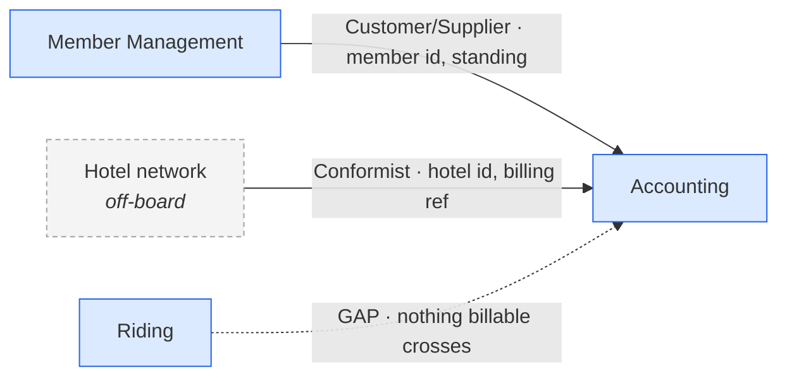

# EventStorming Context Mapper

A **context map** is not a picture of the process. The timeline already draws
the process. A context map draws the **relationships between models** — who
owns which word, who has to translate, who breaks when the other side changes,
and who has no say in it.

The board is arranged by *time*. The map is arranged by *dependency*. Those two
layouts almost never look alike, and the moment they do, the map has copied the
timeline instead of reading it.

Four commitments make the output trustworthy:

- **An edge needs a crossing.** Every relationship must name something concrete
  that moves between the two contexts — a business object written in one and
  read in the other, an actor, a policy, a shared external system. "They are
  next to each other on the wall" is not a crossing. An arrow you cannot
  justify is a future integration nobody asked for.
- **Recurrence collapses; the timeline does not.** A context drawn four times
  along the board is **one node with four appearances**, not four contexts. The
  appearances are evidence of how central it is, and they become the *reason*
  for an edge, not more nodes.
- **Direction before pattern.** Decide who is upstream and who is downstream
  first, from ownership. Only then choose the pattern. Patterns chosen before
  direction always come out as Partnership, which is the answer that costs the
  most and says the least.
- **Do not invent contexts, edges or names.** A context read by everyone and
  written by nobody is a *finding* — draw it dashed and say it is off-board. An
  edge the business obviously needs and the board never drew is the most
  valuable thing on the map; draw it dotted and label it a gap.

## What a context map records

Six things per border, and a map that carries fewer is decoration:

| | | |
|---|---|---|
| **Nodes** | the bounded contexts, one per context however often drawn | plus off-board and external ones, marked |
| **Direction** | upstream → downstream | who would have to change if the other changed |
| **Pattern** | one of nine, with evidence | `references/pattern-catalog.md` |
| **Contract** | what crosses, what stays behind, how the words translate | the border's actual value |
| **Mechanism** | event, replicated read model, synchronous call, file, human | and the staleness window in business terms |
| **Team** | who owns each side, and whether they can negotiate | usually not on the board — ask, do not guess |

## Where borders hide on a board

Nine signals. Work them in order; the first three produce most of the map.

1. **An object written in one bubble and read in another.** The pale-yellow
   business object produced by an event in context A, consulted as a green read
   model by an event in context B. This is the primary evidence for an edge,
   and it settles direction at the same time: **the writer is upstream.**
2. **The same noun written by two contexts.** Contested ownership. Not an edge —
   a boundary defect. Resolve it (one owner, or two differently-named models)
   before drawing anything, because every edge you draw around it will be wrong.
3. **A noun read by everybody and written by nobody.** An off-board upstream:
   a context that exists in the business but not on the wall, or a real external
   system. Draw it dashed. Two or more consumers of the same unwritten noun is
   the strongest possible argument that a context is missing.
4. **External-system stickies** (pink, or whatever the board uses). Every one is
   an edge, and every one forces a choice: conform to its model, wrap it, or
   walk away. A context *named after* an external system deserves a hard look —
   see the traps.
5. **Policies** — *whenever X, then Y*. A policy whose event and command sit in
   different bubbles **is** an edge, already drawn by the team, complete with
   its own asynchrony. Harvest these first; they are free.
6. **Actors under different names.** *Member* here, *Commuter* there, *Customer*
   in the third bubble: either one person the contexts model differently — the
   translation the border exists for — or genuinely different roles. Say which.
7. **The same context bubble drawn several times.** Recurrence. It marks a
   context that serves several phases, which almost always makes it a *supplier*
   to them rather than a step between them.
8. **Objects nobody reads.** An orphan. Either the consumer was never drawn (an
   undrawn edge) or the object is a report. Both are findings; neither is an
   edge you may invent.
9. **Timeline adjacency with nothing crossing.** Two bubbles that follow each
   other with no object passing between them. The process says there is a
   handover; the stickies say nothing is handed over. That is a gap, drawn
   dotted, and it is usually where the missing aggregate lives.

## Workflow

### Step 1 — Read the board into a grid

One table, whatever arrived: event · command · actor or system · business
objects **produced** · read models **consumed** · the context bubble it sits in
· any policy or hotspot on it.

Two reading rules decide the whole map:

- **Produced vs consumed is the axis of the entire method.** If the notation is
  ambiguous — a color used for both, an object with no icon — say so and mark
  the affected rows `uncertain`. A map built on a misread producer is confidently
  backwards.
- **Copy the board's spelling exactly**, including inconsistencies. *Bicylce* in
  one bubble and *Bicycle* in another is evidence about the ubiquitous language,
  and normalizing it silently deletes the finding.

Flag stickies sitting in the overlap of two bubbles, and stickies outside every
bubble. Ask rather than assign, or assign and mark it contested.

### Step 2 — Collapse recurrence into nodes

List each distinct context once, with the appearances it has on the timeline:

```
Bicycle distribution   — 4 appearances (events 1, 4–5, 10, 12)
Rack management        — 2 appearances (events 6–7, 11)
```

Then, per context: the events it owns, the objects it writes, the objects it
reads, its actors, its commands, its terms. A context whose only appearance is
one event with no object is a candidate for dissolution — note it, do not delete
it yet.

**If the board carries no bubbles**, do not invent a cut inside this skill. Run
`pivotal-event-boundary-finder` (or `domain-story-context-finder` for stories),
then map the result and mark every relationship as provisional.

### Step 3 — Build the term ledger

The engine of the map. One row per noun on the board:

| Term | Written by | Read by | Verdict |
|---|---|---|---|
| Member | Member Management | Accounting | owned, one consumer |
| Rack | Rack management | Bicycle distribution | owned, crosses |
| Hotel | *nobody* | Bicycle distribution, Accounting | **off-board upstream** |
| Bicycle | Bicycle distribution, Rack management | both | **contested ownership** |
| Fee | Accounting | *nobody* | **orphan** |

Read the verdict column straight off:

- **one writer, readers elsewhere** → an edge, direction settled
- **one writer, readers only inside** → no edge; internal detail
- **two writers** → boundary defect; resolve in §Step 8 before drawing edges
- **no writer, several readers** → missing or external upstream context
- **no reader** → orphan; suspect an undrawn consumer or a report

Do this before drawing anything. Almost every wrong context map is a term ledger
that was skipped because the ownership "seemed obvious".

### Step 4 — Fix direction

For each crossing, name upstream and downstream:

- **The writer is upstream.** It mints the object and owns its schema.
- **Tie-break with the change test:** if A changed its model, would B have to
  react? If yes, A is upstream of B. If both must react to each other, you have
  a mutual dependency — record it as such (Step 8) rather than smoothing it into
  one arrow.
- **Influence, not data flow.** A downstream context may push data upstream
  (a payment, an acknowledgment) and still be downstream. Ask who dictates the
  vocabulary, not who sends the bytes.
- Upstream contexts on a board are typically the ones drawn several times: they
  serve, they do not sequence.

### Step 5 — Choose a pattern per edge

Full definitions, evidence tests, misuses and micro-examples:
`references/pattern-catalog.md`. The short procedure:

1. **Is the other side outside our control** — a vendor, a legacy system, an
   off-board context, another company? Then the choice is the *downstream's*
   alone: **Conformist** (adopt their model), **Anticorruption Layer** (wrap and
   translate), or **Separate Ways** (do not integrate at all).
2. **Must both sides succeed or fail together**, with two teams and mutual
   dependency? **Partnership.** Expensive; demand evidence of the mutual
   dependency rather than assuming it from two arrows.
3. **Do they share a subset of the model that both write?** **Shared Kernel.**
   On a board this shows up as contested ownership — usually a defect to resolve,
   occasionally a deliberate, small, jointly-owned core.
4. **Does one context serve several downstreams with a stable contract?**
   **Open Host Service**, and its vocabulary is the **Published Language**.
   Recurrence plus multiple consumers in the ledger is the evidence.
5. **One consumer that can negotiate what it needs?** **Customer/Supplier**, the
   honest default for two internal contexts.
6. **No crossing at all?** Say so explicitly — a context map with a deliberately
   empty border is more useful than one that connects everything.

Mark each pattern `on the board` (a sticky says so), `implied` (the board makes
no sense otherwise) or `inferred` (domain or organizational knowledge, needs
confirming). Patterns about *teams* are nearly always inferred: the board shows
models, not org charts. Say so rather than quietly upgrading a guess.

### Step 6 — Write the border contracts

Per edge, six lines. This is the part teams actually build from:

- **Crosses** — the fields, named. Not "the booking", but *bicycle id · rack id ·
  valid until*.
- **Stays behind** — what the downstream must never need. Just as important:
  it is the definition of the interface being narrow.
- **Translation** — *their word → our word*, each way. If nothing translates,
  challenge the border: two contexts sharing every term are one context.
- **Mechanism** — domain event, replicated read model, synchronous query,
  batch/file, or a human carrying it. Prefer what the board already implies.
- **Staleness** — in business terms: "seconds", "until the van does its round",
  "hours". A border whose staleness the team cannot name is a border they have
  not agreed to.
- **Failure** — what the downstream does when the upstream is unavailable or the
  data is stale, and what compensates a wrong decision made in that window.

### Step 7 — Draw the map

Mermaid, upstream → downstream, one edge per relationship:



Conventions worth keeping constant across boards:

- **solid arrow** = a crossing on the board · **dashed node** = off-board or
  external · **dotted arrow** = an edge the business needs and the board does not
  draw, labeled `GAP`
- label every edge `pattern · what crosses`; put `U`/`D` in the label only when
  the arrow direction is not enough (bidirectional pairs)
- **keep it to about nine nodes.** Beyond that, group and draw a second map at
  the coarser level; a map nobody can read has no readers
- do not lay the nodes out left-to-right in timeline order out of habit. If the
  map ends up looking exactly like the board, check whether recurrence was really
  collapsed.

### Step 8 — Stress the map

Run every check; each one that fires is a headline finding, not a footnote.

- **Contested ownership.** Two writers of one noun. Offer the three resolutions:
  one owner and the other reads it; two models with two names; or merge the
  contexts. Say which you would choose and what it costs.
- **Bidirectional customer/supplier.** A ↔ B where each is upstream of the
  other. Either it is a genuine Partnership, or — more often — the boundary is
  in the wrong place and one aggregate is split across it.
- **The hub.** A context touching every other one. Sometimes correct (identity,
  billing); sometimes a Big Ball of Mud wearing a bubble. Check whether its
  neighbors share its vocabulary; if they do, it is not a context, it is the
  system.
- **The sink and the source.** A context with no outbound edge produces nothing
  anyone needs — legitimate for reporting, suspicious otherwise. A context with
  no inbound edge starts from nothing — ask what it is triggered by.
- **One word, two models.** The same term with different attributes on each side
  of a border is normal and must be *stated* in the translation line. The same
  term with the *same* model on both sides means there is no border.
- **The context named after a system.** A bubble carrying the name of a vendor,
  a database or a team is a component, not a bounded context, until someone can
  state the business capability it owns.
- **The thin context.** One event, no object written. Fold it into a neighbor or
  argue for it explicitly — usually its events belong to a context that is
  already on the map.
- **Every border narrow.** If a downstream needs to reach back for live detail to
  do its job, the interface is wide and the two contexts will collapse into one
  under implementation pressure. Name the decision: snapshot at the border, or
  live lookups.

### Step 9 — Say what the board cannot tell you

- **Missing contexts**, with the nouns that argue for each.
- **Missing edges**, especially the ones the money depends on.
- **Missing objects** — a border that needs something to cross and has nothing
  to carry (no *Booking*, no *Trip*, no *Order*). This is the most common and
  most expensive silence on a board.
- **Teams and ownership** — unknown unless someone said. A relationship pattern
  is half a model decision and half an organizational one.
- **Numbers nobody supplied** — every staleness window written as `<n>`.
- **Hotspots verbatim**, mapped to the border each argues about. No hotspots on
  a board with contested ownership means disagreement was never captured.
- **The questions that would settle it** — each answerable by one person in one
  sentence, each naming the edge it decides.

## Output: the Context Map

```
# Context Map — <board or product name>

## 1. Board as read
Grid of event · command · actor · produces · reads · bubble. Assumptions,
overlaps and unreadable stickies flagged. Mode stated: propose (no bubbles
drawn, cut imported and provisional) or review (the team's own bubbles).

## 2. Contexts
Each context once, with its appearances, events, objects written and read,
actors, commands, terms. Recurrence stated explicitly.

## 3. Term ledger
Every noun × written by / read by / verdict.

## 4. The map
Mermaid diagram plus a legend. Off-board contexts dashed, gaps dotted.

## 5. Relationships
One entry per edge: upstream · downstream · pattern · evidence · confidence.

## 6. Border contracts
Per edge: crosses · stays behind · translation · mechanism · staleness ·
failure and compensation.

## 7. Missing contexts and undrawn edges
With the evidence that argues for each.

## 8. Smells and stress tests
Contested ownership, mutual dependency, hubs, sinks, thin contexts, wide
interfaces — each with the resolution options and their cost.

## 9. Contested calls and alternative maps
The coarser map and the finer map, each with what it buys and what it loses.

## 10. Open questions
One sentence each, naming the edge or ownership call it settles.
```

Adapt depth to the request. "Just draw it" gets §4 and §5 — but never drop §3 or
§7, because a map that hides its term ledger cannot be argued with, and a map
that hides its gaps reads as a description of a working system.

**Review mode.** If the team has already drawn a map, do not redraw it silently:
reconstruct it from the board first, then report agreement, disagreement and
omission separately, and say which of their edges the board cannot support.

## Traps worth checking before you publish

- **The timeline in disguise.** Nodes left-to-right in board order, each arrow
  meaning "and then". That is a process diagram. Ask of every arrow: what
  *word* does the downstream have to accept from the upstream?
- **Arrows for adjacency.** Two bubbles next to each other with nothing crossing.
  Dotted and labeled a gap, or not drawn.
- **Partnership by default.** The most expensive pattern, usually chosen because
  direction was never settled. Demand mutual dependency, in writing.
- **Shared Kernel as a compromise.** It is the pattern with the highest ongoing
  cost — two teams must coordinate every change. Choosing it to avoid deciding
  ownership is how a board becomes a distributed monolith.
- **ACL as decoration.** An anticorruption layer that translates nothing is a
  proxy. Name the model difference it absorbs, or drop it.
- **Normalizing the vocabulary.** Fixing the board's inconsistent spellings, or
  reconciling *Member* and *Commuter* into "User", deletes the translation the
  map exists to record.
- **The invented consumer.** Giving an orphan object a reader because a system
  "would obviously need it". Mark it undrawn and ask.
- **Contexts with no owner named.** Fine to publish, but say the team dimension
  is unknown rather than implying the model settles it.
- **One map for everything.** Strategic map (contexts and patterns), team map,
  and deployment map answer different questions. Say which one this is.

## Working with the neighboring skills

- **No bubbles on the board** → `pivotal-event-boundary-finder` first (or
  `domain-story-context-finder` for domain stories). Map the cut it produces and
  carry its caveats through.
- **Rules and refusals rather than borders** → `event-storming-invariant-finder`.
  Its §6 demoted cross-context rules are edges already found: every policy with a
  staleness window is a border contract in another notation.
- **A buildable brief — modules, model, flows, screens** →
  `event-storming-interpreter`.
- **A Visual Glossary exists** → reuse its exact terms and cardinalities in §3,
  and treat a glossary term owned by no context as a §7 finding.
- **Strategic classification — core, supporting, generic** →
  `core-domain-chart-critic` / `core-domain-chart-author`. A context map says
  who depends on whom; the chart says which of them is worth building. The
  hub in §8 is usually the candidate core domain.
- **Contracts about to be implemented** → `openapi-spec-author` /
  `asyncapi-spec-author`. A §6 contract with an event mechanism is an AsyncAPI
  channel; with a synchronous mechanism, an OpenAPI path.

## Reference files

- `references/pattern-catalog.md` — the nine relationship patterns in full,
  each with its definition, the board evidence that supports it, the evidence
  that rules it out, its cost, and how it is misused; the upstream/downstream
  determination rules; integration mechanisms and staleness windows; and the
  smell catalog in full.
- `references/worked-example.md` — a five-context bike-sharing board (Bicycle
  distribution, Member Management, Accounting, Rack management, Riding) worked
  end to end: recurrence collapsed from eleven bubbles to five nodes, a term
  ledger that finds one contested object and two off-board contexts, seven
  relationships with contracts, the gap where the money should cross, and the
  alternative maps. Read this first when unsure how deep to go.

## References

E. Evans, *Domain-Driven Design: Tackling Complexity in the Heart of Software.*
Boston, MA, USA: Addison-Wesley, 2003 — Part IV, "Strategic Design": the
relationship patterns and the map that records them.

V. Vernon, *Implementing Domain-Driven Design.* Boston, MA, USA:
Addison-Wesley, 2013 — "Context Maps": drawing the integration relationships
that already exist before designing the ones you want.

A. Brandolini, *Introducing EventStorming: An Act of Deliberate Collective
Learning.* Leanpub, 2021 — boundaries and the pivotal events between them.

DDD Crew, *Context Mapping* — the working notation for upstream/downstream and
the pattern labels used here.