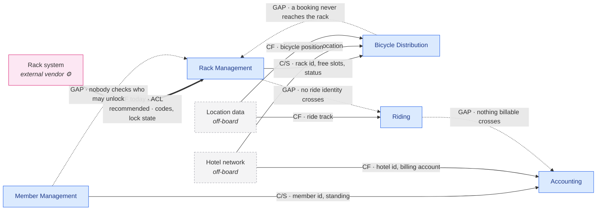

# Worked example — a five-context bike-sharing board

Twelve events, **eleven context bubbles drawn by the team but only five distinct
contexts**, one external system, no policies, no state stickies and no hotspots.
Read this end to end when unsure how deep to go, how hard to push on contested
ownership, or how to report an edge the board never drew.

Abridged: §6 carries a contract for every real edge but only the headline gaps,
and §5 folds evidence into the relationship table. A full map carries a contract
per edge including the gaps once they are agreed.

---

## 1. Board as read

**Mode: review.** The team drew bubbles, so the contexts below are theirs, not
proposed. What is reviewed is the *relationships between* them, which nobody
drew: there is **not one policy sticky on this board**, so every edge in §5 is
derived from ownership of objects rather than read off the wall.

Color convention as read: orange = domain event · blue ⌘ = command · bright
yellow 👤 = actor · green 👁 = read model consumed · pale yellow 💼 = business
object produced · pink ⚙ = external system.

| # | Event | Command | Actor / system | Produces 💼 | Reads 👁 | Bubble |
|---|---|---|---|---|---|---|
| 1 | Bicycle distributed | Distribute bicycle | Mechanic | *Bicylce* | Rack, Hotel | Bicycle distribution |
| 2 | Member registered | Register member | Commuter | **Member** | — | Member Management |
| 3 | Monthly fee paid | Pay monthly fee | Commuter | **Fee** | Member | Accounting |
| 4 | Bicycle searched | Search bicylce | Commuter | — | Geo data, Racks | Bicycle distribution |
| 5 | Bicycle booked | Book bicylce | Commuter | *Bicylce* | — | Bicycle distribution |
| 6 | Unlock code generated | Generate unlock lock code | **Rack management ⚙** | **Code** | Racks | Rack management |
| 7 | Bicycle unlocked | Unlock bicycle | Commuter | *Bicycle* | Code | Rack management |
| 8 | Bicycle ridden | Ride bicycle | Commuter, Tourist | — | Geo data | Riding |
| 9 | Fee paid | Pay fee | Tourist | **Fee** | Hotel | Accounting |
| 10 | Bicycle returned | Return bicycle | Commuter, Tourist | *Bicylce* | Rack, Hotel | Bicycle distribution |
| 11 | Bicycle locked | Lock bicycle | Commuter | **Rack** | — | Rack management |
| 12 | Bicycle picked up | Pick up bicycle | Mechanic | *Bicylce* | — | Bicycle distribution |

**Assumptions flagged — these decide the map, so confirm them first.**

- **Board order is not process order.** *Fee paid* (9) is drawn before *Bicycle
  returned* (10), and the return (10) before *Bicycle locked* (11). Read as the
  wall running out of space rather than as a claim that a tourist pays
  mid-ride — but if the order is deliberate, it changes what Accounting can
  possibly know at payment time, and question 3 in §10 becomes urgent.
- ***Bicylce*** is the board's spelling on four stickies; event 7 spells it
  *Bicycle*. Left verbatim above. Treated as one term with an inconsistent
  spelling, **not** as two concepts — but the one place it is spelled correctly
  is also the one place a second context writes it, so confirm.
- **`Generate unlock lock code`** reads like two commands merged (*generate
  unlock code* / *generate lock code*). Read as one; flagged.
- **`Racks` (green, plural) and `Rack` (pale yellow, singular)** are read as one
  concept: an aggregate and a list projection over it. If the team means two
  things, edge E2 splits.
- **The pink ⚙ sticky says *Rack management*, and so does the bubble around
  it.** A context and an external system with the same name is a naming
  collision that hides a strategic choice — worked in §5 (E4) and §8.
- **No state stickies, no policies, no hotspots anywhere.** The absence of
  policies is why §5 is inference from ownership; the absence of hotspots on a
  board with a contested object is "disagreement was never captured".
- Two bubbles overlap near event 10, with the green *Rack* sticky sitting close
  to the Accounting outline. Read as belonging to *Bicycle distribution*
  (Accounting reads *Hotel*, never *Rack*, anywhere else). Confirm.

---

## 2. Contexts — eleven bubbles, five contexts

The single most important move on this board. The team drew *Bicycle
distribution* four times, *Rack management* twice and *Accounting* twice,
because a timeline forces a context to reappear each time it acts. Those are
appearances, not contexts.

| Context | Appearances | Events | Writes 💼 | Reads 👁 | Actors | Commands |
|---|---|---|---|---|---|---|
| **Bicycle Distribution** | **4** | 1, 4–5, 10, 12 | Bicylce | Rack, Racks, Hotel, Geo data | Mechanic, Commuter, Tourist | Distribute, Search, Book, Return, Pick up |
| **Rack Management** | **2** | 6–7, 11 | Code, Rack, Bicycle | Racks, Code | Commuter, *Rack system ⚙* | Generate unlock code, Unlock, Lock |
| **Accounting** | **2** | 3, 9 | Fee | Member, Hotel | Commuter, Tourist | Pay monthly fee, Pay fee |
| **Member Management** | 1 | 2 | Member | — | Commuter | Register member |
| **Riding** | 1 | 8 | **nothing** | Geo data | Commuter, Tourist | Ride bicycle |

What the appearance count already says, before a single edge is drawn:
**Bicycle Distribution and Rack Management recur across every phase of the
timeline, which makes them suppliers to the process rather than steps in it.**
Riding, the one context that describes what the customer actually buys, appears
once and writes nothing.

---

## 3. Term ledger

| Term | Written by | Read by | Verdict |
|---|---|---|---|
| **Bicylce / Bicycle** | Bicycle Distribution (1, 5, 10, 12) **and** Rack Management (7) | **nobody** | **contested ownership *and* orphan** |
| **Rack** (💼 11) / **Racks** (👁 4, 6) | Rack Management | Bicycle Distribution (1, 4, 10), Rack Management (6) | owned, crosses → **E2** |
| **Code** | Rack Management (6) | Rack Management (7) | internal — **no edge** |
| **Member** | Member Management (2) | Accounting (3) | owned, one consumer → **E1** |
| **Fee** | Accounting (3, 9) | **nobody** | **orphan** |
| **Hotel** | **nobody** | Bicycle Distribution (1, 10), Accounting (9) | **off-board upstream** → E5, E6 |
| **Geo data** | **nobody** | Bicycle Distribution (4), Riding (8) | **off-board upstream** → E7 |
| *Commuter · Tourist · Mechanic · Member* | — | — | role vocabulary; see §8 |

Four findings fall out of this table before anything is drawn:

1. **The central noun of the business is written five times and read never.**
   Five events produce a *Bicycle*; no event consults one. A bike-sharing system
   in which nothing ever asks "where is this bicycle and what state is it in" is
   a board with a missing read model — or a fleet nobody can see.
2. **Two contexts write it.** Bicycle Distribution four times, Rack Management
   once (event 7). Contested ownership, worked in §8.
3. **Two nouns are read by two contexts each and written by none.** *Hotel* and
   *Geo data* are the strongest possible evidence for two contexts that exist in
   the business and not on the wall.
4. ***Fee* is an orphan.** Nothing on this board reads a fee, which means
   nothing checks that one was paid. See §8.

---

## 4. The map

**Legend.** Solid = a crossing evidenced on the board · thick = external system ·
dashed node = off-board context · **dotted = an edge the business needs and the
board does not draw**. Arrows point upstream → downstream.

**Read the shape, not just the edges.** Four of the eleven edges are gaps, and
three of those four are on the path from *unlocking a bicycle* to *being paid
for it*. The board draws a working fleet-logistics system with the revenue path
missing.

---

## 5. Relationships

| Id | Upstream → Downstream | Pattern | Evidence | Confidence |
|---|---|---|---|---|
| **E1** | Member Management → Accounting | Customer/Supplier | *Member* written at 2, read at 3 | implied |
| **E2** | Rack Management → Bicycle Distribution | Customer/Supplier | *Rack* written at 11, read at 1, 4, 10 | on the board |
| **E3** | Bicycle Distribution → Rack Management | **undrawn** | event 6 generates a code for a bicycle booked at 5, and nothing crosses | implied — **GAP** |
| **E4** | Rack system ⚙ → Rack Management | **Conformist today; ACL recommended** | the pink external sticky *is* the actor on event 6, and the bubble carries its name | implied |
| **E5** | Hotel network → Accounting | Conformist | *Hotel* read at 9, written nowhere | implied |
| **E6** | Hotel network → Bicycle Distribution | Conformist | *Hotel* read at 1 and 10, written nowhere | implied |
| **E7** | Location data → Bicycle Distribution, Riding | Conformist | *Geo data* read at 4 and 8, written nowhere | implied |
| **E8** | Rack Management → Riding | **undrawn** | a ride begins on an unlock; nothing identifies it | implied — **GAP** |
| **E9** | Riding → Accounting | **undrawn** | *Fee paid* reads *Hotel*, never a ride | implied — **GAP, the money edge** |
| **E10** | Member Management → Rack Management / Riding | **undrawn** | nothing reads *Member* outside Accounting | implied — **GAP** |

**E2 + E3 together are the map's central problem.** Rack Management supplies
rack availability to Bicycle Distribution (E2, evidenced); Bicycle Distribution
must supply a booking to Rack Management for event 6 to make any sense (E3, not
evidenced, obviously needed). Run the change test both ways and it comes back
"yes" both ways: **mutual dependency**. Per the catalog, mutual dependency
between two adjacent contexts is a misplaced boundary far more often than a
Partnership — and here it is corroborated by the contested *Bicycle*. §8.

**E4 deserves the hardest look on the board.** The actor that generates the
unlock code is a pink external system called *Rack management*, sitting inside a
bubble called *Rack management*. As drawn, the context is the vendor's system
with a circle around it: *Code* is the vendor's concept, and it has already
entered our vocabulary. That is Conformist. Whether that is acceptable depends
entirely on question 5 in §10.

**Deliberate non-edges, and why they are worth drawing.** Member Management has
no crossing to Rack Management or Riding *today*. That is drawn as a gap, not as
Separate Ways, because the business plainly needs it: something must decide that
this commuter may unlock this bicycle. A genuine Separate Ways here would be a
decision; what the board shows is an omission.

---

## 6. Border contracts

### E1 · Member Management → Accounting

- **Crosses:** member id · membership status · tariff or plan · valid-from.
- **Stays behind:** credentials, contact details, registration history, anything
  a sign-up flow accumulates.
- **Translation:** *Member* (identity) → *payer* (billing). Accounting does not
  need a person; it needs an account that can be charged.
- **Mechanism:** the *Member registered* event, plus a replicated read model.
- **Staleness:** seconds. Someone who has just registered expects to be able to
  pay and ride.
- **Failure:** billing queues the charge and retries; nothing is refused, because
  the ride has already happened.

### E2 · Rack Management → Bicycle Distribution

- **Crosses:** rack id · location · free slots · rack status · which bicycles are
  docked.
- **Stays behind:** unlock codes, lock hardware state, vendor error codes,
  firmware, the rack's own telemetry.
- **Translation:** the vendor's *dock* → our *slot*; *occupied* → *not
  available*. If nothing translates, E4 has already leaked the vendor's model
  through two borders.
- **Mechanism:** replicated read model, refreshed on rack events.
- **Staleness:** `<n>` minutes. The cost of getting it wrong is a van driving to
  a full rack — cheap, so minutes are fine. A commuter searching for a bicycle
  is a different story; see question 9.
- **Failure:** distribution falls back to last-known state and marks the rack
  unverified; the mechanic corrects it on arrival.

### E4 · Rack system ⚙ → Rack Management

- **Crosses inward:** lock state · dock occupancy · code validation results ·
  hardware faults.
- **Crosses outward:** unlock requests, lock confirmations.
- **Stays behind:** everything about members, bookings, fees and rides. The rack
  system must never learn who is riding.
- **Translation — the whole point of an ACL here:** vendor *code* → our
  *unlock authorization*; vendor *dock status* → our *slot availability*; vendor
  fault codes → our *rack out of service*.
- **Mechanism:** synchronous call for unlock, events for state.
- **Staleness:** none tolerated on unlock — a commuter is standing at the rack.
- **Failure:** unlock fails closed, with a named fallback the board does not show
  (a second code? a phone number? the mechanic?). Ask.

### E5 / E6 · Hotel network → Accounting, Bicycle Distribution

- **Crosses:** hotel id · location · billing account · guest entitlement.
- **Stays behind:** the hotel's own guest records, room data, its contract terms.
- **Translation:** the hotel's *guest* → our *Tourist*. Note that this is the
  only place a Tourist acquires an identity anywhere on the board.
- **Mechanism:** unclear on the board. Likely a partner agreement plus a periodic
  reconciliation; possibly a person with a spreadsheet.
- **Staleness:** a billing cycle.
- **Failure:** a disputed charge is reconciled against the hotel's own record —
  which is why E9 being missing matters so much: today there is nothing on our
  side to reconcile *against*.

### The gaps, as contracts that need writing

- **E3** must carry: bicycle id · rack id · booking id · valid until. It does not
  exist, and until it does, event 6 has no stated input.
- **E8/E9** must carry a **ride**: ride id · bicycle id · rider id · started/ended
  · distance or duration. **No such object exists anywhere on this board.**

---

## 7. Missing contexts and undrawn edges

**Missing contexts**, each argued from an unwritten noun:

- **Hotel network / Partner management.** *Hotel* is read by three events across
  two contexts and written by none. It is where a Tourist gets an identity and a
  billing account, and where bicycles are placed. Another company's context;
  Conformist, with a Published Language they would define, not us.
- **Location data.** *Geo data* is read by two contexts and written by none.
  Almost certainly bought. Generic; conform and move on.
- **Maintenance** — a *candidate*, argued differently. No unwritten noun points
  to it; instead an actor does. The Mechanic distributes (1) and picks up (12),
  and **nothing on the board says why a bicycle is picked up**: no damage
  report, no inspection, no *Bicycle broken*. Two events with their own actor,
  their own clock and no trigger is a context in hiding, currently filed inside
  Bicycle Distribution.

**Undrawn edges**, in order of consequence:

1. **Riding → Accounting (E9).** The board bills a tourist by reading *Hotel*
   and never reads anything about the ride. As drawn, the per-use fee is charged
   without any record of use. **This is the most consequential single finding on
   the board.**
2. **Rack Management → Riding (E8).** A ride begins when a bicycle is unlocked,
   and nothing carries an identity from the unlock into the ride. Riding writes
   nothing, so nothing survives it either.
3. **Bicycle Distribution → Rack Management (E3).** The booking that the unlock
   code must be generated *for*.
4. **Member Management → operations (E10).** Nothing checks who may unlock.

**Missing objects.** Two, and both are the objects a bike-sharing business turns
money on: a **Booking** (E3) and a **Ride/Trip** (E8, E9). This is the board's
loudest silence, and it is invisible to anyone reading the timeline for
sequence — every event follows sensibly from the last. Only the ledger shows
that nothing is carried.

---

## 8. Smells and stress tests

**Contested ownership — *Bicycle*.** Written by Bicycle Distribution (1, 5, 10,
12) and by Rack Management (7). Three resolutions:

1. **One owner, one reader (preferred).** Bicycle Distribution owns the fleet
   *Bicycle* — identity, condition, location, availability. Rack Management's
   event 7 does not produce a bicycle at all; it produces a **lock state
   change**, and the sticky is a mislabel. Cheapest fix, one sticky, and it
   makes E2 a clean one-way supply.
2. **Two names, two models.** *Fleet bicycle* (Distribution) and *Docked
   bicycle* (Rack Management), with an explicit translation at E2. Honest if
   Rack Management really does hold state that distribution must not.
3. **Merge the two contexts.** Justified by the mutual dependency in §5, and by
   the fact that both are drawn recurrently around the same physical objects.
   The cost is a large context containing all fleet logistics and all hardware
   integration — and it would put the vendor's model inside the same boundary as
   the fleet model, which is exactly what E4's ACL exists to prevent.

**Recommended: (1), and re-test the mutual dependency afterwards.** If E3 then
carries only *booking id · bicycle id · rack id · valid until*, the dependency
is one-way again and the boundary survives.

**Mutual dependency — Bicycle Distribution ↔ Rack Management.** Covered above.
Do not label it Partnership until resolution (1) has been tried; Partnership
here would buy permanent release coordination to avoid moving one sticky.

**The orphan — *Fee*.** Written twice, read never. Nothing on this board checks
that a fee was paid before a bicycle unlocks, and nothing reconciles a fee
against a ride. Either a consumer is undrawn, or the product genuinely trusts
first and bills later — a legitimate model for a hotel-guaranteed tourist and a
questionable one for anyone else.

**The orphan — *Bicycle*.** Written five times, read never (§3). Whatever else
changes, this board needs a *bicycle state* read model, or nobody can answer the
question the whole business rests on.

**The thin context — Riding.** One event, no object written, one read model it
does not own. By the too-small test it should fold into a neighbor. **Do not
fold it.** Riding is the only context describing what the customer buys, and its
thinness is the symptom of the missing *Ride* object, not evidence that the
context is unreal. Give it the object and it becomes the upstream of billing.

**The system-shaped context — Rack Management.** A bubble carrying the same name
as the external system inside it. Rename it to the capability it owns
(*Docking*, *Lock & release*), or admit it is a wrapper and treat everything
inside it as the vendor's model behind an ACL.

**Role vocabulary — *Member*, *Commuter*, *Tourist*, *Mechanic*.** Member
Management mints *Member*; every other context says *Commuter*. Those are the
same person, modeled twice — the ordinary translation a border exists for, and
it should be written into E1. **The Tourist is different and more interesting:
no event ever registers one.** A Tourist rides (8), pays (9) and returns (10)
without ever being registered, and the only identity-shaped thing near them is
*Hotel*. The most economical reading is that **the hotel is the tourist's
identity provider and billing account** — which, if true, makes E5 far more
important than a location lookup and puts a second company on the critical path
of the revenue model. Marked `inferred`; question 4.

**Everything else checked and clean.** No hub context. Accounting is a sink,
correctly — but a sink fed by *Hotel* rather than by usage. No two contexts
share their whole vocabulary. No Big Ball of Mud region.

---

## 9. Contested calls and alternative maps

**Coarser — merge Bicycle Distribution and Rack Management** into one *Fleet
Operations* context. Removes the mutual dependency, the contested *Bicycle* and
two edges at a stroke. **Rejected as the first move**, because it dissolves a
real distinction — one side is about where bicycles *are* (a business problem,
recurring across the whole timeline), the other about hardware that locks and
unlocks (a vendor problem). Merging puts the vendor's model in the same boundary
as the fleet model. Revisit if resolution (1) in §8 fails to make E3 one-way.

**Finer — split Accounting into *Subscription Billing* and *Guest Billing*.**
The two Accounting appearances share only the word *Fee*: different actor
(Commuter vs Tourist), different upstream (*Member* vs *Hotel*), different clock
(monthly vs per use), and — if the tourist is billed through the hotel —
different payer entirely. **A genuine candidate, currently rejected** because
one shared object across two appearances is thin evidence and the board has no
policies to corroborate it. It becomes the right cut the moment E9 exists,
because then guest billing has an upstream that subscription billing does not.

**Finer — split *Maintenance* out of Bicycle Distribution.** Events 1 and 12,
Mechanic's own clock, no trigger drawn. Rejected for now on the same grounds
that Riding is kept: it is thin because something is missing (the trigger), not
because it is unreal. Ask question 7 first.

**The board's own cut, reviewed.** Every one of the team's five contexts
survives. The disagreement is not about *where* the bubbles are but about *how
many there are*: eleven bubbles for five contexts, with the three recurring ones
being precisely the three that suppliers always are. Nothing on the board
supports a sixth context; two nouns support two off-board ones.

---

## 10. Open questions

Each answerable in one sentence, each naming what it settles.

1. **When a commuter books a bicycle, what does the rack system receive?**
   *(Settles E3, and whether Distribution ↔ Rack Management is a misplaced
   boundary or a Partnership.)*
2. **Does event 7 produce a bicycle, or a lock state?** *(Settles the contested
   ownership of the board's central noun — one sticky, and much of §8 follows.)*
3. **What is a ride, and what does a fee charge for — a ride, a day, or a hotel
   agreement?** *(Settles E9, the money edge, and names the missing Ride
   object.)*
4. **Is a Tourist ever registered, and where does their identity and billing
   account come from?** *(Settles whether the Hotel network is a location lookup
   or a partner on the revenue path — and how much of E5 the business controls.)*
5. **Is the rack system ours or a vendor's, and is "Code" their word or ours?**
   *(Settles E4: Conformist as drawn, or ACL — and whether the context should be
   renamed.)*
6. **Does anything check that a fee is paid before a bicycle unlocks?**
   *(Settles the Fee orphan, and whether E10 is an authorization edge or a
   deliberate trust-first model.)*
7. **What tells a mechanic to pick a bicycle up?** *(Settles whether Maintenance
   is a context or two events inside Distribution.)*
8. **Can anyone ask "where is bicycle 4171 and what state is it in"?**
   *(Settles the Bicycle orphan and the missing fleet read model.)*
9. **How stale may rack availability be for a commuter searching, versus for a
   mechanic on a round?** *(Fills the `<n>` in E2, and if the two answers differ
   by an order of magnitude, argues for two read models.)*
10. **Is the monthly fee the same business as the per-use fee?** *(Settles the
    Accounting split in §9.)*

**Numbers nobody supplied:** rack-availability staleness (E2), unlock-code
validity (E4), billing cycle (E5), geo refresh rate (E7), booking hold time
(E3).

**Hotspots verbatim:** none — the board carries no red stickies. On a board
where the central noun has two writers and no readers, and where the revenue
path has three missing edges, an empty hotspot column reads as "disagreement was
never captured", not as "nobody disagreed".