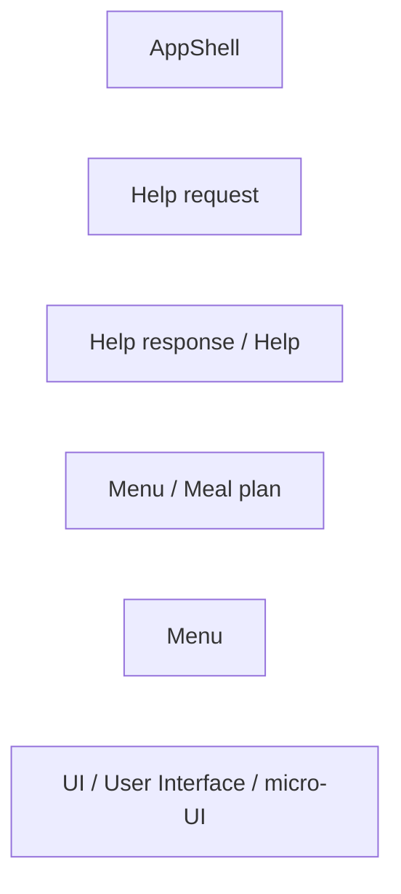

# Larder — ADR & Principles knowledge graph (seed, 2026-09-15)

## Register

| Artifact | Type | Ingested | Nodes | Note |
|---|---|---|---|---|
| ADR0005-Orchestrator.md | ADRDocument | 2026-09-15 | 18 | Full-form; the only ADR with prose Key Architectural Drivers and the only one citing no principle. |
| LarderArchitecturalPrinciples.md | PrinciplesDocument | 2026-09-15 | 10 | 9 entries under 8 IDs (AP0005 used twice). All Adopted, all last amended 2026-09-10. |
| ADR0003-AsynchronousCommunication.md | ADRDocument | 2026-09-15 | 8 | Full-form. Context references an image ../09_ContextMap.jpg that was not supplied. |
| ADR0001-Monolith.md | ADRDocument | 2026-09-15 | 14 | Full-form: Decision / Context / Options considered (3) / Consequences table / Advice ('see meeting protocol'). |
| SadrsLarder.md — small ADR log | ADRLog | 2026-09-15 | 21 | 7 rows, SADR0001–SADR0007, one author (Junker), 2026-09-07 to 2026-09-11. Same IRIs as the project's existing graph. |
| ADR0004-SynchronousCommunicationViaMicroUi.md | ADRDocument | 2026-09-15 | 5 | Full-form. Filename says 'MicroUi', title says 'per UI'; body is about REST vs GraphQL vs WebHooks. |
| ADR0002-Database.md | ADRDocument | 2026-09-15 | 4 | Full-form, same shape as ADR0001. |

> **45 of 56 nodes rest on a single artifact.** Read every lens with that in mind: a graph is only as corroborated as this line says it is.


## Lens — strategy

*What are we trying to change, in whom, and what would do it?*

```mermaid
flowchart RL
```


## Lens — capability

*What do we build, buy, and depend on?*

_No capabilities in the graph yet._


## Lens — language

*What do we call things, and where does the word change?*



`?` on a cardinality means it was derived, not drawn.


## Lens — flow

*What happens, in what order, and who is involved?*

```mermaid
flowchart LR
```


## Lens — traceability

*Whatever happened to that idea? — and, backwards, why are we building this?*

```mermaid
flowchart LR
  Q_MealPlanCorresponds_SADR0003["Dinner has 1 Menu, Menu has 1..* Course, Course con…"]
  Q_MealPlanCorresponds_SADR0002["Dinner has 1 Menu, Menu has 1..* Course, Course con…"]
  Q_MealPlanCorresponds_SADR0003 -.->|proposedSameAs| Q_MealPlanCorresponds_SADR0002
  Ctx_GrandmaAvatarAI["Grandma Avatar AI"]
  Act_GrandmaAvatar["Grandma Avatar"]
  Ctx_GrandmaAvatarAI -->|mentions| Act_GrandmaAvatar
  D_ADR0003["Using Asynchronous Communication"]
  D_ADR0003 -->|mentions| Act_GrandmaAvatar
  D_SADR0001["Chef needs to be accessed exclusively"]
  D_SADR0001 -->|mentions| Act_GrandmaAvatar
  Prin_AP0005b_MicroUIs["Micro-UIs"]
  Con_UserInterface["UI"]
  Prin_AP0005b_MicroUIs -->|mentions| Con_UserInterface
  Prin_AP0006_SyncForUIs["Synchronous communication for UIs"]
  Prin_AP0006_SyncForUIs -->|mentions| Con_UserInterface
  D_ADR0004["Synchronous Communication per UI"]
  D_ADR0004 -->|mentions| Con_UserInterface
  D_ADR0005["Orchestrator UI"]
  D_ADR0005 -->|mentions| Con_UserInterface
  Q_OrchestratorAggregationReadsWhat["When the orchestrator 'synthesizes live data' from …"]
  Ctx_RecipeCatalog["Recipe Catalog"]
  Q_OrchestratorAggregationReadsWhat -->|mentions| Ctx_RecipeCatalog
  D_ADR0001["Using Monolith"]
  D_ADR0001 -->|mentions| Ctx_RecipeCatalog
  D_ADR0005 -->|mentions| Ctx_RecipeCatalog
  Ctx_MealPreparation["Meal Preparation"]
  Q_OrchestratorAggregationReadsWhat -->|mentions| Ctx_MealPreparation
  D_ADR0001 -->|mentions| Ctx_MealPreparation
  D_ADR0005 -->|mentions| Ctx_MealPreparation
  D_SADR0003["Menu"]
  D_SADR0003 -->|mentions| Ctx_MealPreparation
  Ctx_CookingAssistance["Cooking Assistance"]
  Q_OrchestratorAggregationReadsWhat -->|mentions| Ctx_CookingAssistance
  D_ADR0001 -->|mentions| Ctx_CookingAssistance
  D_ADR0003 -->|mentions| Ctx_CookingAssistance
  D_ADR0005 -->|mentions| Ctx_CookingAssistance
  D_SADR0003 -->|mentions| Ctx_CookingAssistance
  Q_ModulesOnlyInADR0005["Paywall for Premium Content and Ads Management appe…"]
  Ctx_PaywallForPremiumContent["Paywall for Premium Content"]
  Q_ModulesOnlyInADR0005 -->|mentions| Ctx_PaywallForPremiumContent
  D_ADR0005 -->|mentions| Ctx_PaywallForPremiumContent
  Ctx_AdsManagement["Ads Management"]
  Q_ModulesOnlyInADR0005 -->|mentions| Ctx_AdsManagement
  D_ADR0005 -->|mentions| Ctx_AdsManagement
  Ctx_MealPlanning["Meal Planning"]
  D_ADR0001 -->|mentions| Ctx_MealPlanning
  D_SADR0003 -->|mentions| Ctx_MealPlanning
  Ctx_CookProfile["Cook Profile"]
  D_ADR0001 -->|mentions| Ctx_CookProfile
  D_ADR0001 -->|mentions| Ctx_GrandmaAvatarAI
  D_ADR0003 -->|mentions| Ctx_GrandmaAvatarAI
  D_ADR0005 -->|mentions| Ctx_GrandmaAvatarAI
  Ctx_Notification["Notification"]
  D_ADR0001 -->|mentions| Ctx_Notification
  D_ADR0003 -->|mentions| Ctx_Notification
  D_ADR0005 -->|mentions| Ctx_Notification
  Ctx_Media["Media"]
  D_ADR0001 -->|mentions| Ctx_Media
  D_ADR0005 -->|mentions| Ctx_Media
  Ctx_ConsentManagement["Consent Management"]
  D_ADR0001 -->|mentions| Ctx_ConsentManagement
  D_ADR0005 -->|mentions| Ctx_ConsentManagement
  Ctx_Sharing["Sharing"]
  D_ADR0001 -->|mentions| Ctx_Sharing
  D_ADR0005 -->|mentions| Ctx_Sharing
  Con_AppShell["AppShell"]
  D_ADR0005 -->|mentions| Con_AppShell
  Act_Chef["Chef"]
  D_ADR0005 -->|mentions| Act_Chef
  D_SADR0001 -->|mentions| Act_Chef
  Act_Community["Community"]
  D_SADR0001 -->|mentions| Act_Community
  Con_HelpRequest["Help request"]
  D_SADR0001 -->|mentions| Con_HelpRequest
  D_SADR0004["Help"]
  D_SADR0004 -->|mentions| Con_HelpRequest
  D_SADR0002["Meal Plan"]
  Con_MealPlan["Menu"]
  D_SADR0002 -->|mentions| Con_MealPlan
  D_SADR0003 -->|mentions| Con_MealPlan
  Con_Menu["Menu"]
  D_SADR0002 -->|mentions| Con_Menu
  D_SADR0003 -->|mentions| Con_Menu
  Con_HelpResponse["Help response"]
  D_SADR0004 -->|mentions| Con_HelpResponse
  Q_DeploymentShape_ADR0001["Which deployment shape do Larder's Bounded Contexts…"]
  D_ADR0001 -->|answers| Q_DeploymentShape_ADR0001
  D_ADR0002["Using One Database Instance"]
  Q_DatabaseArrangement_ADR0002["How are the modules' databases arranged — one insta…"]
  D_ADR0002 -->|answers| Q_DatabaseArrangement_ADR0002
  Q_AssistanceBordersCommunication_ADR0003["How do Cooking Assistance ↔ Notification and Cookin…"]
  D_ADR0003 -->|answers| Q_AssistanceBordersCommunication_ADR0003
  Q_UICommunication_ADR0004["How do the user interfaces communicate with the Bou…"]
  D_ADR0004 -->|answers| Q_UICommunication_ADR0004
  Q_MicroUIComposition_ADR0005["How are the Bounded Contexts' micro-UIs composed in…"]
  D_ADR0005 -->|answers| Q_MicroUIComposition_ADR0005
  Q_HelpRequestAddressedToWhom_SADR0001["A Help Request is 'at 1 Grandma Avatar' and 'at 1 C…"]
  D_SADR0001 -->|answers| Q_HelpRequestAddressedToWhom_SADR0001
  D_SADR0002 -->|answers| Q_MealPlanCorresponds_SADR0002
  D_SADR0003 -->|answers| Q_MealPlanCorresponds_SADR0002
  D_SADR0003 -->|answers| Q_MealPlanCorresponds_SADR0003
  Q_HelpSameTerm_SADR0004["In the glossary 'Help' is the response (provided, c…"]
  D_SADR0004 -->|answers| Q_HelpSameTerm_SADR0004
  D_SADR0005["Visual Glossary with Legend"]
  Q_GlossaryLegend_SADR0005["What do the glossary's blue, green and grey boxes a…"]
  D_SADR0005 -->|answers| Q_GlossaryLegend_SADR0005
  D_SADR0006["Brainstorming with Legend"]
  Q_BrainstormLegend_SADR0006["What does the blue sticky colour on the brainstorm …"]
  D_SADR0006 -->|answers| Q_BrainstormLegend_SADR0006
  D_SADR0007["Capability Map with Legend"]
  Q_CapabilityMapLegend_SADR0007["What do the small ▲ on Member management and ▶ besi…"]
  D_SADR0007 -->|answers| Q_CapabilityMapLegend_SADR0007
```



Dotted edges are **proposed**, not confirmed.


## Findings


### Claims on record

Asserted by an artifact, with a date. Where a subject carries two different claims, both stand and the dates are the story.

- `Orchestrator UI` — **https://w3id.org/dkg/graph/larder#Prin_AP0005b_MicroUIs** (ADR0005-Orchestrator.md, 2026-09-15)
- `Synchronous Communication per UI` — **https://w3id.org/dkg/graph/larder#Prin_AP0008_FineGrainedAccessRights** (ADR0004-SynchronousCommunicationViaMicroUi.md, 2026-09-15); **https://w3id.org/dkg/graph/larder#Prin_AP0006_SyncForUIs** (ADR0004-SynchronousCommunicationViaMicroUi.md, 2026-09-15) ← **changed**
- `Using Asynchronous Communication` — **https://w3id.org/dkg/graph/larder#Prin_AP0003_UsingDDD** (ADR0003-AsynchronousCommunication.md, 2026-09-15); **https://w3id.org/dkg/graph/larder#Prin_AP0002_AsyncBetweenContexts** (ADR0003-AsynchronousCommunication.md, 2026-09-15) ← **changed**
- `Using Monolith` — **https://w3id.org/dkg/graph/larder#Prin_AP0001_MonolithBeforeMicroservices** (ADR0001-Monolith.md, 2026-09-15); **https://w3id.org/dkg/graph/larder#Prin_AP0003_UsingDDD** (ADR0001-Monolith.md, 2026-09-15) ← **changed**
- `Using One Database Instance` — **https://w3id.org/dkg/graph/larder#Prin_AP0001_MonolithBeforeMicroservices** (ADR0002-Database.md, 2026-09-15); **https://w3id.org/dkg/graph/larder#Prin_AP0003_UsingDDD** (ADR0002-Database.md, 2026-09-15) ← **changed**

### Merges awaiting a decision

- `Dinner has 1 Menu, Menu has 1..* Course, Course contains 1..* Meal, Meal with 1 Recipe — which of these does the board's 'Meal plan' correspond to?` ~ `Dinner has 1 Menu, Menu has 1..* Course, Course contains 1..* Meal, Meal with 1 Recipe — which of these does the board's 'Meal plan' correspond to?` — Identical Question text to SADR0002 — the log re-deciding the same doubt.

### Worth a second look

- `Orchestrator UI` — 25 edges, but only one artifact says it exists
- `Using Monolith` — 24 edges, but only one artifact says it exists
- `Using Asynchronous Communication` — 16 edges, but only one artifact says it exists
- `Using One Database Instance` — 16 edges, but only one artifact says it exists
- `Monolith before Microservices` — 13 edges, but only one artifact says it exists
- `Using DDD` — 13 edges, but only one artifact says it exists
- `Synchronous Communication per UI` — 13 edges, but only one artifact says it exists
- `Micro-UIs` — 11 edges, but only one artifact says it exists
- `Synchronous communication for UIs` — 11 edges, but only one artifact says it exists
- `Fine grained access rights` — 10 edges, but only one artifact says it exists
- `Asynchronous Communication before Synchronous` — 10 edges, but only one artifact says it exists
- `Menu` — 10 edges, but only one artifact says it exists
- `Automatic Testing` — 7 edges, but only one artifact says it exists
- `Using Residuality` — 7 edges, but only one artifact says it exists
- `Chef needs to be accessed exclusively` — 7 edges, but only one artifact says it exists
- `Monitoring` — 7 edges, but only one artifact says it exists
- `Meal Plan` — 6 edges, but only one artifact says it exists
- `Help` — 5 edges, but only one artifact says it exists
- `As_ADR0001_honors_AP0003` — 4 edges, but only one artifact says it exists
- `As_ADR0002_honors_AP0001` — 4 edges, but only one artifact says it exists
- `As_ADR0003_honors_AP0002` — 4 edges, but only one artifact says it exists
- `As_ADR0003_honors_AP0003` — 4 edges, but only one artifact says it exists
- `As_ADR0005_overrides_AP0005b` — 4 edges, but only one artifact says it exists
- `When the orchestrator 'synthesizes live data' from Recipe Catalog, Meal Preparation and Cooking Assistance, does it read published read models or query each context live? Live queries would engage AP0002.` — 4 edges, but only one artifact says it exists
- `As_ADR0001_honors_AP0001` — 4 edges, but only one artifact says it exists
- `As_ADR0004_honors_AP0008` — 4 edges, but only one artifact says it exists
- `As_ADR0004_honors_AP0006` — 4 edges, but only one artifact says it exists
- `As_ADR0002_honors_AP0003` — 4 edges, but only one artifact says it exists


---

A graph shows what the artifacts *said*. It has no opinion on whether they were right, and a densely connected node is popular, not important.
