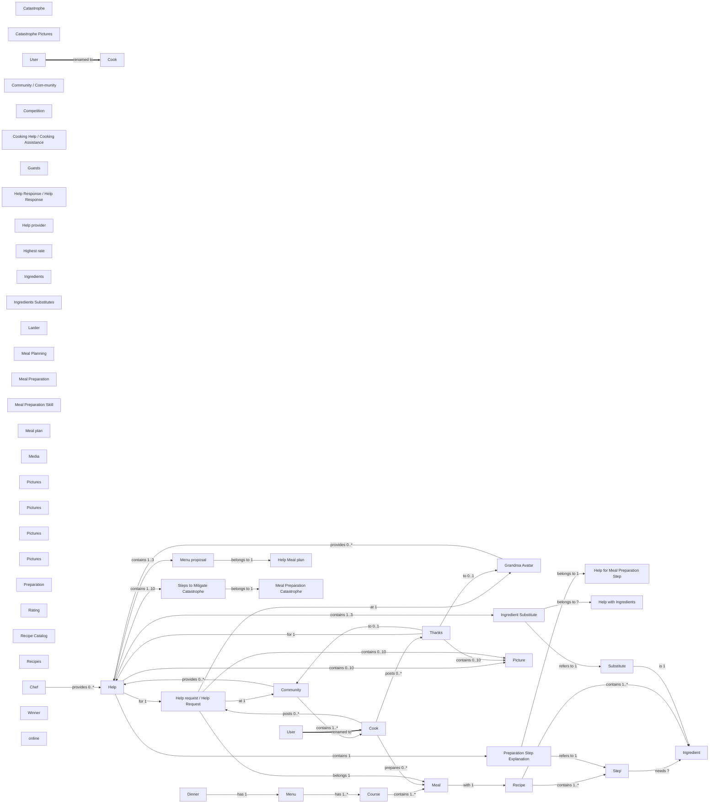

# Larder (Community Cooking) — domain knowledge graph

## Register

| Artifact | Type | Ingested | Nodes | Note |
|---|---|---|---|---|
| Domain Story — Cook asks Chef to plan dinner (DomainStoryAskChef.jpg) | DomainStory | 2026-09-10 | 28 | 8 clauses after splitting compound sentences. |
| Domain Story — Cook asks Grandma Avatar during preparation (II) (DomainStoryGra… | DomainStory | 2026-09-10 | 28 | 9 clauses after splitting compound sentences. |
| Larder Business Model Canvas (BusinessModelCanvasEnhanced.jpg) | BusinessModelCanvas | 2026-09-10 | 30 | 9 blocks, 26 stickies, none empty, no inter-block lines. 4 blue stickies of unconfirmed meaning. |
| Larder impact map (ImpactMappingWithAiStep3.jpg) | ImpactMap | 2026-09-10 | 42 | 1 goal, 9 actors, 14 impacts, 16 deliverables with priority numbers 1–3. |
| Domain Story — Cook asks Community about ingredients (DomainStoryAskCommunity.j… | DomainStory | 2026-09-10 | 24 | 8 clauses after splitting compound sentences. |
| Larder Wardley map (WardleyMapEvolution.jpg) | WardleyMap | 2026-09-10 | 37 | 4 users, 7 needs, 24 components. No movement arrows, no inertia marks, no pipelines. |
| Larder brainstorm — mind map (BrainstormingConvergence.jpg) | Brainstorm | 2026-09-10 | 51 | 11 clusters, 42 idea stickies, 8 in a second (blue) colour of unconfirmed meaning, 0 illegible, no votes. |
| Domain Story — Competition (DomainStoryCompetition.jpg) | DomainStory | 2026-09-10 | 34 | 10 clauses after splitting compound sentences. |
| Community Cooking visual glossary (VisualGlossaryEnhanced.jpg) | VisualGlossary | 2026-09-10 | 66 | 25 terms, 36 relationships, 7 is-a edges; no entity/value-object markings; colour groups unlabelled. |
| Community Cooking EventStorming board, with bounded contexts (EventStormingWith… | EventStormingBoard | 2026-09-10 | 63 | 21 event stickies in three rows, 9 bubbles carrying 7 distinct names; no states, hotspots, policies or aggregates. |
| Domain Story — Cook, Grandma Avatar and the burnt meal (DomainStoryGrandma.jpg) | DomainStory | 2026-09-10 | 28 | 9 clauses after splitting compound sentences. |
| Larder capability map (CapabilityMapStep3.jpg) | CapabilityMap | 2026-09-10 | 40 | 5 level-1, 16 level-2, all 16 marked core/supporting/generic via a drawn legend. |

> **358 of 384 nodes rest on a single artifact.** Read every lens with that in mind: a graph is only as corroborated as this line says it is.


## Lens — strategy

*What are we trying to change, in whom, and what would do it?*

```mermaid
flowchart RL
  Imp_FollowsDietryPlans["follows dietry plans"]
  Goal_LarderPayingMembers(["Larder - recipe sharing platform with min. 2,500 pa…"])
  Imp_FollowsDietryPlans -->|towardsGoal| Goal_LarderPayingMembers
  Imp_ShopEasilyWithDiscount["Shop easily ingredients and tools with discount"]
  Imp_ShopEasilyWithDiscount -->|towardsGoal| Goal_LarderPayingMembers
  Imp_UseOfCommunitySharedRecipes["Use of community shared recipes"]
  Imp_UseOfCommunitySharedRecipes -->|towardsGoal| Goal_LarderPayingMembers
  Imp_FindEasilyRecipes["Find easily recipes"]
  Imp_FindEasilyRecipes -->|towardsGoal| Goal_LarderPayingMembers
  Imp_SupportsUnexperiencedMembers["supports unexperienced members"]
  Imp_SupportsUnexperiencedMembers -->|towardsGoal| Goal_LarderPayingMembers
  Imp_UseEffectiveLimitedBudget["Use effective limited budget"]
  Imp_UseEffectiveLimitedBudget -->|towardsGoal| Goal_LarderPayingMembers
  Imp_LearnCooking["Learn cooking"]
  Imp_LearnCooking -->|towardsGoal| Goal_LarderPayingMembers
  Imp_PublishTheirOwnCookbook["Publish their own cookbook"]
  Imp_PublishTheirOwnCookbook -->|towardsGoal| Goal_LarderPayingMembers
  Imp_CookbooksMakeCurious["Cookbooks make curious"]
  Imp_CookbooksMakeCurious -->|towardsGoal| Goal_LarderPayingMembers
  Imp_FollowCooks["Follow cooks"]
  Imp_FollowCooks -->|towardsGoal| Goal_LarderPayingMembers
  Imp_ConvertToPaidPlan["convert to paid plan"]
  Imp_ConvertToPaidPlan -->|towardsGoal| Goal_LarderPayingMembers
  Imp_PaidMemberRenews["paid member renews"]
  Imp_PaidMemberRenews -->|towardsGoal| Goal_LarderPayingMembers
  Imp_SeePremiumContent["see premium content"]
  Imp_SeePremiumContent -->|towardsGoal| Goal_LarderPayingMembers
  Imp_PayForAds["pay for ads"]
  Imp_PayForAds -->|towardsGoal| Goal_LarderPayingMembers
  Act_Propects["Propects"]
  Imp_ConvertToPaidPlan -->|impactedActor| Act_Propects
  Act_Convertable["Convertable"]
  Imp_PaidMemberRenews -->|impactedActor| Act_Convertable
  Act_CookAsAuthor["Cook as author"]
  Imp_PublishTheirOwnCookbook -->|impactedActor| Act_CookAsAuthor
  Act_Single["Single"]
  Imp_ShopEasilyWithDiscount -->|impactedActor| Act_Single
  Imp_FollowsDietryPlans -->|impactedActor| Act_Single
  Act_YoungFamily["Young family"]
  Imp_ShopEasilyWithDiscount -->|impactedActor| Act_YoungFamily
  Imp_FollowsDietryPlans -->|impactedActor| Act_YoungFamily
  Act_KitchenWareRetailer["Kitchen ware retailer"]
  Imp_PayForAds -->|impactedActor| Act_KitchenWareRetailer
  Act_GroceryStore["Grocery store"]
  Imp_PayForAds -->|impactedActor| Act_GroceryStore
  Act_PhotoBookService["Photo book service"]
  Imp_PayForAds -->|impactedActor| Act_PhotoBookService
  Del_NutritionRequirementManagement["Nutrition requirement management"]
  Del_NutritionRequirementManagement -->|realises| Imp_FollowsDietryPlans
  Del_DirectOrdering["Direct ordering"]
  Del_DirectOrdering -->|realises| Imp_ShopEasilyWithDiscount
  Del_KitchenToolOrdering["Kitchen tool ordering"]
  Del_KitchenToolOrdering -->|realises| Imp_ShopEasilyWithDiscount
  Del_CookingClub["Cooking club"]
  Del_CookingClub -->|realises| Imp_UseOfCommunitySharedRecipes
  Del_MealChooser["Meal Chooser"]
  Del_MealChooser -->|realises| Imp_UseEffectiveLimitedBudget
  Del_AIProposals["AI proposals"]
  Del_AIProposals -->|realises| Imp_UseEffectiveLimitedBudget
  Del_Timer["Timer"]
  Del_Timer -->|realises| Imp_LearnCooking
  Del_GrandmaGrandpaAI["Grandma / Grandpa AI"]
  Del_GrandmaGrandpaAI -->|realises| Imp_LearnCooking
  Del_GrandmaGrandpaAI -->|realises| Imp_SupportsUnexperiencedMembers
  Del_CookbookPublishing["Cookbook publishing"]
  Del_CookbookPublishing -->|realises| Imp_PublishTheirOwnCookbook
  Del_MemberManagement["Member management"]
  Del_MemberManagement -->|realises| Imp_ConvertToPaidPlan
  Del_MemberManagement -->|realises| Imp_PaidMemberRenews
  Del_PaywallForPremiumContent["Paywall for premium content"]
  Del_PaywallForPremiumContent -->|realises| Imp_SeePremiumContent
  Del_AdsManagement["Ads management"]
  Del_AdsManagement -->|realises| Imp_PayForAds
  Cap_AskGrandmaGrandpa["Ask Grandma / Grandpa"]
  Goal_BetterCookingSkills["Better cooking skills"]
  Cap_AskGrandmaGrandpa -->|supports| Goal_BetterCookingSkills
  Cap_AskChef["Ask chef"]
  Cap_AskChef -->|supports| Goal_BetterCookingSkills
  Cap_Competitions["Competitions"]
  Cap_Competitions -->|supports| Goal_BetterCookingSkills
  Cap_AskCommunity["Ask community"]
  Cap_AskCommunity -->|supports| Goal_BetterCookingSkills
  Cap_Refrigerator["Refrigerator"]
  Goal_EfficientUsageOfGroceries["Efficient usage of groceries"]
  Cap_Refrigerator -->|supports| Goal_EfficientUsageOfGroceries
  Cap_Nutrition["Nutrition"]
  Goal_SearchRecipesWithNutritionMeals["Search recipes with nutrition, meals, ..."]
  Cap_Nutrition -->|supports| Goal_SearchRecipesWithNutritionMeals
  Cap_Meal["Meal"]
  Cap_Meal -->|supports| Goal_SearchRecipesWithNutritionMeals
  Cap_AdvancedSearch["Advanced Search"]
  Cap_AdvancedSearch -->|supports| Goal_SearchRecipesWithNutritionMeals
  Cap_WriteRecipe["Write recipe"]
  Goal_CreateContent["Create content"]
  Cap_WriteRecipe -->|supports| Goal_CreateContent
  Cap_UploadMedia["Upload media"]
  Cap_UploadMedia -->|supports| Goal_CreateContent
  Cap_Timer["Timer"]
  Goal_SupportCooking["Support cooking"]
  Cap_Timer -->|supports| Goal_SupportCooking
  Cap_FreeHandControl["Free hand control"]
  Cap_FreeHandControl -->|supports| Goal_SupportCooking
  Cap_MemberManagement["Member Management"]
  Goal_BecomeAMember["Become a member"]
  Cap_MemberManagement -->|supports| Goal_BecomeAMember
  Cap_RateContent["Rate content"]
  Goal_RateContent["Rate content"]
  Cap_RateContent -->|supports| Goal_RateContent
```



**Goals with no metric:** `Become a member`, `Better cooking skills`, `Create content`, `Efficient usage of groceries`, `Rate content`, `Search recipes with nutrition, meals, ...`, `Support cooking`


## Lens — capability

*What do we build, buy, and depend on?*

```mermaid
flowchart LR
  subgraph custom_built["custom-built"]
    Cap_Competitions["Competitions"]
    Cap_AskCommunity["Ask community"]
    Cap_AskChef["Ask chef"]
    Cap_AdvancedSearch["Advanced Search"]
    Cap_AskGrandmaGrandpa["Ask Grandma / Grandpa"]
    Cap_SpecificAI["Specific AI"]
  end
  subgraph product["product"]
    Cap_Meal["Meal"]
    Cap_RatingDatabase["Rating Database"]
    Cap_RecipeDatabase["Recipe database"]
    Cap_Refrigerator["Refrigerator"]
    Cap_RateContent["Rate content"]
    Cap_Nutrition["Nutrition"]
  end
  subgraph commodity["commodity"]
    Cap_Cloud["Cloud"]
    Cap_WriteRecipe["Write recipe · https://w3id.org/dkg/ns#Commodity"]
    Cap_GenAI["Gen AI"]
    Cap_Chat["Chat"]
    Cap_FreeHandControl["Free hand control"]
    Cap_Timer["Timer"]
    Cap_IDM["IDM"]
    Cap_UploadMedia["Upload media"]
    Cap_RemoteMeeting["Remote meeting"]
    Cap_MemberManagement["Member Management"]
    Cap_Mobile["Mobile"]
    Cap_MediaStorage["Media Storage"]
  end
  subgraph unplaced["unplaced"]
    Cap_AdsManagement_CM["Ads management · generic"]
    Cap_CookingAids_CM["Cooking aids · generic"]
    Cap_CookingSupport_L1["Cooking Support"]
    Cap_Sharing_L1["Sharing"]
    Cap_Rating_CM["Rating · supporting"]
    Cap_FamousChefsPartner_CM["Famous chefs partner · core"]
    Cap_ContentCreation["Content Creation"]
    Cap_PaywallForPremiumContent_CM["Paywall for premium content · generic"]
    Cap_CommunityEngagement_CM["Community Engagement · core"]
    Cap_Cooking_L1["Cooking"]
    Cap_ContentCreation_CM["Content Creation · core"]
    Cap_CookbookPublishing_CM["Cookbook publishing · supporting"]
    Cap_MealChooser_CM["Meal Chooser · supporting"]
    Cap_KitchenToolOrdering_CM["Kitchen tool ordering · generic"]
    Cap_Planner_CM["Planner · supporting"]
    Cap_NutritionRequirementManagement_CM["Nutrition requirement management · supporting"]
    Cap_DirectOrdering_CM["Direct ordering · generic"]
    Cap_ContentRating["Content Rating"]
    Cap_MemberManagement_CM["Member management · generic"]
    Cap_RecipeSearch["Recipe Search"]
    Cap_GrandmaGrandpa_CM["Grandma / Grandpa · core"]
    Cap_Rating_L1["Rating"]
    Cap_ProposalsBasedOnLarderEtc_CM["Proposals based on larder, etc. · core"]
    Cap_CookingSupport["Cooking Support"]
    Cap_Onboarding_L1["Onboarding"]
  end
  Cap_AskGrandmaGrandpa --> Cap_SpecificAI
  Cap_AdvancedSearch --> Cap_SpecificAI
  Cap_AskChef --> Cap_RemoteMeeting
  Cap_Competitions --> Cap_RemoteMeeting
  Cap_AskCommunity --> Cap_RemoteMeeting
  Cap_AskChef --> Cap_Chat
  Cap_Competitions --> Cap_Chat
  Cap_AskCommunity --> Cap_Chat
  Cap_Refrigerator --> Cap_RecipeDatabase
  Cap_Nutrition --> Cap_RecipeDatabase
  Cap_Meal --> Cap_RecipeDatabase
  Cap_WriteRecipe --> Cap_RecipeDatabase
  Cap_AdvancedSearch --> Cap_RecipeDatabase
  Cap_UploadMedia --> Cap_MediaStorage
  Cap_Timer --> Cap_Mobile
  Cap_FreeHandControl --> Cap_Mobile
  Cap_MemberManagement --> Cap_IDM
  Cap_RateContent --> Cap_RatingDatabase
  Cap_RemoteMeeting --> Cap_Cloud
  Cap_Chat --> Cap_Cloud
  Cap_IDM --> Cap_Cloud
  Cap_GenAI --> Cap_Cloud
  Cap_MediaStorage --> Cap_Cloud
  Cap_RecipeDatabase --> Cap_Cloud
  Cap_RatingDatabase --> Cap_Cloud
  Cap_SpecificAI --> Cap_GenAI
```



`unplaced` capabilities came from a canvas or capability map, which carry no evolution axis. Not a defect.


## Lens — language

*What do we call things, and where does the word change?*



`?` on a cardinality means it was derived, not drawn.


## Lens — flow

*What happens, in what order, and who is involved?*

```mermaid
flowchart LR
  subgraph Ctx_CookProfile["Cook Profile"]
    Ev_CookRegistered["Cook registered"]
  end
  subgraph Ctx_MealPlanning["Meal Planning"]
    Ev_DinnerPlanned["Dinner planned"]
    Ev_RecipesSearched["Recipes searched"]
    Ev_RecipeSelected["Recipe selected"]
    Ev_IngredientsMissing["Ingredients missing"]
    Ev_MealPlanningStalled["Meal planning stalled"]
    Ev_IngredientsSubstituted["Ingredients substituted"]
    Ev_PlanSetteled["plan setteled"]
  end
  subgraph Ctx_CookingAssistance["Cooking Assistance"]
    Ev_HelpRequested["Help requested"]
    Ev_HelpProvided["Help provided"]
  end
  subgraph Ctx_MealPreparation["Meal Preparation"]
    Ev_MealPreparationStarted["Meal preparation started"]
    Ev_StepUnclear["Step unclear"]
    Ev_CatastropheHappened["Catastrophe happened"]
    Ev_StepCompeted["Step competed"]
    Ev_MealRescued["Meal rescued"]
    Ev_MealPrepared["Meal prepared"]
  end
  subgraph Ctx_Media["Media"]
    Ev_PicturesTaken["Pictures taken"]
  end
  subgraph Ctx_Sharing["Sharing"]
    Ev_ThanksGiven["Thanks given"]
  end
  Ev_CookRegistered --> Ev_DinnerPlanned
  Ev_DinnerPlanned --> Ev_RecipesSearched
  Ev_RecipesSearched --> Ev_RecipeSelected
  Ev_RecipeSelected --> Ev_IngredientsMissing
  Ev_IngredientsMissing --> Ev_MealPlanningStalled
  Ev_MealPlanningStalled --> Ev_HelpRequested
  Ev_PicturesTaken --> Ev_HelpRequested
  Ev_HelpRequested --> Ev_HelpProvided
  Ev_HelpProvided --> Ev_IngredientsSubstituted
  Ev_IngredientsSubstituted --> Ev_PlanSetteled
  Ev_PlanSetteled --> Ev_MealPreparationStarted
  Ev_MealPreparationStarted --> Ev_StepUnclear
  Ev_StepUnclear --> Ev_CatastropheHappened
  Ev_CatastropheHappened --> Ev_PicturesTaken
  Ev_MealPrepared --> Ev_PicturesTaken
  Ev_HelpProvided --> Ev_StepCompeted
  Ev_StepCompeted --> Ev_MealRescued
  Ev_MealRescued --> Ev_MealPrepared
  Ev_PicturesTaken --> Ev_ThanksGiven
  Cmd_RegisterCook(["Register cook"]) -.-> Ev_CookRegistered
  Cmd_PlanDinner(["Plan dinner"]) -.-> Ev_DinnerPlanned
  Cmd_SearchRecipes(["Search recipes"]) -.-> Ev_RecipesSearched
  Cmd_SearchRecipes(["Search recipes"]) -.-> Ev_RecipeSelected
  Cmd_SearchIngredients(["Search Ingredients"]) -.-> Ev_IngredientsMissing
  Cmd_PrepareMeal(["Prepare meal"]) -.-> Ev_MealPlanningStalled
  Cmd_PrepareMeal(["Prepare meal"]) -.-> Ev_MealPreparationStarted
  Cmd_PrepareMeal(["Prepare meal"]) -.-> Ev_StepUnclear
  Cmd_PrepareMeal(["Prepare meal"]) -.-> Ev_CatastropheHappened
  Cmd_PrepareMeal(["Prepare meal"]) -.-> Ev_StepCompeted
  Cmd_PrepareMeal(["Prepare meal"]) -.-> Ev_MealRescued
  Cmd_PrepareMeal(["Prepare meal"]) -.-> Ev_MealPrepared
  Cmd_RequestHelp(["Request help"]) -.-> Ev_HelpRequested
  Cmd_RequestHelp(["Request help"]) -.-> Ev_HelpProvided
  Cmd_ProvideHelp(["Provide help"]) -.-> Ev_HelpProvided
  Cmd_SubstituteIngredients(["Substitute ingredients"]) -.-> Ev_IngredientsSubstituted
  Cmd_PlanMeal(["Plan meal"]) -.-> Ev_PlanSetteled
  Cmd_TakePictures(["Take pictures"]) -.-> Ev_PicturesTaken
  Cmd_ProvideThanks(["Provide thanks"]) -.-> Ev_ThanksGiven
```




## Lens — traceability

*Whatever happened to that idea? — and, backwards, why are we building this?*

```mermaid
flowchart LR
  Idea_CookingClub["Cooking Club"]
  Del_CookingClub["Cooking club"]
  Idea_CookingClub -.->|proposedSameAs| Del_CookingClub
  Cap_CommunityEngagement_CM["Community Engagement"]
  Cap_CommunityEngagement_CM -.->|proposedSameAs| Del_CookingClub
  Idea_Timer["Timer"]
  Del_Timer["Timer"]
  Idea_Timer -.->|proposedSameAs| Del_Timer
  Cap_Timer["Timer"]
  Cap_Timer -.->|proposedSameAs| Del_Timer
  Idea_MealChooser["Meal Chooser"]
  Del_MealChooser["Meal Chooser"]
  Idea_MealChooser -.->|proposedSameAs| Del_MealChooser
  Cap_MealChooser_CM["Meal Chooser"]
  Cap_MealChooser_CM -.->|proposedSameAs| Del_MealChooser
  Idea_CookbookPublishing["Cookbook publishing"]
  Del_CookbookPublishing["Cookbook publishing"]
  Idea_CookbookPublishing -.->|proposedSameAs| Del_CookbookPublishing
  Cap_CookbookPublishing_CM["Cookbook publishing"]
  Cap_CookbookPublishing_CM -.->|proposedSameAs| Del_CookbookPublishing
  Idea_Rating["Rating"]
  Del_Rating["Rating"]
  Idea_Rating -.->|proposedSameAs| Del_Rating
  Cap_RateContent["Rate content"]
  Cap_RateContent -.->|proposedSameAs| Del_Rating
  Cap_Rating_CM["Rating"]
  Cap_Rating_CM -.->|proposedSameAs| Del_Rating
  Con_Rating["Rating"]
  Con_Rating -.->|proposedSameAs| Del_Rating
  Idea_DietaryRequirements["Dietary requirements"]
  Del_NutritionRequirementManagement["Nutrition requirement management"]
  Idea_DietaryRequirements -.->|proposedSameAs| Del_NutritionRequirementManagement
  Cap_Nutrition["Nutrition"]
  Cap_Nutrition -.->|proposedSameAs| Del_NutritionRequirementManagement
  VP_RecipesForSpecializedNutritionRequirements["Recipes for specialized nutrition requirements"]
  VP_RecipesForSpecializedNutritionRequirements -.->|proposedSameAs| Del_NutritionRequirementManagement
  Cap_NutritionRequirementManagement_CM["Nutrition requirement management"]
  Cap_NutritionRequirementManagement_CM -.->|proposedSameAs| Del_NutritionRequirementManagement
  Idea_OrderIngredientsDirectly["Order ingredients directly"]
  Del_DirectOrdering["Direct ordering"]
  Idea_OrderIngredientsDirectly -.->|proposedSameAs| Del_DirectOrdering
  Cap_DirectOrdering_CM["Direct ordering"]
  Cap_DirectOrdering_CM -.->|proposedSameAs| Del_DirectOrdering
  Idea_KitchenTools["Kitchen tools"]
  Del_KitchenToolOrdering["Kitchen tool ordering"]
  Idea_KitchenTools -.->|proposedSameAs| Del_KitchenToolOrdering
  Cap_KitchenToolOrdering_CM["Kitchen tool ordering"]
  Cap_KitchenToolOrdering_CM -.->|proposedSameAs| Del_KitchenToolOrdering
  Idea_FamousChefsAsPartner["Famous chefs as partner"]
  Del_FamousChefsPartner["Famous chefs partner"]
  Idea_FamousChefsAsPartner -.->|proposedSameAs| Del_FamousChefsPartner
  Cap_FamousChefsPartner_CM["Famous chefs partner"]
  Cap_FamousChefsPartner_CM -.->|proposedSameAs| Del_FamousChefsPartner
  Act_ChefsAsSeniorPartner["Chefs as senior partner"]
  Idea_FamousChefsAsPartner -.->|proposedSameAs| Act_ChefsAsSeniorPartner
  Cap_AskChef["Ask chef"]
  Cap_AskChef -.->|proposedSameAs| Act_ChefsAsSeniorPartner
  Act_Chefs["Chefs"]
  Act_Chefs -.->|proposedSameAs| Act_ChefsAsSeniorPartner
  Act_Chef["Chef"]
  Act_Chef -.->|proposedSameAs| Act_ChefsAsSeniorPartner
  Idea_AskGrandma["Ask grandma"]
  Del_GrandmaGrandpaAI["Grandma / Grandpa AI"]
  Idea_AskGrandma -.->|proposedSameAs| Del_GrandmaGrandpaAI
  Idea_GrandpaShowsHowToDoIt["Grandpa shows how to do it"]
  Idea_GrandpaShowsHowToDoIt -.->|proposedSameAs| Del_GrandmaGrandpaAI
  Cap_AskGrandmaGrandpa["Ask Grandma / Grandpa"]
  Cap_AskGrandmaGrandpa -.->|proposedSameAs| Del_GrandmaGrandpaAI
  Cap_GrandmaGrandpa_CM["Grandma / Grandpa"]
  Cap_GrandmaGrandpa_CM -.->|proposedSameAs| Del_GrandmaGrandpaAI
  Act_GrandmaAvatar["Grandma Avatar"]
  Act_GrandmaAvatar -.->|proposedSameAs| Del_GrandmaGrandpaAI
  Idea_DinnerPartyPlanner["Dinner-party planner"]
  Del_Planner["Planner"]
  Idea_DinnerPartyPlanner -.->|proposedSameAs| Del_Planner
  VP_Planner["Planner"]
  VP_Planner -.->|proposedSameAs| Del_Planner
  Cap_Planner_CM["Planner"]
  Cap_Planner_CM -.->|proposedSameAs| Del_Planner
  Con_MealPlan_ES["Meal plan"]
  Con_MealPlan_ES -.->|proposedSameAs| Del_Planner
  Idea_Budget["Budget"]
  Imp_UseEffectiveLimitedBudget["Use effective limited budget"]
  Idea_Budget -.->|proposedSameAs| Imp_UseEffectiveLimitedBudget
  Goal_EfficientUsageOfGroceries["Efficient usage of groceries"]
  Goal_EfficientUsageOfGroceries -.->|proposedSameAs| Imp_UseEffectiveLimitedBudget
  Idea_CookingSkillLearning["Cooking skill learning"]
  Imp_LearnCooking["Learn cooking"]
  Idea_CookingSkillLearning -.->|proposedSameAs| Imp_LearnCooking
  Goal_BetterCookingSkills["Better cooking skills"]
  Goal_BetterCookingSkills -.->|proposedSameAs| Imp_LearnCooking
  Idea_Followers["Followers"]
  Imp_FollowCooks["Follow cooks"]
  Idea_Followers -.->|proposedSameAs| Imp_FollowCooks
  Act_YoungFamilies["Young families"]
  Act_YoungFamily["Young family"]
  Act_YoungFamilies -.->|proposedSameAs| Act_YoungFamily
  Act_YoungFamilies_BMC["Young families"]
  Act_YoungFamilies_BMC -.->|proposedSameAs| Act_YoungFamily
  Act_ParentsInLaw["Parents in Law"]
  Act_ParentsInLaw -.->|proposedSameAs| Act_YoungFamily
  Act_Singles["Singles"]
  Act_Single["Single"]
  Act_Singles -.->|proposedSameAs| Act_Single
  Act_Singles_BMC["Singles"]
  Act_Singles_BMC -.->|proposedSameAs| Act_Single
  Act_Prospect["Prospect"]
  Act_Propects["Propects"]
  Act_Prospect -.->|proposedSameAs| Act_Propects
  Cap_Timer -.->|proposedSameAs| Idea_Timer
  Cap_MemberManagement["Member Management"]
  Del_MemberManagement["Member management"]
  Cap_MemberManagement -.->|proposedSameAs| Del_MemberManagement
  Cap_MemberManagement_CM["Member management"]
  Cap_MemberManagement_CM -.->|proposedSameAs| Del_MemberManagement
  Cap_AskGrandmaGrandpa -.->|proposedSameAs| Idea_AskGrandma
  Act_GrandmaAvatar -.->|proposedSameAs| Idea_AskGrandma
  Cap_Competitions["Competitions"]
  Idea_SponsorContest["Sponsor contest"]
  Cap_Competitions -.->|proposedSameAs| Idea_SponsorContest
  Con_Competition["Competition"]
  Con_Competition -.->|proposedSameAs| Idea_SponsorContest
  Cap_RateContent -.->|proposedSameAs| Idea_Rating
  Cap_Rating_CM -.->|proposedSameAs| Idea_Rating
  Con_Rating -.->|proposedSameAs| Idea_Rating
  Cap_Refrigerator["Refrigerator"]
  Idea_LarderTracker["Larder tracker"]
  Cap_Refrigerator -.->|proposedSameAs| Idea_LarderTracker
  Cap_ProposalsBasedOnLarderEtc_CM["Proposals based on larder, etc."]
  Cap_ProposalsBasedOnLarderEtc_CM -.->|proposedSameAs| Idea_LarderTracker
  Idea_SearchWithThingsIAlreadyHave["Search with things I already have"]
  Cap_Refrigerator -.->|proposedSameAs| Idea_SearchWithThingsIAlreadyHave
  Idea_FridgePhotoRecipeGeneration["Fridge-photo recipe generation"]
  Cap_Refrigerator -.->|proposedSameAs| Idea_FridgePhotoRecipeGeneration
  Cap_FreeHandControl["Free hand control"]
  Idea_VoiceControl["Voice control"]
  Cap_FreeHandControl -.->|proposedSameAs| Idea_VoiceControl
  Goal_SearchRecipesWithNutritionMeals["Search recipes with nutrition, meals, ..."]
  Imp_FindEasilyRecipes["Find easily recipes"]
  Goal_SearchRecipesWithNutritionMeals -.->|proposedSameAs| Imp_FindEasilyRecipes
  VP_EasyToFindRecipes["Easy to find recipes"]
  VP_EasyToFindRecipes -.->|proposedSameAs| Imp_FindEasilyRecipes
  Goal_BecomeAMember["Become a member"]
  Imp_ConvertToPaidPlan["convert to paid plan"]
  Goal_BecomeAMember -.->|proposedSameAs| Imp_ConvertToPaidPlan
  RS_MonthlyMemberFee["Monthly member fee"]
  RS_MonthlyMemberFee -.->|proposedSameAs| Imp_ConvertToPaidPlan
  Act_Singles_BMC -.->|proposedSameAs| Act_Singles
  Act_YoungFamilies_BMC -.->|proposedSameAs| Act_YoungFamilies
  Act_KitchenWareRetailer_BMC["Kitchen ware retailer"]
  Act_KitchenWareRetailer["Kitchen ware retailer"]
  Act_KitchenWareRetailer_BMC -.->|proposedSameAs| Act_KitchenWareRetailer
  Act_GroceryStores["Grocery stores"]
  Act_GroceryStore["Grocery store"]
  Act_GroceryStores -.->|proposedSameAs| Act_GroceryStore
  Act_PhotoBookService_BMC["Photo book service"]
  Act_PhotoBookService["Photo book service"]
  Act_PhotoBookService_BMC -.->|proposedSameAs| Act_PhotoBookService
  Act_Chefs -.->|proposedSameAs| Idea_FamousChefsAsPartner
  KR_Cooks["Cooks"]
  Act_HomeCook["Home cook"]
  KR_Cooks -.->|proposedSameAs| Act_HomeCook
  Act_Cook["Cook"]
  Act_Cook -.->|proposedSameAs| Act_HomeCook
  Cap_ContentCreation["Content Creation"]
  Cluster_ContentCreation["Content Creation"]
  Cap_ContentCreation -.->|proposedSameAs| Cluster_ContentCreation
  Cap_ContentCreation_CM["Content Creation"]
  Cap_ContentCreation_CM -.->|proposedSameAs| Cluster_ContentCreation
  Cap_ContentRating["Content Rating"]
  Cluster_ContentRating["Content Rating"]
  Cap_ContentRating -.->|proposedSameAs| Cluster_ContentRating
  Cap_CookingSupport["Cooking Support"]
  Cluster_CookingSupport["Cooking Support"]
  Cap_CookingSupport -.->|proposedSameAs| Cluster_CookingSupport
  Cap_CookingSupport_L1["Cooking Support"]
  Cap_CookingSupport_L1 -.->|proposedSameAs| Cluster_CookingSupport
  Goal_SupportCooking["Support cooking"]
  Cap_CookingSupport -.->|proposedSameAs| Goal_SupportCooking
  VP_CookingSupport["Cooking support"]
  Cap_CookingSupport -.->|proposedSameAs| VP_CookingSupport
  Ctx_CookingAssistance["Cooking Assistance"]
  Ctx_CookingAssistance -.->|proposedSameAs| VP_CookingSupport
  Cap_RecipeSearch["Recipe Search"]
  Cluster_RecipeSearch["Recipe Search"]
  Cap_RecipeSearch -.->|proposedSameAs| Cluster_RecipeSearch
  Cap_AdvancedSearch["Advanced Search"]
  Cap_RecipeSearch -.->|proposedSameAs| Cap_AdvancedSearch
  KR_AISearchSupport["AI search support"]
  KR_AISearchSupport -.->|proposedSameAs| Cap_AdvancedSearch
  Cmd_SearchRecipes["Search recipes"]
  Cmd_SearchRecipes -.->|proposedSameAs| Cap_AdvancedSearch
  VP_AIProposals["AI proposals"]
  Del_AIProposals["AI proposals"]
  VP_AIProposals -.->|proposedSameAs| Del_AIProposals
  Cap_ProposalsBasedOnLarderEtc_CM -.->|proposedSameAs| Del_AIProposals
  Con_MenuProposal_VG["Menu proposal"]
  Con_MenuProposal_VG -.->|proposedSameAs| Del_AIProposals
  Cluster_Planner["Planner"]
  VP_Planner -.->|proposedSameAs| Cluster_Planner
  Con_MealPlanning["Meal Planning"]
  Con_MealPlanning -.->|proposedSameAs| Cluster_Planner
  VP_EasyToFindRecipes -.->|proposedSameAs| Goal_SearchRecipesWithNutritionMeals
  Imp_FollowsDietryPlans["follows dietry plans"]
  VP_RecipesForSpecializedNutritionRequirements -.->|proposedSameAs| Imp_FollowsDietryPlans
  RS_AdsByPartners["Ads by partners"]
  Imp_PayForAds["pay for ads"]
  RS_AdsByPartners -.->|proposedSameAs| Imp_PayForAds
  Del_AdsManagement["Ads management"]
  RS_AdsByPartners -.->|proposedSameAs| Del_AdsManagement
  Cap_AdsManagement_CM["Ads management"]
  Cap_AdsManagement_CM -.->|proposedSameAs| Del_AdsManagement
  CR_Community["Community"]
  Cluster_Community["Community"]
  CR_Community -.->|proposedSameAs| Cluster_Community
  Cap_CommunityEngagement_CM -.->|proposedSameAs| Cluster_Community
  Act_Community["Community"]
  Act_Community -.->|proposedSameAs| Cluster_Community
  KR_Recipes["Recipes"]
  Cap_RecipeDatabase["Recipe database"]
  KR_Recipes -.->|proposedSameAs| Cap_RecipeDatabase
  Con_RecipeCatalog_ES["Recipe Catalog"]
  Con_RecipeCatalog_ES -.->|proposedSameAs| Cap_RecipeDatabase
  KR_Media["Media"]
  Cap_MediaStorage["Media Storage"]
  KR_Media -.->|proposedSameAs| Cap_MediaStorage
  Ctx_Media["Media"]
  Ctx_Media -.->|proposedSameAs| Cap_MediaStorage
  Cap_SpecificAI["Specific AI"]
  KR_AISearchSupport -.->|proposedSameAs| Cap_SpecificAI
  Cost_CloudService["Cloud service"]
  Cap_Cloud["Cloud"]
  Cost_CloudService -.->|proposedSameAs| Cap_Cloud
  Cap_FamousChefsPartner_CM -.->|proposedSameAs| Act_Chefs
  Act_Chef -.->|proposedSameAs| Act_Chefs
  Cap_FamousChefsPartner_CM -.->|proposedSameAs| Cap_AskChef
  Act_Chef -.->|proposedSameAs| Cap_AskChef
  Cap_MemberManagement_CM -.->|proposedSameAs| Cap_MemberManagement
  Cap_MealChooser_CM -.->|proposedSameAs| Idea_MealChooser
  Cap_ProposalsBasedOnLarderEtc_CM -.->|proposedSameAs| VP_AIProposals
  Con_MenuProposal_VG -.->|proposedSameAs| VP_AIProposals
  Cap_Planner_CM -.->|proposedSameAs| VP_Planner
  Con_MealPlanning -.->|proposedSameAs| VP_Planner
  Con_MealPlan_ES -.->|proposedSameAs| VP_Planner
  Cap_CommunityEngagement_CM -.->|proposedSameAs| CR_Community
  Act_Community -.->|proposedSameAs| CR_Community
  Cap_NutritionRequirementManagement_CM -.->|proposedSameAs| Cap_Nutrition
  Cap_CookingAids_CM["Cooking aids"]
  Cap_CookingAids_CM -.->|proposedSameAs| Cap_Timer
  Cap_CookingAids_CM -.->|proposedSameAs| Cap_FreeHandControl
  Cluster_Helper["Helper"]
  Cap_CookingAids_CM -.->|proposedSameAs| Cluster_Helper
  Cap_GrandmaGrandpa_CM -.->|proposedSameAs| Cap_AskGrandmaGrandpa
  Act_GrandmaAvatar -.->|proposedSameAs| Cap_AskGrandmaGrandpa
  Cap_ContentCreation_CM -.->|proposedSameAs| Cap_ContentCreation
  Cap_CookbookPublishing_CM -.->|proposedSameAs| Idea_CookbookPublishing
  Cap_PaywallForPremiumContent_CM["Paywall for premium content"]
  Del_PaywallForPremiumContent["Paywall for premium content"]
  Cap_PaywallForPremiumContent_CM -.->|proposedSameAs| Del_PaywallForPremiumContent
  Cap_Rating_CM -.->|proposedSameAs| Cap_RateContent
  Cap_Rating_CM -.->|proposedSameAs| Cap_ContentRating
  Cap_Rating_L1["Rating"]
  Cap_Rating_L1 -.->|proposedSameAs| Cap_ContentRating
  Cap_CookingSupport_L1 -.->|proposedSameAs| Cap_CookingSupport
  Ctx_CookingAssistance -.->|proposedSameAs| Cap_CookingSupport
  Cap_Sharing_L1["Sharing"]
  CR_DailyForSharing["Daily for sharing"]
  Cap_Sharing_L1 -.->|proposedSameAs| CR_DailyForSharing
  Cmd_Shares["shares"]
  Cmd_Shares -.->|proposedSameAs| CR_DailyForSharing
  Ctx_Sharing["Sharing"]
  Ctx_Sharing -.->|proposedSameAs| CR_DailyForSharing
  Cap_Onboarding_L1["Onboarding"]
  Cap_Onboarding_L1 -.->|proposedSameAs| Goal_BecomeAMember
  Ev_CookRegistered["Cook registered"]
  Ev_CookRegistered -.->|proposedSameAs| Goal_BecomeAMember
  Cluster_Authentication["Authentication"]
  Cap_Onboarding_L1 -.->|proposedSameAs| Cluster_Authentication
  Ctx_CookProfile["Cook Profile"]
  Ctx_CookProfile -.->|proposedSameAs| Cluster_Authentication
  Act_Grandma["Grandma"]
  Act_Grandma -.->|proposedSameAs| Act_GrandmaAvatar
  Con_HelpProvider_ES["Help provider"]
  Con_HelpProvider_ES -.->|proposedSameAs| Act_GrandmaAvatar
  Con_GrandmaAvatar_VG["Grandma Avatar"]
  Con_GrandmaAvatar_VG -.->|proposedSameAs| Act_GrandmaAvatar
  Act_Cooks["Cooks"]
  Act_OtherCooks["Other cooks"]
  Act_Cooks -.->|proposedSameAs| Act_OtherCooks
  Act_Cooks -.->|proposedSameAs| Act_Cook
  Con_Cook_ES["Cook"]
  Con_Cook_ES -.->|proposedSameAs| Act_Cook
  Act_Cook -.->|proposedSameAs| KR_Cooks
  Act_CookAsAuthor["Cook as author"]
  Act_Cook -.->|proposedSameAs| Act_CookAsAuthor
  Cap_AskCommunity["Ask community"]
  Act_Community -.->|proposedSameAs| Cap_AskCommunity
  Act_GrandmaAvatar -.->|proposedSameAs| Cap_GrandmaGrandpa_CM
  Con_CatastrophePictures["Catastrophe Pictures"]
  Con_Pictures["Pictures"]
  Con_CatastrophePictures -.->|proposedSameAs| Con_Pictures
  Con_Pictures20_ES["Pictures"]
  Con_Pictures20_ES -.->|proposedSameAs| Con_Pictures
  Con_Picture_VG["Picture"]
  Con_Picture_VG -.->|proposedSameAs| Con_Pictures
  Con_IngredientsSubstitutes["Ingredients Substitutes"]
  Con_Ingredients["Ingredients"]
  Con_IngredientsSubstitutes -.->|proposedSameAs| Con_Ingredients
  Con_Ingredient_VG["Ingredient"]
  Con_Ingredient_VG -.->|proposedSameAs| Con_Ingredients
  Con_Competition -.->|proposedSameAs| Cap_Competitions
  Con_Rating -.->|proposedSameAs| Cap_Rating_CM
  Con_Recipe["Recipe"]
  Con_Recipe -.->|proposedSameAs| KR_Recipes
  Con_RecipeCatalog_ES -.->|proposedSameAs| KR_Recipes
  Con_Meal["Meal"]
  Cap_Meal["Meal"]
  Con_Meal -.->|proposedSameAs| Cap_Meal
  Con_MealPreparation["Meal Preparation"]
  Con_Preparation["Preparation"]
  Con_MealPreparation -.->|proposedSameAs| Con_Preparation
  Con_Pictures -.->|proposedSameAs| KR_Media
  Ctx_Media -.->|proposedSameAs| KR_Media
  Cap_UploadMedia["Upload media"]
  Con_Pictures -.->|proposedSameAs| Cap_UploadMedia
  Idea_MakingPhotos["Making Photos"]
  Con_Pictures -.->|proposedSameAs| Idea_MakingPhotos
  Idea_SharingOnInstagram["Sharing on Instagram"]
  Cmd_Shares -.->|proposedSameAs| Idea_SharingOnInstagram
  Ctx_CookingHelp["Cooking Help"]
  Ctx_CookingHelp -.->|proposedSameAs| Ctx_CookingAssistance
  Act_CommunityCook["Community Cook"]
  Act_CommunityCook -.->|proposedSameAs| Act_Community
  Con_Community_VG["Community"]
  Con_Community_VG -.->|proposedSameAs| Act_Community
  Con_Pictures14_ES["Pictures"]
  Con_Pictures14_ES -.->|proposedSameAs| Con_CatastrophePictures
  Con_Picture_VG -.->|proposedSameAs| Con_CatastrophePictures
  Con_Catastrophe_ES["Catastrophe"]
  Con_Catastrophe_ES -.->|proposedSameAs| Con_CatastrophePictures
  Con_Pictures_ES["Pictures"]
  Con_Pictures_ES -.->|proposedSameAs| Con_Pictures14_ES
  Con_Picture_VG -.->|proposedSameAs| Con_Pictures14_ES
  Con_Pictures_ES -.->|proposedSameAs| Con_Pictures20_ES
  Con_Picture_VG -.->|proposedSameAs| Con_Pictures20_ES
  Con_HelpRequest_ES["Help request"]
  Con_Help["Help"]
  Con_HelpRequest_ES -.->|proposedSameAs| Con_Help
  Con_HelpResponse_ES["Help Response"]
  Con_HelpResponse_ES -.->|proposedSameAs| Con_Help
  Con_Thanks_ES["Thanks"]
  Cmd_Thanks["thanks"]
  Con_Thanks_ES -.->|proposedSameAs| Cmd_Thanks
  Ev_ThanksGiven["Thanks given"]
  Ev_ThanksGiven -.->|proposedSameAs| Cmd_Thanks
  Cmd_ProvideThanks["Provide thanks"]
  Cmd_ProvideThanks -.->|proposedSameAs| Cmd_Thanks
  Con_Menu_ES["Menu"]
  Con_Dinner["Dinner"]
  Con_Menu_ES -.->|proposedSameAs| Con_Dinner
  Con_Menu_ES -.->|proposedSameAs| Con_MealPlanning
  Con_MealPlan_ES -.->|proposedSameAs| Con_MealPlanning
  Ctx_MealPlanning["Meal Planning"]
  Ctx_MealPlanning -.->|proposedSameAs| Con_MealPlanning
  Con_Guests_ES["Guests"]
  Con_Guests_ES -.->|proposedSameAs| Act_ParentsInLaw
  Cmd_Burns["burns"]
  Con_Catastrophe_ES -.->|proposedSameAs| Cmd_Burns
  Ev_CatastropheHappened["Catastrophe happened"]
  Ev_CatastropheHappened -.->|proposedSameAs| Cmd_Burns
  Con_MealPreparationCatastrophe_VG["Meal Preparation Catastrophe"]
  Con_MealPreparationCatastrophe_VG -.->|proposedSameAs| Cmd_Burns
  Con_HelpProvider_ES -.->|proposedSameAs| Act_Chef
  Con_Chef_VG["Chef"]
  Con_Chef_VG -.->|proposedSameAs| Act_Chef
  Con_HelpProvider_ES -.->|proposedSameAs| Act_CommunityCook
  Con_Community_VG -.->|proposedSameAs| Act_CommunityCook
  Ev_CookRegistered -.->|proposedSameAs| Cap_MemberManagement_CM
  Ctx_CookProfile -.->|proposedSameAs| Cap_MemberManagement_CM
  Ev_PicturesTaken["Pictures taken"]
  Cmd_Takes["takes"]
  Ev_PicturesTaken -.->|proposedSameAs| Cmd_Takes
  Cmd_TakePictures["Take pictures"]
  Cmd_TakePictures -.->|proposedSameAs| Cmd_Takes
  Ev_HelpRequested["Help requested"]
  Cmd_Asks["asks"]
  Ev_HelpRequested -.->|proposedSameAs| Cmd_Asks
  Cmd_RequestHelp["Request help"]
  Cmd_RequestHelp -.->|proposedSameAs| Cmd_Asks
  Cmd_Needs["needs"]
  Ev_HelpRequested -.->|proposedSameAs| Cmd_Needs
  Ev_HelpProvided["Help provided"]
  Cmd_Provides["provides"]
  Ev_HelpProvided -.->|proposedSameAs| Cmd_Provides
  Cmd_ProvideHelp["Provide help"]
  Cmd_ProvideHelp -.->|proposedSameAs| Cmd_Provides
  Ev_MealRescued["Meal rescued"]
  Cmd_Rescues["rescues"]
  Ev_MealRescued -.->|proposedSameAs| Cmd_Rescues
  Ev_IngredientsSubstituted["Ingredients substituted"]
  Ev_IngredientsSubstituted -.->|proposedSameAs| Con_IngredientsSubstitutes
  Con_Substitute_VG["Substitute"]
  Con_Substitute_VG -.->|proposedSameAs| Con_IngredientsSubstitutes
  Con_IngredientSubstitute_VG["Ingredient Substitute"]
  Con_IngredientSubstitute_VG -.->|proposedSameAs| Con_IngredientsSubstitutes
  Cmd_PrepareMeal["Prepare meal"]
  Cmd_Prepares["prepares"]
  Cmd_PrepareMeal -.->|proposedSameAs| Cmd_Prepares
  Cmd_PrepareMeal -.->|proposedSameAs| Con_MealPreparation
  Ctx_MealPreparation["Meal Preparation"]
  Ctx_MealPreparation -.->|proposedSameAs| Con_MealPreparation
  Con_MealPreparationSkill["Meal Preparation Skill"]
  Con_MealPreparationSkill -.->|proposedSameAs| Con_MealPreparation
  Cmd_PlanDinner["Plan dinner"]
  Cmd_Plans["plans"]
  Cmd_PlanDinner -.->|proposedSameAs| Cmd_Plans
  Cmd_SearchRecipes -.->|proposedSameAs| Cap_RecipeSearch
  Ctx_CookingAssistance -.->|proposedSameAs| Cap_CookingSupport_L1
  Ctx_MealPlanning -.->|proposedSameAs| Cap_Planner_CM
  Cap_Cooking_L1["Cooking"]
  Ctx_MealPreparation -.->|proposedSameAs| Cap_Cooking_L1
  Ctx_Sharing -.->|proposedSameAs| Cap_Sharing_L1
  Ctx_CookProfile -.->|proposedSameAs| Cap_Onboarding_L1
  Con_IngredientSubstitute_VG -.->|proposedSameAs| Ev_IngredientsSubstituted
  Con_HelpWithIngredients_VG["Help with Ingredients"]
  Sen_D_2["Cook needs Help with Ingredients"]
  Con_HelpWithIngredients_VG -.->|proposedSameAs| Sen_D_2
  Con_HelpMealPlan_VG["Help Meal plan"]
  Sen_C_2["Cook needs Help for Meal Planning"]
  Con_HelpMealPlan_VG -.->|proposedSameAs| Sen_C_2
  Con_HelpForMealPreparationStep_VG["Help for Meal Preparation Step"]
  Sen_B_2a["Cook needs Help for Meal Preparation"]
  Con_HelpForMealPreparationStep_VG -.->|proposedSameAs| Sen_B_2a
  Ev_StepUnclear["Step unclear"]
  Con_HelpForMealPreparationStep_VG -.->|proposedSameAs| Ev_StepUnclear
  Con_Step_VG["Step"]
  Con_Step_VG -.->|proposedSameAs| Ev_StepUnclear
  Con_MealPreparationCatastrophe_VG -.->|proposedSameAs| Ev_CatastropheHappened
  Con_MealPreparationCatastrophe_VG -.->|proposedSameAs| Con_Catastrophe_ES
  Ev_StepCompeted["Step competed"]
  Con_Step_VG -.->|proposedSameAs| Ev_StepCompeted
  Idea_StepByStepCookingMode["Step-by-step cooking mode"]
  Con_Step_VG -.->|proposedSameAs| Idea_StepByStepCookingMode
  Con_MenuProposal_VG -.->|proposedSameAs| Cap_ProposalsBasedOnLarderEtc_CM
  Con_Help -.->|proposedSameAs| Con_HelpResponse_ES
  Cmd_Share["share"]
  Cmd_Share -.->|proposedSameAs| Cmd_Shares
  Con_Recipe -.->|proposedSameAs| Con_RecipeCatalog_ES
  Cap_RatingDatabase["Rating Database"]
  Con_Rating -.->|proposedSameAs| Cap_RatingDatabase
  Idea_CookingSkillLevel["Cooking skill level"]
  Con_MealPreparationSkill -.->|proposedSameAs| Idea_CookingSkillLevel
  Del_NutritionRequirementManagement -->|realises| Imp_FollowsDietryPlans
  Imp_ShopEasilyWithDiscount["Shop easily ingredients and tools with discount"]
  Del_DirectOrdering -->|realises| Imp_ShopEasilyWithDiscount
  Del_KitchenToolOrdering -->|realises| Imp_ShopEasilyWithDiscount
  Imp_UseOfCommunitySharedRecipes["Use of community shared recipes"]
  Del_CookingClub -->|realises| Imp_UseOfCommunitySharedRecipes
  Del_MealChooser -->|realises| Imp_UseEffectiveLimitedBudget
  Del_AIProposals -->|realises| Imp_UseEffectiveLimitedBudget
  Del_Timer -->|realises| Imp_LearnCooking
  Del_GrandmaGrandpaAI -->|realises| Imp_LearnCooking
  Imp_SupportsUnexperiencedMembers["supports unexperienced members"]
  Del_GrandmaGrandpaAI -->|realises| Imp_SupportsUnexperiencedMembers
  Imp_PublishTheirOwnCookbook["Publish their own cookbook"]
  Del_CookbookPublishing -->|realises| Imp_PublishTheirOwnCookbook
  Del_MemberManagement -->|realises| Imp_ConvertToPaidPlan
  Imp_PaidMemberRenews["paid member renews"]
  Del_MemberManagement -->|realises| Imp_PaidMemberRenews
  Imp_SeePremiumContent["see premium content"]
  Del_PaywallForPremiumContent -->|realises| Imp_SeePremiumContent
  Del_AdsManagement -->|realises| Imp_PayForAds
  Goal_LarderPayingMembers["Larder - recipe sharing platform with min. 2,500 pa…"]
  Imp_FollowsDietryPlans -->|towardsGoal| Goal_LarderPayingMembers
  Imp_ShopEasilyWithDiscount -->|towardsGoal| Goal_LarderPayingMembers
  Imp_UseOfCommunitySharedRecipes -->|towardsGoal| Goal_LarderPayingMembers
  Imp_FindEasilyRecipes -->|towardsGoal| Goal_LarderPayingMembers
  Imp_SupportsUnexperiencedMembers -->|towardsGoal| Goal_LarderPayingMembers
  Imp_UseEffectiveLimitedBudget -->|towardsGoal| Goal_LarderPayingMembers
  Imp_LearnCooking -->|towardsGoal| Goal_LarderPayingMembers
  Imp_PublishTheirOwnCookbook -->|towardsGoal| Goal_LarderPayingMembers
  Imp_CookbooksMakeCurious["Cookbooks make curious"]
  Imp_CookbooksMakeCurious -->|towardsGoal| Goal_LarderPayingMembers
  Imp_FollowCooks -->|towardsGoal| Goal_LarderPayingMembers
  Imp_ConvertToPaidPlan -->|towardsGoal| Goal_LarderPayingMembers
  Imp_PaidMemberRenews -->|towardsGoal| Goal_LarderPayingMembers
  Imp_SeePremiumContent -->|towardsGoal| Goal_LarderPayingMembers
  Imp_PayForAds -->|towardsGoal| Goal_LarderPayingMembers
  Cap_AskGrandmaGrandpa -->|supports| Goal_BetterCookingSkills
  Cap_AskChef -->|supports| Goal_BetterCookingSkills
  Cap_Competitions -->|supports| Goal_BetterCookingSkills
  Cap_AskCommunity -->|supports| Goal_BetterCookingSkills
  Cap_Refrigerator -->|supports| Goal_EfficientUsageOfGroceries
  Cap_Nutrition -->|supports| Goal_SearchRecipesWithNutritionMeals
  Cap_Meal -->|supports| Goal_SearchRecipesWithNutritionMeals
  Cap_AdvancedSearch -->|supports| Goal_SearchRecipesWithNutritionMeals
  Cap_WriteRecipe["Write recipe"]
  Goal_CreateContent["Create content"]
  Cap_WriteRecipe -->|supports| Goal_CreateContent
  Cap_UploadMedia -->|supports| Goal_CreateContent
  Cap_Timer -->|supports| Goal_SupportCooking
  Cap_FreeHandControl -->|supports| Goal_SupportCooking
  Cap_MemberManagement -->|supports| Goal_BecomeAMember
  Goal_RateContent["Rate content"]
  Cap_RateContent -->|supports| Goal_RateContent
  Idea_Larder["Larder"]
  Goal_LarderPayingMembers -->|mentions| Idea_Larder
  Sen_A_1["Cook prepares Meal"]
  Sen_A_1 -->|mentions| Con_Meal
  Sen_A_2a["Cook burns Meal"]
  Sen_A_2a -->|mentions| Con_Meal
  Sen_A_4["Grandma Avatar provides Help to rescue Meal"]
  Sen_A_4 -->|mentions| Con_Meal
  Sen_A_5a["Cook rescues Meal"]
  Sen_A_5a -->|mentions| Con_Meal
  Sen_C_5a["Cook prepares Meal"]
  Sen_C_5a -->|mentions| Con_Meal
  Sen_D_1["Cook prepares Meal"]
  Sen_D_1 -->|mentions| Con_Meal
  Sen_D_5a["Cook prepares Meal"]
  Sen_D_5a -->|mentions| Con_Meal
  Sen_K_4dupa["Cook prepares Meal"]
  Sen_K_4dupa -->|mentions| Con_Meal
  Sen_K_5a["Other cooks rate Meal"]
  Sen_K_5a -->|mentions| Con_Meal
  Sen_B_1["Cook prepares Meal"]
  Sen_B_1 -->|mentions| Con_Meal
  Sen_B_4["Grandma Avatar provides Help to prepare Meal"]
  Sen_B_4 -->|mentions| Con_Meal
  Sen_B_5a["Cook prepares Meal"]
  Sen_B_5a -->|mentions| Con_Meal
  Con_Course_VG["Course"]
  Con_Course_VG -->|mentions| Con_Meal
  Con_Cook_ES -->|mentions| Con_Meal
  Con_HelpRequest_ES -->|mentions| Con_Meal
  Sen_A_1 -->|mentions| Cmd_Prepares
  Sen_C_5a -->|mentions| Cmd_Prepares
  Sen_D_1 -->|mentions| Cmd_Prepares
  Sen_D_5a -->|mentions| Cmd_Prepares
  Sen_K_4dupa -->|mentions| Cmd_Prepares
  Sen_B_1 -->|mentions| Cmd_Prepares
  Sen_B_5a -->|mentions| Cmd_Prepares
  Sen_A_2a -->|mentions| Cmd_Burns
  Sen_A_2b["…and takes Pictures"]
  Sen_A_2b -->|mentions| Con_Pictures
  Sen_A_5b["…and takes Pictures"]
  Sen_A_5b -->|mentions| Con_Pictures
  Sen_A_6b["…and shares Pictures with Community"]
  Sen_A_6b -->|mentions| Con_Pictures
  Sen_C_5b["…and takes Pictures"]
  Sen_C_5b -->|mentions| Con_Pictures
  Sen_C_6b["…and shares Pictures with Community"]
  Sen_C_6b -->|mentions| Con_Pictures
  Sen_D_5b["…and takes Pictures"]
  Sen_D_5b -->|mentions| Con_Pictures
  Sen_D_6b["…and shares Pictures with Community"]
  Sen_D_6b -->|mentions| Con_Pictures
  Sen_B_2b["…and takes Pictures"]
  Sen_B_2b -->|mentions| Con_Pictures
  Sen_B_3["Cook asks Grandma Avatar for Help with Pictures"]
  Sen_B_3 -->|mentions| Con_Pictures
  Sen_B_5b["…and takes Pictures"]
  Sen_B_5b -->|mentions| Con_Pictures
  Sen_B_6b["…and shares Pictures with Community"]
  Sen_B_6b -->|mentions| Con_Pictures
  Sen_A_2b -->|mentions| Cmd_Takes
  Sen_A_5b -->|mentions| Cmd_Takes
  Sen_C_5b -->|mentions| Cmd_Takes
  Sen_D_5b -->|mentions| Cmd_Takes
  Sen_B_2b -->|mentions| Cmd_Takes
  Sen_B_5b -->|mentions| Cmd_Takes
  Sen_A_3["Cook asks Grandma Avatar for Help with Catastrophe …"]
  Sen_A_3 -->|mentions| Act_GrandmaAvatar
  Sen_A_6a["Cook thanks Grandma Avatar"]
  Sen_A_6a -->|mentions| Act_GrandmaAvatar
  Sen_B_3 -->|mentions| Act_GrandmaAvatar
  Sen_A_3 -->|mentions| Con_Help
  Sen_A_4 -->|mentions| Con_Help
  Sen_C_2 -->|mentions| Con_Help
  Sen_C_3["Cook asks Chef for Help"]
  Sen_C_3 -->|mentions| Con_Help
  Sen_C_4["Chef provides Help to plan Dinner"]
  Sen_C_4 -->|mentions| Con_Help
  Sen_D_2 -->|mentions| Con_Help
  Sen_D_3["Cook asks Community for Help with Ingredients"]
  Sen_D_3 -->|mentions| Con_Help
  Sen_D_4["Community provides Help with Ingredients Substitutes"]
  Sen_D_4 -->|mentions| Con_Help
  Sen_B_2a -->|mentions| Con_Help
  Sen_B_3 -->|mentions| Con_Help
  Sen_B_4 -->|mentions| Con_Help
  Con_Thanks_ES -->|mentions| Con_Help
  Con_Community_VG -->|mentions| Con_Help
  Con_GrandmaAvatar_VG -->|mentions| Con_Help
  Con_Chef_VG -->|mentions| Con_Help
  Sen_A_3 -->|mentions| Con_CatastrophePictures
  Sen_A_3 -->|mentions| Cmd_Asks
  Sen_C_3 -->|mentions| Cmd_Asks
  Sen_D_3 -->|mentions| Cmd_Asks
  Sen_B_3 -->|mentions| Cmd_Asks
  Sen_A_4 -->|mentions| Cmd_Provides
  Sen_C_4 -->|mentions| Cmd_Provides
  Sen_D_4 -->|mentions| Cmd_Provides
  Sen_B_4 -->|mentions| Cmd_Provides
  Sen_A_5a -->|mentions| Cmd_Rescues
  Sen_A_6a -->|mentions| Cmd_Thanks
  Sen_C_6a["Cook thanks Chef"]
  Sen_C_6a -->|mentions| Cmd_Thanks
  Sen_D_6a["Cook thanks Community"]
  Sen_D_6a -->|mentions| Cmd_Thanks
  Sen_B_6a["Cook thanks Grandma"]
  Sen_B_6a -->|mentions| Cmd_Thanks
  Sen_A_6b -->|mentions| Act_Community
  Sen_C_6b -->|mentions| Act_Community
  Sen_D_3 -->|mentions| Act_Community
  Sen_D_6a -->|mentions| Act_Community
  Sen_D_6b -->|mentions| Act_Community
  Sen_B_6b -->|mentions| Act_Community
  Sen_A_6b -->|mentions| Cmd_Shares
  Sen_C_6b -->|mentions| Cmd_Shares
  Sen_D_6b -->|mentions| Cmd_Shares
  Sen_K_4dupb["…and shares online"]
  Sen_K_4dupb -->|mentions| Cmd_Shares
  Sen_B_6b -->|mentions| Cmd_Shares
  Sen_C_1["Cook plans Dinner with Parents in Law"]
  Sen_C_1 -->|mentions| Con_Dinner
  Sen_C_4 -->|mentions| Con_Dinner
  Sen_C_1 -->|mentions| Act_ParentsInLaw
  Sen_C_1 -->|mentions| Cmd_Plans
  Sen_K_2["Community Administrator plans Competition"]
  Sen_K_2 -->|mentions| Cmd_Plans
  Sen_C_2 -->|mentions| Con_MealPlanning
  Sen_C_2 -->|mentions| Cmd_Needs
  Sen_D_2 -->|mentions| Cmd_Needs
  Sen_B_2a -->|mentions| Cmd_Needs
  Sen_C_3 -->|mentions| Act_Chef
  Sen_C_6a -->|mentions| Act_Chef
  Sen_D_2 -->|mentions| Con_Ingredients
  Sen_D_3 -->|mentions| Con_Ingredients
  Sen_D_4 -->|mentions| Con_IngredientsSubstitutes
  Sen_K_1["Cook wnat to compare Meal Preparation Skill with ot…"]
  Sen_K_1 -->|mentions| Con_MealPreparationSkill
  Sen_K_1 -->|mentions| Act_Cooks
  Cmd_WnatToCompare["wnat to compare"]
  Sen_K_1 -->|mentions| Cmd_WnatToCompare
  Sen_K_2 -->|mentions| Con_Competition
  Sen_K_3dup["Cook registers for Competition"]
  Sen_K_3dup -->|mentions| Con_Competition
  Sen_K_3["Community Administrator selects Recipe for Preparat…"]
  Sen_K_3 -->|mentions| Con_Recipe
  Con_Meal -->|mentions| Con_Recipe
  Sen_K_3 -->|mentions| Con_Preparation
  Cmd_Selects["selects"]
  Sen_K_3 -->|mentions| Cmd_Selects
  Cmd_RegistersFor["registers for"]
  Sen_K_3dup -->|mentions| Cmd_RegistersFor
  Sen_K_4["Community Administrator findes Other cooks for Rati…"]
  Sen_K_4 -->|mentions| Act_OtherCooks
  Sen_K_4 -->|mentions| Con_Rating
  Cmd_Findes["findes"]
  Sen_K_4 -->|mentions| Cmd_Findes
  Con_Online["online"]
  Sen_K_4dupb -->|mentions| Con_Online
  Sen_K_5b["…and share online"]
  Sen_K_5b -->|mentions| Con_Online
  Cmd_Rate["rate"]
  Sen_K_5a -->|mentions| Cmd_Rate
  Sen_K_5b -->|mentions| Cmd_Share
  Sen_K_6["Community Administrator crowns Winner with Highest …"]
  Con_Winner["Winner"]
  Sen_K_6 -->|mentions| Con_Winner
  Con_HighestRate["Highest rate"]
  Sen_K_6 -->|mentions| Con_HighestRate
  Cmd_Crowns["crowns"]
  Sen_K_6 -->|mentions| Cmd_Crowns
  Sen_B_2a -->|mentions| Con_MealPreparation
  Sen_B_6a -->|mentions| Act_Grandma
  Con_Dinner -->|mentions| Con_Menu_ES
  Con_Menu_ES -->|mentions| Con_Course_VG
  Con_Recipe -->|mentions| Con_Ingredient_VG
  Con_Step_VG -->|mentions| Con_Ingredient_VG
  Con_Substitute_VG -->|mentions| Con_Ingredient_VG
  Con_Recipe -->|mentions| Con_Step_VG
  Con_PreparationStepExplanation_VG["Preparation Step Explanation"]
  Con_PreparationStepExplanation_VG -->|mentions| Con_Step_VG
  Con_Community_VG -->|mentions| Con_Cook_ES
  Con_Cook_ES -->|mentions| Con_HelpRequest_ES
  Con_Help -->|mentions| Con_HelpRequest_ES
  Con_Cook_ES -->|mentions| Con_Thanks_ES
  Con_Thanks_ES -->|mentions| Con_GrandmaAvatar_VG
  Con_HelpRequest_ES -->|mentions| Con_GrandmaAvatar_VG
  Con_Thanks_ES -->|mentions| Con_Community_VG
  Con_HelpRequest_ES -->|mentions| Con_Community_VG
  Con_Thanks_ES -->|mentions| Con_Picture_VG
  Con_HelpRequest_ES -->|mentions| Con_Picture_VG
  Con_Help -->|mentions| Con_Picture_VG
  Con_Help -->|mentions| Con_IngredientSubstitute_VG
  Con_Help -->|mentions| Con_PreparationStepExplanation_VG
  Con_StepsToMitigateCatastrophe_VG["Steps to Mitigate Catastrophe"]
  Con_Help -->|mentions| Con_StepsToMitigateCatastrophe_VG
  Con_Help -->|mentions| Con_MenuProposal_VG
  Con_IngredientSubstitute_VG -->|mentions| Con_HelpWithIngredients_VG
  Con_PreparationStepExplanation_VG -->|mentions| Con_HelpForMealPreparationStep_VG
  Con_StepsToMitigateCatastrophe_VG -->|mentions| Con_MealPreparationCatastrophe_VG
  Con_MenuProposal_VG -->|mentions| Con_HelpMealPlan_VG
  Con_IngredientSubstitute_VG -->|mentions| Con_Substitute_VG
  Cmd_RegisterCook["Register cook"]
  Cmd_RegisterCook -->|triggers| Ev_CookRegistered
  Ev_DinnerPlanned["Dinner planned"]
  Cmd_PlanDinner -->|triggers| Ev_DinnerPlanned
  Ev_RecipesSearched["Recipes searched"]
  Cmd_SearchRecipes -->|triggers| Ev_RecipesSearched
  Ev_RecipeSelected["Recipe selected"]
  Cmd_SearchRecipes -->|triggers| Ev_RecipeSelected
  Cmd_SearchIngredients["Search Ingredients"]
  Ev_IngredientsMissing["Ingredients missing"]
  Cmd_SearchIngredients -->|triggers| Ev_IngredientsMissing
  Ev_MealPlanningStalled["Meal planning stalled"]
  Cmd_PrepareMeal -->|triggers| Ev_MealPlanningStalled
  Ev_MealPreparationStarted["Meal preparation started"]
  Cmd_PrepareMeal -->|triggers| Ev_MealPreparationStarted
  Cmd_PrepareMeal -->|triggers| Ev_StepUnclear
  Cmd_PrepareMeal -->|triggers| Ev_CatastropheHappened
  Cmd_PrepareMeal -->|triggers| Ev_StepCompeted
  Cmd_PrepareMeal -->|triggers| Ev_MealRescued
  Ev_MealPrepared["Meal prepared"]
  Cmd_PrepareMeal -->|triggers| Ev_MealPrepared
  Cmd_RequestHelp -->|triggers| Ev_HelpRequested
  Cmd_RequestHelp -->|triggers| Ev_HelpProvided
  Cmd_ProvideHelp -->|triggers| Ev_HelpProvided
  Cmd_SubstituteIngredients["Substitute ingredients"]
  Cmd_SubstituteIngredients -->|triggers| Ev_IngredientsSubstituted
  Cmd_PlanMeal["Plan meal"]
  Ev_PlanSetteled["plan setteled"]
  Cmd_PlanMeal -->|triggers| Ev_PlanSetteled
  Cmd_TakePictures -->|triggers| Ev_PicturesTaken
  Cmd_ProvideThanks -->|triggers| Ev_ThanksGiven
```

Dotted edges are **proposed**, not confirmed.


## Findings

### Orphans

Nothing in the graph references these, and they reference nothing. Each absence means something.

- `A Help Request is 'at 1 Grandma Avatar' and 'at 1 Community' — is every request addressed to both, and never to a Chef?` — only in Community Cooking visual glossary (VisualGlossaryEnhanced.jpg)
- `App` — only in Larder Business Model Canvas (BusinessModelCanvasEnhanced.jpg)
- `Are Cooking Assistance (planning-time help) and Cooking Help (cooking-time help) one bounded context or two?` — only in Community Cooking EventStorming board, with bounded contexts (EventStormingWithBoundedContext.jpg + EventStormingBoardWithBcs.jpg)
- `Are the Pictures taken during trouble the same kind of thing as the Pictures shared with the Community?` — only in Domain Story — Cook asks Grandma Avatar during preparation (II) (DomainStoryGrandmaII.jpg), Domain Story — Cook, Grandma Avatar and the burnt meal (DomainStoryGrandma.jpg)
- `Competition story: sentences 3 and 4 each appear twice — are they parallel or was the numbering a slip?` — only in Domain Story — Competition (DomainStoryCompetition.jpg)
- `Content` — only in Larder impact map (ImpactMappingWithAiStep3.jpg)
- `Dinner has 1 Menu, Menu has 1..* Course, Course contains 1..* Meal, Meal with 1 Recipe — which of these does the board's 'Meal plan' correspond to?` — only in Community Cooking visual glossary (VisualGlossaryEnhanced.jpg)
- `In the glossary 'Help' is the response (provided, contains substitutes/explanations); in the stories 'Help' is also what the Cook asks for. Same term?` — only in Community Cooking visual glossary (VisualGlossaryEnhanced.jpg)
- `Is 'Community' the responder (story AskCommunity, sentence 4) the same thing as 'Community' the audience (every story, sentence 6)?` — only in Domain Story — Cook asks Community about ingredients (DomainStoryAskCommunity.jpg), Domain Story — Cook, Grandma Avatar and the burnt meal (DomainStoryGrandma.jpg)
- `Is 'Grandma' in story II sentence 6 the same actor as 'Grandma Avatar'?` — only in Domain Story — Cook asks Grandma Avatar during preparation (II) (DomainStoryGrandmaII.jpg)
- `Is 'Help' one work object or two — the request the Cook asks for and the response the responder provides?` — only in Domain Story — Cook asks Chef to plan dinner (DomainStoryAskChef.jpg), Domain Story — Cook asks Community about ingredients (DomainStoryAskCommunity.jpg), Domain Story — Cook asks Grandma Avatar during preparation (II) (DomainStoryGrandmaII.jpg), Domain Story — Cook, Grandma Avatar and the burnt meal (DomainStoryGrandma.jpg)
- `Is 'Prepare meal' really one command for seven events (6, 11, 12, 13, 17, 18, 19), or a placeholder?` — only in Community Cooking EventStorming board, with bounded contexts (EventStormingWithBoundedContext.jpg + EventStormingBoardWithBcs.jpg)
- `Is event 10 'plan setteled' or 'Meal plan setteled'? The sticky is partly covered by the Menu read model.` — only in Community Cooking EventStorming board, with bounded contexts (EventStormingWithBoundedContext.jpg + EventStormingBoardWithBcs.jpg)
- `Licenses` — only in Larder Business Model Canvas (BusinessModelCanvasEnhanced.jpg)
- `Marketing` — only in Larder Business Model Canvas (BusinessModelCanvasEnhanced.jpg)
- `Software development` — only in Larder Business Model Canvas (BusinessModelCanvasEnhanced.jpg)
- `Software maintainance` — only in Larder Business Model Canvas (BusinessModelCanvasEnhanced.jpg)
- `The board has no state stickies and no hotspots — on a domain with 'stalled', 'unclear', 'catastrophe'. Were disagreements captured anywhere?` — only in Community Cooking EventStorming board, with bounded contexts (EventStormingWithBoundedContext.jpg + EventStormingBoardWithBcs.jpg)
- `Weekly for creating` — only in Larder Business Model Canvas (BusinessModelCanvasEnhanced.jpg)
- `What do the glossary's blue, green and grey boxes and the ⊞ icon mean — bounded contexts, or terms added in the 'enhanced' revision?` — only in Community Cooking visual glossary (VisualGlossaryEnhanced.jpg)
- `What do the small ▲ on Member management and ▶ beside Planner mean on the capability map?` — only in Larder capability map (CapabilityMapStep3.jpg)
- `What do the sparkle icon (many events) and the robot icon (Meal planning stalled, Meal rescued) mean on the board?` — only in Community Cooking EventStorming board, with bounded contexts (EventStormingWithBoundedContext.jpg + EventStormingBoardWithBcs.jpg)
- `What does the blue sticky colour on the brainstorm mean?` — only in Larder brainstorm — mind map (BrainstormingConvergence.jpg)
- `Which impacts hang off Single, Young family, Chefs as senior partner, Grocery store, Photo book service — and which impacts do Content, Rating, Planner, Famous chefs partner realise?` — only in Larder impact map (ImpactMappingWithAiStep3.jpg)
- `Which users own which needs on the Wardley map, and which of Refrigerator / Nutrition / Meal feed Remote meeting and Chat?` — only in Larder Wardley map (WardleyMapEvolution.jpg)

### Ideas nothing picked up

Brainstormed, and no later artifact references them. Dropped on purpose, or dropped by accident?

- `Food pairing`
- `Smart kitchen`
- `Store recipes`
- `Allergenes`
- `Remix of recipes`
- `Login with social account`
- `Historical recipes`
- `Left over optimizations`
- `Cooking Calendar`
- `Cooking Videos`
- `Grill master`
- `Search with cooking time`
- `Necessary stuff`
- `Comments`
- `Larder`

### Claims on record

Asserted by an artifact, with a date. Where a subject carries two different claims, both stand and the dates are the story.

- `Ads management` — **generic** (Larder capability map (CapabilityMapStep3.jpg), 2026-09-10)
- `Community Engagement` — **core** (Larder capability map (CapabilityMapStep3.jpg), 2026-09-10)
- `Content Creation` — **core** (Larder capability map (CapabilityMapStep3.jpg), 2026-09-10); **core** (Larder capability map (CapabilityMapStep3.jpg), 2026-09-10)
- `Cookbook publishing` — **supporting** (Larder capability map (CapabilityMapStep3.jpg), 2026-09-10)
- `Cooking aids` — **generic** (Larder capability map (CapabilityMapStep3.jpg), 2026-09-10)
- `Direct ordering` — **generic** (Larder capability map (CapabilityMapStep3.jpg), 2026-09-10)
- `Famous chefs partner` — **core** (Larder capability map (CapabilityMapStep3.jpg), 2026-09-10)
- `Grandma / Grandpa` — **core** (Larder capability map (CapabilityMapStep3.jpg), 2026-09-10); **core** (Larder capability map (CapabilityMapStep3.jpg), 2026-09-10)
- `Grandma / Grandpa AI` — **priority 3** (Larder impact map (ImpactMappingWithAiStep3.jpg), 2026-09-10)
- `Grandma Avatar` — **https://w3id.org/dkg/ns#Actor** (Domain Story — Cook, Grandma Avatar and the burnt meal (DomainStoryGrandma.jpg), 2026-09-10); **https://w3id.org/dkg/ns#ExternalSystem** (Community Cooking EventStorming board, with bounded contexts (EventStormingWithBoundedContext.jpg + EventStormingBoardWithBcs.jpg), 2026-09-10) ← **changed**
- `Help request` — **https://w3id.org/dkg/graph/larder#Con_Community_VG** (Community Cooking visual glossary (VisualGlossaryEnhanced.jpg), 2026-09-10)
- `Kitchen tool ordering` — **generic** (Larder capability map (CapabilityMapStep3.jpg), 2026-09-10)
- `Meal Chooser` — **supporting** (Larder capability map (CapabilityMapStep3.jpg), 2026-09-10)
- `Member management` — **generic** (Larder capability map (CapabilityMapStep3.jpg), 2026-09-10)
- `Nutrition requirement management` — **supporting** (Larder capability map (CapabilityMapStep3.jpg), 2026-09-10)
- `Paywall for premium content` — **generic** (Larder capability map (CapabilityMapStep3.jpg), 2026-09-10)
- `Planner` — **supporting** (Larder capability map (CapabilityMapStep3.jpg), 2026-09-10)
- `Proposals based on larder, etc.` — **core** (Larder capability map (CapabilityMapStep3.jpg), 2026-09-10)
- `Rating` — **supporting** (Larder capability map (CapabilityMapStep3.jpg), 2026-09-10)
- `Thanks` — **https://w3id.org/dkg/graph/larder#Con_GrandmaAvatar_VG** (Community Cooking visual glossary (VisualGlossaryEnhanced.jpg), 2026-09-10)
- `Write recipe` — **https://w3id.org/dkg/ns#Commodity** (Larder Wardley map (WardleyMapEvolution.jpg), 2026-09-10)
- `asks` — **https://w3id.org/dkg/graph/larder#Act_Chef** (Domain Story — Cook asks Chef to plan dinner (DomainStoryAskChef.jpg), 2026-09-10)
- `thanks` — **https://w3id.org/dkg/graph/larder#Act_Chef** (Domain Story — Cook asks Chef to plan dinner (DomainStoryAskChef.jpg), 2026-09-10)

### Merges awaiting a decision

- `Cooking Club` ~ `Cooking club` — brainstorm 'Cooking Club' / impact-map 'Cooking club'; case differs
- `Community Engagement` ~ `Cooking club` — core
- `Timer` ~ `Timer` — identical label, Idea vs Deliverable
- `Timer` ~ `Timer` — same word; Component vs Deliverable vs Idea (cross-class)
- `Meal Chooser` ~ `Meal Chooser` — identical label, Idea vs Deliverable
- `Meal Chooser` ~ `Meal Chooser` — supporting
- `Cookbook publishing` ~ `Cookbook publishing` — identical label, Idea vs Deliverable
- `Cookbook publishing` ~ `Cookbook publishing` — supporting
- `Rating` ~ `Rating` — identical label, Idea vs Deliverable
- `Rate content` ~ `Rating` — 'Rate content' vs 'Rating'
- `Rating` ~ `Rating` — supporting
- `Rating` ~ `Rating` — story work object vs deliverable/capability/idea
- `Dietary requirements` ~ `Nutrition requirement management` — 'Dietary requirements' sticky vs 'Nutrition requirement management' deliverable
- `Nutrition` ~ `Nutrition requirement management` —
- `Recipes for specialized nutrition requirements` ~ `Nutrition requirement management` —
- `Nutrition requirement management` ~ `Nutrition requirement management` — supporting
- `Order ingredients directly` ~ `Direct ordering` — 'Order ingredients directly' vs 'Direct ordering'
- `Direct ordering` ~ `Direct ordering` — generic
- `Kitchen tools` ~ `Kitchen tool ordering` — 'Kitchen tools' (Shopping) vs 'Kitchen tool ordering'
- `Kitchen tool ordering` ~ `Kitchen tool ordering` — generic
- `Famous chefs as partner` ~ `Famous chefs partner` — one sticky became a deliverable AND an actor on the impact map
- `Famous chefs partner` ~ `Famous chefs partner` — core
- `Famous chefs as partner` ~ `Chefs as senior partner` — one sticky became a deliverable AND an actor on the impact map
- `Ask chef` ~ `Chefs as senior partner` — Component vs Actor — a capability named after who provides it
- `Chefs` ~ `Chefs as senior partner` — 'Chefs' vs 'Chefs as senior partner' vs 'Famous chefs as partner'
- `Chef` ~ `Chefs as senior partner` — story 'Chef' vs BMC 'Chefs' vs impact-map 'Chefs as senior partner'
- `Ask grandma` ~ `Grandma / Grandpa AI` — 'Ask grandma' / 'Grandpa shows how to do it' vs 'Grandma / Grandpa AI'; the brainstorm never says AI
- `Grandpa shows how to do it` ~ `Grandma / Grandpa AI` —
- `Ask Grandma / Grandpa` ~ `Grandma / Grandpa AI` — sits on the Custom line; stage Inferred
- `Grandma / Grandpa` ~ `Grandma / Grandpa AI` — core
- `Grandma Avatar` ~ `Grandma / Grandpa AI` — the stories name only Grandma; every strategy artifact says Grandma / Grandpa
- `Dinner-party planner` ~ `Planner` — blue sticky
- `Planner` ~ `Planner` — blue sticky
- `Planner` ~ `Planner` — supporting
- `Meal plan` ~ `Planner` —
- `Budget` ~ `Use effective limited budget` — an Idea that resurfaced as an Impact, not a deliverable
- `Efficient usage of groceries` ~ `Use effective limited budget` — groceries vs budget — related, possibly not the same need
- `Cooking skill learning` ~ `Learn cooking` — an Idea that resurfaced as an Impact
- `Better cooking skills` ~ `Learn cooking` — Wardley need vs impact-map impact
- `Followers` ~ `Follow cooks` — an Idea that resurfaced as an Impact
- `Young families` ~ `Young family` — plural on the Wardley map, singular on the impact map
- `Young families` ~ `Young family` —
- `Parents in Law` ~ `Young family` — guests, not a segment — weak
- `Singles` ~ `Single` — plural vs singular
- `Singles` ~ `Single` — exact match with the Wardley user; segment vs user kept apart until confirmed
- `Prospect` ~ `Propects` — Wardley 'Prospect' vs impact-map 'Propects' (misspelt plural)
- `Timer` ~ `Timer` — same word; Component vs Deliverable vs Idea (cross-class)
- `Member Management` ~ `Member management` — 'Member Management' vs 'Member management'; Component vs Deliverable
- `Member management` ~ `Member management` — generic
- `Ask Grandma / Grandpa` ~ `Ask grandma` — sits on the Custom line; stage Inferred
- `Grandma Avatar` ~ `Ask grandma` — the stories name only Grandma; every strategy artifact says Grandma / Grandpa
- `Competitions` ~ `Sponsor contest` — 'Competitions' vs 'Sponsor contest'
- `Competition` ~ `Sponsor contest` — story work object vs Wardley component vs brainstorm idea
- `Rate content` ~ `Rating` — 'Rate content' vs 'Rating'
- `Rating` ~ `Rating` — supporting
- `Rating` ~ `Rating` — story work object vs deliverable/capability/idea
- `Refrigerator` ~ `Larder tracker` — 'Refrigerator' is the map's word for the larder/fridge ideas; three stickies are candidates
- `Proposals based on larder, etc.` ~ `Larder tracker` — core
- `Refrigerator` ~ `Search with things I already have` — 'Refrigerator' is the map's word for the larder/fridge ideas; three stickies are candidates
- `Refrigerator` ~ `Fridge-photo recipe generation` — 'Refrigerator' is the map's word for the larder/fridge ideas; three stickies are candidates
- `Free hand control` ~ `Voice control` — 'Free hand control' vs 'Voice control'
- `Search recipes with nutrition, meals, ...` ~ `Find easily recipes` — Wardley need vs impact-map impact
- `Easy to find recipes` ~ `Find easily recipes` — VP vs impact vs Wardley need
- `Become a member` ~ `convert to paid plan` — the map says member; the impact map says paying
- `Monthly member fee` ~ `convert to paid plan` — the revenue stream the impact-map goal counts
- `Singles` ~ `Singles` — exact match with the Wardley user; segment vs user kept apart until confirmed
- `Young families` ~ `Young families` —
- `Kitchen ware retailer` ~ `Kitchen ware retailer` — exact label; KeyPartner vs impact-map actor
- `Grocery stores` ~ `Grocery store` — plural vs singular
- `Photo book service` ~ `Photo book service` — exact label; KeyPartner vs impact-map actor
- `Chefs` ~ `Famous chefs as partner` — 'Chefs' vs 'Chefs as senior partner' vs 'Famous chefs as partner'
- `Cooks` ~ `Home cook` — BMC resource 'Cooks' vs Wardley user 'Home cook'
- `Cook` ~ `Home cook` — operational 'Cook' vs Wardley 'Home cook', BMC 'Cooks', impact-map 'Cook as author'
- `Content Creation` ~ `Content Creation` — exact label; KeyActivity vs brainstorm Cluster (cross-class)
- `Content Creation` ~ `Content Creation` — core
- `Content Rating` ~ `Content Rating` — exact label; KeyActivity vs brainstorm Cluster
- `Cooking Support` ~ `Cooking Support` — one phrase as cluster, key activity, value proposition and Wardley need
- `Cooking Support` ~ `Cooking Support` — level-1 chevron
- `Cooking Support` ~ `Support cooking` — one phrase as cluster, key activity, value proposition and Wardley need
- `Cooking Support` ~ `Cooking support` — one phrase as cluster, key activity, value proposition and Wardley need
- `Cooking Assistance` ~ `Cooking support` — two bubbles: top-right (event 7) and middle-left (event 8). On EventStormingBoardWithBcs.jpg all four help bubbles carry this name.
- `Recipe Search` ~ `Recipe Search` — exact label with the brainstorm cluster; Wardley draws 'Advanced Search'
- `Recipe Search` ~ `Advanced Search` — exact label with the brainstorm cluster; Wardley draws 'Advanced Search'
- `AI search support` ~ `Advanced Search` —
- `Search recipes` ~ `Advanced Search` — one command sticky repeated under 2 events
- `AI proposals` ~ `AI proposals` — blue sticky
- `Proposals based on larder, etc.` ~ `AI proposals` — core
- `Menu proposal` ~ `AI proposals` — glossary: green; ⊞
- `Planner` ~ `Planner` — blue sticky
- `Meal Planning` ~ `Planner` — story work object 'Meal Planning' vs the strategy artifacts' 'Planner'
- `Easy to find recipes` ~ `Search recipes with nutrition, meals, ...` — VP vs impact vs Wardley need
- `Recipes for specialized nutrition requirements` ~ `follows dietry plans` —
- `Ads by partners` ~ `pay for ads` —
- `Ads by partners` ~ `Ads management` —
- `Ads management` ~ `Ads management` — generic
- `Community` ~ `Community` — blue sticky
- `Community Engagement` ~ `Community` — core
- `Community` ~ `Community` — story actor vs BMC relationship vs Wardley component vs brainstorm cluster
- `Recipes` ~ `Recipe database` — resource 'Recipes' vs Wardley 'Recipe database'
- `Recipe Catalog` ~ `Recipe database` — board read model vs Wardley component vs BMC resource
- `Media` ~ `Media Storage` —
- `Media` ~ `Media Storage` — drawn twice: right (event 14) and bottom (event 20)
- `AI search support` ~ `Specific AI` —
- `Cloud service` ~ `Cloud` —
- `Famous chefs partner` ~ `Chefs` — core
- `Chef` ~ `Chefs` — story 'Chef' vs BMC 'Chefs' vs impact-map 'Chefs as senior partner'
- `Famous chefs partner` ~ `Ask chef` — core
- `Chef` ~ `Ask chef` — story 'Chef' vs BMC 'Chefs' vs impact-map 'Chefs as senior partner'
- `Member management` ~ `Member Management` — generic
- `Meal Chooser` ~ `Meal Chooser` — supporting
- `Proposals based on larder, etc.` ~ `AI proposals` — core
- `Menu proposal` ~ `AI proposals` — glossary: green; ⊞
- `Planner` ~ `Planner` — supporting
- `Meal Planning` ~ `Planner` — story work object 'Meal Planning' vs the strategy artifacts' 'Planner'
- `Meal plan` ~ `Planner` —
- `Community Engagement` ~ `Community` — core
- `Community` ~ `Community` — story actor vs BMC relationship vs Wardley component vs brainstorm cluster
- `Nutrition requirement management` ~ `Nutrition` — supporting
- `Cooking aids` ~ `Timer` — generic
- `Cooking aids` ~ `Free hand control` — generic
- `Cooking aids` ~ `Helper` — generic
- `Grandma / Grandpa` ~ `Ask Grandma / Grandpa` — core
- `Grandma Avatar` ~ `Ask Grandma / Grandpa` — the stories name only Grandma; every strategy artifact says Grandma / Grandpa
- `Content Creation` ~ `Content Creation` — core
- `Cookbook publishing` ~ `Cookbook publishing` — supporting
- `Paywall for premium content` ~ `Paywall for premium content` — generic
- `Rating` ~ `Rate content` — supporting
- `Rating` ~ `Content Rating` — supporting
- `Rating` ~ `Content Rating` — level-1 chevron
- `Cooking Support` ~ `Cooking Support` — level-1 chevron
- `Cooking Assistance` ~ `Cooking Support` — two bubbles: top-right (event 7) and middle-left (event 8). On EventStormingBoardWithBcs.jpg all four help bubbles carry this name.
- `Sharing` ~ `Daily for sharing` — level-1 chevron
- `shares` ~ `Daily for sharing` — the verb 'shares' vs the brainstorm/BMC sharing stickies
- `Sharing` ~ `Daily for sharing` — exact label with the capability-map level-1 'Sharing' (cross-class)
- `Onboarding` ~ `Become a member` — level-1 chevron
- `Cook registered` ~ `Become a member` — event vs Wardley need vs capability (cross-class)
- `Onboarding` ~ `Authentication` — level-1 chevron
- `Cook Profile` ~ `Authentication` —
- `Grandma` ~ `Grandma Avatar` — story II writes 'Grandma' once, 'Grandma Avatar' three times
- `Help provider` ~ `Grandma Avatar` — the board's read model over whoever answered
- `Grandma Avatar` ~ `Grandma Avatar` — glossary term vs story/board actor (cross-class)
- `Cooks` ~ `Other cooks` — Competition story: 'Cooks' (sentence 1) vs 'Other cooks' (4, 5)
- `Cooks` ~ `Cook` — Competition story: 'Cooks' (sentence 1) vs 'Other cooks' (4, 5)
- `Cook` ~ `Cook` — the business object 'Cook' produced at registration vs the actor 'Cook'
- `Cook` ~ `Cooks` — operational 'Cook' vs Wardley 'Home cook', BMC 'Cooks', impact-map 'Cook as author'
- `Cook` ~ `Cook as author` — operational 'Cook' vs Wardley 'Home cook', BMC 'Cooks', impact-map 'Cook as author'
- `Community` ~ `Ask community` — story actor vs BMC relationship vs Wardley component vs brainstorm cluster
- `Grandma Avatar` ~ `Grandma / Grandpa` — the stories name only Grandma; every strategy artifact says Grandma / Grandpa
- `Catastrophe Pictures` ~ `Pictures` — containment: the qualifier probably means a second concept; NOT merged
- `Pictures` ~ `Pictures` — the 'Pictures' business object produced at event 20 — of the finished meal, read by Thanks given (21). Same label as event 14's object; split per the one-label-two-purposes rule.
- `Picture` ~ `Pictures` — one glossary term for what the stories and board split into two
- `Ingredients Substitutes` ~ `Ingredients` — containment; NOT merged
- `Ingredient` ~ `Ingredients` — singular term vs plural story/board object
- `Competition` ~ `Competitions` — story work object vs Wardley component vs brainstorm idea
- `Rating` ~ `Rating` — story work object vs deliverable/capability/idea
- `Recipe` ~ `Recipes` — singular work object vs plural BMC resource
- `Recipe Catalog` ~ `Recipes` — board read model vs Wardley component vs BMC resource
- `Meal` ~ `Meal` — story work object vs Wardley component 'Meal' (cross-class)
- `Meal Preparation` ~ `Preparation` — 'Meal Preparation' (story II) vs 'Preparation' (Competition story)
- `Pictures` ~ `Media` — story 'Pictures' vs BMC 'Media' vs Wardley 'Upload media' vs brainstorm 'Making Photos'
- `Media` ~ `Media` — drawn twice: right (event 14) and bottom (event 20)
- `Pictures` ~ `Upload media` — story 'Pictures' vs BMC 'Media' vs Wardley 'Upload media' vs brainstorm 'Making Photos'
- `Pictures` ~ `Making Photos` — story 'Pictures' vs BMC 'Media' vs Wardley 'Upload media' vs brainstorm 'Making Photos'
- `shares` ~ `Sharing on Instagram` — the verb 'shares' vs the brainstorm/BMC sharing stickies
- `Cooking Help` ~ `Cooking Assistance` — two bubbles: middle-right (event 15) and bottom-left (event 16). Named 'Cooking Help' on EventStormingWithBoundedContext.jpg and 'Cooking Assistance' on EventStormingBoardWithBcs.jpg.
- `Community Cook` ~ `Community` — board 'Community Cook' vs the stories' 'Community' (responder in AskCommunity)
- `Community` ~ `Community` — glossary term vs story/board actor (cross-class)
- `Pictures` ~ `Catastrophe Pictures` — the 'Pictures' business object produced at event 14 — of the catastrophe, read by Help requested (15)
- `Picture` ~ `Catastrophe Pictures` — one glossary term for what the stories and board split into two
- `Catastrophe` ~ `Catastrophe Pictures` — board read model 'Catastrophe' vs story verb 'burns' (cross-class)
- `Pictures` ~ `Pictures` — green 'Pictures' read models at 15 and 21 — which of the two produced objects each reads is the split question
- `Picture` ~ `Pictures` — one glossary term for what the stories and board split into two
- `Pictures` ~ `Pictures` — green 'Pictures' read models at 15 and 21 — which of the two produced objects each reads is the split question
- `Picture` ~ `Pictures` — one glossary term for what the stories and board split into two
- `Help request` ~ `Help` — board splits the stories' one 'Help' into request and response
- `Help Response` ~ `Help` — spelled 'Help Response' on the read-model stickies at 9 and 10, 'Help response' elsewhere
- `Thanks` ~ `thanks` — board business object vs story verb (cross-class)
- `Thanks given` ~ `thanks` —
- `Provide thanks` ~ `thanks` —
- `Menu` ~ `Dinner` — board 'Menu' vs story 'Dinner' / 'Meal Planning'
- `Menu` ~ `Meal Planning` — board 'Menu' vs story 'Dinner' / 'Meal Planning'
- `Meal plan` ~ `Meal Planning` —
- `Meal Planning` ~ `Meal Planning` — drawn twice: the top bubble (events 2–6) and a second bubble beneath it (events 9–10)
- `Guests` ~ `Parents in Law` — board read model vs story actor (cross-class)
- `Catastrophe` ~ `burns` — board read model 'Catastrophe' vs story verb 'burns' (cross-class)
- `Catastrophe happened` ~ `burns` — branch
- `Meal Preparation Catastrophe` ~ `burns` —
- `Help provider` ~ `Chef` — the board's read model over whoever answered
- `Chef` ~ `Chef` — glossary: green; ⊞
- `Help provider` ~ `Community Cook` — the board's read model over whoever answered
- `Community` ~ `Community Cook` — glossary term vs story/board actor (cross-class)
- `Cook registered` ~ `Member management` — event vs Wardley need vs capability (cross-class)
- `Cook Profile` ~ `Member management` —
- `Pictures taken` ~ `takes` — recurs: drawn at events 14 and 20
- `Take pictures` ~ `takes` — one command sticky repeated under 2 events
- `Help requested` ~ `asks` — recurs: drawn at events 7 and 15
- `Request help` ~ `asks` — one command sticky repeated under 3 events
- `Help requested` ~ `needs` — recurs: drawn at events 7 and 15
- `Help provided` ~ `provides` — recurs: drawn at events 8 and 16
- `Provide help` ~ `provides` —
- `Meal rescued` ~ `rescues` — robot icon (unconfirmed)
- `Ingredients substituted` ~ `Ingredients Substitutes` — second Meal Planning bubble
- `Substitute` ~ `Ingredients Substitutes` —
- `Ingredient Substitute` ~ `Ingredients Substitutes` —
- `Prepare meal` ~ `prepares` — one command sticky repeated under 7 events
- `Prepare meal` ~ `Meal Preparation` — one command sticky repeated under 7 events
- `Meal Preparation` ~ `Meal Preparation` — drawn twice: centre (events 11–13) and bottom-centre (events 17–19)
- `Meal Preparation Skill` ~ `Meal Preparation` — Competition story's 'Meal Preparation Skill' vs brainstorm 'Cooking skill level'
- `Plan dinner` ~ `plans` —
- `Search recipes` ~ `Recipe Search` — one command sticky repeated under 2 events
- `Cooking Assistance` ~ `Cooking Support` — two bubbles: top-right (event 7) and middle-left (event 8). On EventStormingBoardWithBcs.jpg all four help bubbles carry this name.
- `Meal Planning` ~ `Planner` — drawn twice: the top bubble (events 2–6) and a second bubble beneath it (events 9–10)
- `Meal Preparation` ~ `Cooking` — drawn twice: centre (events 11–13) and bottom-centre (events 17–19)
- `Sharing` ~ `Sharing` — exact label with the capability-map level-1 'Sharing' (cross-class)
- `Cook Profile` ~ `Onboarding` —
- `Ingredient Substitute` ~ `Ingredients substituted` —
- `Help with Ingredients` ~ `Cook needs Help with Ingredients` — the glossary term names exactly story AskCommunity's sentence 2
- `Help Meal plan` ~ `Cook needs Help for Meal Planning` — glossary: green; ⊞
- `Help for Meal Preparation Step` ~ `Cook needs Help for Meal Preparation` —
- `Help for Meal Preparation Step` ~ `Step unclear` —
- `Step` ~ `Step unclear` —
- `Meal Preparation Catastrophe` ~ `Catastrophe happened` —
- `Meal Preparation Catastrophe` ~ `Catastrophe` —
- `Step` ~ `Step competed` —
- `Step` ~ `Step-by-step cooking mode` —
- `Menu proposal` ~ `Proposals based on larder, etc.` — glossary: green; ⊞
- `Help` ~ `Help Response` — glossary 'Help' behaves like the board's 'Help response'
- `share` ~ `shares` — Competition story 'share' (plural actor) vs 'shares' elsewhere
- `Recipe` ~ `Recipe Catalog` — singular work object vs plural BMC resource
- `Rating` ~ `Rating Database` — story work object vs deliverable/capability/idea
- `Meal Preparation Skill` ~ `Cooking skill level` — Competition story's 'Meal Preparation Skill' vs brainstorm 'Cooking skill level'

### Contradictions

Both sides stand. The room settles these.

- As_ThanksToOnlyAvatarOrCommunity_VG **vs** As_ThanksToChef_Story
- As_ThanksToChef_Story **vs** As_ThanksToOnlyAvatarOrCommunity_VG
- As_RequestAtAvatarAndCommunity_VG **vs** As_RequestAtChef_Story
- As_RequestAtChef_Story **vs** As_RequestAtAvatarAndCommunity_VG
- As_ContentCreationCore_CM **vs** As_CreateContentCommodity_W
- As_CreateContentCommodity_W **vs** As_ContentCreationCore_CM
- As_GrandmaCore_CM **vs** As_GrandmaPriority3_IM
- As_GrandmaPriority3_IM **vs** As_GrandmaCore_CM
- As_AvatarExternalSystem_ES **vs** As_AvatarPersonActor_Story
- As_AvatarPersonActor_Story **vs** As_AvatarExternalSystem_ES

### Worth a second look

- `Prepare meal` — 15 edges, but only one artifact says it exists
- `Larder - recipe sharing platform with min. 2,500 paying members in two years` — 15 edges, but only one artifact says it exists
- `Request help` — 14 edges, but only one artifact says it exists
- `Community` — 12 edges, but only one artifact says it exists
- `Picture` — 10 edges, but only one artifact says it exists
- `Grandma Avatar` — 9 edges, but only one artifact says it exists
- `Meal Planning` — 9 edges, but only one artifact says it exists
- `Cloud` — 9 edges, but only one artifact says it exists
- `Cooking Support` — 9 edges, but only one artifact says it exists
- `Recipe Search` — 9 edges, but only one artifact says it exists
- `Step` — 9 edges, but only one artifact says it exists
- `Recipe database` — 9 edges, but only one artifact says it exists
- `Cooking Support` — 8 edges, but only one artifact says it exists
- `Ingredient Substitute` — 8 edges, but only one artifact says it exists
- `Grandma / Grandpa AI` — 8 edges, but only one artifact says it exists
- `Meal Preparation` — 8 edges, but only one artifact says it exists
- `Cook needs Help for Meal Preparation` — 7 edges, but only one artifact says it exists
- `Pictures taken` — 7 edges, but only one artifact says it exists
- `Rating` — 7 edges, but only one artifact says it exists
- `Menu proposal` — 7 edges, but only one artifact says it exists
- `Ask chef` — 7 edges, but only one artifact says it exists
- `Meal Planning` — 7 edges, but only one artifact says it exists
- `Advanced Search` — 7 edges, but only one artifact says it exists
- `Cook needs Help for Meal Planning` — 7 edges, but only one artifact says it exists
- `Cook asks Grandma Avatar for Help with Catastrophe Pictures` — 7 edges, but only one artifact says it exists
- `Help provided` — 7 edges, but only one artifact says it exists
- `Help requested` — 7 edges, but only one artifact says it exists
- `Cook needs Help with Ingredients` — 7 edges, but only one artifact says it exists
- `Help Response` — 7 edges, but only one artifact says it exists
- `Search recipes` — 7 edges, but only one artifact says it exists
- `Cook asks Grandma Avatar for Help with Pictures` — 7 edges, but only one artifact says it exists
- `Provide help` — 7 edges, but only one artifact says it exists
- `Community` — 7 edges, but only one artifact says it exists
- `Ask Grandma / Grandpa` — 7 edges, but only one artifact says it exists
- `Cook asks Community for Help with Ingredients` — 7 edges, but only one artifact says it exists
- `Ingredient` — 7 edges, but only one artifact says it exists
- `Meal Preparation` — 6 edges, but only one artifact says it exists
- `Content Creation` — 6 edges, but only one artifact says it exists
- `Rate content` — 6 edges, but only one artifact says it exists
- `Step unclear` — 6 edges, but only one artifact says it exists
- `Timer` — 6 edges, but only one artifact says it exists
- `Grandma Avatar provides Help to rescue Meal` — 6 edges, but only one artifact says it exists
- `Community provides Help with Ingredients Substitutes` — 6 edges, but only one artifact says it exists
- `Ingredients substituted` — 6 edges, but only one artifact says it exists
- `Proposals based on larder, etc.` — 6 edges, but only one artifact says it exists
- `Community Administrator selects Recipe for Preparation` — 6 edges, but only one artifact says it exists
- `Preparation Step Explanation` — 6 edges, but only one artifact says it exists
- `Competitions` — 6 edges, but only one artifact says it exists
- `Competition` — 6 edges, but only one artifact says it exists
- `pay for ads` — 6 edges, but only one artifact says it exists
- `Catastrophe happened` — 6 edges, but only one artifact says it exists
- `Member management` — 6 edges, but only one artifact says it exists
- `Grandma Avatar provides Help to prepare Meal` — 6 edges, but only one artifact says it exists
- `Ingredients Substitutes` — 6 edges, but only one artifact says it exists
- `Catastrophe Pictures` — 6 edges, but only one artifact says it exists
- `Cooking Assistance` — 6 edges, but only one artifact says it exists
- `Onboarding` — 6 edges, but only one artifact says it exists
- `Cook asks Chef for Help` — 6 edges, but only one artifact says it exists
- `Catastrophe` — 6 edges, but only one artifact says it exists
- `Community Administrator findes Other cooks for Rating` — 6 edges, but only one artifact says it exists
- `Take pictures` — 6 edges, but only one artifact says it exists
- `Grandma / Grandpa` — 6 edges, but only one artifact says it exists
- `Refrigerator` — 6 edges, but only one artifact says it exists
- `Chef provides Help to plan Dinner` — 6 edges, but only one artifact says it exists
- `Meal Preparation Catastrophe` — 6 edges, but only one artifact says it exists
- `Provide thanks` — 6 edges, but only one artifact says it exists
- `Rating` — 6 edges, but only one artifact says it exists
- `Community Engagement` — 5 edges, but only one artifact says it exists
- `Cooking` — 5 edges, but only one artifact says it exists
- `Cook prepares Meal` — 5 edges, but only one artifact says it exists
- `follows dietry plans` — 5 edges, but only one artifact says it exists
- `Sharing` — 5 edges, but only one artifact says it exists
- `Other cooks rate Meal` — 5 edges, but only one artifact says it exists
- `Plan meal` — 5 edges, but only one artifact says it exists
- `…and takes Pictures` — 5 edges, but only one artifact says it exists
- `Planner` — 5 edges, but only one artifact says it exists
- `Chat` — 5 edges, but only one artifact says it exists
- `As_ThanksToOnlyAvatarOrCommunity_VG` — 5 edges, but only one artifact says it exists
- `Cooking aids` — 5 edges, but only one artifact says it exists
- `…and shares Pictures with Community` — 5 edges, but only one artifact says it exists
- `…and takes Pictures` — 5 edges, but only one artifact says it exists
- `Become a member` — 5 edges, but only one artifact says it exists
- `Cook thanks Grandma` — 5 edges, but only one artifact says it exists
- `Shop easily ingredients and tools with discount` — 5 edges, but only one artifact says it exists
- `Substitute ingredients` — 5 edges, but only one artifact says it exists
- `Famous chefs partner` — 5 edges, but only one artifact says it exists
- `Cook registered` — 5 edges, but only one artifact says it exists
- `Plan dinner` — 5 edges, but only one artifact says it exists
- `…and takes Pictures` — 5 edges, but only one artifact says it exists
- `Search recipes with nutrition, meals, ...` — 5 edges, but only one artifact says it exists
- `Better cooking skills` — 5 edges, but only one artifact says it exists
- `…and shares Pictures with Community` — 5 edges, but only one artifact says it exists
- `Meal rescued` — 5 edges, but only one artifact says it exists
- `Planner` — 5 edges, but only one artifact says it exists
- `As_ThanksToChef_Story` — 5 edges, but only one artifact says it exists
- `Cooking Support` — 5 edges, but only one artifact says it exists
- `Learn cooking` — 5 edges, but only one artifact says it exists
- `Step competed` — 5 edges, but only one artifact says it exists
- `…and shares Pictures with Community` — 5 edges, but only one artifact says it exists
- `Young family` — 5 edges, but only one artifact says it exists
- `Cook thanks Community` — 5 edges, but only one artifact says it exists
- `Cook prepares Meal` — 5 edges, but only one artifact says it exists
- `As_RequestAtChef_Story` — 5 edges, but only one artifact says it exists
- `Member Management` — 5 edges, but only one artifact says it exists
- `…and takes Pictures` — 5 edges, but only one artifact says it exists
- `Media Storage` — 5 edges, but only one artifact says it exists
- `As_GrandmaPriority3_IM` — 5 edges, but only one artifact says it exists
- `As_GrandmaCore_CM` — 5 edges, but only one artifact says it exists
- `…and share online` — 5 edges, but only one artifact says it exists
- `Cook thanks Grandma Avatar` — 5 edges, but only one artifact says it exists
- `Remote meeting` — 5 edges, but only one artifact says it exists
- `As_AvatarExternalSystem_ES` — 5 edges, but only one artifact says it exists
- `Community Cook` — 5 edges, but only one artifact says it exists
- `Cook thanks Chef` — 5 edges, but only one artifact says it exists
- `As_RequestAtAvatarAndCommunity_VG` — 5 edges, but only one artifact says it exists
- `Rating` — 5 edges, but only one artifact says it exists
- `Specific AI` — 5 edges, but only one artifact says it exists
- `Cook plans Dinner with Parents in Law` — 5 edges, but only one artifact says it exists
- `Substitute` — 5 edges, but only one artifact says it exists
- `Community Administrator plans Competition` — 5 edges, but only one artifact says it exists
- `Help for Meal Preparation Step` — 5 edges, but only one artifact says it exists
- `Nutrition` — 5 edges, but only one artifact says it exists
- `Cook wnat to compare Meal Preparation Skill with other Cooks` — 5 edges, but only one artifact says it exists
- `As_ContentCreationCore_CM` — 5 edges, but only one artifact says it exists
- `As_CreateContentCommodity_W` — 5 edges, but only one artifact says it exists
- `Planner` — 5 edges, but only one artifact says it exists
- `Cook burns Meal` — 5 edges, but only one artifact says it exists
- `convert to paid plan` — 5 edges, but only one artifact says it exists
- `Cook registers for Competition` — 5 edges, but only one artifact says it exists
- `Cook rescues Meal` — 5 edges, but only one artifact says it exists
- `Free hand control` — 5 edges, but only one artifact says it exists
- `Community Administrator crowns Winner with Highest rate` — 5 edges, but only one artifact says it exists
- `…and shares Pictures with Community` — 5 edges, but only one artifact says it exists
- `Cook prepares Meal` — 5 edges, but only one artifact says it exists
- `Content Creation` — 5 edges, but only one artifact says it exists
- `Ask community` — 5 edges, but only one artifact says it exists
- `Use effective limited budget` — 5 edges, but only one artifact says it exists
- `…and takes Pictures` — 5 edges, but only one artifact says it exists
- `Cook prepares Meal` — 5 edges, but only one artifact says it exists
- `burns` — 5 edges, but only one artifact says it exists
- `…and takes Pictures` — 5 edges, but only one artifact says it exists
- `…and shares online` — 5 edges, but only one artifact says it exists
- `Nutrition requirement management` — 5 edges, but only one artifact says it exists
- `Cook prepares Meal` — 4 edges, but only one artifact says it exists
- `Pictures` — 4 edges, but only one artifact says it exists
- `Single` — 4 edges, but only one artifact says it exists
- `Rating Database` — 4 edges, but only one artifact says it exists
- `Other cooks` — 4 edges, but only one artifact says it exists
- `Rating` — 4 edges, but only one artifact says it exists
- `Cook prepares Meal` — 4 edges, but only one artifact says it exists
- `Member management` — 4 edges, but only one artifact says it exists
- `Meal Chooser` — 4 edges, but only one artifact says it exists
- `Ingredients missing` — 4 edges, but only one artifact says it exists
- `Cook Profile` — 4 edges, but only one artifact says it exists
- `Chefs` — 4 edges, but only one artifact says it exists
- `Meal Preparation Skill` — 4 edges, but only one artifact says it exists
- `Chefs as senior partner` — 4 edges, but only one artifact says it exists
- `Community Administrator` — 4 edges, but only one artifact says it exists
- `Meal planning stalled` — 4 edges, but only one artifact says it exists
- `Nutrition requirement management` — 4 edges, but only one artifact says it exists
- `Planner` — 4 edges, but only one artifact says it exists
- `Cookbook publishing` — 4 edges, but only one artifact says it exists
- `Famous chefs as partner` — 4 edges, but only one artifact says it exists
- `Recipe Catalog` — 4 edges, but only one artifact says it exists
- `Recipe selected` — 4 edges, but only one artifact says it exists
- `Pictures` — 4 edges, but only one artifact says it exists
- `Recipes searched` — 4 edges, but only one artifact says it exists
- `Write recipe` — 4 edges, but only one artifact says it exists
- `Steps to Mitigate Catastrophe` — 4 edges, but only one artifact says it exists
- `Help Meal plan` — 4 edges, but only one artifact says it exists
- `Meal` — 4 edges, but only one artifact says it exists
- `Meal preparation started` — 4 edges, but only one artifact says it exists
- `Chef` — 4 edges, but only one artifact says it exists
- `Ask grandma` — 4 edges, but only one artifact says it exists
- `plan setteled` — 4 edges, but only one artifact says it exists
- `Course` — 4 edges, but only one artifact says it exists
- `AI proposals` — 4 edges, but only one artifact says it exists
- `Dinner planned` — 4 edges, but only one artifact says it exists
- `Content Rating` — 4 edges, but only one artifact says it exists
- `Pictures` — 4 edges, but only one artifact says it exists
- `Shopping` — 4 edges, but only one artifact says it exists
- `online` — 4 edges, but only one artifact says it exists
- `Register cook` — 4 edges, but only one artifact says it exists
- `Meal plan` — 4 edges, but only one artifact says it exists
- `Upload media` — 4 edges, but only one artifact says it exists
- `Meal prepared` — 4 edges, but only one artifact says it exists
- `Cook prepares Meal` — 4 edges, but only one artifact says it exists
- `Thanks given` — 4 edges, but only one artifact says it exists
- `Help with Ingredients` — 4 edges, but only one artifact says it exists
- `Is 'Help' one work object or two — the request the Cook asks for and the response the responder provides?` — 4 artifacts mention it, nothing builds on it


---

A graph shows what the artifacts *said*. It has no opinion on whether they were right, and a densely connected node is popular, not important.