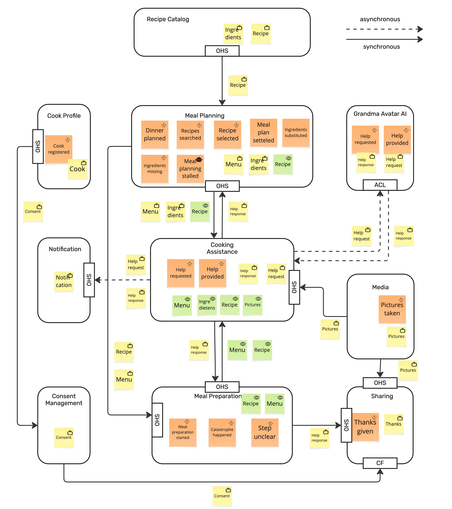

ADR0003

# Using Asynchronous Communication

### Adopted 2026-09-10

### Annegret Junker, Architect

## Decision
**We will use asynchronous communication with RabbitMQ.**

## Context

Cooking Assistance and Notification and Cooking Assistance and Grandma Avatar need asynchronous communication based on the DDD analysis.

## Options considered

### Asynchronous communication via RabbitMQ

We will use RabbitMQ for asynchronous communication.

Advantages: It is supported by principles (see [AP0002](./LarderArchitecturalPrinciples.md/#ap0002-asynchronous-communication-before-synchronous) )
Advantages: Skills are available to implement the communication.

### Asynchronous communication via Kafka

We will use Kafka for asynchronous communication.

Advantages: It is supported by principles (see [AP0002](./LarderArchitecturalPrinciples.md/#ap0002-asynchronous-communication-before-synchronous) )
Disadvantages: Skills are not available to implement the communication

### Using of synchronous communication

We use synchronous communication for Cooking Assistance and Notification and Cooking Assistance and Grandma Avatar.

Disadvantage: It contradicts [AP0002](./LarderArchitecturalPrinciples.md/#ap0002-asynchronous-communication-before-synchronous)
Disadvantage: It contradicts the business analysis (see [Context Map](../09_ContextMap.jpg))

## Consequences

| Consequence    | Asynchronous RabbitMQ | Asynchronous Kafka | Synchronous     |
|----------------|-----------------------|--------------------|-----------------|
| Implementation | ⚠️ Medium effort       | ⚠️ Medium effort    | ⚠️️ Small effort |
| Avalable skills | ☑️ Available          | ‼️ Not Available    | ☑️ Available |
| Functional  | ☑️ suited | ☑️ suited | ‼️ Not suited |

## Advice

See meeting protocol
