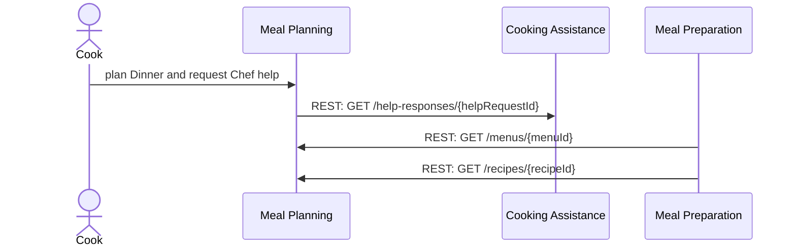
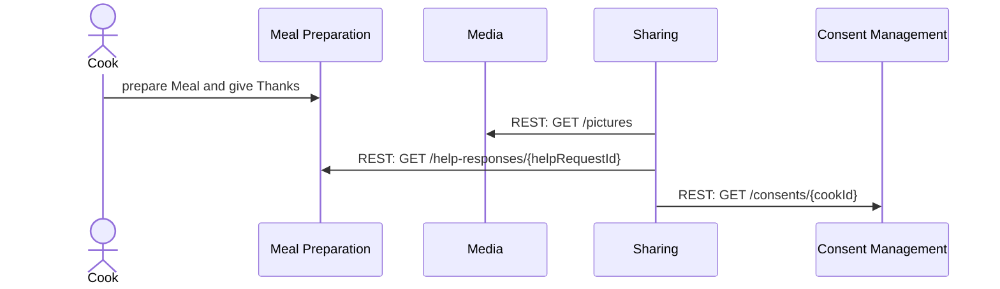
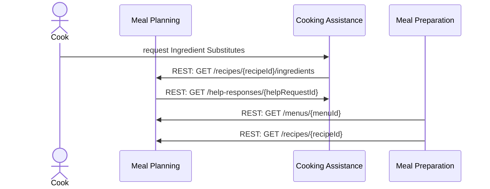
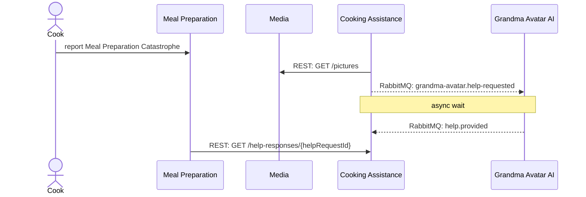
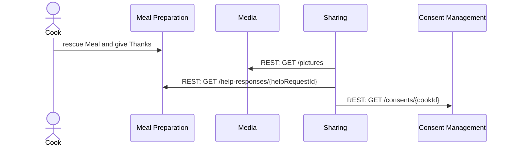
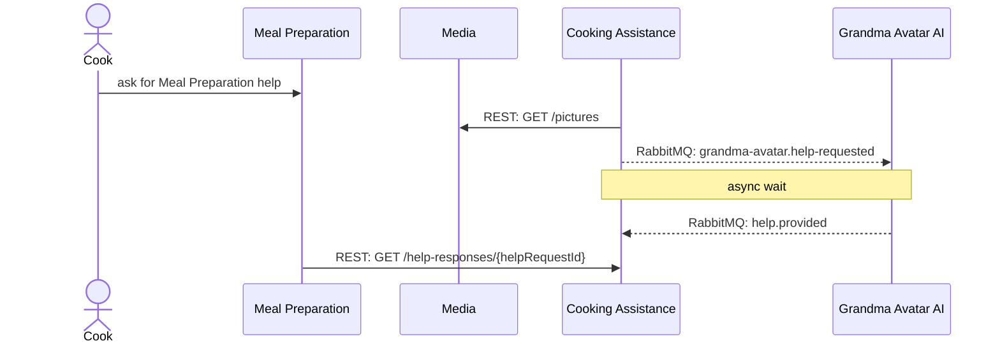
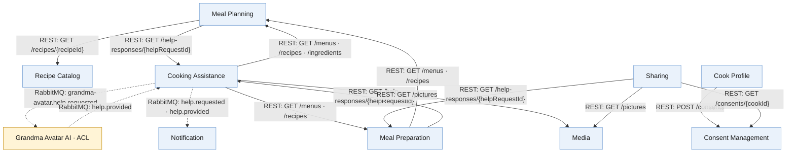

# Prompt 2026-09-20

@context map api proposer

Propose APIs based on the Context Map and the Domain Stories, Visual Glossary and architecture knowledge graph.

# Answer

The graph fixes asynchronous messaging as RabbitMQ, but leaves synchronous bounded-context transport open. Please choose REST, gRPC, or GraphQL so I can complete the API proposal. REST best aligns with ADR0004.

**Use REST**

# API Proposal — Larder

## 0. Inputs and working conventions

This proposal uses:

- Context Map: `09_ContextMap(2).jpg`
- Visual Glossary: `VIsualGlossaryEnhanced(3).jpg`
- Domain Stories: Ask Chef, Ask Community, Grandma, and Grandma II
- Architecture knowledge graph: `graph(2).ttl`, with the vocabulary extension in `dkg-adr(2).ttl`
- Confirmed synchronous technology: **REST**
- Graph-settled asynchronous technology: **RabbitMQ** (`ADR0003`)

This is an API **proposal**, not a full specification. Fields have names and cardinality notes only; types, validation rules, HTTP status codes, error bodies, authorization rules, exchange durability, retry policy, and dead-letter behavior remain for the detailed OpenAPI/AsyncAPI work.

The Context Map draws solid OHS arrows from a provider toward a consumer. In the REST tables and diagrams below, direction is normalized to **caller → API provider**. Thus a map arrow showing `Recipe Catalog → Meal Planning: Recipe` becomes `Meal Planning → Recipe Catalog: GET /recipes/{recipeId}`.

All bounded contexts remain modules of the adopted modular-monolith interpretation of `ADR0001`; the interfaces below are logical module boundaries and do not imply independently deployed services.

## 1. Border ledger

| # | Caller / producer | Provider / consumer | Crossing | Glossary term | Type | Map mechanism | Staleness | Story evidence |
|---:|---|---|---|---|---|---|---|---|
| B01 | Meal Planning | Recipe Catalog | Retrieve a recipe | Recipe | qry | Solid OHS arrow | Unstated | None |
| B02 | Cooking Assistance | Meal Planning | Retrieve menu, ingredients, and recipe | Menu; Ingredient; Recipe | qry | Solid OHS arrow | Unstated | Ask Chef and Ask Community imply planning data is needed during assistance |
| B03 | Meal Planning | Cooking Assistance | Retrieve the response to a help request | Help response | qry | Solid OHS arrow | Unstated | Ask Chef: steps 3–4 |
| B04 | Meal Preparation | Meal Planning | Retrieve menu and recipe | Menu; Recipe | qry | Solid OHS arrow | Unstated | All stories move from planning/preparation intent to preparing a Meal |
| B05 | Cooking Assistance | Meal Preparation | Retrieve menu and recipe during preparation | Menu; Recipe | qry | Solid OHS arrow | Unstated | Grandma and Grandma II |
| B06 | Meal Preparation | Cooking Assistance | Retrieve the response to a help request | Help response | qry | Solid OHS arrow | Unstated | Grandma and Grandma II: steps 3–4 |
| B07 | Cooking Assistance | Media | Retrieve pictures attached to a help request | Picture | qry | Solid OHS arrow | Unstated | Grandma and Grandma II: Pictures accompany Help request |
| B08 | Sharing | Media | Retrieve pictures for sharing | Picture | qry | Solid OHS arrow | Unstated | All stories: final sharing step |
| B09 | Sharing | Meal Preparation | Retrieve the help response associated with thanks | Help response | qry | Solid OHS arrow | Unstated | All stories: Cook thanks the selected help provider |
| B10 | Cook Profile | Consent Management | Record consent | Consent | cmd | Solid OHS arrow | Unstated | None |
| B11 | Sharing | Consent Management | Verify consent before sharing | Consent | qry | Solid CF/OHS arrow | Unstated | Sharing is in all stories; consent check is map-only |
| B12 | Cooking Assistance | Notification | Notify about help-request lifecycle | Help request; Help response | evt | Dashed arrow | Unstated | Help request/response appears in all stories; Notification does not |
| B13 | Cooking Assistance | Grandma Avatar AI | Request help | Help request | cmd | Dashed ACL arrow | Unstated | Grandma and Grandma II: step 3 |
| B14 | Grandma Avatar AI | Cooking Assistance | Provide help | Help response | evt | Dashed ACL arrow | Unstated | Grandma and Grandma II: step 4 |

The Context Map also records relationship patterns: OHS on most provider borders, an ACL at Grandma Avatar AI, and a conformist relationship at Sharing. Those patterns affect ownership and translation but do not themselves select a wire protocol.

## 2. Sync/async classification

| Border | Verdict | Confidence | Evidence |
|---|---|---|---|
| B01–B11 | Sync | stated | Each is drawn as a solid arrow; the map legend defines solid as synchronous. REST was confirmed for this proposal. These borders remain in tension with the general async preference in `AP0002`, but the map is border-specific evidence. |
| B12 | Async | graph | `ADR0003` explicitly adopts asynchronous RabbitMQ communication between Cooking Assistance and Notification. |
| B13–B14 | Async | graph | `ADR0003` explicitly adopts asynchronous RabbitMQ communication between Cooking Assistance and Grandma Avatar; the Context Map also draws both directions as dashed. |

No classification relies on a type default. No staleness window is stated on the map.

## 3. Synchronous REST sketches

### Recipe Catalog

| Operation | Rough input | Rough output | From border / story | REST sketch |
|---|---|---|---|---|
| Retrieve Recipe | `recipeId` *(identity name unconfirmed)* | `recipe`, including `ingredients[]` (1..*) and `steps[]` (1..*) | B01; no story evidence | `GET /recipes/{recipeId}` |

### Meal Planning

| Operation | Rough input | Rough output | From border / story | REST sketch |
|---|---|---|---|---|
| Retrieve Menu | `menuId` *(identity name unconfirmed)* | `menu`, including `courses[]` (1..*) | B02, B04 | `GET /menus/{menuId}` |
| Retrieve Recipe | `recipeId` *(identity name unconfirmed)* | `recipe` | B02, B04 | `GET /recipes/{recipeId}` |
| Retrieve Ingredients for Recipe | `recipeId` *(identity name unconfirmed)* | `ingredients[]` (1..*) | B02 | `GET /recipes/{recipeId}/ingredients` |

### Cooking Assistance

| Operation | Rough input | Rough output | From border / story | REST sketch |
|---|---|---|---|---|
| Retrieve Help response | `helpRequestId` *(identity name unconfirmed)* | `helpResponse`; one or more applicable details: `ingredientSubstitutes[]` (1..3), `preparationStepExplanation` (1), `stepsToMitigateCatastrophe[]` (1..10), or `menuProposals[]` (1..3) | B03, B06; all four stories | `GET /help-responses/{helpRequestId}` |

`Help request` and `Help response` are deliberately separate terms under `SADR0004`; the generic story word “Help” is not used as the API resource name.

### Meal Preparation

| Operation | Rough input | Rough output | From border / story | REST sketch |
|---|---|---|---|---|
| Retrieve Menu used for preparation | `menuId` *(identity name unconfirmed)* | `menu` | B05; Grandma and Grandma II | `GET /menus/{menuId}` |
| Retrieve Recipe used for preparation | `recipeId` *(identity name unconfirmed)* | `recipe` | B05; Grandma and Grandma II | `GET /recipes/{recipeId}` |
| Retrieve Help response for thanks | `helpRequestId` *(identity name unconfirmed)* | `helpResponse` | B09; all stories | `GET /help-responses/{helpRequestId}` |

### Media

| Operation | Rough input | Rough output | From border / story | REST sketch |
|---|---|---|---|---|
| Retrieve Pictures | `mealId` or `helpRequestId` *(association choice unconfirmed)* | `pictures[]`; 0..10 when attached to a Help request | B07, B08; all stories | `GET /pictures?mealId={mealId}&helpRequestId={helpRequestId}` |

The stories show the Cook taking Pictures, but the Context Map does not draw a write border into Media. A future Media-owned UI/API may need `POST /pictures`; it is intentionally not asserted as a cross-context operation here.

### Consent Management

| Operation | Rough input | Rough output | From border / story | REST sketch |
|---|---|---|---|---|
| Record Consent | `cookId` from JWT, `consent` | `consent` | B10; no story evidence | `POST /consents` |
| Verify Consent | `cookId` from JWT, sharing purpose | `consent` | B11; map-only consent check | `GET /consents/{cookId}?purpose=sharing` |

Per `SADR0007b`, `cookId` comes from the JWT identity rather than an ordinary caller-controlled body field. Detailed scopes and authorization checks must satisfy `AP0008` in the OpenAPI/security design.

## 4. Asynchronous RabbitMQ sketches

| Producer | Consumer | Exchange | Routing key | Message | Rough payload | Evidence |
|---|---|---|---|---|---|---|
| Cooking Assistance | Notification | `cooking-assistance.events` | `help.requested` | `HelpRequested` | `helpRequestId`, `cookId`, `pictures[]` (0..10), request kind | B12; `ADR0003` |
| Cooking Assistance | Notification | `cooking-assistance.events` | `help.provided` | `HelpProvided` | `helpRequestId`, `helpResponseId`, provider, provided-at | B12; `ADR0003` |
| Cooking Assistance | Grandma Avatar AI | `cooking-assistance.commands` | `grandma-avatar.help-requested` | `HelpRequested` | `helpRequestId`, `cookId`, `pictures[]` (0..10), request kind | B13; Grandma and Grandma II; `ADR0003` |
| Grandma Avatar AI | Cooking Assistance | `grandma-avatar.events` | `help.provided` | `HelpProvided` | `helpRequestId`, `helpResponseId`, applicable response detail | B14; Grandma and Grandma II; `ADR0003` |

The ACL at Grandma Avatar AI should translate between these canonical Larder messages and the AI provider’s native request/response model. The AsyncAPI phase must add correlation IDs, idempotency, delivery guarantees, retries, dead-letter queues, access control, and observability metadata (`AP0007`).

## 5. Proposed Arazzo files

These are journey proposals only; no Arazzo YAML is generated at this stage.

### 5.1 `ask-chef-to-plan-dinner.arazzo.yaml`

| Field | Content |
|---|---|
| Actor | Cook |
| Goal | Obtain an exclusive Chef’s Help response, prepare the Meal, thank the Chef, and share Pictures |
| Contexts touched, in order | Meal Planning → Cooking Assistance → Meal Preparation → Media → Sharing → Consent Management |
| Steps | 1. Meal Planning calls `GET /help-responses/{helpRequestId}` (**sync step**). 2. Meal Preparation calls Meal Planning for `GET /menus/{menuId}` and `GET /recipes/{recipeId}` (**sync steps**). 3. Sharing calls `GET /pictures?...`, `GET /help-responses/{helpRequestId}`, and `GET /consents/{cookId}?purpose=sharing` (**sync steps**). |
| Arazzo version | `1.0.1` |

`SADR0001` requires the Chef to be accessed exclusively. The Chef is an external Help provider, not a bounded context on the supplied map, so its provider-specific call is an unresolved external step rather than an invented API.

### 5.2 `ask-community-for-ingredient-substitute.arazzo.yaml`

| Field | Content |
|---|---|
| Actor | Cook |
| Goal | Obtain Ingredient Substitutes, prepare the Meal, thank the Community, and share Pictures |
| Contexts touched, in order | Meal Planning → Cooking Assistance → Meal Preparation → Media → Sharing → Consent Management |
| Steps | 1. Cooking Assistance calls Meal Planning for Ingredient data (**sync step**). 2. Meal Planning retrieves `GET /help-responses/{helpRequestId}` (**sync step**). 3. Meal Preparation retrieves Menu and Recipe (**sync steps**). 4. Sharing retrieves Pictures and Help response and verifies Consent (**sync steps**). |
| Arazzo version | `1.0.1` |

The Community is an external Help provider in the glossary/story, not a bounded context on the supplied map. Its provider-specific integration is therefore a coverage gap.

### 5.3 `ask-grandma-to-rescue-meal.arazzo.yaml`

| Field | Content |
|---|---|
| Actor | Cook |
| Goal | Receive Steps to Mitigate Catastrophe from Grandma Avatar, rescue the Meal, give Thanks, and share Pictures |
| Contexts touched, in order | Meal Preparation → Media → Cooking Assistance → Grandma Avatar AI → Cooking Assistance → Meal Preparation → Sharing → Consent Management |
| Steps | 1. Cooking Assistance retrieves Pictures from Media (**sync step**). 2. Cooking Assistance publishes `HelpRequested` (**async wait begins**). 3. Grandma Avatar AI publishes `HelpProvided` (**async wait completes**). 4. Meal Preparation retrieves the Help response (**sync step**). 5. Sharing retrieves Pictures and Help response and verifies Consent (**sync steps**). |
| Arazzo version | `1.1.0` |

### 5.4 `ask-grandma-for-meal-preparation-help.arazzo.yaml`

| Field | Content |
|---|---|
| Actor | Cook |
| Goal | Receive Grandma Avatar’s preparation Help response, prepare the Meal, give Thanks, and share Pictures |
| Contexts touched, in order | Meal Preparation → Media → Cooking Assistance → Grandma Avatar AI → Cooking Assistance → Meal Preparation → Sharing → Consent Management |
| Steps | 1. Cooking Assistance retrieves Pictures from Media (**sync step**). 2. Cooking Assistance publishes `HelpRequested` (**async wait begins**). 3. Grandma Avatar AI publishes `HelpProvided` (**async wait completes**). 4. Meal Preparation retrieves the Help response (**sync step**). 5. Sharing retrieves Pictures and Help response and verifies Consent (**sync steps**). |
| Arazzo version | `1.1.0` |

## 6. API landscape

Every edge below corresponds to one or more rows in sections 1, 3, or 4. Solid edges are synchronous REST calls; dashed edges are asynchronous RabbitMQ messages.

## 7. Terminology decisions

| Source wording | Term used here | Reason |
|---|---|---|
| Meal plan | Menu | `SADR0003` supersedes `SADR0002` and selects Menu across Meal Planning, Meal Preparation, and Cooking Assistance. |
| Help (requested sense) | Help request | `SADR0004` splits the overloaded word. |
| Help (provided sense) | Help response | `SADR0004` splits the overloaded word. |
| Ingredients Substitutes | Ingredient Substitute / `ingredientSubstitutes[]` | Visual Glossary term; Help contains 1..3. |
| Catastrophe Pictures / Pictures | Picture / `pictures[]` | Visual Glossary uses singular Picture; Help and Help request may contain 0..10. |
| Grandma Avatar | Grandma Avatar AI for the bounded context; Grandma Avatar for the provider concept | Preserves both the map’s context label and glossary concept. |
| Help for Meal Preparation Step | Preparation Step Explanation | Visual Glossary’s response term. |
| Rescue instructions | Steps to Mitigate Catastrophe | Visual Glossary’s exact response term; Help contains 1..10. |

The glossary picture does not contain the legend mandated by `SADR0005`, and it does not show explicit identity terms such as `RecipeId`. Conventional `...Id` field names are therefore marked unconfirmed.

## 8. Architecture context and compliance

| Source | Effect on this proposal |
|---|---|
| `ADR0001` / `AP0001` | Interfaces are module boundaries inside a modular monolith; they are not a recommendation to split into microservices. |
| `ADR0003` / `AP0002` | B12–B14 are asynchronous over RabbitMQ. All other synchronous inter-context borders should be reviewed as explicit exceptions/tensions against the async preference. |
| `ADR0004` / `AP0006` | User-interface communication is synchronous; REST is consistent with the ADR rationale and was confirmed for this proposal. |
| `ADR0004` / `AP0008` | Detailed specs must define fine-grained authorization for domain artifacts. GraphQL’s recorded concern is avoided by the confirmed REST choice, but REST still needs explicit controls. |
| `ADR0005` | The AppShell orchestrates guided cooking journeys. This proposal keeps orchestration outside the domain APIs and exposes only context-owned interfaces. The graph records that ADR0005 overrides the Micro-UIs independence principle without acknowledgement. |
| `SADR0001` | Chef access must be exclusive in the Chef journey. |
| `SADR0003` | Menu is the canonical replacement for the ambiguous Meal plan wording. |
| `SADR0004` | Help request and Help response are distinct API/message concepts. |
| `SADR0007b` | A JWT conveys the Cook identity as `cookId`; APIs should not trust a duplicate body/query value as the identity authority. |
| `AP0005a` | Contract, component, and journey tests should remain highly automatable. |
| `AP0007` | OpenAPI/AsyncAPI follow-up must define monitoring and correlation behavior, especially around async waits. |

No proposed operation or channel silently resolves the graph’s recorded architecture defects: the monolith/modular-monolith wording defect, duplicate `AP0005` and `SADR0007` identifiers, the missing glossary legend, and the unacknowledged ADR0005/AP0005b override remain visible governance items.

## 9. Coverage gaps and open questions

1. **No story evidence:** B01 (Recipe Catalog), B10 (record Consent), and Notification’s actual user-visible behavior in B12.
2. **Weak story-to-border trace:** B02–B09 are supported by work objects and sequence, but the stories do not name bounded contexts; the mapping is inferred through the Context Map.
3. **External providers are unmapped:** Chef and Community are glossary/story actors but not bounded contexts. Their concrete integrations, including the Chef-exclusive rule, need separate decisions.
4. **No Picture write border:** every story says the Cook takes Pictures, but the map only shows Media supplying Pictures. Confirm the Media-owned upload/capture interface before specifying it.
5. **Sharing-to-Community is implicit:** every story ends by sharing Pictures with Community, but the map stops at the Sharing context. Confirm whether Community is an external channel, actor audience, or future bounded context.
6. **IDs are absent from the glossary:** `recipeId`, `menuId`, `mealId`, `helpRequestId`, and `helpResponseId` are conventional placeholders, not glossary-authoritative identity terms.
7. **Picture query association is unclear:** confirm whether Pictures are addressed by Meal, Help request, both, or a separate media collection identity.
8. **Notification payload ambiguity:** the map places both Help request and Help response near one outbound dashed crossing. Confirm whether Notification consumes both lifecycle events.
9. **No staleness windows:** the map states sync/async mechanisms but no tolerated delay, timeout, or freshness requirement.
10. **Consent shape and purpose taxonomy are undefined:** `purpose=sharing` is a rough operation-level discriminator, not a settled glossary term.
11. **Response variants need a discriminator:** Ingredient Substitute, Preparation Step Explanation, Steps to Mitigate Catastrophe, and Menu proposal require a formal choice of polymorphism/envelope in the detailed schema.
12. **No invariants sheet:** later Arazzo `onFailure` actions cannot yet be grounded in explicit business rules.

## 10. Handoff

- Turn section 3 into OpenAPI documents with full schemas, errors, authorization, and JWT behavior.
- Turn section 4 into AsyncAPI documents for RabbitMQ, including bindings, correlation, retries, idempotency, dead-letter behavior, and monitoring.
- Confirm the four journey sketches, then use an Event Model to author the actual Arazzo files. Use Arazzo 1.1.0 for the Grandma journeys because they contain async waits.
- Resolve the gaps in section 9 before treating this proposal as a contract, especially Media writes, external Chef/Community integration, identities, consent semantics, and Notification payloads.
