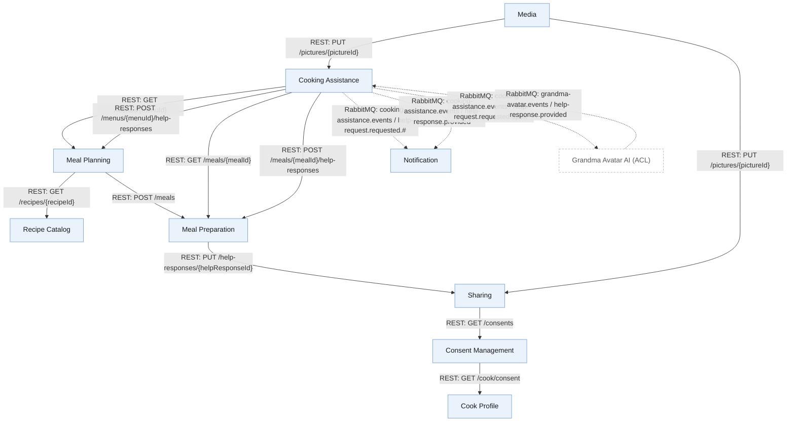
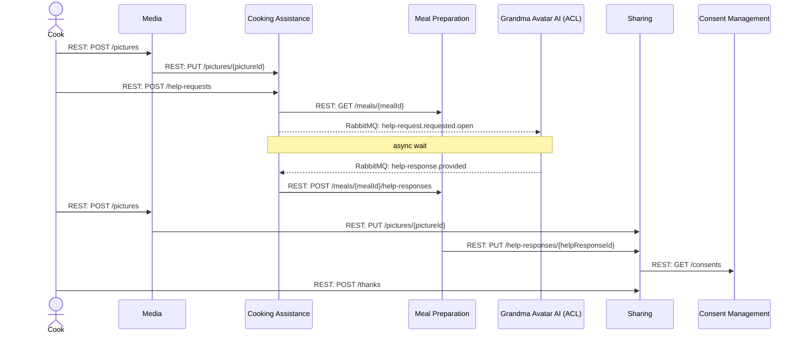
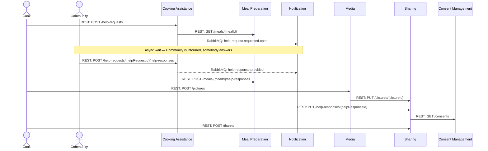
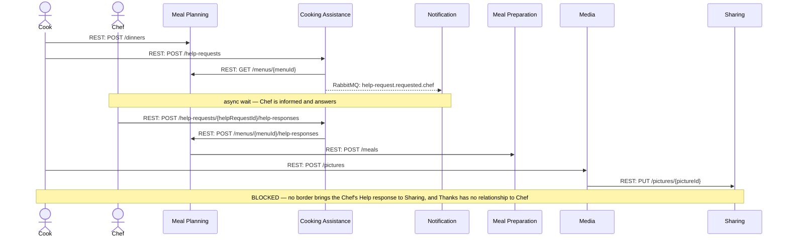

# Prompt 2026-09-20

/context-map-api-proposer

Propose APIs based on the Context Map and the Domain Stories, Visual Glossary and architecture knowledge graph.

[Graph](../assets/KnowledgeGraphWithJwt/graph.ttl)
[Domain Graph](../assets/KnowledgeGraphWithJwt/dkg-adr.ttl)

# Answer

# API Proposal — Larder (Community Cooking) context map

**This is a proposal, not a specification.** Operation names, rough field names
and one-line technology sketches only — enough for the room to agree on scope
and pick which borders deserve a real OpenAPI / AsyncAPI / Arazzo file next.

**The three findings that matter most, before the tables:**

1. **The asynchronous half is already decided; the synchronous half mostly
   is.** ADR0003 (Adopted) settles both dashed borders *and* RabbitMQ. ADR0004
   (Adopted) settles REST — but only for UIs. Every solid context-to-context
   line on the map is therefore a REST sketch resting on an ADR whose scope
   does not quite cover it, and running against AP0002's stated preference for
   asynchronous communication between bounded contexts.
2. **The map delivers *Help response* synchronously (solid lines into Meal
   Planning, Meal Preparation and Sharing); all four stories and AP0002 point
   the other way.** In every story the answer comes from a *different actor,
   later*. These three borders are sketched as drawn and flagged hardest.
3. **Story B cannot complete on this map.** The Cook thanks the Chef for
   *planning* help, but the only path by which a Help response reaches Sharing
   runs through Meal Preparation. Meal Planning has no edge to Sharing — and
   the glossary has no `Thanks —to→ Chef` relationship either.

---

## 0. Inputs

| Input | Used as | Note |
|---|---|---|
| `09_ContextMap.jpg` | Context map — 10 contexts, 14 crossings | Team-drawn. Legend: dashed = asynchronous, solid = synchronous. Patterns: OHS ×9, ACL ×1, CF ×1. No staleness windows stated anywhere. |
| `06a` AskChef · `06b` AskCommunity · `06d` Grandma · `06e` GrandmaII | Domain stories B, C, A, D | Six sentences each, same skeleton: trouble → ask → help → carry on → thank and share. |
| `VIsualGlossaryEnhanced.jpg` | Naming and field-shape authority | Read directly; cardinalities are crisp on the picture. No legend for the blue / green / grey / ⊞ marks — SADR0005 already asks for one. |
| `graph.ttl` (+ `dkg-adr.ttl` vocabulary) | Architecture knowledge graph | 9 Principles, 13 Decisions (12 Adopted, 1 Superseded). Read in full. |
| Project: `invariants-community-cooking-board.md` | Bonus — failure cases for Arazzo `onFailure` | §5 only. |

**Reading convention for the map — please confirm, every sketch depends on
it.** Arrows are read as *the direction the payload travels*; the OHS box marks
*whose published interface carries it*. So an arrow **leaving** an OHS is a
consumer reading from the host (`qry`), and an arrow **entering** an OHS is a
sender submitting to the host (`cmd`/`evt`). This is the only reading under
which both `Consent Management [OHS] → [CF] Sharing` and
`Cooking Assistance → [OHS] Notification` make sense at once.

**Technologies (Step 3) — taken from the graph, not chosen here:**

- **Asynchronous → RabbitMQ.** ADR0003, Adopted: *"We will use asynchronous
  communication with RabbitMQ."* Kafka was a considered and rejected option.
  Direct match; not asked.
- **Synchronous → REST.** ADR0004, Adopted: *"We will use synchronous
  communication for User Interfaces"*, rationale *"…synchronously via REST
  API"*; GraphQL rejected as contradicting AP0008. **Scope caveat:** ADR0004 is
  about UI communication. No Decision covers synchronous calls *between*
  contexts, and gRPC was never considered. REST is extended to those rows as
  the only synchronous technology in the team's record, and each such row is
  tagged `(ADR0004 scope-extended)`. If the room wants something else between
  modules, §3–6 re-run without touching §1–2.

---

## 1. Border ledger

`[OHS]` / `[ACL]` / `[CF]` mark the end of the line the pattern box sits on.

| # | From | To | Crossing (map's words) | Glossary term | Type | Map's mechanism | Staleness | Story evidence |
|---|---|---|---|---|---|---|---|---|
| B1 | Recipe Catalog [OHS] | Meal Planning | Recipe | Recipe | qry | solid — synchronous | — | **none** |
| B2 | Meal Planning | [OHS] Meal Preparation | Recipe, Menu | Recipe, Menu | cmd | solid — synchronous | — | B 1→5 (weak: plans Dinner … prepares Meal) |
| B3 | Meal Planning [OHS] | Cooking Assistance | Menu, Ingredients, Recipe | Menu, Ingredient, Recipe | qry | solid — synchronous | — | B 2–3 |
| B4 | Cooking Assistance | [OHS] Meal Planning | Help response | Help *(see §7)* | evt, pushed | solid — synchronous | — | B 4 |
| B5 | Meal Preparation [OHS] | Cooking Assistance | Menu, Recipe | Menu, Recipe | qry | solid — synchronous | — | A 2–3 · C 2–3 · D 2–3 |
| B6 | Cooking Assistance | [OHS] Meal Preparation | Help response | Help *(§7)* | evt, pushed | solid — synchronous | — | A 4–5 · C 4–5 · D 4–5 |
| B7 | Media | [OHS] Cooking Assistance | Pictures | Picture | cmd | solid — synchronous | — | A 2–3 · D 2–3 |
| B8 | Cooking Assistance | [OHS] Notification | Help request, Help response | Help Request, Help *(§7)* | evt | dashed — asynchronous | — | B 3, C 3 (somebody must be told) |
| B9 | Cooking Assistance | [ACL] Grandma Avatar AI | Help request | Help Request | evt | dashed — asynchronous | — | A 3 · D 3 |
| B10 | Grandma Avatar AI [ACL] | Cooking Assistance | Help response | Help *(§7)* | evt | dashed — asynchronous | — | A 4 · D 4 |
| B11 | Meal Preparation | [OHS] Sharing | Help response | Help *(§7)* | evt, pushed | solid — synchronous | — | A 6 · C 6 · D 6 |
| B12 | Media | [OHS] Sharing | Pictures | Picture | cmd | solid — synchronous | — | A–D 5–6 |
| B13 | Cook Profile [OHS] | Consent Management | Consent | *(not in glossary)* | ? → qry | solid — synchronous | — | **none** |
| B14 | Consent Management [OHS] | [CF] Sharing | Consent | *(not in glossary)* | qry | solid — synchronous | — | **none** (implied by "shares Pictures with Community") |

**Not a border, by decision:** *Cook* identity. SADR0007b (Adopted 2026-09-20):
*"JWT Token contains identity of Cook as cookId."* That is why Cook Profile's
OHS feeds nothing but Consent Management — and why no sketch below carries
`cookId` as a request field.

**B13 is the one row whose type the map does not settle.** The OHS sits on
Cook Profile, so it is read as Consent Management *reading* consent from Cook
Profile. The alternative — Cook Profile *recording* a consent into Consent
Management — would flip the provider. No story touches it.

---

## 2. Sync/async classification

| # | Border | Verdict | Confidence | Evidence |
|---|---|---|---|---|
| B8 | Cooking Assistance → Notification | **async** | `graph` | **ADR0003**, Adopted — names this exact pair: *"Cooking Assistance and Notification … need asynchronous communication"*. Direct match. Map agrees (dashed). |
| B9 | Cooking Assistance → Grandma Avatar AI | **async** | `graph` | **ADR0003** — names this pair too. Direct match. Map agrees. |
| B10 | Grandma Avatar AI → Cooking Assistance | **async** | `graph` | **ADR0003**. Stories A 3→4 and D 3→4 corroborate: a different actor answers. |
| B1 | Recipe Catalog → Meal Planning | sync | `stated` | Solid line. No Decision names this border. |
| B3 | Meal Planning → Cooking Assistance | sync | `stated` | Solid line. |
| B5 | Meal Preparation → Cooking Assistance | sync | `stated` | Solid line. |
| B7 | Media → Cooking Assistance | sync | `stated` | Solid line. Stories agree: Pictures are taken and used one clause apart (A 2→3). |
| B12 | Media → Sharing | sync | `stated` | Solid line. Stories agree (5→6, same actor, same breath). |
| B13 | Cook Profile → Consent Management | sync | `stated` | Solid line. Type unconfirmed (§1). |
| B14 | Consent Management → Sharing | sync | `stated` | Solid line. A consent check before publishing wants an immediate answer. |
| B2 | Meal Planning → Meal Preparation | sync | `stated` — **contested** | Solid line. But the project's own pivotal-event cut puts *hours to days* between settling and cooking; rung 3 would say async had the map stated that window. AP0002 leans the same way. |
| B4 | Cooking Assistance → Meal Planning | sync | `stated` — **contested** | Solid line. Story B 3→4: a *different actor* (Chef) answers *later* — rung 4 says async. An `evt` would default async. AP0002 prefers async. **Three signals against one line.** |
| B6 | Cooking Assistance → Meal Preparation | sync | `stated` — **contested** | As B4, with stories A, C, D. |
| B11 | Meal Preparation → Sharing | sync | `stated` — **contested** | Solid line; an `evt` forwarded second-hand. Nothing in the stories needs it to block. |

**Why AP0002 is not applied as a `principle-default`.** It would only slot in
above the type default, and the map's explicit legend (rung 2) has already
answered every row. AP0002 therefore shows up as a *conflict flag* on the
sketches (§3) rather than as a verdict here — the map and the principle
disagree, and that is the room's call, not this document's.

**No `default` verdicts.** Every row rests on the graph or on the map's own
legend. That is unusually good coverage; the weakness is in the four contested
rows, not in missing evidence.

---

## 3. Synchronous API sketches, per context

Field names only. Shapes follow the glossary's cardinalities; anything the
glossary does not cover is `(unconfirmed shape)`. **The glossary states no
identity term for any entity**, so every `…Id` below is a placeholder of the
obvious kind, not a glossary fact. `cookId` never appears as a field
(SADR0007b — it rides in the JWT).

Flags: `(AP0002)` = synchronous context-to-context call against the stated
preference for asynchronous — see §8. `(scope-ext)` = REST per ADR0004,
scope-extended beyond UIs.

### Recipe Catalog — OHS

| Operation | Rough input | Rough output | From border / story | Sketch |
|---|---|---|---|---|
| Search Recipes | search criteria `(unconfirmed shape)` | recipes[] | B1 · (no story evidence) | `GET /recipes` (scope-ext) (AP0002) |
| Get Recipe | recipeId | recipe: ingredients[] *(1..\*)*, steps[] *(1..\*)* — each Step with the Ingredients it needs | B1 · (no story evidence) | `GET /recipes/{recipeId}` (scope-ext) (AP0002) |

*Ingredient* and *Step* stay inline on Recipe — nothing on the map addresses
either independently.

### Meal Planning — OHS

| Operation | Rough input | Rough output | From border / story | Sketch |
|---|---|---|---|---|
| Get Menu | menuId | menu: courses[] *(1..\*)* → meals[] *(1..\*)* → recipe *(1)* | B3 · B 2–3 | `GET /menus/{menuId}` (scope-ext) (AP0002) |
| Get Ingredients of Menu | menuId | ingredients[] *(1..\*)* | B3 · B 2–3; C 2–3 if that trouble is a planning one (§9) | `GET /menus/{menuId}/ingredients` (scope-ext) (AP0002) |
| Accept Help response | menuId, helpResponseId, helpRequestId, helpProvider, menuProposals[] *(1..3)* **or** ingredientSubstitutes[] *(1..3)*, pictures[] *(0..10)* | accepted | B4 · B 4 | `POST /menus/{menuId}/help-responses` (scope-ext) **(principle conflict: AP0002)** |

*Recipe* crosses B3 only as Meal Planning's relayed copy of Recipe Catalog's
data (it is a green read model inside Meal Planning). Sketched inline on Menu
rather than as a second Recipe API.

### Meal Preparation — OHS (two: top, towards Cooking Assistance; left, towards Meal Planning)

| Operation | Rough input | Rough output | From border / story | Sketch |
|---|---|---|---|---|
| Start Meal preparation | menuId, recipe *(1 — Meal with 1 Recipe)* | mealId | B2 · B 1→5 | `POST /meals` (scope-ext) **(principle conflict: AP0002)** |
| Get Meal | mealId | meal: menu *(ref)*, recipe *(1)* with steps[] *(1..\*)*, ingredients[] *(1..\*)* | B5 · A/C/D 2–3 | `GET /meals/{mealId}` (scope-ext) (AP0002) |
| Accept Help response | mealId, helpResponseId, helpRequestId, helpProvider, preparationStepExplanation *(1)* **or** stepsToMitigateCatastrophe[] *(1..10)* **or** ingredientSubstitutes[] *(1..3)*, pictures[] *(0..10)* | accepted | B6 · A/C/D 4–5 | `POST /meals/{mealId}/help-responses` (scope-ext) **(principle conflict: AP0002)** |

### Cooking Assistance — OHS

| Operation | Rough input | Rough output | From border / story | Sketch |
|---|---|---|---|---|
| Register Picture | pictureId, mealId, picture reference `(unconfirmed shape)` | registered | B7 · A 2–3, D 2–3 | `PUT /pictures/{pictureId}` (scope-ext) (AP0002) |

Registered rather than "attached to a Help request", because in stories A and D
the Pictures exist one sentence *before* the request does.

### Sharing — OHS (two: top, from Media; left, from Meal Preparation) + CF

| Operation | Rough input | Rough output | From border / story | Sketch |
|---|---|---|---|---|
| Register Picture | pictureId, mealId, picture reference `(unconfirmed shape)` | registered | B12 · A–D 5–6 | `PUT /pictures/{pictureId}` (scope-ext) (AP0002) |
| Register Help response | helpResponseId, helpRequestId, helpProvider, mealId | registered | B11 · A/C/D 6 | `PUT /help-responses/{helpResponseId}` (scope-ext) **(principle conflict: AP0002)** |

### Consent Management — OHS

| Operation | Rough input | Rough output | From border / story | Sketch |
|---|---|---|---|---|
| Get Consent | *(cook from JWT)*, purpose `(unconfirmed shape)` | consent `(unconfirmed shape)` | B14 · (no story evidence) | `GET /consents` (scope-ext) (AP0002) |

Sharing is **Conformist**: it takes Consent in Consent Management's shape and
translates nothing. That is the map's claim; the sketch honours it by giving
Sharing no consent model of its own.

### Cook Profile — OHS

| Operation | Rough input | Rough output | From border / story | Sketch |
|---|---|---|---|---|
| Get Consent of Cook | *(cook from JWT)* | consent `(unconfirmed shape)` | B13 · (no story evidence) · **type unconfirmed** | `GET /cook/consent` (scope-ext) (AP0002) |

### Cook-facing entry operations — *not border crossings*

Listed only because the Arazzo journeys in §5 cannot start without them. These
are the micro-UI → own-context calls that **ADR0004 covers directly** (REST,
`graph` confidence, no scope extension, no AP0002 tension — AP0006 governs).

| Context | Operation | Rough input | Rough output | Story | Sketch |
|---|---|---|---|---|---|
| Meal Planning | Plan Dinner | guests `(unconfirmed shape — no glossary term)`, menu *(1)* | dinnerId, menuId | B 1 | `POST /dinners` |
| Media | Take Picture | picture content, mealId | pictureId | A 2, A 5, D 2, B–D 5 | `POST /pictures` |
| Cooking Assistance | Post Help request | mealId *(belongs 1 Meal)*, kind *(one of the four Help Request subtypes)*, addressee *(§8, SADR0001)*, pictures[] *(0..10)*, step *(ref, for Help for Meal Preparation Step)* | helpRequestId | A–D 3 | `POST /help-requests` |
| Cooking Assistance | Provide Help response *(Community, Chef)* | helpRequestId, content by kind: ingredientSubstitutes[] *(1..3)* / preparationStepExplanation *(1)* / stepsToMitigateCatastrophe[] *(1..10)* / menuProposals[] *(1..3)*, pictures[] *(0..10)* | helpResponseId | B 4, C 4 | `POST /help-requests/{helpRequestId}/help-responses` |
| Sharing | Give Thanks | helpResponseId *(for 1 Help)*, to *(0..1 Community, 0..1 Grandma Avatar)*, pictures[] *(0..10)* | thanksId | A–D 6 | `POST /thanks` |

### Landscape — synchronous and asynchronous together

Drawn from the §3 tables above and the §4 tables below; border crossings only
(the Cook-facing entry operations are not edges between contexts). Sync edges
point **caller → provider**.

Grandma Avatar AI is drawn off-board: ADR0001 lists it as *"an ACL to the
external AI used"*, and the graph types it `dkg:ExternalSystem`.

---

## 4. Asynchronous API sketches, per context

RabbitMQ per ADR0003. Message and field names only.

### Cooking Assistance — producer

| Exchange | Messages produced | Consumed by | Rough payload | Sketch |
|---|---|---|---|---|
| Help request events | HelpRequested | Notification (B8), Grandma Avatar AI (B9) | helpRequestId, kind, mealId, addressee, **cook** *(see below)*, pictures[] *(0..10, refs)*, situation snapshot: menu / recipe / step `(unconfirmed shape)` | exchange `cooking-assistance.events` (topic), routing key `help-request.requested.<addressee>` — `chef` or `open` |
| Help response events | HelpProvided | Notification (B8) | helpResponseId, helpRequestId, helpProvider, kind | exchange `cooking-assistance.events`, routing key `help-response.provided` |

- **The addressee is in the routing key because SADR0001 says *"Chef needs to
  be accessed exclusively."*** Grandma Avatar AI binds to
  `help-request.requested.open` only, so a Chef-exclusive request never reaches
  the avatar by construction. Notification binds to `help-request.requested.#`.
- **`cook` has to travel in the payload here.** SADR0007b's three considered
  options (JWT, header, property in each request) are all request-shaped; a
  RabbitMQ message has no JWT. This is a hole in an Adopted decision, not a
  conflict with it — §9.
- **The snapshot is unavoidable on B9.** The map sends Grandma Avatar AI
  *Help request* and nothing else, so whatever the avatar needs of Menu, Recipe
  or Step must ride inside the message. (For human helpers the question stays
  open — the project's pivotal-event cut called it the decision most likely to
  make or break these boundaries.)

### Grandma Avatar AI (ACL) — producer

| Exchange | Messages produced | Consumed by | Rough payload | Sketch |
|---|---|---|---|---|
| Avatar help responses | HelpProvided | Cooking Assistance (B10) | helpRequestId, content by kind: ingredientSubstitutes[] *(1..3)* / preparationStepExplanation *(1)* / stepsToMitigateCatastrophe[] *(1..10)* / menuProposals[] *(1..3)*, pictures[] *(0..10)* | exchange `grandma-avatar.events`, routing key `help-response.provided` |

The ACL's whole job is visible in this row: the external AI's answer arrives in
whatever shape the vendor produces, and leaves the ACL as a glossary-shaped
Help response with the glossary's bounds enforced (at most 3 substitutes, at
most 10 mitigation steps).

### Notification — consumer only

Produces nothing on the map. Its OHS is what Cooking Assistance publishes
*into*; what Notification then does to reach Community and Chef (push, mail,
toast) is outward-facing and not a border between contexts.

---

## 5. Proposed Arazzo files

Four stories, three files. Stories A and D are the same journey with a
different Help Request kind, so they share a file as two workflows. Every
journey contains an asynchronous wait → all three aim at **Arazzo 1.1.0**.

### 5.1 `rescue-meal-with-grandma-avatar.arazzo.yaml`

| Field | Content |
|---|---|
| Actor | Cook |
| Goal | A Meal in trouble is back on track, the avatar is thanked, Pictures are shared with the Community |
| Stories | A (Meal Preparation Catastrophe) · D (Help for Meal Preparation Step) — two workflows, one file |
| Contexts, in order | Meal Preparation → Media → Cooking Assistance → Grandma Avatar AI → Cooking Assistance → Meal Preparation → Media → Sharing → Consent Management |
| Steps | 1 `sync` Take Picture (Media) · 2 `sync` Register Picture (B7) · 3 `sync` Post Help request · 4 `sync` Get Meal (B5) · 5 **`async wait`** HelpRequested → avatar → HelpProvided (B9, B10) · 6 `sync` Accept Help response (B6) · 7 `sync` Take Picture · 8 `sync` Register Picture (B12) · 9 `sync` Register Help response (B11) · 10 `sync` Get Consent (B14) · 11 `sync` Give Thanks |
| Arazzo version | 1.1.0 |

### 5.2 `substitute-ingredients-with-community-help.arazzo.yaml`

| Field | Content |
|---|---|
| Actor | Cook, with Community as second actor |
| Goal | The Cook has Ingredient Substitutes, the Meal is prepared, the Community is thanked |
| Story | C |
| Contexts, in order | Meal Preparation → Cooking Assistance → Notification → Cooking Assistance → Meal Preparation → Media → Sharing → Consent Management |
| Steps | 1 `sync` Post Help request (kind: Help with Ingredients) · 2 `sync` Get Meal (B5) · 3 **`async wait`** HelpRequested → Notification → a Community member answers (B8) · 4 `sync` Provide Help response · 5 `sync` Accept Help response (B6) · 6 `sync` Take Picture · 7 `sync` Register Picture (B12) · 8 `sync` Register Help response (B11) · 9 `sync` Get Consent (B14) · 10 `sync` Give Thanks |
| Arazzo version | 1.1.0 |

### 5.3 `plan-dinner-with-chef-help.arazzo.yaml`

| Field | Content |
|---|---|
| Actor | Cook, with Chef as second actor |
| Goal | The Dinner is planned with the Chef's Menu proposal, the Meal is prepared, the Chef is thanked |
| Story | B |
| Contexts, in order | Meal Planning → Cooking Assistance → Notification → Cooking Assistance → Meal Planning → Meal Preparation → Media → Sharing |
| Steps | 1 `sync` Plan Dinner · 2 `sync` Post Help request (kind: Help Meal plan, addressee: Chef) · 3 `sync` Get Menu (B3) · 4 **`async wait`** HelpRequested (`…requested.chef`) → Notification → Chef answers (B8) · 5 `sync` Provide Help response · 6 `sync` Accept Help response (B4) · 7 `sync` Start Meal preparation (B2) · 8 `sync` Take Picture · 9 `sync` Register Picture (B12) · 10 **BLOCKED** — Give Thanks to Chef |
| Arazzo version | 1.1.0 |

**Step 10 cannot be sketched honestly.** `Give Thanks` needs the
`helpResponseId` Sharing was told about, and Sharing only ever hears about Help
responses via B11 from *Meal Preparation*. A planning-time Help response stops
in Meal Planning (B4). Separately, the glossary gives Thanks a `to 0..1
Community` and a `to 0..1 Grandma Avatar` and nothing to Chef. Story B's last
sentence is unsupported by both the map and the glossary.

**No single-context journeys to exclude** — all four stories cross borders.

### `onFailure` candidates, from the project's invariants sheet

Not sketched; listed so whoever writes the real Arazzo files starts with them.

| Step | Rule | Failure |
|---|---|---|
| Post Help request | INV-HELP-01 | request not answerable — no Recipe/Menu, no Picture |
| Provide Help response | INV-HELP-03, INV-HELP-04 | responder is the requester; request no longer open |
| async wait (B9/B10) | X-04 | nobody answers within `<n>` minutes → avatar fallback. **The most important timeout in the product, and `<n>` is unknown.** |
| Accept Help response (B6) | INV-PREP-08 | advice arriving is not the rescue; the Cook confirms |
| Register Picture / Give Thanks | INV-MEDIA-03 + B14 | no consent → share refused |
| Give Thanks | INV-SHARE-01, INV-SHARE-03 | thanking someone who did not help; thanking twice |

---

## 6. Diagrams

Placed under the tables they were drawn from: the landscape flowchart at the
end of §3, one sequence diagram per Arazzo file in §5.1–5.3. All four parse
cleanly under Mermaid 10. The landscape has 15 labelled edges on 10 nodes and
may lay out densely; if it does, it splits naturally into a synchronous and an
asynchronous diagram without losing anything.

---

## 7. Terminology

Glossary wins on naming — **except where an Adopted Decision has already
overruled it**, which happens twice.

| Where | Says | Used here | Why |
|---|---|---|---|
| Glossary | **Help** (the answer) | **Help response** | **SADR0004**, Adopted 2026-09-11: *"Help response / Help request."* The map already follows it; the *Enhanced* glossary does not yet. |
| Glossary | Help **R**equest | Help request | SADR0004's and the map's casing. Invisible in `helpRequestId`; visible in prose. |
| Glossary | **Help Meal plan** (Help Request subtype) | kept verbatim as a `kind` value — flagged | **SADR0003**, Adopted: *"Menu is used for Menu and Meal plan."* The subtype name is now stale; *Menu proposal*, its answer, already uses the surviving word. |
| Map | *Meal plan setteled* (event) | — not a crossing | Stale under SADR0003, and misspelt. |
| Map | Ingredients · *Ingre dietens* | Ingredient, `ingredients[]` | Glossary singular; array from `Recipe contains 1..*`. |
| Map, stories | Pictures · Catastrophe Pictures | Picture, `pictures[]` *(0..10)* | Glossary singular with a bound. The glossary has **one** Picture term where the project's earlier analyses found two concepts (evidence vs trophy); the sketch follows the glossary and registers Pictures separately with Cooking Assistance and with Sharing. |
| Map | Grandma Avatar **AI** | Grandma Avatar (the helper) · Grandma Avatar AI (the context) | Glossary term for the Help provider; map name for the ACL context. |
| Story D, s6 | Grandma | Grandma Avatar | Story slip. |
| Story C | Ingredients Substitutes | Ingredient Substitute, `ingredientSubstitutes[]` *(1..3)* | Glossary spelling and bound. |
| Story B | Parents in Law | `guests` `(unconfirmed shape)` | **No glossary term for guests at all.** |
| Map | Consent · Notification | as written | **Neither is in the glossary** — two whole contexts with no vocabulary. |

**Glossary terms with no crossing (worth asking about):** Dinner, Course, Step
*(as a crossing — it is referenced by Help for Meal Preparation Step, yet B5
carries only Menu and Recipe)*, Substitute, Help provider *(it should cross
B11 — sketched as `helpProvider`)*.

**One cardinality the sketch could not honour:** `Help Request belongs 1 Meal`.
In Story B no Meal exists when the Cook asks for help planning a Dinner. Either
the cardinality is `0..1`, or a Help Meal plan request belongs to a Menu.
`mealId` is sketched as required, per the glossary; it will be wrong for 5.3.

More than a spot-check's worth of drift between map, stories and glossary —
`domain-story-glossary-consistency` would be worth a run.

---

## 8. Architecture context

**Verdicts taken from the graph**

| Border | Source | Match |
|---|---|---|
| B8, B9, B10 → async | **ADR0003** *Using Asynchronous Communication*, Adopted 2026-09-10; honours AP0002 (explicit) | **Direct** — the ADR's Context names both pairs, and cites this very context map image. |

**Technologies taken from the graph**

| Half | Source | Match |
|---|---|---|
| Async → RabbitMQ | ADR0003 decided option | Direct. |
| Sync → REST, for UIs | **ADR0004**, Adopted; honours AP0006 (explicit), AP0008 (by elimination of GraphQL) | Direct for the Cook-facing entry operations. |
| Sync → REST, between contexts | ADR0004 | **Weak — scope-extended.** The ADR is about UIs. Stated, not asserted: the room should either widen ADR0004 or write the missing ADR. |

**Principle conflicts**

> **AP0002** — *"For communication between Bounded Contexts asynchronous
> communication is preferred."* (Adopted, testable, scope: between Bounded
> Contexts.)

Eleven of fourteen borders are drawn synchronous. The principle says
*preferred*, not *required*, so they are not all equal:

- **Defensible — a reader needs an answer now** *(flagged `(AP0002)`)*: B1, B3,
  B5, B13, B14 (queries), B7, B12 (Pictures used one clause later). Even here
  the map hints at the compliant alternative: Cooking Assistance already holds
  *Menu*, *Ingredients*, *Recipe* and *Pictures* as green read models. If those
  are *replicated* read models fed by events, B3, B5 and B7 become asynchronous
  and the three `GET`s disappear. The map's legend says solid, so they are
  sketched solid.
- **Hard to defend — nothing waits for the reply** *(flagged **principle
  conflict: AP0002**)*: **B2, B4, B6, B11.** All four push a fact that is
  already true to a context that does nothing with it until a human acts. The
  stories (different actor, later) and the pivotal-event cut (hours to days on
  B2) agree with the principle against the map. ADR0003 examined exactly two
  borders *"based on the DDD analysis"*; these four look like they were never
  examined rather than deliberately excepted. **Recommendation for the room:**
  extend ADR0003 to them — the RabbitMQ sketch is already there
  (`help-response.provided`), and B4, B6 and B11 collapse into three more
  bindings on one routing key.

**Other decisions that shaped the sketch**

- **ADR0001 / ADR0002 / AP0001 — modular monolith, one database instance.**
  Every "REST call between contexts" above is a call between *modules of one
  deployable*. AP0001's implication — *"strict boundaries of the Bounded
  Contexts"* — is what the OHS interfaces protect; whether a module crosses
  that interface over HTTP or in-process is not decided anywhere in the graph.
  Note also ADR0001's own defect, recorded in the graph: the decision line says
  "Monolith", the argument says "Modular monolith".
- **ADR0005 — Orchestrator UI (AppShell).** Its drivers name *"Catastrophe &
  Rescue Management … across Meal Preparation, Cooking Assistance, Media and
  Grandma Avatar AI"* — that is journey 5.1. **The three Arazzo files are, in
  effect, the orchestrator's script**, which is a good reason to write them.
  ADR0005 also names events **MealPrepared** and **ThanksGiven** for
  Notification toasts and the Sharing feed; neither has a producing border on
  the map (§9). Already recorded in the graph: ADR0005 overrides AP0005b
  (team independence) without acknowledging it.
- **SADR0001 — *Chef needs to be accessed exclusively*.** Drives the
  `addressee` field and the `.chef` / `.open` routing keys. The glossary still
  says every Help Request is `at 1 Community` and `at 1 Grandma Avatar` with no
  Chef relationship — it lags the decision.
- **SADR0007b — cookId in the JWT.** Applied on every REST row. Does not reach
  RabbitMQ messages (§4) or module-to-module calls made outside a Cook's
  request (B13, the avatar's reply on B10).
- **AP0008 — fine-grained access control on domain artifacts.** No conflict
  flagged, because the sketch is too rough to violate it — but **B7 and B9
  together send a Cook's kitchen Pictures to an external AI, and the only
  context that ever sees Consent is Sharing.** That is an AP0008 question on
  the map, not on the API.

**No contradiction between two Adopted Decisions** on any sync/async or
technology question. (The graph's two ID collisions — AP0005 ×2, SADR0007 ×2 —
are cited above by their disambiguated ids.)

---

## 9. Coverage gaps

**Borders with no story evidence:** B1 (nobody searches a Recipe in any story),
B13, B14. B2 has only the weak B 1→5 inference. Consent Management, Cook
Profile, Recipe Catalog and Notification appear in **no** story as such.

**Contested verdicts (not `default`, but not settled):** B2, B4, B6, B11 — map
says sync; stories, event type and AP0002 say async. B13's *type* is
unconfirmed, which could flip its provider.

**`(unconfirmed shape)` fields:** search criteria · guests · consent (both
operations) · picture reference · the situation snapshot on HelpRequested ·
every `…Id` (the glossary names no identities).

**Things the stories need that the map does not draw:**

1. **Meal Planning → Sharing.** Blocks Story B's thanks (§5.3).
2. **Thanks → Chef** in the glossary. Same story, same sentence.
3. **Step and Catastrophe never cross B5.** The glossary's *Help for Meal
   Preparation Step* refers to 1 Step, yet Cooking Assistance receives only
   Menu and Recipe. Either the Step rides inside Recipe and the request names
   its position, or B5 is missing a payload.
4. **Story C's trouble is in the wrong place — or the map is.** The Cook
   *prepares Meal* and needs Help with Ingredients; the map puts *Ingredients
   missing* in Meal Planning and carries Ingredients only on B3. Journey 5.2
   follows the story (Meal Preparation) and reaches Ingredients via Recipe.
5. **MealPrepared and ThanksGiven** (ADR0005) have no border, and *Meal
   prepared* is not even a sticky in the map's Meal Preparation.
6. **Who tells the Cook the answer has arrived?** B8 sends HelpProvided to
   Notification, but in a synchronous-push world (B4/B6) the Cook's UI has
   nothing to wait on. One more reason the push wants to be an event.
7. **Notification's outbound side** — reaching Community and Chef — is
   unmodelled.
8. **No Help response ever reaches Sharing first-hand.** B11 relays it via
   Meal Preparation, so the Help provider's identity arrives third-hand
   (helper → Cooking Assistance → Meal Preparation → Sharing). A direct
   Cooking Assistance → Sharing border would be one hop and would also fix
   gap 1.

**Decisions with holes:** SADR0007b for async messages and background calls ·
ADR0004's scope for context-to-context REST · HTTP vs in-process between
modules of the monolith.

**Not checked here:** whether this map matches the EventStorming board it came
from (`context-map-board-consistency`). The project's earlier analyses argued
Thanks belongs inside the help context; this map keeps it in Sharing, and the
sketch follows the map.

---

## 10. Handoff

| Next artefact | Skill | It still needs |
|---|---|---|
| One OpenAPI 3.1 file per providing context — start with **Cooking Assistance** (core, and the hub of every journey), then Meal Preparation, Meal Planning, Sharing | `openapi-spec-author` | Identities, full schemas per Help Request kind (a `oneOf` over the four subtypes and their four answers), error responses from the invariants sheet, JWT security scheme per SADR0007b, per-artifact access rules per AP0008 |
| One AsyncAPI 3.x file for `cooking-assistance.events`, one for `grandma-avatar.events` | `asyncapi-spec-author` (RabbitMQ / AMQP bindings) | The snapshot schema; where `cook` lives in a message; the avatar-fallback timeout `<n>`; dead-lettering for an avatar that never answers |
| Three Arazzo 1.1.0 files (§5) | `event-model-author` first if the Event Model behind the prototype is not current, then `arazzo-from-event-model` | Success criteria per step, the `onFailure` actions listed in §5, and a resolution for 5.3 step 10 |
| The four contested borders | a small-ADR row each, re-ingested with `adr-and-principles-ingester` | A yes/no from the room: extend ADR0003 to B2, B4, B6, B11? |
| Vocabulary drift | `domain-story-glossary-consistency` | The glossary updated for SADR0001, SADR0003, SADR0004 and a legend (SADR0005) |