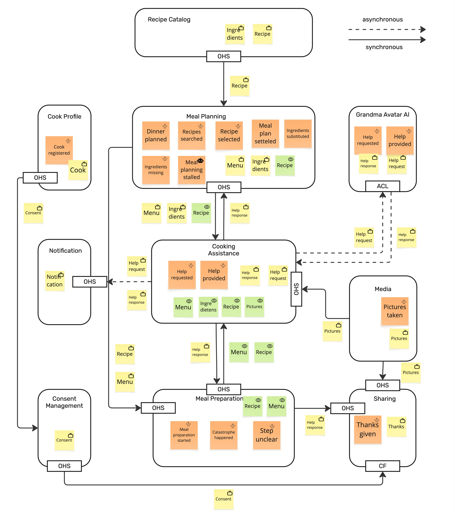
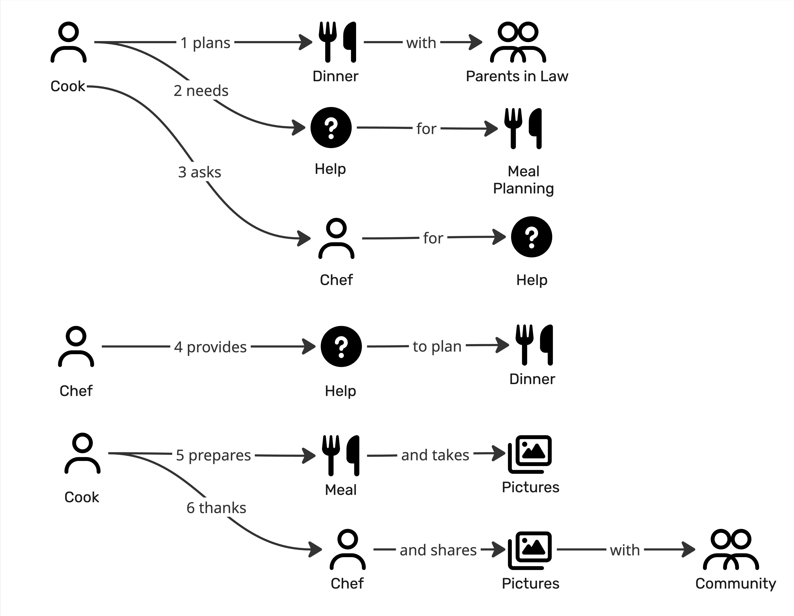
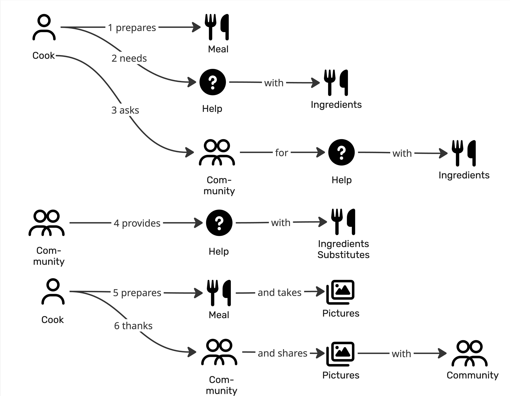
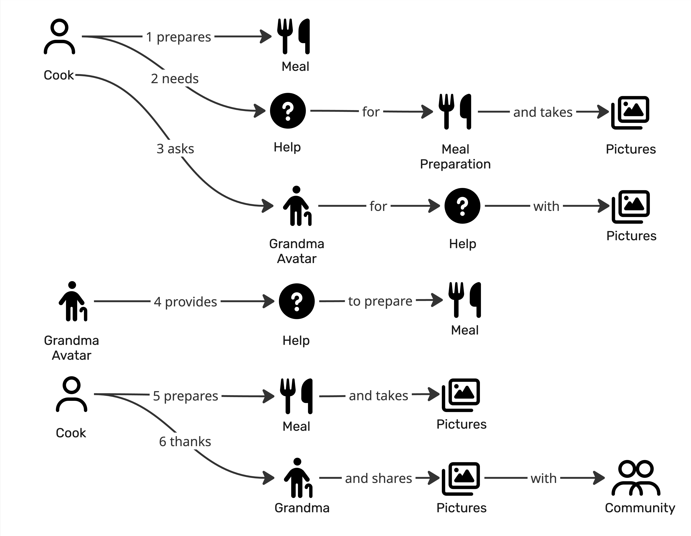
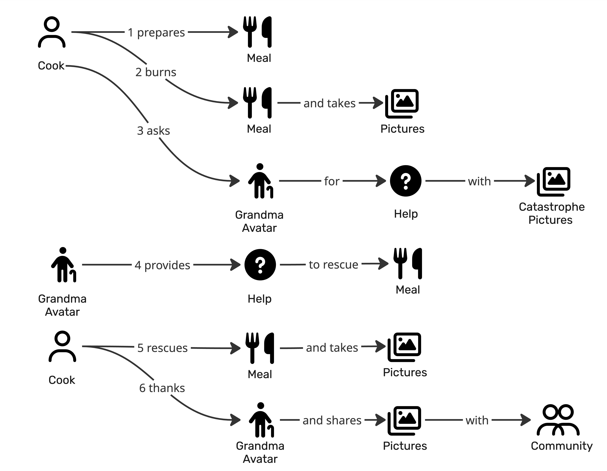
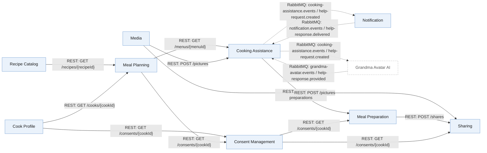
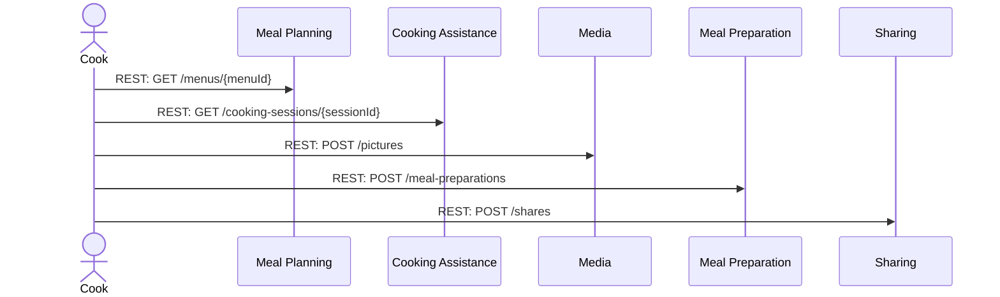
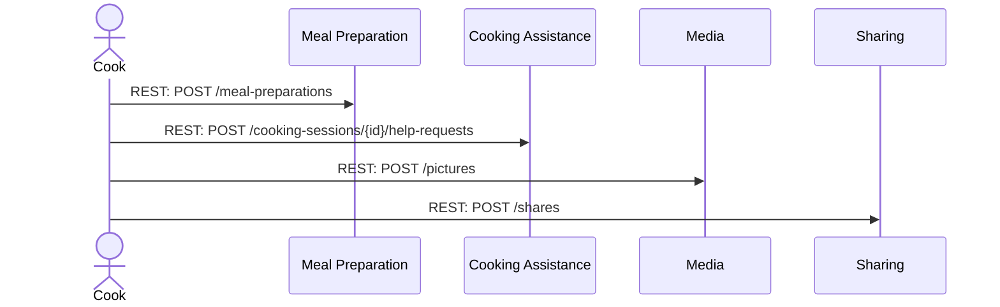
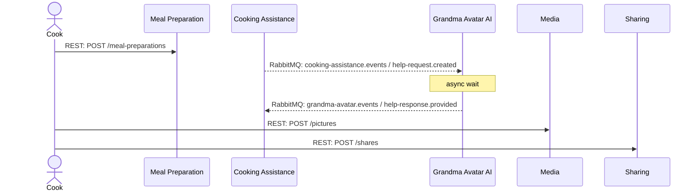
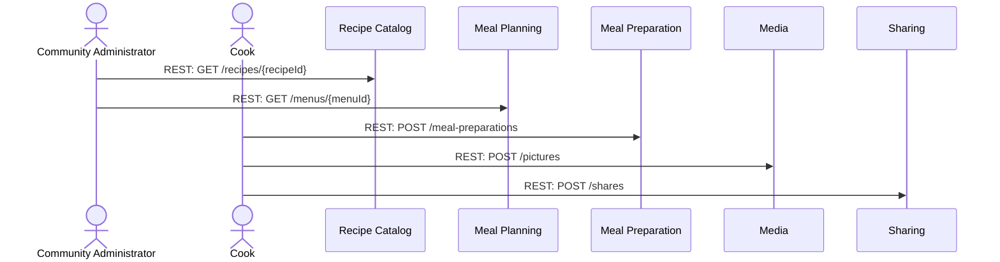

# Prompt 2026-09-20

/context-map-api-proposer

Propose APIs based on the Context Map and the Domain Stories, Visual Glossary and architecture knowledge graph.

[Graph](../assets/KnowledgeGraphWithJwt/graph.ttl)
[Domain Graph](../assets/KnowledgeGraphWithJwt/dkg-adr.ttl)







# Answer


```python
import os
print(os.listdir("."))


```

```text
['visual-glossary.md', 'architecture-graph.md', 'input_file_5.png', 'input_file_4.png', 'input_file_3.png', 'input_file_2.png', 'input_file_1.png', 'input_file_0.png', 'graph.ttl', 'dkg-adr.ttl']


```

```python
import rdflib

g = rdflib.Graph()
g.parse("graph.ttl", format="turtle")
print(f"Graph loaded with {len(g)} triples")

# Let's query Decisions and Principles
query_decisions = """
PREFIX dkg: <https://w3id.org/dkg/ns#>
SELECT ?d ?id ?status ?option WHERE {
    ?d a dkg:Decision ;
       dkg:decisionId ?id ;
       dkg:status ?status ;
       dkg:decidedOption ?option .
}
"""
for row in g.query(query_decisions):
    print(row)


```

```text
Traceback (most recent call last):
  File "<xbox-string>", line 1, in <module>
    import rdflib
ModuleNotFoundError: No module named 'rdflib'


```

```python
from PIL import Image
import os

for f in sorted(os.listdir(".")):
    if f.endswith(".png") or f.endswith(".jpg"):
        im = Image.open(f)
        print(f, im.size, im.format)


```

```text
input_file_0.png (909, 1024) JPEG
input_file_1.png (1024, 482) JPEG
input_file_2.png (1024, 795) JPEG
input_file_3.png (1024, 795) JPEG
input_file_4.png (830, 1024) JPEG
input_file_5.png (1024, 795) JPEG


```

```python
try:
    import pytesseract
    for f in sorted(os.listdir(".")):
        if f.startswith("input_file"):
            txt = pytesseract.image_to_string(Image.open(f))
            first_line = txt.split('\n')[0] if txt else ''
            print(f, first_line[:50], "...")
except Exception as e:
    print(e)


```

```text
No module named 'pytesseract'


```

```python
# Let's verify our Mermaid syntax constructs mentally or write a small script to validate formatting

landscape_mermaid = """flowchart LR
  classDef ctx fill:#EAF2FB,stroke:#6E9BD1,color:#1A1A1A
  classDef offboard fill:#FFFFFF,stroke:#B0B0B0,stroke-dasharray:4 3,color:#5A5A5A

  RecipeCatalog["Recipe Catalog"]:::ctx
  CookProfile["Cook Profile"]:::ctx
  MealPlanning["Meal Planning"]:::ctx
  CookingAssistance["Cooking Assistance"]:::ctx
  Notification["Notification"]:::ctx
  GrandmaAvatarAI["Grandma Avatar AI"]:::offboard
  Media["Media"]:::ctx
  ConsentManagement["Consent Management"]:::ctx
  MealPreparation["Meal Preparation"]:::ctx
  Sharing["Sharing"]:::ctx

  RecipeCatalog -->|"REST: GET /recipes/{recipeId}"| MealPlanning
  CookProfile -->|"REST: GET /cooks/{cookId}"| MealPlanning
  CookProfile -->|"REST: GET /consents/{cookId}"| ConsentManagement
  MealPlanning -->|"REST: GET /menus/{menuId}"| CookingAssistance
  MealPlanning -->|"REST: GET /consents/{cookId}"| ConsentManagement
  CookingAssistance -.->|"RabbitMQ: cooking-assistance.events / help-request.created"| Notification
  Notification -.->|"RabbitMQ: notification.events / help-response.delivered"| CookingAssistance
  CookingAssistance -.->|"RabbitMQ: cooking-assistance.events / help-request.created"| GrandmaAvatarAI
  GrandmaAvatarAI -.->|"RabbitMQ: grandma-avatar.events / help-response.provided"| CookingAssistance
  Media -->|"REST: POST /pictures"| CookingAssistance
  CookingAssistance -->|"REST: POST /meal-preparations"| MealPreparation
  ConsentManagement -->|"REST: GET /consents/{cookId}"| MealPreparation
  Media -->|"REST: POST /pictures"| Sharing
  MealPreparation -->|"REST: POST /shares"| Sharing
  ConsentManagement -->|"REST: GET /consents/{cookId}"| Sharing
"""

print("Mermaid Landscape Length:", len(landscape_mermaid))


```

```text
Mermaid Landscape Length: 1635


```

# API Proposal — Larder System

## 0. Inputs

* **Context Map Source**: `09_ContextMap.jpg`.


* **Domain Stories Supplied**:
* `06a_DomainStoryAskChef.jpg` (covers Meal Planning, Cooking Assistance, Media, Meal Preparation, Sharing).


* `06b_DomainStoryAskCommunity.jpg` (covers Meal Preparation, Cooking Assistance, Media, Sharing).


* `06c_DomainStoryCompetition.jpg` (covers Recipe Catalog, Meal Planning, Meal Preparation, Media, Sharing, Cook Profile).


* `06e_DomainStoryGrandmaII.jpg` (covers Meal Preparation, Cooking Assistance, Grandma Avatar AI, Media, Sharing).


* **Visual Glossary**: `VIsualGlossaryEnhanced.jpg` (provides naming authority, entity/value object hierarchy, and cardinality constraints).


* **Architecture Knowledge Graph**: `graph.ttl` and `dkg-adr.ttl` (provides standing Principles AP0001–AP0008 and Decisions ADR0001–ADR0005, SADR0001–SADR0007b).


* **Technologies Confirmed via Knowledge Graph**:
* **Synchronous**: **REST** (settled by Adopted Decision ADR0004).


* **Asynchronous**: **RabbitMQ** (settled by Adopted Decision ADR0003).


---

## 1. Border Ledger

| From | To | Crossing | Glossary term | Type | Map's stated mechanism | Staleness | Evidence |
| --- | --- | --- | --- | --- | --- | --- | --- |
| Recipe Catalog | Meal Planning | Recipe lookup | `Recipe` | qry | synchronous call | immediate | solid arrow + OHS

|
| Cook Profile | Meal Planning | Cook profile lookup | `Cook` | qry | synchronous call | immediate | solid arrow + OHS

|
| Meal Planning | Cooking Assistance | Menu & recipe details | `Menu`, `Recipe`, `Ingredient` | qry | synchronous call | immediate | solid arrow + OHS

|
| Meal Planning | Consent Management | Recipe & menu consent check | `Recipe`, `Menu` | qry | synchronous call | immediate | solid arrow

|
| Cook Profile | Consent Management | Cook consent lookup | `Cook` | qry | synchronous call | immediate | solid arrow + OHS

|
| Cooking Assistance | Notification | Help request notification | `Help Request` | evt | event / published | minutes | dashed arrow + OHS

|
| Notification | Cooking Assistance | Help response delivery | `Help Response` | evt | event / published | minutes | dashed arrow + OHS

|
| Cooking Assistance | Grandma Avatar AI | Help request to AI | `Help Request` | evt | event / published | minutes | dashed arrow + ACL

|
| Grandma Avatar AI | Cooking Assistance | Help response from AI | `Help Response` | evt | event / published | minutes | dashed arrow + ACL

|
| Media | Cooking Assistance | Picture asset fetch | `Picture` | qry | synchronous call | immediate | solid arrow + SHO

|
| Cooking Assistance | Meal Preparation | Preparation context | `Menu`, `Recipe` | cmd | synchronous call | immediate | solid arrow + OHS

|
| Consent Management | Meal Preparation | Preparation consent check | `Consent` | qry | synchronous call | immediate | solid arrow + OHS

|
| Media | Sharing | Picture payload for share | `Picture` | cmd | synchronous call | immediate | solid arrow + OHS

|
| Meal Preparation | Sharing | Help response & thanks sharing | `Help Response`, `Thanks` | cmd | synchronous call | immediate | solid arrow + OHS

|
| Consent Management | Sharing | Sharing consent check | `Consent` | qry | synchronous call | immediate | solid arrow + CF

|

---

## 2. Sync/Async Classification

| Border | Verdict | Confidence | Evidence |
| --- | --- | --- | --- |
| Recipe Catalog → Meal Planning | sync | stated | Solid arrow on map; aligns with AP0001/AP0006.

|
| Cook Profile → Meal Planning | sync | stated | Solid arrow on map; aligns with AP0001/AP0006.

|
| Meal Planning → Cooking Assistance | sync | stated | Solid arrow on map; aligns with AP0001/AP0006.

|
| Meal Planning → Consent Management | sync | stated | Solid arrow on map; aligns with AP0001/AP0006.

|
| Cook Profile → Consent Management | sync | stated | Solid arrow on map; aligns with AP0001/AP0006.

|
| Cooking Assistance → Notification | async | graph | ADR0003 mandates asynchronous communication via RabbitMQ; dashed arrow on map.

|
| Notification → Cooking Assistance | async | graph | ADR0003 mandates asynchronous communication via RabbitMQ; dashed arrow on map.

|
| Cooking Assistance → Grandma Avatar AI | async | graph | ADR0003 mandates asynchronous communication via RabbitMQ; dashed arrow on map.

|
| Grandma Avatar AI → Cooking Assistance | async | graph | ADR0003 mandates asynchronous communication via RabbitMQ; dashed arrow on map.

|
| Media → Cooking Assistance | sync | stated | Solid arrow on map; aligns with AP0001/AP0006.

|
| Cooking Assistance → Meal Preparation | sync | stated | Solid arrow on map; aligns with AP0001/AP0006.

|
| Consent Management → Meal Preparation | sync | stated | Solid arrow on map; aligns with AP0001/AP0006.

|
| Media → Sharing | sync | stated | Solid arrow on map; aligns with AP0001/AP0006.

|
| Meal Preparation → Sharing | sync | stated | Solid arrow on map; aligns with AP0001/AP0006.

|
| Consent Management → Sharing | sync | stated | Solid arrow on map; aligns with AP0001/AP0006.

|

---

## 3. Synchronous API Sketches, per context (REST)

### 3.1 Recipe Catalog

| Operation | Rough input | Rough output | From border / story | Sketch |
| --- | --- | --- | --- | --- |
| Get Recipe | `recipeId` | `recipeId`, `ingredients` (array 1..*), `steps` (array 1..*) | Recipe Catalog → Meal Planning, Story #06c

| `GET /recipes/{recipeId}` |

### 3.2 Cook Profile

| Operation | Rough input | Rough output | From border / story | Sketch |
| --- | --- | --- | --- | --- |
| Get Cook Profile | `cookId` | `cookId`, `name` | Cook Profile → Meal Planning, SADR0007b

| `GET /cooks/{cookId}` |

### 3.3 Meal Planning

| Operation | Rough input | Rough output | From border / story | Sketch |
| --- | --- | --- | --- | --- |
| Get Menu | `menuId` | `menuId`, `courses` (array 1..*), `recipes` (array 1..*) | Meal Planning → Cooking Assistance, Story #06a, SADR0003

| `GET /menus/{menuId}` |

### 3.4 Consent Management

| Operation | Rough input | Rough output | From border / story | Sketch |
| --- | --- | --- | --- | --- |
| Validate Consent | `cookId`, `scope` | `consentId`, `granted` | Cook Profile / Meal Planning / Meal Preparation / Sharing → Consent Management

| `GET /consents/{cookId}` |

### 3.5 Cooking Assistance

| Operation | Rough input | Rough output | From border / story | Sketch |
| --- | --- | --- | --- | --- |
| Get Active Cooking Session | `sessionId` | `sessionId`, `menuId`, `recipeId`, `helpRequests` (array 0..*) | Cooking Assistance → Meal Preparation, Stories #06a, #06b, #06e

| `GET /cooking-sessions/{sessionId}` |

### 3.6 Media

| Operation | Rough input | Rough output | From border / story | Sketch |
| --- | --- | --- | --- | --- |
| Upload Picture | `pictureData` | `pictureId`, `url` | Media → Cooking Assistance / Sharing, Stories #06a, #06b, #06e

| `POST /pictures` |

### 3.7 Meal Preparation

| Operation | Rough input | Rough output | From border / story | Sketch |
| --- | --- | --- | --- | --- |
| Start Meal Preparation | `cookId`, `menuId`, `recipeId` | `preparationId`, `status` | Cooking Assistance → Meal Preparation, Stories #06a, #06b, #06e

| `POST /meal-preparations` |

### 3.8 Sharing

| Operation | Rough input | Rough output | From border / story | Sketch |
| --- | --- | --- | --- | --- |
| Post Thanks & Share Pictures | `cookId`, `helpRequestId`, `pictures` (array 0..10), `thanksText` | `shareId`, `createdAt` | Meal Preparation / Media → Sharing, Stories #06a, #06b, #06e

| `POST /shares` |

---

## 4. Asynchronous API Sketches, per context (RabbitMQ)

### 4.1 Cooking Assistance (Producer)

| Channel / exchange | Messages produced | Messages consumed | Rough payload | Sketch |
| --- | --- | --- | --- | --- |
| `cooking-assistance.events` | `HelpRequestCreated` | — | `helpRequestId`, `cookId`, `recipeId`, `stepId`, `pictures` (array 0..10) | Exchange: `cooking-assistance.events`, Routing Key: `help-request.created` |

### 4.2 Grandma Avatar AI (Producer)

| Channel / exchange | Messages produced | Messages consumed | Rough payload | Sketch |
| --- | --- | --- | --- | --- |
| `grandma-avatar.events` | `HelpResponseProvided` | — | `helpRequestId`, `preparationStepExplanations` (1), `stepsToMitigateCatastrophe` (array 1..10), `ingredientSubstitutes` (array 1..3) | Exchange: `grandma-avatar.events`, Routing Key: `help-response.provided` |

### 4.3 Notification (Producer)

| Channel / exchange | Messages produced | Messages consumed | Rough payload | Sketch |
| --- | --- | --- | --- | --- |
| `notification.events` | `HelpResponseDelivered` | — | `helpRequestId`, `status` | Exchange: `notification.events`, Routing Key: `help-response.delivered` |

---

## 5. Proposed Arazzo Files

| Proposed file name | Actor | Goal | Contexts touched, in order | Step sketch | Arazzo version |
| --- | --- | --- | --- | --- | --- |
| `ask-chef-guidance.arazzo.yaml` | Cook / Chef | Request guidance from Chef, prepare meal, take pictures, and share thanks | Meal Planning → Cooking Assistance → Media → Meal Preparation → Sharing | Step 1 (sync): `GET /menus/{menuId}`<br>

<br>Step 2 (sync): `GET /cooking-sessions/{sessionId}`<br>

<br>Step 3 (sync): `POST /pictures`<br>

<br>Step 4 (sync): `POST /meal-preparations`<br>

<br>Step 5 (sync): `POST /shares` | `1.0.1` |
| `ask-community-help.arazzo.yaml` | Cook / Community | Request ingredient help from Community, receive substitutes, take pictures, and share thanks | Meal Preparation → Cooking Assistance → Media → Sharing | Step 1 (sync): `POST /meal-preparations`<br>

<br>Step 2 (sync): `POST /cooking-sessions/{id}/help-requests`<br>

<br>Step 3 (sync): `POST /pictures`<br>

<br>Step 4 (sync): `POST /shares` | `1.0.1` |
| `ask-grandma-avatar-help.arazzo.yaml` | Cook / Grandma Avatar AI | Request preparation help from Grandma Avatar AI asynchronously, receive response, prepare meal, take pictures, and share thanks | Meal Preparation → Cooking Assistance → Grandma Avatar AI → Media → Sharing | Step 1 (sync): `POST /meal-preparations`<br>

<br>Step 2 (async wait): Exchange `cooking-assistance.events` / Key `help-request.created`<br>

<br>Step 3 (async wait): Exchange `grandma-avatar.events` / Key `help-response.provided`<br>

<br>Step 4 (sync): `POST /pictures`<br>

<br>Step 5 (sync): `POST /shares` | `1.1.0` |
| `community-competition.arazzo.yaml` | Community Admin / Cook | Run community competition, register cooks, prepare competition meal, rate entries, and crown winner | Recipe Catalog → Meal Planning → Meal Preparation → Media → Sharing → Cook Profile | Step 1 (sync): `GET /recipes/{recipeId}`<br>

<br>Step 2 (sync): `GET /menus/{menuId}`<br>

<br>Step 3 (sync): `POST /meal-preparations`<br>

<br>Step 4 (sync): `POST /pictures`<br>

<br>Step 5 (sync): `POST /shares` | `1.0.1` |

---

## 6. Diagrams

### 6.1 API Landscape Diagram

*(Drawn directly from Section 1–5 ledgers)*



---

### 6.2 Sequence Diagrams per Journey

#### Journey 1: `ask-chef-guidance.arazzo.yaml`

*(Drawn directly from Story #06a)*



#### Journey 2: `ask-community-help.arazzo.yaml`

*(Drawn directly from Story #06b)*



#### Journey 3: `ask-grandma-avatar-help.arazzo.yaml`

*(Drawn directly from Story #06e)*



#### Journey 4: `community-competition.arazzo.yaml`

*(Drawn directly from Story #06c)*



---

## 7. Terminology

* **Glossary Overrides & Reconciliations**:
* `Meal plan` on map/stories → overridden to `Menu` per Visual Glossary and Decision SADR0003.


* `Help` on map → split into `Help Request` and `Help Response` per Visual Glossary and Decision SADR0004.


* `Grandma Avatar` on map → normalized to `Grandma Avatar AI` per Knowledge Graph.


* **Dead Vocabulary in Glossary** *(terms with no explicit cross-context border crossings)*:
* `Dinner`, `Course`, `Preparation Step Explanation`, `Steps to Mitigate Catastrophe`. These are internal domain concepts within single bounded contexts.


---

## 8. Architecture Context

* **ADR0003** (Adopted): Settles asynchronous messaging via **RabbitMQ** for Cooking Assistance, Notification, and Grandma Avatar AI. Honors **AP0002** ("Asynchronous Communication before Synchronous").


* **ADR0004** (Adopted): Settles synchronous UI/BC communication via **REST API**. Honors **AP0006** ("Synchronous communication for UIs") and **AP0008** ("Fine grained access rights").


* **ADR0001** (Adopted): Modular Monolith deployment model. Honors **AP0001** ("Monolith before Microservices") and **AP0003** ("Using DDD").


* **ADR0002** (Adopted): One database instance with separate schemas per Bounded Context module.


* **ADR0005** (Adopted): Orchestrator UI / AppShell pattern. Flagged: Unacknowledged override of **AP0005b** ("Micro-UIs") regarding team independence (`dkg:acknowledged false`).


* **SADR0007b** (Adopted): JWT carries `cookId` across Bounded Contexts.


* **Uncited / Untestable Principles Check**:
* **AP0004** ("Using Residuality"): Dead letter in current ADR set (not cited by any decision).


---

## 9. Coverage Gaps

* **Borders with No Direct Story Evidence**: `Consent Management` interactions. Consent checks for Cook Profile, Meal Planning, Meal Preparation, and Sharing exist on the Context Map, but are not drawn as explicit step nodes in domain stories #06a–06e.


* **Contexts with No Domain Story**: `Consent Management` (acts as a background policy enforcement context across scenarios).
* **Single-Context Journeys Excluded from §5**: Internal recipe browsing within `Recipe Catalog` and cook registration within `Cook Profile` do not cross context boundaries and require no Arazzo files.

---

## 10. Handoff

* **REST Synchronous Specifications**: Hand over Section 3 sketches to `openapi-spec-author` to produce OpenAPI 3.1 YAML files (requires HTTP status codes, JSON Schemas, error models, and JWT authorization headers using `cookId`).
* **Asynchronous Event Specifications**: Hand over Section 4 sketches to `asyncapi-spec-author` to produce AsyncAPI 3.0 documents (requires AMQP 0-9-1 bindings for RabbitMQ exchanges/queues and JSON payload schemas).
* **Multi-Call Journey Specifications**: Hand over Section 5 proposals to `arazzo-from-event-model` or `arazzo-spec-author` to generate full Arazzo 1.0.1 / 1.1.0 YAML files (requires step output parameters, success criteria, and failure recovery actions).