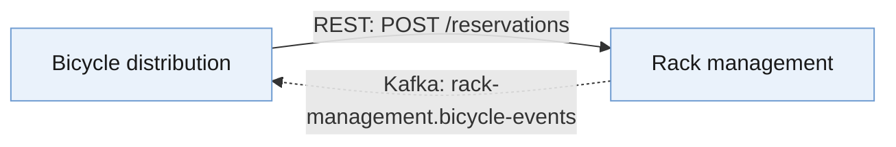
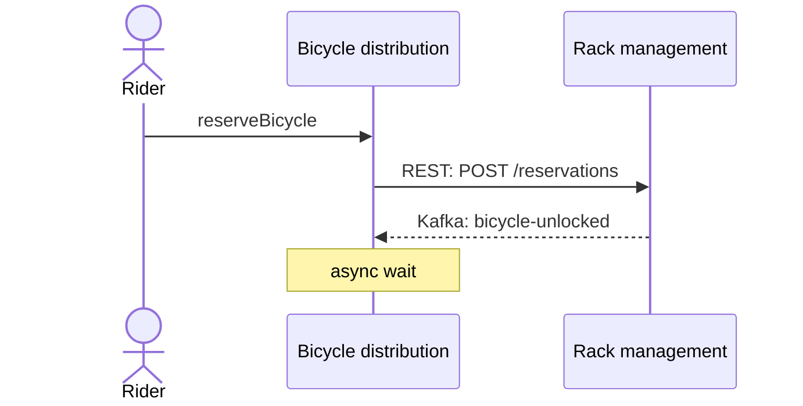

# Context Map API Proposer

A context map says which borders exist and what crosses them. A domain story
says what a person actually does when a crossing happens. Neither alone is
enough to propose an API: the map gives you the border without the traffic,
the story gives you the traffic without the border. Put together, they tell
you which contexts need a synchronous interface, which need an asynchronous
one, and which user journeys will need to call several APIs in sequence.

Those two things can arrive as **pictures and text** (a context map, the
stories, maybe a glossary) or already merged into **one domain knowledge
graph** — or as a graph with a few pictures that were never ingested. The
workflow and the report are the same either way; only where Step 1's ledger
comes from changes.

**This skill proposes; it does not specify.** The output is deliberately
rough — operation names, rough inputs/outputs, a one-line technology sketch —
exactly enough for a room full of humans to agree on scope and pick which
borders are worth turning into a real specification. Full OpenAPI, AsyncAPI,
gRPC/GraphQL schemas, or Arazzo YAML are the *next* step, done by the sibling
skills listed at the end, once the team has confirmed this sketch.

Four commitments keep the sketch trustworthy:

- **Every operation traces to a border and a story.** A crossing with no
  story evidence gets proposed anyway (the map still says it exists) but is
  marked `(no story evidence)` rather than invented dialogue.
- **Sync/async is a classification with evidence, not a guess.** Every border
  gets a verdict *and* the evidence it rests on, ranked `stated` > `inferred`
  > `default`. A `default` verdict is a flag for the room to confirm, not a
  finding to present as fact.
- **Technology choice belongs to the user, always.** Never pick REST over
  gRPC, or Kafka over RabbitMQ, because the domain "obviously wants" one —
  ask once, plainly, before sketching operations.
- **Every diagram traces to a table.** The Mermaid diagrams in Step 7 are a
  rendering of the ledgers already built, never a second, independent pass —
  a node or edge that isn't backed by a row in §1–5 doesn't get drawn.

## Inputs — three lanes, same workflow

| Lane | You were given | Borders come from | Stories come from | Names and shapes come from |
|---|---|---|---|---|
| **Artifact** | a Context Map + Domain Stories, as images, exports or text | the map | the stories | a Visual Glossary, if supplied |
| **Graph** | a domain knowledge graph (`.ttl`) | derived from the graph | the graph's `dkg:DomainStory` artifacts | the graph's glossary terms |
| **Mixed** | a graph **and** images not yet in it | graph first, images added, disagreements kept | both | both |

Pick the lane from what is actually in front of you — a `.ttl` upload, an
image, pasted sentences — and say which lane you are in. If nothing was
supplied, ask once: *"Do you have a domain knowledge graph (.ttl), or the
context map and domain stories as pictures/text — or both?"* Never ask a
graph-lane user for a context map, stories or a glossary before running the
extractor: the graph may already hold all three, and its §0 tells you exactly
which it lacks.

### Graph lane

**Read `references/domain-knowledge-graph.md` first**, then run:

```bash
pip install rdflib --break-system-packages
python3 scripts/graph_inputs.py <graph.ttl> --json /tmp/graph_inputs.json
```

The graph vocabulary has **no context-map class** — the map is implicit in
what the graph's canvases, boards, event models, stories and glossaries say
crosses between contexts. The script makes it explicit as ranked border
candidates (B1 canvas message → B5 glossary reference only), and also prints
the journeys, the terminology and cardinalities, the current decisions and
testable principles, the open questions, and **what the graph cannot supply**.
That last list is not boilerplate: every line of it goes into the report's
Coverage gaps. Show the user the contexts and border candidates before
classifying anything — a wrong border is cheapest to catch there.

One graph does every job at once here: it is the map, the stories, the
glossary *and* the architecture knowledge graph described below. Don't ask
for any of them separately unless the extractor says it is missing.

### Artifact lane

- **The Context Map.** Needs, per border: the two contexts, what crosses,
  the mechanism if the map states one, and the staleness window if it states
  one — the shape `event-storming-context-mapper` or
  `domain-story-context-finder` produce. A team-drawn map with the same
  fields works too, as a photo, a Miro export or text. If the map doesn't
  state a mechanism for a border, that's fine — Step 2 has a fallback — but
  say so rather than inventing one.
- **The Domain Stories belonging to the map's contexts.** Numbered
  actor→activity→work-object sentences (pictures, egon.io exports, or plain
  text), covering as many border crossings as exist. Coverage need not be
  complete — say which borders have no story evidence rather than declining.

Transcribe an image before using it — contexts, arrows and labels for a map,
numbered sentences for a story — and show the transcription, so a misread
arrowhead is caught before it becomes an operation.

**If there's no context map yet**, stop and get one first:
`event-storming-context-mapper` from an EventStorming board, or
`domain-story-context-finder` straight from the stories. Proposing APIs over
a cut invented inside this skill produces confident-looking answers to the
wrong question.

**If there are no domain stories**, ask for them before sketching operations
— they're what turns "a border exists" into "here's what actually gets
called and when." If none exist yet, offer `domain-story-seeder` to draft
strawman stories from the map's own contexts rather than proceeding on the
map alone; if the user wants to proceed anyway, mark every operation in the
output `(no story evidence)` and say the sketch is border-only.

### Mixed lane

A graph plus a photo — typically a context map nobody ingested, a new story,
or a redrawn glossary. Run the extractor, check each image against the
graph's artifact list (already ingested → work from the graph), then build
the ledger graph-first and add what the images contribute, with a `Source`
column (`graph` / `image` / `both`). **Where graph and image disagree, keep
both in the row and flag it** — neither wins by default; ask when it changes
a verdict. An un-ingested context map is the best image to have beside a
graph: its mechanism and staleness labels are what the vocabulary cannot
hold. Offer `domain-knowledge-graph` to ingest the images afterwards; never
write to the `.ttl` from here (`references/domain-knowledge-graph.md` §8).

**Bonus inputs in the artifact lane, worth one ask each** (the graph lane
already has whichever of these were ingested):

| If you also have | It sharpens |
|---|---|
| A Visual Glossary | The terminology authority for every name and shape in the sketch — see below. |
| An architecture knowledge graph (`.ttl`) | Already-settled decisions and principle constraints, checked before defaulting or asking — see below. |
| Bounded Context Canvases | Their message ledger is already typed cmd/qry/evt — reuse it directly in Step 1 instead of rebuilding it. |
| An invariants sheet (`event-storming-invariant-finder` / `event-model-invariant-finder`) | Failure cases worth flagging for later `onFailure` actions in the Arazzo files. |

### Using a Visual Glossary, when one exists

*(Graph lane: the extractor's §4 is the glossary — same rules, plus the
graph-only distinctions in `references/domain-knowledge-graph.md` §6: derived
cardinalities, non-glossary concepts, and terms renamed across a border.)*

If a Visual Glossary exists for the map's contexts, it's the authority on
**naming and field shape** — read `references/visual-glossary.md` before
Step 4 for how it overrides the map's/stories' own wording, turns
cardinality into singular-vs-array shape, and distinguishes an entity
(worth its own operation) from a value object (stays an inline field).
Ask once whether one exists, even if nobody mentioned it.

### Using an architecture knowledge graph, when one exists

*(Graph lane: this is the same file — the extractor's §5 already lists its
current Decisions and testable Principles. The rules below apply unchanged.)*

If a `.ttl` architecture knowledge graph exists — built by
`domain-knowledge-graph` and/or grown by `adr-and-principles-ingester` —
it's the authority on **what's already been decided**, the way the
glossary is the authority on naming: read `references/architecture-graph.md`
before Step 2 for how to load it, match Decisions/Principles to a border or
a technology question, and where it changes Steps 2, 3, and 4–5 (a new top
evidence rung, fewer things to ask, and a compliance flag on the sketch).
Ask once whether one exists, even if nobody mentioned it — the answer
changes how much of Step 2 and Step 3 is still open to derive versus
already settled.

## Workflow

### Step 1 — Build the border ledger

One row per crossing, across the whole map (skip this if a canvas message
ledger already exists — copy it in):

| From | To | Crossing | Glossary term | Type | Map's stated mechanism | Staleness | Evidence |
|---|---|---|---|---|---|---|---|
| Bicycle distribution | Rack management | Reserve a bicycle | Reservation | cmd | *(unstated)* | — | crossing on the map, no mechanism noted |
| Rack management | Bicycle distribution | Bicycle unlocked | Bicycle | evt | event | minutes | dashed arrow + sticky |

Type each crossing the same way `bounded-context-canvas-author` does: **cmd**
(an instruction that can be refused), **qry** (a question answered with data,
no state change), **evt** (a fact already true). When the map genuinely
doesn't say, write `?` and resolve it in Step 2 rather than guessing here.

**Graph lane:** the ledger is the extractor's §2, one row per border
candidate, with three columns added — `Rung` (B1–B5), `Border confidence`
(the graph's `on-artifact` / `implied` / `inferred` for *the border existing*,
which is a different question from sync/async confidence) and `Story
sentences`. `Evidence` cites the node and its locator as printed. Keep every
`?` type as `?` here. Resolve pending context merges before going on — a row
noted `NOT A BORDER if … is confirmed` links two names the graph suspects are
one context; ask once, and never sketch an API between them unasked.
`Map's stated mechanism` and `Staleness` will mostly read *(not in graph)* —
leave them that way. **Mixed lane:** add `Source`.

Drop the `Glossary term` column entirely when no glossary was supplied; when
one was, fill it with the glossary's own spelling of the crossing's subject
and leave it blank (not guessed) for a crossing the glossary doesn't cover.

### Step 2 — Classify each crossing synchronous or asynchronous

Work down this evidence hierarchy per row; stop at the first rung that
applies, and record which rung settled it:

1. **The architecture knowledge graph already decided it**, if one exists.
   An Accepted/Adopted Decision naming this border's integration pattern →
   its verdict, `graph` confidence, cite the Decision. Absent a
   border-specific Decision, a `dkg:testable true` Principle setting a
   general default (with no conflicting Decision) → that default, marked
   `principle-default`, cite the Principle.
2. **The map already says.** "Synchronous call", "API call", "request/reply"
   → **sync**. "Event", "published", "replicated read model" → **async**.
   "File", "human handoff" → **out of scope** — note it, it isn't becoming an
   API here.
3. **The staleness window says.** Stated as immediate / none → leans
   **sync**. Stated in minutes, hours, or days → leans **async** — nobody
   builds a synchronous call with a two-hour timeout.
4. **The domain story says.** Does the very next sentence show the same
   actor using the result immediately (reading a confirmation, being shown a
   value)? → **sync**. Does the story move on to a different actor, a later
   time, or a separate trigger before anything comes back? → **async**.
5. **Type default**, only when 1–4 are all silent, and always marked
   `(default)`: qry → sync, evt → async, cmd → sync. A `cmd` default is the
   weakest of the lot — commands are frequently fire-and-forget in
   practice — so flag it hardest in the open questions.

**Graph lane:** same rungs, read from the extractor — rung 1 from its §5
(current decisions, testable principles only), rung 4 from its §3 (the row
after a filled `Crosses` cell). Rung 2 fires only where a comment or canvas
assumption states a mechanism in words: `messageKind evt` types the message,
it does not put it on a broker. Rung 3 is usually silent. A `?`-typed row gets
its type here, marked `inferred`. Details: reference §5.

Give every row in the ledger a `Verdict` (sync/async/out-of-scope) and a
`Confidence` (`graph`/`principle-default`/`stated`/`inferred`/`default`). A
ledger where every row is `default` means the map, the stories, and the
graph didn't actually answer the question this skill exists to answer —
say that plainly rather than dressing it up as a finished proposal.

### Step 3 — Ask which technologies to sketch toward

Before asking, check the graph (if one exists) for an Accepted Decision or
an unambiguous Principle that already commits to a synchronous and/or
asynchronous technology. Where it does, state the technology and cite the
source instead of asking about that half; where it only shows a
preference, still ask but mention the preference as a hint; where two
Accepted Decisions answer the same technology question differently, surface
both verbatim as a contradiction in the team's own record and ask the user
to resolve it. For whatever the graph leaves open, ask once, before writing
a single operation:

> For the **synchronous** crossings, should I sketch toward **REST**,
> **gRPC**, or **GraphQL**?
> For the **asynchronous** crossings, **Kafka** or **RabbitMQ**?

If an elicitation tool is available, use it (two single-select questions).
Otherwise ask in plain text and wait for the answer — do not default silently.
If the user explicitly says "you choose" or "doesn't matter", default to REST
and Kafka, but label every technology-specific line in the output
`(unconfirmed default)` so it's obvious the choice was never actually made.
A later answer can be applied by re-running Steps 4–6 without repeating 1–3.

### Step 4 — Sketch the synchronous side, per context

For every context that is the **provider** (the callee) of a `sync`-verdict
crossing, list its candidate operations:

| Operation | Rough input | Rough output | From border / story | Sketch |
|---|---|---|---|---|
| Reserve a bicycle | riderId, rackId | reservationId, expiresAt | Bicycle distribution → Rack management, story #4 | `POST /reservations` |

Name the operation from the crossing's own verb, but the resource noun in
the path/message/field comes from the glossary term when one exists (e.g.
`reservationId` over a story's looser "booking"), otherwise from the
crossing's own wording. The `Sketch` column depends on the chosen
technology and stays one line:

- **REST**: `METHOD /kebab-case-path`
- **gRPC**: `ServiceName.rpcName(RequestMessage) returns (ResponseMessage)`
- **GraphQL**: `type Mutation { fieldName(args): ReturnType }` (or `Query`
  for a `qry` crossing)

Rough inputs/outputs are field **names** only — no types, constraints,
status codes, or error shapes; that precision is the next skill's job, not
this one's. Field **shape** (singular vs array, and whether it's optional)
follows the glossary's cardinality rules above when a glossary exists;
otherwise take the shape straight from the crossing or the story's work
object and mark it `(unconfirmed shape)`. In the graph lane, append
`(inferred border)` to every row sketched from a border the graph holds only
as `inferred`, `(derived cardinality)` where the shape rests on a cardinality
the glossary's ingester derived rather than the team drew, and — where the
graph records a term renamed across this border — name the field in the
provider's term with `(consumer calls this <other term>)`. When an architecture knowledge
graph exists, check the operation against its testable Principles and
append `(principle conflict: P<id>)` to the row rather than adjusting the
sketch to quietly comply.

### Step 5 — Sketch the asynchronous side, per context

For every context that is the **producer** of an `async`-verdict crossing,
list its candidate channels:

| Channel / topic | Messages produced | Messages consumed | Rough payload | Sketch |
|---|---|---|---|---|
| Bicycle events | BicycleUnlocked, BicycleReturned | — | bicycleId, rackId, at | Kafka topic: `rack-management.bicycle-events` |

Technology sketch, one line:

- **Kafka**: a topic name, `kebab-case` context prefix + dot-separated event
  group (`context-name.event-group`).
- **RabbitMQ**: an exchange plus routing key, e.g. exchange
  `context.events`, routing key `bicycle.unlocked`.

Same rule as Step 4: message names and payload field names only, no
schemas — the same glossary treatment for naming and singular-vs-array
shape when one exists, and the same `(principle conflict: P<id>)` flag
when an architecture knowledge graph exists and this channel would
override a testable Principle.

### Step 6 — Propose the Arazzo files

Read back through the domain stories for **journeys that cross at least one
border** — an actor whose activities touch more than one bounded context in
one continuous scenario. One candidate Arazzo file per such journey, **not**
one per border: a journey crossing three borders is one file with three (or
more) steps, because the point of Arazzo is the ordered sequence, not the
individual call.

For each journey:

| Field | Content |
|---|---|
| Proposed file name | `<goal-in-kebab-case>.arazzo.yaml` |
| Actor | who drives it, from the story |
| Goal | the outcome the business would recognize as done |
| Contexts touched, in order | from the story's sequence |
| Step sketch | one line per border crossed, each tagged `sync step` or `async wait` from the Step 2 verdict |
| Arazzo version to aim for | `1.0.1` if every step is sync; `1.1.0` if any step is an async wait |

**Graph lane:** the extractor's §3 has one block per story with each
sentence's context and crossing already marked; cite the ledger row in each
step-sketch line. Recount crossings after any context merge was confirmed —
a journey can drop to zero — and say when a sentence was placed only
`(via actor's lane)`. §7's rules per context are the failure cases worth
naming beside a journey.

A journey that never leaves one context needs **no** Arazzo file — that
traffic is just that context's own API from Step 4, not a cross-context
workflow. Say so explicitly rather than proposing a one-step file for
completeness.

### Step 7 — Draw the Mermaid diagrams

Draw these **from the tables already built in Steps 1–6, never from
imagination** — a diagram that doesn't trace back to a row in a table is
worth less than no diagram, because it looks authoritative and isn't.

**7a. The API landscape diagram — always, once Steps 4–5 are done.** One
`flowchart` with one node per context and one edge per operation/channel
from the sketches: a solid edge for a sync-verdict crossing (Step 4),
labeled with the chosen technology and the operation, and a dashed edge for
an async-verdict crossing (Step 5), labeled with the channel/topic. An
`out-of-scope` crossing from Step 2 (file, human handoff) is **not** drawn
as an edge — note it in prose instead, since it isn't becoming an API.



A context that appears only as an external/off-board party on the map (no
canvas of its own) gets the `offboard` class instead of `ctx`, mirroring how
`event-storming-context-mapper` draws it. Add a one-line legend comment
(`%% solid = synchronous, dashed = asynchronous`) so the diagram reads
without the surrounding prose.

**7b. One journey sequence diagram per proposed Arazzo file from Step 6** —
skip entirely for a context map with no cross-context journeys. Use
`sequenceDiagram`, one participant per actor and per context the journey
touches, in the story's own order: a solid arrow (`->>`) for a sync step
with the operation sketch as the label, a dashed arrow (`-->>`) plus a note
for an async wait.



**Mermaid conventions, both diagram types:**

- Quote every label containing a space, `:`, `/`, `-`, or `·` — Mermaid
  parses unquoted punctuation as syntax.
- Node/participant ids: `PascalCase`, no spaces, never a reserved word
  (`end`, `class`, `graph`, `subgraph`, `style`, `click`, `default`). Give
  the id an alias (`participant X as Human Name`) rather than putting
  spaces in the id itself.
- Use the glossary's exact term spelling in every label, same as the
  tables, when a glossary exists.
- Keep edge labels to the technology sketch already written in Steps 4–5
  — don't invent a fuller description for the diagram that the table
  doesn't carry.
- Render each diagram once before presenting it. A diagram that parses
  cleanly can still lay out unreadably with many contexts; if it does, say
  so and offer to split it (e.g. sync landscape and async landscape as two
  separate diagrams) rather than shrinking labels until they stop being
  useful.

### Step 8 — Write the report

```
# API Proposal — <context map / system name>

## 0. Inputs
Lane (artifact / graph / mixed). Graph lane: the file, the artifacts it holds
by type (extractor §0), and any image checked against it. Context map source, domain stories supplied and which borders they cover,
whether a Visual Glossary was supplied (and whether it needed
`visual-glossary-interpreter` first), bonus inputs used, technologies
confirmed (or defaulted) in Step 3.

## 1. Border ledger
The full table from Step 1, with type and glossary term where one exists.

## 2. Sync/async classification
The ledger from Step 2: border · verdict · confidence · evidence.

## 3. Synchronous API sketches, per context
Step 4's tables, one subsection per context.

## 4. Asynchronous API sketches, per context
Step 5's tables, one subsection per context.

## 5. Proposed Arazzo files
Step 6's table, one entry per cross-context journey.

## 6. Diagrams
The Step 7a landscape diagram, plus one Step 7b sequence diagram per entry
in §5. Each diagram sits directly under the table it was drawn from, not
collected at the end, so a reader can check picture against table without
scrolling.

## 7. Terminology
Only when a glossary exists: every crossing/field where the glossary's
spelling differs from the map's or the story's, the glossary term used
instead, and any glossary term with no matching crossing (dead vocabulary,
worth asking about).

## 8. Architecture context
Only when a graph exists: every `graph`/`principle-default` verdict from
§2 with its citing Decision/Principle, every technology settled or hinted
by the graph in Step 3, every `(principle conflict: P<id>)` flag from §3–4
with the Principle's statement quoted, and any contradiction between two
Accepted Decisions surfaced instead of silently resolved.

## 9. Coverage gaps
Graph lane: every line of the extractor's "cannot supply" list, one-sided
canvas messages, story-only and glossary-only borders, `(inferred border)`
rows, pending merges left unanswered, and the graph's own open questions
that touch a border. Mixed lane: every graph-vs-image disagreement.
Borders with no story evidence, `(default)`-confidence verdicts,
`(unconfirmed shape)` fields, contexts with no domain story at all, and
single-context journeys explicitly excluded from §5.

## 10. Handoff
Which sibling skill turns each part of this sketch into a real
specification (see below), and what each needs that this skill didn't
produce (full schemas, error responses, auth, failure criteria).
```

Adapt depth to the ask — "just tell me sync or async" gets §1–2 only, but
never drop §9: a proposal that hides its gaps reads as a finished design.
Drop §7 when no glossary was supplied and §8 when no graph was supplied,
rather than leaving either empty. The landscape diagram in §6 stays even in
a trimmed report — it's the fastest way for a room to sanity-check the
whole ledger at once.


## Traps worth checking before you publish

- **Trusting the word "event" on the map without checking staleness or the
  story.** Some teams write "event" for anything published on a queue, even
  when the caller blocks for the reply. Rung 2 and 3 exist to catch this.
- **Defaulting every `cmd` to sync because commands sound like requests.**
  Check the story; a lot of commands are fire-and-forget in practice.
- **Writing full schemas here.** Field types, constraints, status codes,
  and error shapes belong in the downstream skills, not in this sketch.
- **One Arazzo file per border.** Doubles the file count and throws away the
  thing that makes Arazzo worth having — the ordered, multi-call sequence.
- **Skipping borders with no story evidence.** Propose them anyway from the
  map alone, tagged `(no story evidence)` — don't quietly drop them.
- **Treating a `(default)` verdict as settled.** It belongs in §9 every time,
  however confident the sketch reads.
- **Silently harmonizing terminology.** When the glossary says `Bicycle`
  and the map's crossing label says `Bike`, use `Bicycle` and *record* the
  discrepancy — don't just quietly pick one and move on.
- **Guessing array-vs-singular without checking the glossary's
  cardinality.** A field sketched as singular that the glossary actually
  bounds `1..*` misleads whoever writes the real schema next.
- **Giving a value object its own operation.** A leaf term with no
  identity of its own belongs inline on its parent's payload; treating it
  as a resource invents an API surface the domain never asked for.
- **Drawing the diagram from memory instead of the tables.** Every node and
  edge in §6 must trace to a row already written in §1–5; a landscape
  diagram that adds a crossing the ledger never had is a new claim, not an
  illustration of an old one.
- **One diagram style doing two jobs.** Mixing solid and dashed arrows
  inconsistently, or drawing an async wait as a plain arrow in a sequence
  diagram, erases the exact distinction §2 spent the whole classification
  step establishing.
- **Choosing the technology for the user.** Even a domain that "obviously"
  wants gRPC still gets asked — *unless* an Accepted Decision or an
  unambiguous Principle in the graph genuinely settles it, and even then
  cite it rather than presenting the choice as your own judgment.
- **Forcing a fuzzy text match into a graph citation.** A Decision that
  merely mentions one of the two context names in passing isn't the same
  as a Decision *about* that border. State the match and let the room judge
  it, rather than presenting a weak match with the same confidence as a
  direct one.
- **Treating an untestable or superseded entry as authoritative.** A
  `dkg:testable false` Principle settles nothing (§2's own rule); a
  superseded Decision is history, not current guidance — check `dkg:status`
  before citing.
- **Quietly redesigning a sketch to dodge a principle conflict.** Flag it
  in the row and in §8; don't just pick the compliant option and erase the
  fact that the map/story pointed the other way.

- **Asking a graph-lane user for the map, stories and glossary anyway**, or
  reading the Turtle by eye. Run the extractor first; ask only for what its
  §0 says is missing. By hand, on a real graph, borders get missed silently.
- **Treating every graph border as equally drawn.** A B1 message on both
  canvases and a B5 glossary arrow are different strengths of claim — and
  neither `on-artifact` nor `messageKind evt` is a sync/async verdict.
- **Sketching an API between two names for one context.** A
  `dkg:proposedSameAs` between a story lane and a board bubble is a question
  for the room before it is a border.
- **Letting the graph silently beat the image, or the image the graph**, or
  writing the answer back into the `.ttl` yourself. Disagreements are
  findings; updates go through `domain-knowledge-graph`.

## Working with neighboring skills

- **No context map yet** → `event-storming-context-mapper` (from a board) or
  `domain-story-context-finder` (straight from stories).
- **No domain stories yet** → `domain-story-seeder` to draft strawman
  scenarios from the map's own contexts.
- **A message ledger already exists, typed cmd/qry/evt** →
  `bounded-context-canvas-author`'s Step 3 — reuse it instead of rebuilding
  in Step 1 here.
- **Ready to write the real synchronous spec, and REST was chosen** →
  `openapi-spec-author`. No bundled skill here authors gRPC `.proto` or
  GraphQL SDL yet — hand the Step 4 sketch over as-is if either was chosen.
- **Ready to write the real asynchronous spec** → `asyncapi-spec-author`,
  which covers Kafka, RabbitMQ, and other broker protocols.
- **Ready to write a real Arazzo file** → `arazzo-from-event-model`, which
  expects an Event Model behind the journey. If none exists yet, offer
  `event-model-author` first — this skill's §5 sketch is the input it needs
  (the journey, its actor, and its ordered borders).
- **Rules that should become `onFailure` actions later** →
  `event-storming-invariant-finder` / `event-model-invariant-finder`.
- **A Visual Glossary exists only as a picture** →
  `visual-glossary-interpreter` first, to get the term catalogue and
  cardinality table this skill's naming/shape rules need.
- **The map, the stories, and the glossary disagree on vocabulary in more
  than a spot check** → `domain-story-glossary-consistency` for a full
  term-by-term reconciliation, rather than resolving it piecemeal inside
  this skill's Terminology section.
- **ADRs or a principles document exist but aren't graphed yet** →
  `adr-and-principles-ingester` to build or grow the `.ttl` this skill
  reads in Step 2–3, and to get the full compliance matrix this skill's
  §8 only samples the API-relevant slice of.
- **No graph at all yet, or the team wants full cross-artifact
  traceability** → `domain-knowledge-graph`, which builds the `.ttl` this
  skill's graph lane runs on.
- **Mixed lane left images un-ingested, or the room confirmed a pending
  merge** → `domain-knowledge-graph` to ingest or record it, so the next run
  is graph-only and the merge is not asked again.
- **The graph has contexts but no border on any rung** →
  `bounded-context-canvas-author` (its message tables become B1 rows once
  ingested), or `event-storming-context-mapper` for a drawn map to use in the
  mixed lane.
- **A `(principle conflict: P<id>)` flag needs a real decision, not just a
  flag** → write the resolution up as a small-ADR row and re-ingest with
  `adr-and-principles-ingester`, which closes the loop the same way it
  does for `architecture-question-finder`'s agenda.
- **The room wants the *full* architecture backlog, not just the
  API-relevant decisions this skill surfaces** →
  `architecture-question-finder`, which mines the same graph for
  boundary, build-vs-buy, and sizing questions beyond sync/async and
  technology choice.

## References

E. Evans, *Domain-Driven Design: Tackling Complexity in the Heart of Design.*
Boston, MA, USA: Addison-Wesley, 2003 — bounded contexts and the borders
between them that this skill turns into candidate interfaces.

A. Dymitruk, *Event Modeling*, eventmodeling.org — the state-change/state-view
distinction behind the cmd/qry split used in the border ledger.

*The Arazzo Specification*, OpenAPI Initiative — v1.0.1 (2025-01-16) and
v1.1.0 (2026-05-17), https://spec.openapis.org/arazzo/latest.html — the
target format for the files proposed in §5.

`references/domain-knowledge-graph.md` — the graph and mixed lanes: running
`scripts/graph_inputs.py`, the B1–B5 border rungs and what each may claim,
graph confidence vs verdict confidence, graph-only terminology rules, mixed
lane reconciliation, what a graph cannot supply, and a worked example on
`assets/example-graph.ttl`. Read it whenever a `.ttl` is an input, before
Step 1.

`references/architecture-graph.md` — how to load a `.ttl` architecture
knowledge graph, match its Decisions and Principles to a border or a
technology question, and where that changes Steps 2, 3, and 4–5. Read it
whenever a graph exists, before Step 2.

`references/visual-glossary.md` — how a Visual Glossary overrides naming
and decides singular-vs-array field shape, and the entity/value-object
distinction that decides what gets its own operation. Read it whenever a
glossary exists, before Step 4.