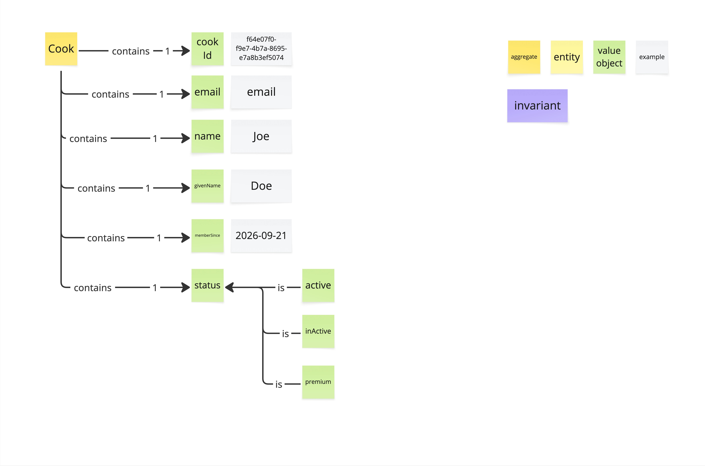

# Prompt 2026-10-04

/devils-advocate

Critique the Visual Glossary of the Cook Profile

# Answer

The board is a finished artifact rather than a live brainstorm, so I'll go straight to pressure-testing it. Three objections I'd stake real weight on, then a few smaller ones. Push back on any of these if I'm misreading your intent.

## 1. `status` is carrying two different ideas

`active` and `inActive` describe the Cook's **lifecycle**: can this person use the platform? `premium` describes a **commercial tier**: what are they paying for? As drawn, these are three mutually exclusive values of one status, which forces some odd conclusions:

- A premium cook can't be "active," because they hold one status or the other.
- A paying cook who gets suspended has to stop being premium.
- When a premium subscription lapses, nothing says whether the cook goes back to `active` or to `inActive`.

My premortem: six months from now someone adds `suspended` or `trial`, and the enum turns into a grab bag that every consumer has to special-case.

What would ease my concern is splitting this into two value objects, say `status` (active / inactive) and `membershipTier` (standard / premium). Another option is to ask whether premium belongs to a Billing or Subscription context and shouldn't be on the Cook Profile at all. If the team has a deliberate reason for one combined field, writing that reason down would settle it.

## 2. The `name` / `givenName` examples look swapped

- `name` = "Joe"
- `givenName` = "Doe"

"Given name" means the first name, which is Joe here. Doe is the family name. Either the labels or the example stickies are wrong. Either way, the result is the same: whoever builds this will store surnames in `givenName`.

This also exposes a deeper ambiguity: what does `name` mean? It could be a display name, a full name, a first name, or a nickname. I'd suggest replacing it with explicit terms such as `givenName` and `familyName`, or `displayName` if that's the actual intent. I'd also check whether the platform needs to handle people with a single name. "Exactly 1 givenName" would reject them.

## 3. Cook is marked as an aggregate, but no invariant is drawn

The legend has an `invariant` sticky, and none appears on the board. An aggregate exists to protect rules. Without any, Cook reads as a flat record with a UUID. Some candidate rules the board seems to imply but never states:

- Is email unique across Cooks? This one matters: uniqueness across instances can't be enforced inside a single aggregate, so it needs a different mechanism.
- Can `memberSince` change after it's set, and can it be in the future?
- Which status transitions are allowed? Can an inactive cook become premium directly?
- Can email change, and does that change identity?

If after this exercise there really are no rules to protect, that's useful information. It would suggest Cook Profile is a supporting, CRUD-ish part of the model, and you can design it more simply.

## Smaller points, quickly

- **Every cardinality is exactly 1.** It's worth confirming that each field is genuinely mandatory at registration. `email` and `givenName` are the likely candidates for `0..1`.
- **The `email` example sticky just says "email."** It's a placeholder, not an example. A real value like `joe.doe@example.com` is what reveals format rules during discussion.
- **`memberSince` is ambiguous.** Is it the registration date, or the date premium started? The answer ties back to objection 1.
- **The Cook / Cook Profile naming is unclear.** The board's root is `Cook`, but you call the artifact "Cook Profile." If Cook is the person and Profile is one view of them, the term on the board should say which.
- **The casing `inActive`** will spread into code as written. Prefer `inactive` in the ubiquitous language.

If you can only fix one thing before this goes further, fix the status split. It's the decision that's most expensive to undo once events and APIs depend on it.

