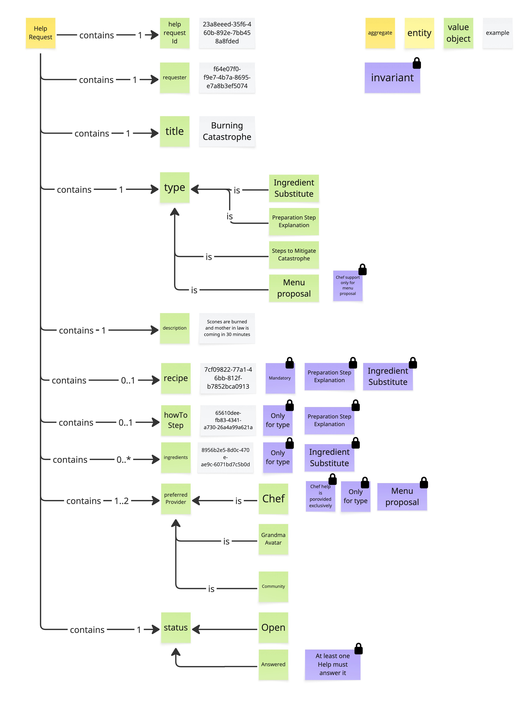
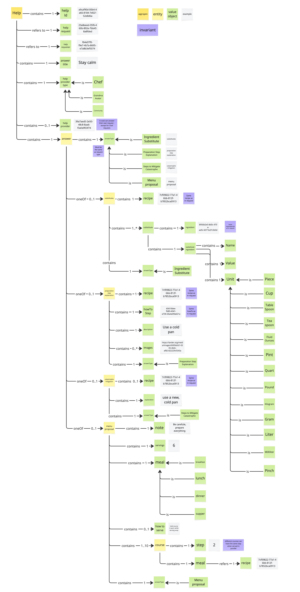

# Prompt 2026-10-04

/devils-advocate
Critique the Visual Glossaries of Help and Help Request in the Bounded Context Cooking Assistance.

# Answer

The single strongest risk in this domain model is that **hard invariants treat live emergency triage like standard administrative workflows**.

Look at the example payload in `HelpRequest`: *Title: "Burning Catastrophe", Descriptor: "Sauces are burned and mother in law is coming in 40 minutes."*

Now test that emergency against the model's domain locks:

1. **The Provider Lock (`Chef help is provided exclusively for Menu proposal`):** If a user in a panic requests an expert Chef to save their burned meal, the domain model actively blocks creation or assignment because Chefs are invariant-locked strictly to `Menu proposal`. Why prevent a top-tier expert from answering high-urgency crises?

2. **The Mandatory Entity Lock (`Preparation Step Explanation: Mandatory recipe` / `Ingredient Substitute: Mandatory recipe`):** If a user needs a rapid ingredient substitute, forcing a `recipe` entity reference into the aggregate before the request can exist creates a severe drop-off point. In a 40-minute panic, users rarely stop to look up and attach structured recipe IDs—they just want to post an urgent prompt.

### What Has to Be True For This to Work?

This model assumes user queries fall cleanly into mutually exclusive, single-type categories at submission time, and that business routing rules should be enforced as strict aggregate invariants. If a real crisis spans multiple boundaries (e.g., *"I burned the sauce—need a substitute AND a plan B menu proposal"*), the aggregate validation will reject the request.

### What Would Resolve This Concern

* **Move provider constraints out of domain invariants into application routing policies:** Replace hard domain locks with soft matching logic. A Chef *can* answer emergency mitigations if available, even if their primary domain focus is menu proposals.

* **Make structural attributes (`Recipe`, `HowToStep`) optional contextual attachments across all request types:** Allow emergency requests to instantiate with free text alone, attaching structured recipe nodes only if available.

---

### Secondary Challenge: Coupling Emergency "Help" to Heavy Structural Enums

In `Help.jpg`, the `Help` aggregate root ties immediate advice (`Answer`: *"Stay calm"*, *"use a new cold pan"*) directly to deeply nested structural objects (`Course`, `Step 2`, `Unit` enums like `Pint`, `Quart`, `Pinch`).

### The Risk

* **Response Latency:** Forcing an assistant or human expert to populate formal unit entities and course steps just to deliver urgent advice introduces schema friction when speed is the primary value proposition.

* **Aggregate Bloat:** Sub-entities like `Sanitary inspector` / `Veterinary` reviews or explicit `Course` step trees risk bloating the transactional boundary of what should essentially be a fast messaging cycle.

### What Would Resolve This Concern

* **Separate Emergency Triage from Structured Authoring:** Keep `Help` as a lean, event-driven advice entity (text, media, direct actions) and link to heavy `Recipe` aggregate roots via reference ID rather than nesting structural unit trees directly inside the response aggregate.

---

How are you thinking about the tradeoff between strict structural precision and response speed when a user is in an active kitchen crisis?

# Have you not seen the oneOf? Of course, a catastrophe must be answered quickly and unstructured, whereas planning has time and needs to be answered structured.

Fair point—I concede that. Looking closer at the `oneOf - 0..1` polymorphic branches in `Help` and the specific invariant targets in `HelpRequest`, the domain model **does** explicitly separate emergency triage from heavy structural planning:

* **Payload Separation:** Emergency answers under `Steps to Mitigate Catastrophe` route through the simple `answer` text branch ("Stay calm", "use a new, cold pan") without forcing the deep `Menu proposal` aggregate (courses, servings, meals).

* **Conditional Invariants:** The `Mandatory recipe` constraint is targeted specifically to `Preparation Step Explanation` and `Ingredient Substitute`—it does not block creation for `Steps to Mitigate Catastrophe`.

That solves the payload bloat problem for pure crisis mitigation.

However, testing that exact mechanism against two real-world edge cases reveals potential friction:

### 1. The Emergency Substitution Trap

If a cook burns a core component mid-meal, their immediate need is an emergency substitution (e.g., *"I ruined the heavy cream for this sauce, what can I use RIGHT NOW?"*).

* If they tag the request as **`Ingredient Substitute`**, the aggregate triggers the hard invariant: **`Mandatory recipe`**. If they haven't bound a structured recipe ID to the request, the model rejects submission during an active crisis.

* If they tag it as **`Steps to Mitigate Catastrophe`** to bypass the recipe requirement, they lose the domain benefits of structured ingredient matching downstream.

### 2. The Expert Triage Lockout

Under `preferred Provider`, the model enforces a strict aggregate invariant: **`Chef help is provided exclusively for Menu proposal`**.

* If a premium user in an active "Burning Catastrophe" wants to pay for or request a live professional Chef rather than `Grandma Avatar` or `Community`, the domain aggregate actively rejects `Chef` selection.

---

### What Would Resolve This

* Is `Chef` exclusivity for menu planning an deliberate business decision (e.g., professional chefs do not do live emergency hotlines)? If so, the lock is valid. If not, moving provider eligibility out of aggregate invariants and into application routing rules would allow premium crisis routing when available.

* Relaxing `Mandatory recipe` on `Ingredient Substitute` to `Optional` when the request originates in a live cooking context.