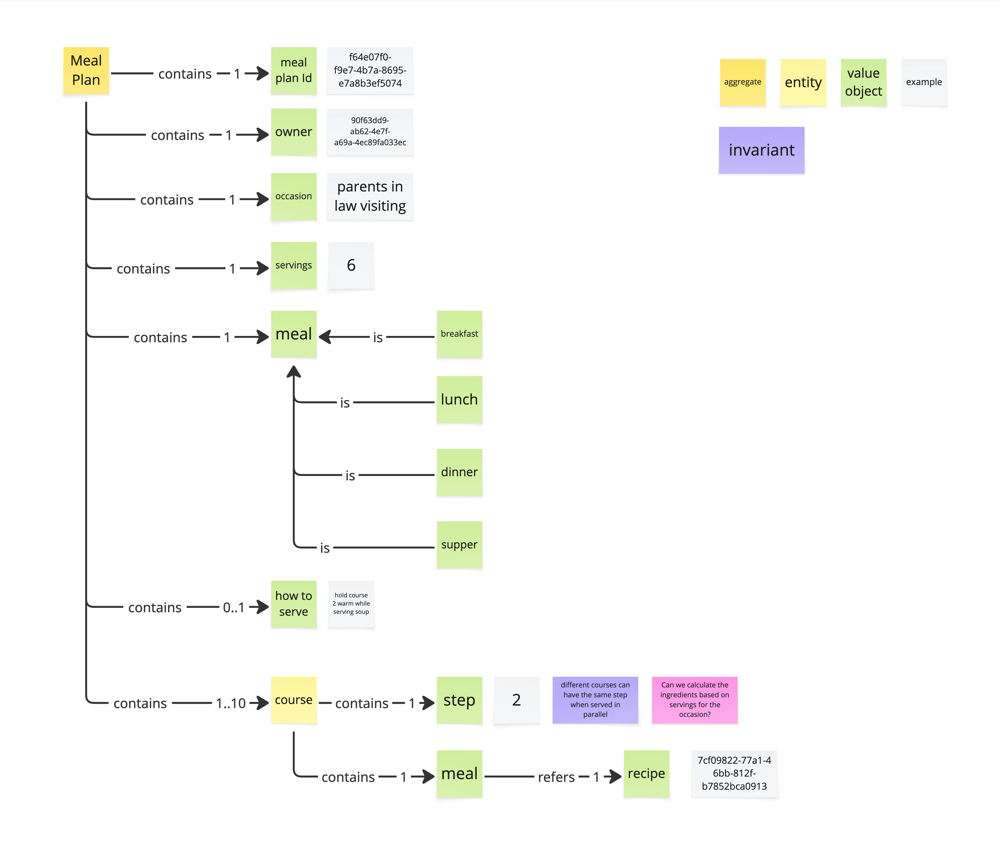

# Prompt 2026-10-04

/devils-advocate
Critique the Visual Glossary of  Meal Planning

# Answer

The primary structural and domain risks in this visual glossary stem from **ambiguous domain terminology**, **overly restrictive cardinalities**, and **misclassified Domain-Driven Design (DDD) stereotypes**.

### 1. Ubiquitous Language Collision: Overloaded `meal` Concept

* **The Objection:** The model uses `meal` in two conflicting places within the exact same aggregate root: at the top level to categorize time-of-day events (`contains 1 meal` $\rightarrow$ *breakfast, lunch, dinner, supper*) and inside `course` (`contains 1 meal` $\rightarrow$ `refers 1 recipe`).

* **Why It Breaks:** In DDD, *Ubiquitous Language* must be unambiguous. Equating the dining occasion/event with an individual food component or dish forces developers and domain experts to parse whether `meal` refers to the overall dinner or a specific recipe item.

* **Path Forward:** Rename top-level `meal` to `MealType` or `OccasionType`, and rename the course-level entity to `Dish` or `CourseItem`.

---

### 2. Cardinality & Scope Trap: `Meal Plan` vs. `Menu`

* **The Objection:** The aggregate root `Meal Plan` contains starrly *exactly 1* `meal` category.

* **Why It Breaks:** Real-world domain users expect a "Meal Plan" to cover multiple meal events across a day or week (e.g., Breakfast + Lunch + Dinner). Constraining `Meal Plan` to exactly 1 meal category means this model does not represent a meal plan at all—it represents a single-event `Menu` or `MealEvent`.

* **Path Forward:** If the intent is to model multi-meal planning, change the cardinality to `contains 1..* meal`. If it is strictly meant for single dining events, rename the aggregate root from `Meal Plan` to `Menu` or `MealEvent` to prevent scope creep.

---

### 3. Flawed Scalability Assumption: Global `servings`

* **The Objection:** Portions (`servings: 6`) are anchored exclusively at the aggregate root level to drive ingredient calculations (as highlighted by the pink note).

* **Why It Breaks:** Real meal occasions (like the example *"parents in law visiting"*) rarely scale every single course at a 1:1 ratio. Appetizers, desserts, child portions, or drink pairings often require different yield counts than the main course. Enforcing a single global `servings` integer will produce incorrect grocery and ingredient calculations.

* **Path Forward:** Keep `servings` at the root level as a default multiplier, but allow optional serving overrides (`servings_override`) on individual `course` nodes.

---

### 4. Cognitive Friction: Using `step` for Staging Order

* **The Objection:** The `course` entity contains `step` (e.g., value `2`) to define concurrent service timing (supported by the invariant *"different courses can have the same step when served in parallel"*).

* **Why It Breaks:** In culinary and recipe contexts, developers and chefs universally associate `step` with recipe execution steps (*"Step 1: Chop onions"*). Reusing `step` for course sequence and parallel presentation causes immediate mental collision.

* **Path Forward:** Rename `step` to `ServicePhase`, `ServingStage`, or `SequenceGroup` to explicitly signal presentation timing rather than recipe instructions.

---

### 5. DDD Stereotype Misclassification (Entities vs. Value Objects)

* **The Objection:** Almost every node in the tree—including scalar values like `servings`, `occasion`, `how to serve`, and `step`—is classified under the light green legend as an `entity`.

* **Why It Breaks:** In DDD, Entities possess distinct thread-safe identities and life cycles, whereas Value Objects are defined purely by their attributes and are immutable. Marking simple attributes (like integer `servings` or text `how to serve`) as entities bloats the data model and confuses persistence boundaries.

* **Path Forward:** Reclassify scalar nodes (`servings`, `occasion`, `how to serve`, `step`) as **Value Objects** (light green/grey in legend) and reserve Entity status for items with independent identities (`Meal Plan`, `Recipe`).

---

Which of these load-bearing assumptions represents an intentional domain trade-off versus an unexamined constraint? Push back if the scope of a `Meal Plan` in your domain was deliberately bounded to single-event menus.