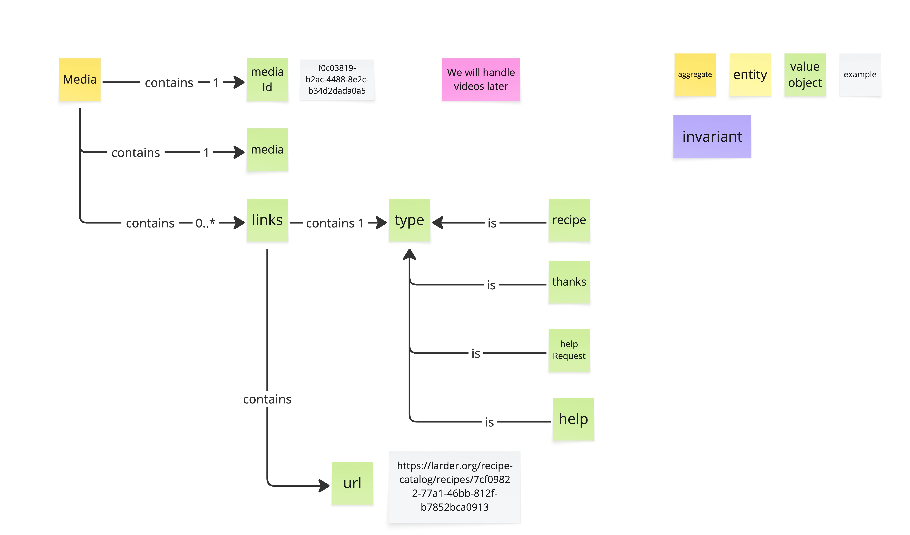

# Prompt 2026-10-04

/devils-advocate
Critique Visual Glossary Media

# Answer

The core architecture of this `Media` aggregate model is clean and easy to trace, but three load-bearing assumptions could cause friction once this hits production.

### 1. Domain Coupling via Link Types

* **The Load-Bearing Assumption:** The core `Media` aggregate needs to explicitly categorize links into business-domain types like `recipe`, `thanks`, `help Request`, and `help`.
* **Why it worries me:** Modeling specific downstream domains (`recipe`, `help Request`) as explicit subtypes of `type` creates a direct coupling between your generic `Media` service and higher-level application contexts. If a new domain feature (e.g., `user_profile` or `comment`) needs to attach media next month, you'll have to modify the core `Media` aggregate taxonomy, violating bounded context isolation.
* **What would make me stop worrying:** If `type` is modeled as a generic string/value object (or standardized link relation like `rel`), and `recipe`/`help` are re-classified as usage examples (grey stickies) rather than rigid domain types defined inside this aggregate.

### 2. Unbounded Collections Without Invariants (`0..* links`)

* **The Load-Bearing Assumption:** A single `Media` aggregate instance can manage `0..*` `links` without transactional constraints.
* **Why it worries me:** While `invariant` (purple) is defined in your legend, zero invariants appear on the model itself. An aggregate root in Domain-Driven Design defines a strict transactional consistency boundary. Hydrating a `Media` object with an unbounded list of links risks bloated payload sizes, database row locking, and performance degradation during updates.
* **What would make me stop worrying:** Adding explicit invariants to the diagram—such as a hard cap on link count per media item (e.g., max 10 links), or moving `links` out of the write-side aggregate into a separate read-model/query projection if high cardinality is expected.

### 3. The "Video Later" Architectural Debt

* **The Load-Bearing Assumption:** The current schema—where `Media` points directly to a single `url` value object—can easily accommodate video down the road.
* **Why it worries me:** Static asset schemas (like single direct URLs) almost always break when video arrives. Video requires state tracking (uploading, encoding, failed), streaming manifests vs. source files, multiple rendition URLs, and thumbnail assets. Deferring video while hardcoding a single `url` attribute risks requiring a breaking database and API redesign later.
* **What would make me stop worrying:** Renaming/refactoring `url` into a more flexible `rendition` or `media_location` structure now, or explicitly scoping this aggregate as `StaticImageMedia` rather than a generic `Media` root that promises future video support.

*(Note: On a minor structural note, `Media contains 1 -> media` appears recursive/redundant in naming—clarifying if that node represents binary payload metadata or raw file attributes would prevent developer confusion).*

Here is why I'm worried on these three fronts—push back if I've misread the domain intent or phase.