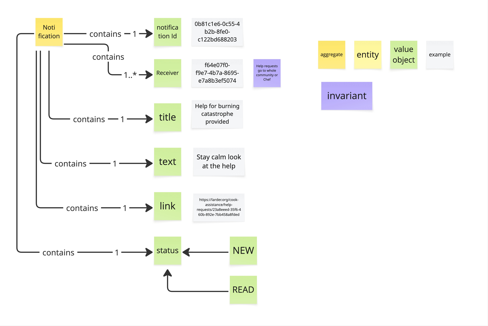

# Prompt 2026-10-04

/devils-advocate
Critique Visual Glossary Notification

# Answer

Since this is a finished glossary, not a brainstorm in progress, I'll go straight to challenging it. Most of it holds up: one aggregate with flat attributes is simple and readable. Here are the objections I think matter, strongest first. Push back on any that miss context I can't see from the picture.

**1. One `status`, many `Receiver`s: read by whom?**
This is the one I'd fix before anything else. A Notification has 1..* receivers but exactly one status (NEW → READ). If it goes to the whole community and one cook opens it, does it flip to READ for everyone? Then nobody else sees it as new. If it doesn't flip, what does the single status mean?

The glossary seems to merge two concepts: the *message* (title, text, link) and its *delivery to one person* (who got it, whether they read it). There are two clean ways out:
- one Notification per receiver (Receiver becomes 1), or
- a per-receiver entity, e.g. *Delivery* (Receiver + status), with the Notification containing 1..* of those.

Interestingly, the legend has an **entity** colour that is never used. A Delivery may be the entity that's missing.

**2. The invariant can't be checked from inside this aggregate**
"Help requests go to whole community or Chef" is pinned to Receiver, but the Notification doesn't know:
- that it's about a help request (only the URL hints at that),
- what "the community" is, or
- which UUID belongs to the Chef. Receivers are just IDs.

So either this rule lives upstream, in whatever decides the recipients (which I'd suspect), or the Notification needs an explicit audience concept, such as `Audience = Community | Chef`, instead of a raw ID list.

Representing "whole community" as an expanded list also has a side effect. Membership is frozen at send time, so a cook who joins a minute later never sees the request. Is that intended?

**3. The example contradicts the invariant**
The example title is "Help for burning catastrophe *provided*" and the text says "look at the help." That reads like a reply to the *requester*, a single cook. It isn't a help request going to the community or the Chef.

So there are at least two kinds of notification ("help requested" and "help provided") with different recipient rules. Yet the glossary has no **type or reason** term to tell them apart. Without one, the invariant applies either to everything (wrong for this example) or to nothing that can be checked.

**4. `link` as a full URL couples you to another context's UI**
`https://larder.org/cook-assistance/help-requests/<id>` bakes a domain, a route and a bounded context's path into stored data. If the route changes or a mobile app wants a deep link, every stored notification is stale.

What the domain probably means is "refers to Help Request 23a8…". A reference (type + id) would let each client build its own link. If the URL really is the ubiquitous term the team uses, keep it, but say so deliberately.

**5. Smaller, take or leave**
- **No time at all.** There's no created or read timestamp, so notifications can't be ordered, expired or cleaned up.
- **"contains" on every edge** carries no meaning. "is addressed to" for Receiver would already expose objection 1.
- **Lifecycle is one-way and minimal.** Can a notification be dismissed, or marked unread again?

**What would make me stop worrying**
- A clear answer to "read by whom": either Receiver = 1, or a per-receiver delivery with its own status.
- The invariant moved to wherever recipients are decided, or an explicit audience/type term added so it can actually be enforced.

If both are already settled outside this picture, I withdraw 1–3 and the glossary just needs to show it.