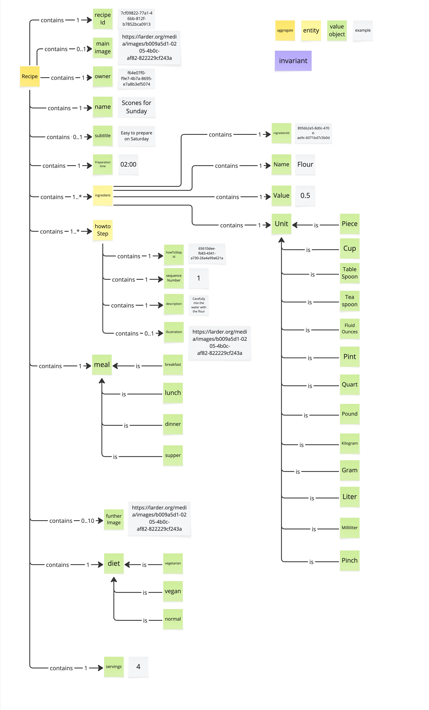

# Prompt 2026-10-04

/devils-advocate
Critique Recipe Catalog Visual Glossary

# Answer

This is a finished glossary rather than an open brainstorm, so I'll go straight to challenging it. I'm leaving the small things for the end. Each point is a hypothesis, so push back where I've misread your intent.

**Premortem.** A year from now, Larder has thousands of recipes. Searching "recipes with flour" misses half of them because they say "plain flour", "Flour", and "wheat flour". The shopping list can't add 2 cups of flour to 250 g of flour. And a "vegan" recipe turns out to contain butter. Each of those failures goes back to one of the boxes below.

**1. "Ingredient" means two different things, and the model picks the weaker one.** The yellow `ingredient` entity, with its own `ingredientId` and a free-text `Name` of "Flour", is really a *recipe line*: "0.5 cup of flour, in this recipe." The thing itself, *Flour*, has no identity anywhere. So nothing can recognise two recipes as using the same ingredient. Search, shopping-list aggregation, allergen checks and diet checks all depend on that.
*What would settle it:* split it into a value object `IngredientLine` (or `RecipeIngredient`) holding a `Quantity` and a reference to an `Ingredient` from a catalog, which may belong to another bounded context. If you've decided the catalog is out of scope, say so explicitly on the board. Right now the board only tells us this by leaving it out.

**2. The legend has a purple invariant sticky, but none appear on the board.** That's the most important gap. The cardinalities hint at rules nobody wrote down:
- Can `sequenceNumber` values repeat or skip numbers? What happens to them when a step is inserted?
- Can `servings` or `Value` be 0 or negative?
- Can a recipe marked `vegan` contain an ingredient that isn't vegan?

The last one is the important one. If `diet` is entered by hand, it will drift away from the ingredients. If it's derived from them, it's a calculated read model, not something stored on the recipe.

**3. `meal` and `diet` are both exactly one value, and I doubt that holds up in a real kitchen.** Scones fit breakfast, afternoon tea and supper. There's no dessert or snack option. On diet:
- Vegan is a subset of vegetarian, so these aren't mutually exclusive values on one scale.
- "Normal" isn't a diet. It just means none of the others.
- Gluten-free and lactose-free are what users actually filter by.

*What would change my mind:* evidence that users really browse by a single meal slot. If not, make both of these `0..*` tags.

**4. `Unit` as a closed list hides assumptions about conversion and region.**
- Cup, Pint, Quart and Fluid Ounce differ between the US and the UK.
- Weight ounces are missing, even though Pound is on the list.
- Piece and Pinch can't be converted to anything else, and they don't scale cleanly when servings change. Doubling a pinch doesn't really give you two pinches.
- With `Value 1` and `Unit 1` both required, a line like "salt to taste" or "oil for frying" can't be represented at all.

*Suggestion:* add a `Quantity` value object that includes an explicit "unquantified" case, and decide whether converting between units is part of this domain.

**5. Steps are an ordered list disguised as entities.** If position is the only thing that gives a step meaning, then `sequenceNumber` plus `howToStepId` is extra bookkeeping. What do steps actually need to be referenced by ID for? The model also can't show recipe sections like "For the dough / For the filling", or a step that refers to an ingredient line.

**Smaller things I'd let go if needed:**
- `Preparation time` "02:00": is that hours or minutes? Real recipes also separate prep, cooking and resting time.
- `main image` plus up to 10 `further Image`s could simply be one image list with a "main" flag.
- The naming isn't consistent: `Name`/`Value`/`Unit` are capitalised and other terms aren't, and `howtoStep` sits next to `howToStep Id`. That's worth tidying before the terms reach the API.

**What I'd keep without hesitation:** Recipe as the single aggregate, with owner as a reference by ID rather than an embedded user. That boundary is sound.

If you can answer #1 (is there an ingredient catalog, and in which context?) and add a handful of invariants for #2, most of my other concerns either go away or become easy fixes. Which of these did your team already discuss and deliberately put aside?